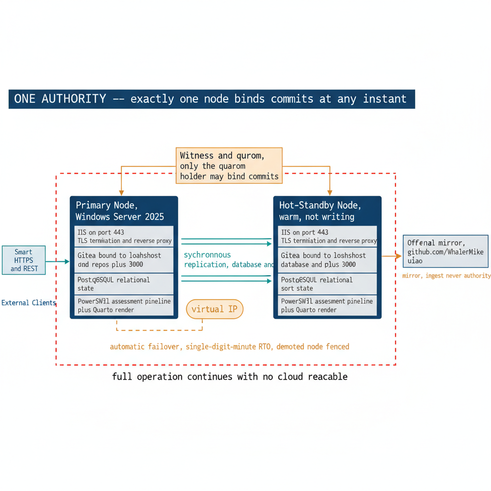

# Chapter 3 — Building the Substrate

::: {.callout-note}
## In this chapter
The UIAO Governance OS is the platform every other part of the modernization
program depends on. This chapter explains why a single Windows Server 2025 host
running Gitea behind an IIS reverse proxy was chosen over four alternatives —
most notably IIS alone — and what each component contributes. It then walks the
substrate's topology and its high-availability posture: **one logical
authority** that is the only machine ever allowed to make a commit binding, kept
continuously available by a **hot-standby replica with automatic,
split-brain-safe failover**, alongside an off-premises GitHub mirror — engineered
so that no single component is a point of failure and full on-premises operation
continues even when no cloud service is reachable. Horizontal scale lives at the
target surfaces, never at the authority.
:::

## Why the Program Needs a Substrate

Before any modernization work can proceed, the UIAO program requires a governance substrate — a platform that can receive assessment data, version it, enforce governance rules on every commit, trigger downstream automation, and provide a single source of truth for every artifact in the modernization pipeline. The UIAO Governance OS is that substrate. It runs on a self-hosted Gitea repository server behind an IIS reverse proxy on Windows Server 2025, with PowerShell assessment modules and a Quarto-rendered documentation pipeline alongside.

> A platform that cannot be operated by any authorized administrator is a platform that will eventually be operated by no one.

That principle is why the substrate's minimalism is intentional rather than incidental. Every component earns its place by being operable, recoverable, and inspectable by a single administrator on a well-understood host — and, as the topology section shows, that single-authority discipline is exactly what lets the platform be made redundant without ever splitting the truth it holds.

{#fig-book-15-cpt-03-diagram-01 fig-alt="Engineering blueprint diagram on a white background showing the UIAO Governance OS high-availability topology. On the left, a federal navy (#1F3A5F) box labeled Primary Node, Windows Server 2025 contains stacked monospace component boxes: IIS on port 443 TLS termination and reverse proxy; Gitea bound to localhost port 3000; PostgreSQL relational state; and the PowerShell assessment pipeline plus Quarto render. To its right, a second federal navy box labeled Hot-Standby Node, warm, not writing holds the same component stack greyed slightly. Teal (#1A9E8F) double arrows between the two nodes are labeled synchronous replication, database and repos plus LFS. Above and between the two nodes sits a smaller amber (#D4A017) box labeled Witness and quorum, only the quorum holder may bind commits, with thin amber lines to both nodes. An amber rounded label virtual IP follows the active node points at whichever node is primary, and an amber note reads automatic failover, single-digit-minute RTO, demoted node fenced. A teal arrow labeled Smart HTTPS and REST flows from external clients to the virtual IP. A separate amber arrow labeled mirror, ingest never authority connects the Primary Node to an off-premises box labeled GitHub mirror, github.com slash WhalerMike slash uiao. A bold navy banner across the top reads ONE AUTHORITY — exactly one node binds commits at any instant. A red (#C0392B) dashed boundary line drawn around the two on-premises nodes and the witness is labeled full operation continues with no cloud reachable. Monospace labels throughout, no human figures, 16:9 landscape." width="85%"}

## The Infrastructure Decision — ADR-041

The infrastructure decision was not trivial. The initial question — whether IIS with git-http-backend.exe was sufficient for the full UIAO governance vision — was answered directly in Architecture Decision Record **ADR-041, UIAO Git Infrastructure**: no, not alone. (Earlier drafts of this chapter cited this decision as ADR-001; that was a mis-citation — ADR-001 is the Hybrid Azure AD Join deprecation, unrelated to Git infrastructure.) IIS with git-http-backend.exe provides exactly one capability well: Git Smart HTTP transport over HTTPS with Windows Integrated Authentication. That is necessary, but it is not sufficient.

The UIAO governance vision requires a set of capabilities that do not exist in IIS natively:

| Required capability | Why the program needs it |
| :--- | :--- |
| **Programmatic code access via REST API** | Tooling and scripts must read and write repositories without a browser |
| **Webhook-driven automation pipelines** | Commits must trigger downstream governance and rendering jobs |
| **API token authentication for assessment scripts** | Unattended PowerShell modules need non-interactive credentials |
| **Repository management endpoints** | Repos must be created and configured programmatically |
| **OAuth2 and OIDC integration with Entra ID** | Identity must federate with the organization's directory |

> The IIS-only Git deployment guide that preceded ADR-041 remains a valid reference for environments that require only simple authenticated Git transport without the API surface — but it is explicitly superseded by the Gitea-on-IIS architecture for all production UIAO deployments.

## The Recommended Architecture — Gitea Behind IIS

After evaluating five architecture options — ranging from IIS alone to a full Azure DevOps Services deployment — ADR-041 recommends Gitea on Windows Server 2025 behind an IIS reverse proxy.

Gitea was selected because it delivers the missing capability surface in a single, Windows-native package:

- It is a single Go binary that runs natively on Windows as a service.
- It provides a full OpenAPI-documented REST API.
- It supports LDAP and Active Directory as well as OAuth2 and OIDC authentication.
- It includes a native webhook system with configurable retry logic.
- It keeps its relational state in PostgreSQL on a separate host, which the high-availability posture below replicates synchronously.

IIS is not replaced in this architecture — it is promoted from CGI application host to reverse proxy, where it handles TLS termination, request filtering, and security hardening through the Application Request Routing and URL Rewrite modules.

> The two components are complementary: IIS provides the security perimeter and TLS management that a Windows-native deployment requires, and Gitea provides the governance capability surface that IIS cannot deliver.

## The Substrate Topology and Its High-Availability Posture

The substrate is **one logical authority** — exactly one machine is ever allowed to make a commit binding. That constraint is not a limitation to be engineered around; it *is* the source of truth. As Book 16's chapter "One Host, Not a Fleet" puts it, the single source of truth is a physical claim about how many machines are allowed to say *yes*, and the answer is one. Two machines that both accept binding commits produce two histories, and divergent truth is a hole through the centre of the governance model.

High availability, then, does **not** mean spreading the authority across several live writers. It means making that single authority *continuously available through redundancy* — the distinction Book 16 draws when it observes that redundancy which preserves a single answer is safety, while redundancy that produces two answers is corruption wearing safety's clothes.

- **Primary node.** Hosts all platform services: the Gitea application server bound to localhost on port 3000; IIS on port 443 providing HTTPS termination; DNS entries for git.uiao.local and docs.uiao.local; the PostgreSQL relational store; and the assessment pipeline that runs PowerShell modules and commits its output to the governance repository. While healthy, it is the one node that binds commits.

- **Hot-standby node.** Kept continuously current by synchronous replication of both halves of the substrate's state — the relational database and the bare Git repositories with their LFS objects — so that an acknowledged commit is durable on both nodes before it is acknowledged at all. The standby runs warm and ready but does **not** serve binding writes while the primary is healthy. A baseline deployment may instead run a *cold* standby restored on demand; the hot-standby posture is selected when a customer's recovery requirement is tighter than the baseline allows.

- **Witness and automatic failover.** A lightweight third arbiter holds the deciding vote: **only the node that holds quorum may bind commits.** If the primary fails or is partitioned, the standby promotes *only after* it acquires quorum; the former primary is fenced so it can no longer accept a stray write; and a virtual address follows the active node, so clients and server-side hooks always reach the one writer without reconfiguration. Failover is automatic and measured in single-digit minutes, and because promotion is arbitrated it can never produce two writers at once.

- **Off-premises GitHub mirror.** Receives the canonical governance record on an interval, providing a geographically separate copy that is **ingest, never authority** — canon flows out to it for safekeeping; authority never flows back from it.

The result is a substrate with **no single point of failure below the authority tier** — redundant network, power, and storage on each node — that nonetheless answers to a single authority at any instant. The recovery objectives improve accordingly: a **near-zero Recovery Point Objective**, because synchronous replication means an acknowledged commit already exists on both nodes, and a **Recovery Time Objective in single-digit minutes**, because no human sits in the automatic-failover path. Cold restore from backup, together with the off-premises mirror, remains the floor for the rare total-site loss. Chapter 5 details the recovery objectives and the drill regime; the decision of record for this high-availability posture is **ADR-090, Substrate High Availability**, which extends the base substrate decision in ADR-041.

Where genuine horizontal scale is needed, it lives at the target surfaces — Entra, Intune, Azure Arc — which are built to fan out across millions of objects. The substrate authority governs those surfaces; it does not compete with them for throughput.

This architecture maintains full on-premises operational capability even under complete cloud service unavailability.

::: {.callout-note title="Architecture Note — ADR-041 and ADR-090"}
The IIS-only Git deployment guide is retained as a valid reference for constrained environments requiring only authenticated Git transport. It is explicitly superseded by the Gitea-on-IIS architecture (**ADR-041**) for all deployments requiring the full UIAO governance capability surface, including REST API access, webhook automation, and Entra ID OIDC integration. The high-availability posture described above — a hot-standby replica with automatic, split-brain-safe failover — is governed by **ADR-090**, which extends ADR-041 for customers whose recovery requirement is tighter than the baseline cold-standby RTO.
:::
