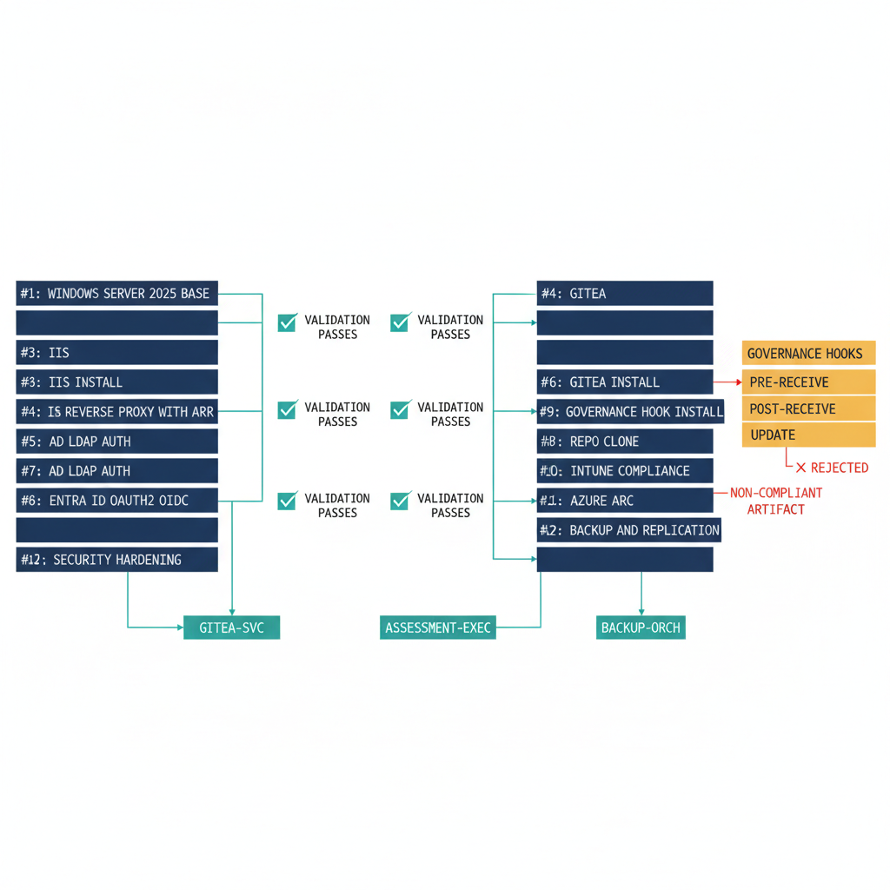

# Chapter 4 — The Infrastructure in Detail

::: {.callout-note}
## In this chapter
How the UIAO platform is actually built: a thirteen-phase, PowerShell-first,
idempotent build sequence that proceeds in strict dependency order, the three
purpose-scoped service accounts that govern all platform operations, and the
governance hook architecture that turns a generic Git server into an active
boundary enforcer. Each layer is what separates the platform from ordinary
infrastructure.
:::

## The Thirteen-Phase Build Sequence

The platform build is executed in thirteen phases, each PowerShell-first and idempotent. The phases proceed in strict dependency order, and each produces a verifiable state that the next phase depends on:

1. Windows Server 2025 base configuration
2. IIS installation and module configuration
3. TLS certificate provisioning from the enterprise CA
4. Gitea installation and service registration
5. IIS reverse proxy configuration with Application Request Routing
6. Active Directory LDAP authentication integration
7. Entra ID OAuth2 and OIDC authentication integration
8. UIAO repository cloning from the GitHub external mirror
9. Governance hook installation on all repositories
10. Intune compliance integration for the platform server itself
11. Azure Arc enrollment under the Commercial Cloud exception boundary
12. Backup and replication configuration
13. Security hardening — including attack surface reduction, Windows Defender configuration, and audit policy enforcement

> No phase is marked complete until its validation test suite passes in its entirety.

{#fig-book-15-cpt-04-diagram-01 fig-alt="Engineering blueprint diagram on a white background showing the thirteen-phase UIAO platform build as a left-to-right dependency chain of federal navy (#1F3A5F) numbered boxes, each labeled in monospace — Windows Server 2025 base, IIS install, TLS cert from enterprise CA, Gitea install, IIS reverse proxy with ARR, AD LDAP auth, Entra ID OAuth2 OIDC, UIAO repo clone, governance hook install, Intune compliance, Azure Arc enrollment, backup and replication, security hardening. A small teal (#1A9E8F) checkmark validation-gate symbol sits between every consecutive pair of phase boxes, marked validation suite passes, indicating no phase advances until its tests pass. Below the chain, three teal account chips labeled gitea-svc, assessment-exec, backup-orch feed into the relevant phases. To the right, an amber (#D4A017) panel labeled governance hooks shows three rows — pre-receive, post-receive, update — wrapping the Gitea phase. One red (#C0392B) arrow shows a non-compliant artifact being rejected at the pre-receive hook before it can enter the canonical record. Monospace labels throughout, no human figures, 16:9 landscape." width="85%"}

## The Three Service Accounts

Three service accounts govern all platform operations. Each is scoped to exactly the access its function requires and nothing more — no account used for discovery has write access to any domain object.

| Service account | Function | Access scope |
| :--- | :--- | :--- |
| **Gitea application service account** | Runs the Gitea binary | Local administrator rights on the server; full control of the D: drive data partition where all repository data resides |
| **Assessment execution account** | Runs all PowerShell assessment modules | Read-only Active Directory permissions; write access only to the assessment output directory |
| **Backup orchestration account** | Manages scheduled backup and replication workflows | Write access to the backup destination share; push access to the GitHub external mirror |

All three accounts use 20-character managed passwords rotated quarterly through the credential management procedure documented in the operations runbook.

## The Governance Hook Architecture

The governance hook architecture is what separates the UIAO platform from a generic Git server. Three classes of hook each enforce a distinct governance responsibility:

- **Pre-receive hooks** enforce classification boundary compliance, validate YAML frontmatter metadata on every document commit, prohibit marking combinations that would violate the GCC-Moderate boundary designation, and enforce document ID naming conventions against the UIAO-NNN schema.

- **Post-receive hooks** trigger webhook delivery to downstream automation targets — the Quarto rendering pipeline, the OrgPath drift detection engine, and the compliance dashboard regeneration workflow.

- **Update hooks** enforce branch protection rules, requiring pull request review for any commit destined for the main or canon branches.

> Together these hooks transform the Git server from a passive storage layer into an active governance enforcer — a boundary condition that prevents non-compliant artifacts from entering the canonical record regardless of how they were produced.
