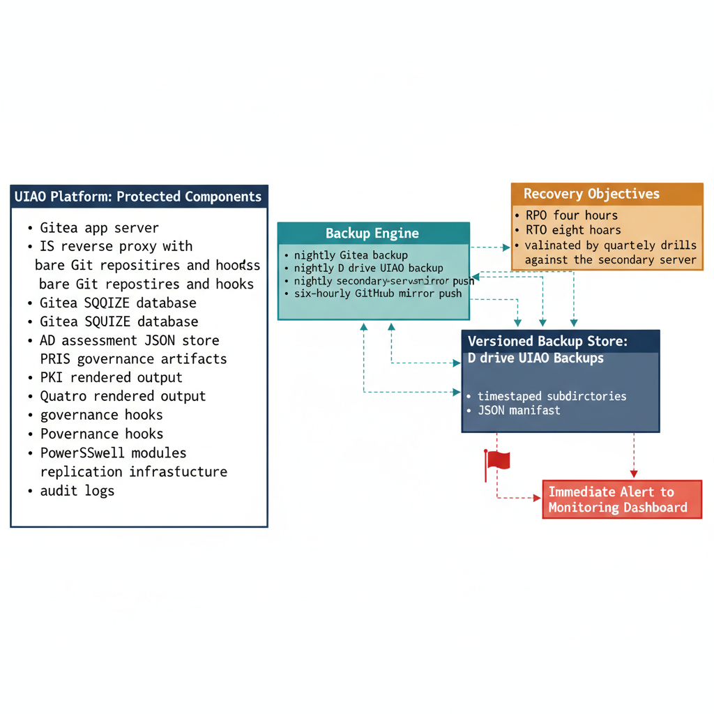

# Chapter 5 — Disaster Recovery and Platform Resilience

::: {.callout-note}
## In this chapter
How the UIAO platform's resilience posture applies the same governance
discipline as the modernization pipeline itself — every procedure documented,
deterministic, and executable by any authorized administrator. This chapter
draws the line between the two tiers of recovery: **high-availability failover**,
which keeps the single authority continuously available through a hot-standby
replica with automatic, split-brain-safe promotion (near-zero data loss,
minutes to recover), and **disaster recovery**, the cold-restore floor that the
backup chain guarantees for the rare total-site loss. It then covers the twelve
platform components the DR playbook protects, the explicit Recovery Point and
Recovery Time Objectives for each tier, and the scheduled-task backup
architecture with its versioned storage and integrity verification.
:::

## Recovery as a Design Requirement

The UIAO platform's recovery posture reflects the same governance discipline applied to the modernization pipeline itself. Every recovery procedure is documented, deterministic, and executable by any authorized administrator — not just the person who built the system. This is a design requirement, not a documentation courtesy.

> A governance platform whose recovery depends on the institutional knowledge of a single individual is not a governance platform; it is a single point of failure with documentation theater attached to it.

{#fig-book-15-cpt-05-diagram-01 fig-alt="Engineering blueprint diagram on a white background depicting the UIAO platform recovery posture in two tiers. On the left, a federal navy (#1F3A5F) cluster labeled twelve protected components lists monospace items — Gitea app server, IIS reverse proxy with ARR and URL Rewrite, bare Git repositories and hooks, Gitea relational database, AD assessment JSON store, PKI and TLS certificate chain, canon governance artifacts, Quarto rendered output, governance hooks, PowerShell modules, replication infrastructure, audit logs. In the center, a teal (#1A9E8F) backup engine box shows four Windows Scheduled Tasks — nightly Gitea backup, nightly D drive UIAO backup, nightly secondary-server mirror push, six-hourly GitHub mirror push — flowing into a navy versioned backup store box labeled D drive UIAO Backups with timestamped subdirectories and a JSON manifest. On the right, an amber (#D4A017) panel split into two stacked rows states the recovery objectives: top row Tier one, high-availability failover, RPO near-zero, RTO single-digit minutes, automatic witness-gated promotion to the hot standby; bottom row Tier two, disaster recovery restore, RPO four hours, RTO eight hours, cold restore for total-site loss, validated by quarterly drills. A red (#C0392B) flag marks a backup integrity verification failure path that raises an immediate alert to the monitoring dashboard. Monospace labels throughout, no human figures, 16:9 landscape." width="100%"}

## Two Tiers of Recovery

Resilience and disaster recovery answer two different failure questions, and the platform treats them as two tiers rather than one.

The first tier is **high-availability failover**. When the primary node fails, the hot-standby replica described in Chapter 3 is promoted automatically — gated by a quorum witness so that exactly one node ever binds commits, with the failed node fenced before the standby takes over. Because the standby is kept current by synchronous replication, an acknowledged commit already exists on both nodes, so failover loses essentially no data and completes in single-digit minutes with no human in the path. This is the everyday answer to a node, disk, power, or network failure, and it is the decision of record in **ADR-090, Substrate High Availability**.

The second tier is **disaster recovery** — the cold-restore floor. It is the answer to the rare event that high availability cannot cover: loss of the whole site, both nodes and the witness together, or a corruption that propagates. Here the backup chain and the off-premises GitHub mirror rebuild the platform from versioned, integrity-checked artifacts. This tier is slower by design, and its objectives are deliberately conservative.

## Recovery Objectives

Recovery objectives are defined explicitly per tier and validated through quarterly drills.

| Tier | Objective | Target | Basis |
| :--- | :--- | :--- | :--- |
| **High-availability failover** | RPO | Near-zero data loss | Synchronous replication of the relational database and the Git repositories with their LFS objects: an acknowledged commit is durable on both nodes before it is acknowledged. |
| **High-availability failover** | RTO | Single-digit minutes | Automatic, witness-gated promotion of the hot standby; no human sits in the failover path. |
| **Disaster recovery (restore)** | RPO | Four hours — maximum acceptable data loss | The combination of the six-hour GitHub mirror synchronization cycle and the scheduled assessment commit frequency. In practice, the most recent commit in the mirror will be no more than four hours old at any point in the day. |
| **Disaster recovery (restore)** | RTO | Eight hours — maximum elapsed time to restore full functionality | Assumes a total-site-loss scenario in which the platform is rebuilt from backup and the most recent mirror synchronization has completed. |

The disaster-recovery objectives are validated through quarterly DR drills that execute the recovery runbooks against a rebuilt environment and verify that it passes the full platform validation test suite before the drill is marked successful. High-availability failover is exercised on its own cadence through planned-failover drills, which confirm that promotion, fencing, and the virtual-address handover all behave as designed.

## Backup Architecture

The backup architecture uses Windows Scheduled Tasks in the `\UIAO\` task folder to orchestrate four scheduled operations:

1. A nightly full backup of the Gitea data directory and relational database
2. A nightly backup of the `D:\UIAO\` assessment and module directories
3. A nightly push of all governance repositories to the secondary server mirror via authenticated Git remote
4. A six-hourly push to the GitHub external mirror

Backups are stored in a versioned directory structure under `D:\UIAO\Backups\` with timestamped subdirectories and a JSON manifest file recording the backup scope, duration, component list, and hash verification results for every backed-up file.

> Backup integrity verification runs as a separate scheduled task the morning after each nightly backup, and any verification failure generates an immediate alert to the platform monitoring dashboard.
