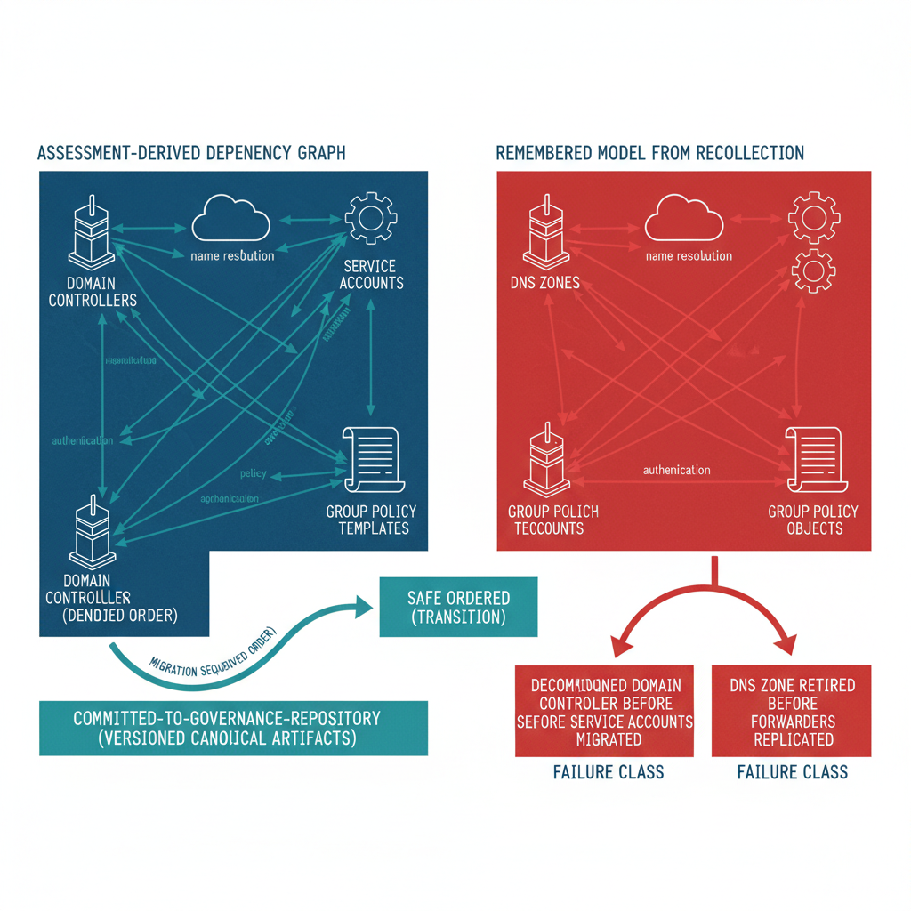

# Chapter 6 — The Principle of Assessment Before Action

::: {.callout-note}
## In this chapter
Assessment Before Action is the master project plan's first principle: no migration activity begins until the complete Active Directory forest has been inventoried, classified, and committed to the governance repository as canonical artifacts. This chapter explains why the most common modernization failures trace to an incorrect model of the *current* state rather than the target, how making the dependency graph explicit and versioned eliminates that failure class, and how the assessment phase's twenty-three deliverables are enforced through repository phase gates and Canon Steward approval.
:::

## The Principle

The UIAO Master Project Plan establishes one principle above all others: Assessment Before Action. No migration activity begins until the complete Active Directory forest has been inventoried, classified, and committed to the UIAO governance repository as machine-readable canonical artifacts. Every modernization plan — for computer objects, identities, Group Policy Objects, DNS zones, or PKI infrastructure — is generated from assessment data, not designed in isolation from an architect's memory of how the environment is supposed to look.

> This principle is not a procedural preference. It is a structural guarantee that modernization sequences follow the actual dependency graph of the environment rather than a hypothetical graph constructed from assumption and recollection.

{#fig-book-15-cpt-06-diagram-01 fig-alt="Engineering blueprint diagram on a white background contrasting two migration approaches. On the left, a federal navy (#1F3A5F) panel labeled in monospace assessment-derived dependency graph shows inventoried Active Directory forest objects — domain controllers, DNS zones, service accounts, certificate templates, Group Policy Objects — connected by arrows that represent real dependencies, with a teal (#1A9E8F) committed-to-governance-repository band beneath it marking the versioned canonical artifacts. A teal arrow labeled migration sequence follows derived order flows from this panel to a teal box reading safe ordered transition. On the right, a red (#C0392B) panel labeled remembered model from recollection shows the same objects connected by a sparser incorrect dependency graph; a red arrow leads to a red box reading decommissioned domain controller before service accounts migrated and a red box reading DNS zone retired before forwarders replicated, depicting the failure class the principle eliminates. Monospace labels throughout, no human figures, 16:9 landscape." width="85%"}

## Why the Current State Is the Hard Problem

The rationale for this principle is straightforward and grounded in the most common failure mode of enterprise IT modernization. Programs fail not because the architects did not know the target architecture — they almost always do — but because the migration sequence was designed against an incorrect model of the current state. The recurring pattern is a transition step taken before its prerequisites were satisfied:

- A domain controller decommissioned before all its service accounts were migrated.
- A DNS zone retired before all its conditional forwarder entries were replicated to the new infrastructure.
- A certificate template deprecated before all the application services that depended on it had been re-enrolled.

> Assessment Before Action eliminates this failure class by requiring that the dependency graph be explicit, versioned, and verified before any irreversible transition step is taken.

## The Assessment Phase and Its Gates

The assessment phase is therefore the most detailed and most gate-heavy phase in the master project plan. It produces twenty-three canonical deliverables spanning the complete Active Directory forest topology, and it must complete — with all deliverables committed to the governance repository and approved by the Canon Steward — before any subsequent phase can begin.

Phase gates are enforced through the repository itself:

1. No phase transition artifact can be committed to the `canon/` directory until the phase it closes has produced all required deliverables.
2. No phase transition artifact can be committed without a pull request reviewed and approved by an authorized Canon Steward.
