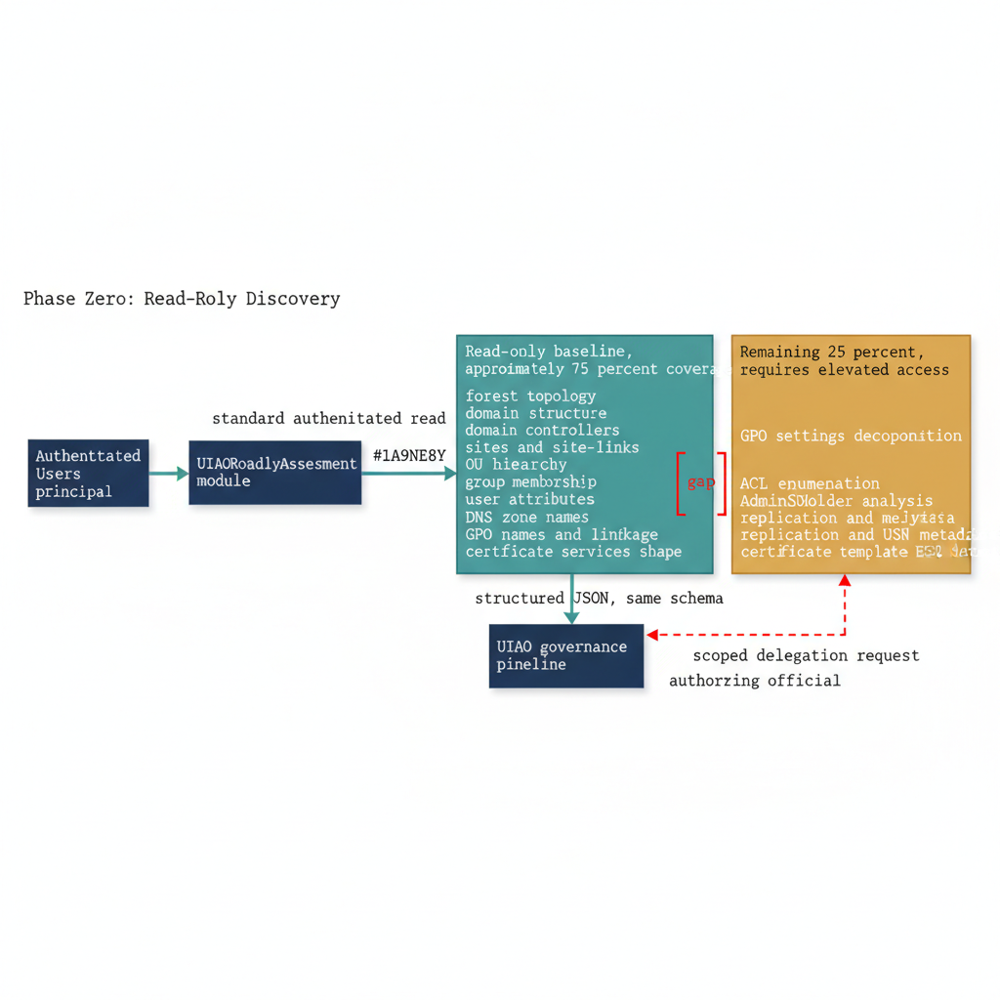

# Chapter 7 — Phase Zero: Maximum Discovery with Minimum Privilege

::: {.callout-note}
## In this chapter
Phase Zero is read-only discovery: how an assessment team captures the
overwhelming majority of what modernization planning needs *before* elevated
access is authorized. This chapter explains why the Authenticated Users
principal can read so much of Active Directory, what the `UIAOReadOnlyAssessment`
module captures and how its output feeds the governance pipeline, the roughly
75 percent coverage achievable at standard privilege, and how the remaining
25 percent becomes a precisely scoped elevated-delegation request.
:::

## The Problem Phase Zero Solves

The read-only assessment guide introduces a concept that resolves a practical problem every modernization engagement eventually confronts: how to begin gathering intelligence before elevated access has been authorized. In federal and enterprise IT modernization, the assessment team rarely receives privileged access on day one. Authorization paperwork must be completed, security review boards must approve elevated delegations, and the paperwork process at federal agencies can take weeks or months to navigate.

> The read-only assessment framework ensures that assessment teams do not sit idle during that window — that the time waiting for elevated access is used to capture everything that standard authenticated access can reach.

{#fig-book-15-cpt-07-diagram-01 fig-alt="Engineering blueprint diagram on a white background showing Phase Zero read-only discovery. On the left, a federal navy (#1F3A5F) box labeled Authenticated Users principal feeds an arrow into a navy box labeled UIAOReadOnlyAssessment module. From that module a teal (#1A9E8F) arrow labeled standard authenticated read leads to a teal panel titled Read-only baseline, approximately 75 percent coverage, listing monospace items forest topology, domain structure, domain controllers, sites and site-links, OU hierarchy, group membership, user attributes, DNS zone names, GPO names and linkage, certificate services shape. A teal arrow labeled structured JSON, same schema flows down into a navy box labeled UIAO governance pipeline. On the right, an amber (#D4A017) panel titled Remaining 25 percent, requires elevated access lists monospace items GPO settings decomposition, ACL enumeration, AdminSDHolder analysis, replication and USN metadata, certificate template ESC detection. A red (#C0392B) bracket marks this amber panel as the gap, and a red dashed arrow labeled scoped delegation request points from the gap back toward the authorizing official. Monospace labels throughout, no human figures, 16:9 landscape." width="85%"}

## What Authenticated Users Can Read

The critical insight of the read-only assessment framework is that the Authenticated Users security principal — the default permission set inherited by every domain-joined user account — can read an enormous volume of Active Directory data. The following is readable with standard user credentials, no elevation required:

- Forest topology
- Domain structure
- Domain controller enumeration
- Site and site-link configuration
- The complete OU hierarchy
- Security group membership
- User object attributes
- DNS zone names
- GPO names and their OU linkage points
- The broad shape of the certificate services infrastructure

The read-only assessment PowerShell module, `UIAOReadOnlyAssessment`, captures this data systematically, producing structured JSON output that feeds directly into the UIAO governance pipeline with the same schema as the full assessment modules.

> Because the read-only output shares the full assessment schema, as elevated access is granted and full assessment modules are run, their output supplements rather than replaces the read-only baseline.

## The Coverage Score and the Remaining Gap

The read-only assessment coverage score quantifies precisely how much of the full assessment surface is achievable at each privilege level. With Authenticated Users credentials only, the framework captures approximately 75 percent of the data needed for modernization planning — a figure that is consistently surprising to modernization teams who expect privileged access to be a prerequisite for meaningful discovery.

The remaining 25 percent requires elevated access commensurate with those specific capabilities:

- Detailed GPO settings decomposition beyond linkage metadata
- ACL enumeration on sensitive objects
- AdminSDHolder-protected object analysis
- Replication metadata and USN tracking
- Certificate template security analysis, including ESC class detection

The gap analysis produced by the read-only assessment becomes the formal basis for the elevated delegation request, scoped precisely to what the remaining 25 percent requires and no more, providing the authorizing official with an exact description of what access is being requested and why.
