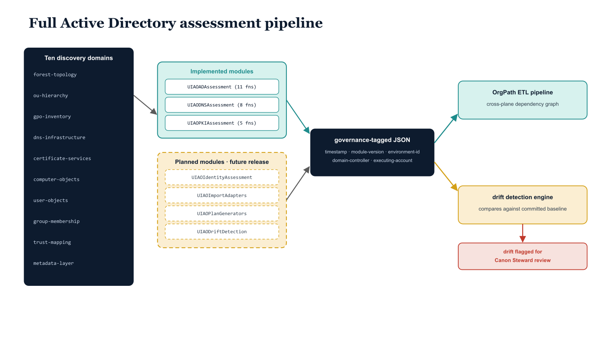

# Chapter 8 — The Full Assessment Pipeline

::: {.callout-note}
## In this chapter
The complete Active Directory assessment spans ten domains of discovery, each producing canonical artifacts committed to the governance repository. This chapter walks the discovery surface, the modules that implement it today, the four modules planned to close the assessment-to-remediation loop, and the governance-tagged JSON schema that lets the OrgPath ETL pipeline and drift detection engine reason over every assessment state with full provenance.
:::

## The Ten Domains of Discovery

The full Active Directory assessment covers ten domains of discovery, each producing a distinct set of canonical artifacts committed to the governance repository:

- **Forest and domain topology discovery** captures the complete forest structure — functional levels, optional features, cross-forest trust relationships, and the authoritative domain controller roster for each domain.
- **Organizational unit hierarchy extraction** produces the OrgTree — the machine-readable representation of the OU hierarchy that becomes the source schema for OrgPath attribute generation.
- **Group Policy Object inventory and analysis** decomposes every GPO in scope into its component settings, categorized by policy area, with migration complexity scoring and conflict detection that identifies GPOs with overlapping scope and potentially contradictory settings.
- **DNS infrastructure assessment** enumerates all forward and reverse lookup zones, record types, scavenging configurations, DNSSEC status, and conditional forwarder targets.
- **Certificate services assessment** discovers all CA instances and analyzes every certificate template for the eight ESC vulnerability classes that represent the most commonly exploited Active Directory Certificate Services attack surface.

The remaining domains — computer object enumeration, user object analysis, group membership decomposition, trust relationship mapping, and the cross-cutting metadata layer — complete the identity and access surface and are addressed by the modules below.

{#fig-book-15-cpt-08-diagram-01 fig-alt="Engineering blueprint diagram on a white background showing the full Active Directory assessment pipeline as a left-to-right flow. On the left, a federal navy (#1F3A5F) column lists the ten discovery domains as monospace labels — forest-topology, ou-hierarchy, gpo-inventory, dns-infrastructure, certificate-services, computer-objects, user-objects, group-membership, trust-mapping, metadata-layer. Arrows feed a teal (#1A9E8F) band of implemented modules labeled UIAOADAssessment (eleven functions), UIAODNSAssessment (eight functions), and UIAOPKIAssessment (five functions). A second teal-to-amber band shows four planned modules drawn with dashed amber (#D4A017) borders — UIAOIdentityAssessment, UIAOImportAdapters, UIAOPlanGenerators, UIAODriftDetection — marked future release. Every module emits into a central navy box labeled governance-tagged JSON schema, carrying timestamp, module-version, environment-id, domain-controller, executing-account. From that box one teal arrow leads to the OrgPath ETL pipeline producing a cross-plane dependency graph, and one amber arrow leads to the drift detection engine comparing against the committed baseline. A red (#C0392B) flag marks a divergence path labeled drift flagged for Canon Steward review. Monospace labels throughout, no human figures, 16:9 landscape." width="100%"}

## Modules in the Current Pipeline

The UIAOADAssessment module provides eleven functions covering this surface in detail.

- The core discovery layer is formed by `Invoke-UIAOForestDiscovery`, `Invoke-UIAOOUHierarchy`, `Invoke-UIAOGPOInventory`, `Get-UIAODNSAssessment`, and `Invoke-UIAOCertificateAssessment`.
- Computer object enumeration, user object analysis, group membership decomposition, and trust relationship mapping complete the identity and access surface.

Complementing the AD assessment modules are two specialized companions:

| Module | Functions | Coverage |
| :--- | :--- | :--- |
| **UIAOADAssessment** | 11 | Forest, OU hierarchy, GPO, DNS, certificate services, computer/user/group/trust surface |
| **UIAODNSAssessment** | 8 | DNS zone analysis |
| **UIAOPKIAssessment** | 5 | Certificate authority and template assessment |

## Planned Modules — Closing the Loop

Four additional modules are planned for future release and represent the most consequential capability gaps in the current assessment pipeline:

| Module | What it adds | Gap it closes |
| :--- | :--- | :--- |
| **UIAOIdentityAssessment** | Extends the assessment surface to Entra ID and hybrid identity constructs | Enables comparison between on-premises and cloud identity states |
| **UIAOImportAdapters** | Ingests third-party tool reports — including Microsoft Assessment and Planning Toolkit output and Defender for Identity findings — into the UIAO governance schema | Brings external assessment data into a single governed schema |
| **UIAOPlanGenerators** | Derives modernization migration plans automatically from assessment data | Closes the most significant manual gap in the current workflow |
| **UIAODriftDetection** | Provides continuous baseline comparison and drift alerting | Detects when the live environment diverges from the committed governance baseline |

> Together these four modules complete the assessment-to-remediation loop that transforms raw discovery data into actionable, automatically generated governance artifacts.

## The Governance-Tagged Output Schema

All assessment output follows a consistent JSON schema with governance-tagged metadata fields:

- assessment timestamp,
- module version,
- environment identifier,
- domain controller used for the query, and
- the account that executed the assessment.

This metadata enables the drift detection engine to compare current assessment output against the committed baseline with full provenance, flagging deviations for Canon Steward review while preserving the complete history of every assessment state the environment has passed through.

> The OrgPath ETL pipeline consumes this output to maintain the cross-plane dependency graph that maps every identity, device, server, and policy to its organizational position.
