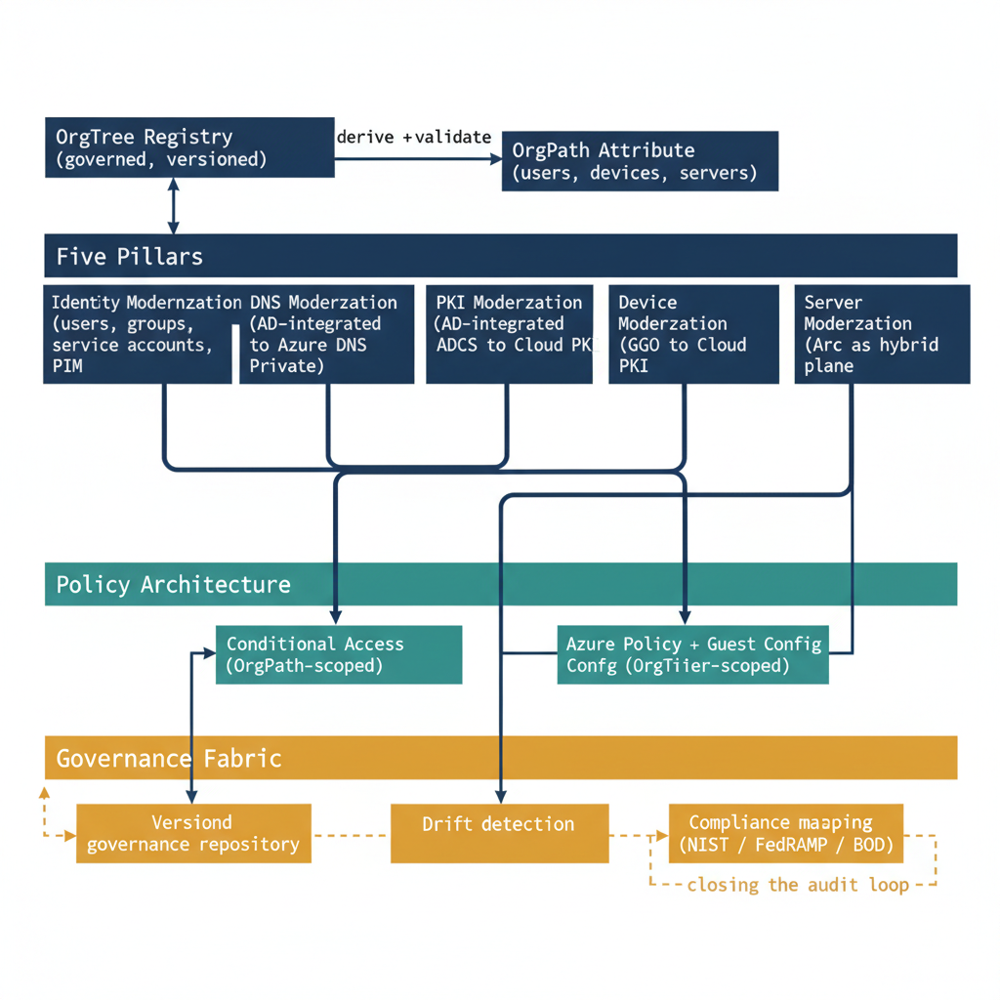

# Chapter 9 — Identity Modernization: From Object to Lifecycle

::: {.callout-note}
## In this chapter
Identity modernization is the central pillar of the UIAO program, and its
guide is the most comprehensive document in the corpus. This chapter surveys
the object classes and governance constructs it covers, examines service
account migration as the most technically complex element, and explains how
the privileged access tier model maps directly onto the OrgPath node model.
:::

{#fig-15-uiao-governance-os-complete-narrative-diagram-02 fig-alt="Top band: OrgTree Registry (governed, versioned) → OrgPath Attribute (users, devices, servers), with the connecting arrow labeled \"derive + validate\". Second band labeled \"Five Pillars\" contains five horizontally arranged boxes: Identity Modernization (users, groups, service accounts, PIM); DNS Modernization (AD-integrated to Azure DNS Private); PKI Modernization (ADCS to Cloud PKI); Device Modernization (GPO to Intune); Server Modernization (Arc as hybrid plane). The OrgPath attribute fans into all five pillars. Third band labeled \"Policy Architecture\" contains two boxes: Conditional Access (OrgPath-scoped); Azure Policy + Guest Config (OrgTier-scoped). Identity and Device pillars feed Conditional Access; Server pillar feeds Azure Policy. Bottom band labeled \"Governance Fabric\" contains three boxes: Versioned governance repository; Drift detection; Compliance mapping (NIST / FedRAMP / BOD). Dashed governance arrows: Registry → Repository; both policy boxes → Drift detection; Drift detection → Compliance mapping; Compliance mapping → Repository (closing the audit loop). Engineering blueprint style, white background, federal navy (#1F3A5F) for registry and pillars, teal (#1A9E8F) for policy band, amber (#D4A017) for governance fabric, monospace identifiers, 16:9 landscape." width="85%"}

## The Scope of the Identity Modernization Guide

Identity modernization is the central pillar of the UIAO program, and the identity modernization guide is correspondingly the most comprehensive single document in the corpus. It covers every object class and governance construct in the Active Directory identity model:

- **User objects** — with their attribute sets, UPN routing, SID history, group memberships, OU placement, and lifecycle state.
- **Security and distribution groups** — with their scope, nesting patterns, mail-enablement, and dynamic membership targets in Entra ID.
- **Service accounts in all three forms** — traditional service accounts, Managed Service Accounts, and Group Managed Service Accounts.
- **Privileged access** — including AdminSDHolder-protected groups, delegation models, and tiered administration architecture.
- **Conditional Access** — as the cloud replacement for GPO-based logon restrictions.
- **Identity governance** — including access reviews, entitlement management, lifecycle workflows, and compliance attestation through Entra ID Governance.

## Service Account Migration

The service account migration deserves particular attention because it is the most technically complex element of identity modernization and the one most consistently underestimated in modernization programs that have not encountered it before.

> Traditional service accounts are among the most dangerous objects in any Active Directory forest: they often carry excessive permissions accumulated over years of incremental privilege creep, they are rarely reviewed because changing them risks breaking the services they run, and they authenticate with passwords that may not have been rotated in a decade or more.

The UIAO framework treats service account modernization as a three-track migration:

| Account category | Short-term destination | Long-term destination |
| :--- | :--- | :--- |
| **Services on domain-joined Windows machines** | Group Managed Service Accounts — the domain controller manages password rotation automatically | Managed Identities, as the services they support migrate to Azure-hosted or cloud-native deployments |
| **Accounts that authenticate to Azure services** | Workload Identity Federation, directly — eliminating the stored credential entirely | — |
| **Accounts with no clear owner** — no identifiable responsible team and no confirmable active service dependency | Quarantined in a restricted OU with no network access rights | Deprovisioned after a 30-day monitoring window confirms no service disruption |

## The Privileged Access Tier Model

The privileged access tier model maps directly to the OrgPath node model, creating a clean correspondence between organizational position and administrative privilege scope.

| Tier | Scope | Authentication and access controls |
| :--- | :--- | :--- |
| **Tier 0** | Domain and cloud control plane administrators — the most sensitive accounts in the environment | Separate, dedicated cloud-only identities in Entra ID with Privileged Identity Management just-in-time activation that requires approval, justification, and produces a complete audit record for every activation |
| **Tier 1** | Server administrators | Phishing-resistant multi-factor authentication combined with compliant device requirements enforced through Conditional Access, ensuring server management activity can only originate from managed, compliant devices |
| **Tier 2** | Workstation administrators | The standard authentication stack |

No administrator account crosses tier boundaries. No administrator account is used for routine user activity.

> This separation is enforced architecturally — Tier 0 accounts have no mailbox, no Teams presence, and no access to end-user applications — not merely by policy directive that individual administrators might choose to ignore.
