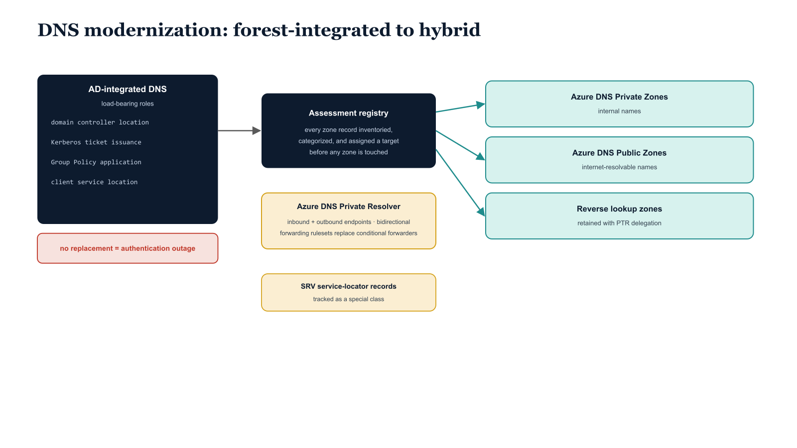

# Chapter 10 — DNS Modernization: From Forest-Integrated to Hybrid Resolution

::: {.callout-note}
## In this chapter
DNS is the most underestimated dependency in any Active Directory modernization program. This chapter explains why AD-integrated DNS is a load-bearing authentication mechanism rather than a convenience feature, the governing principle that no zone migrates until every record is inventoried and assigned a target, how forward, reverse, and conditional-forwarder resolution maps onto Azure DNS services, the special governance class reserved for SRV service-locator records, and the role of the Azure DNS Private Resolver as the centerpiece of the hybrid target state.
:::

## Why DNS Is the Load-Bearing Dependency

DNS is the most underestimated dependency in any Active Directory modernization program, and the UIAO DNS modernization guide exists precisely because underestimating it is catastrophically common. Active Directory-integrated DNS is not a convenience feature and it is not a simple zone host. It is the mechanism by which domain controllers find each other across sites, by which Kerberos ticket issuance works, by which Group Policy is applied, by which client machines locate every directory service from login through session to logout.

> Removing AD-integrated DNS without a complete and tested replacement is the fastest available path to making an entire organization unable to authenticate.

{#fig-book-15-cpt-10-diagram-01 fig-alt="Engineering blueprint diagram on a white background showing the migration from forest-integrated DNS to a hybrid Azure resolution model. On the left, a federal navy (#1F3A5F) box labeled AD-integrated DNS lists its load-bearing roles in monospace — domain controller location, Kerberos ticket issuance, Group Policy application, and client service location. A red (#C0392B) caution band beneath it reads no replacement equals authentication outage. In the center, a navy assessment registry box shows every zone record inventoried, categorized, and assigned a migration target before any zone is touched. On the right, three teal (#1A9E8F) target boxes receive arrows from the registry — Azure DNS Private Zones for internal names, Azure DNS Public Zones for internet-resolvable names, and reverse lookup zones retained with PTR delegation. An amber (#D4A017) box at center labeled Azure DNS Private Resolver shows inbound and outbound endpoints providing bidirectional resolution and replacing conditional forwarders with forwarding rulesets. A separate amber governance box highlights SRV service-locator records tracked as a special class. Monospace labels throughout, no human figures, 16:9 landscape." width="85%"}

## The Governing Principle: Inventory Before Migration

The UIAO DNS modernization framework is built around one governing principle: no DNS zone is migrated until every record in that zone has been inventoried, categorized, and assigned a migration target in the UIAO DNS assessment registry. Each zone type carries its own target and its own continuity requirement:

| Source zone / mechanism | Migration target | Continuity requirement |
| :--- | :--- | :--- |
| **Forward lookup zones (internal)** | Azure DNS Private Zones | Internal name resolution within Azure virtual networks |
| **Forward lookup zones (external)** | Azure DNS Public Zones | Externally visible names that must remain resolvable from the public internet |
| **Reverse lookup zones** | Maintained throughout the transition with PTR record delegation to the new infrastructure | Reverse resolution — required by many application-level health checks and audit logging systems — does not break during the forward resolution migration |
| **Conditional forwarders** | Azure DNS Forwarding Rulesets configured on the Azure DNS Private Resolver | The same forwarding behavior for trusted forests and partner domains, in a cloud-native, manageable form |

## SRV Record Governance: The Service-Locator Class

The SRV record governance section of the DNS modernization guide addresses the most technically sensitive aspect of the entire migration: the Active Directory service locator records. These records are what allow every domain-joined machine on the network to find a domain controller:

- `_ldap._tcp.dc._msdcs`
- `_kerberos._tcp`
- `_kpasswd._tcp`
- and their site-specific variants

Three rules bound how these records are handled across the migration period:

1. They must remain continuously resolvable throughout the migration period.
2. They must be replicated to the new DNS infrastructure before any AD-integrated DNS zone is touched for decommissioning.
3. Their correctness must be validated against the domain controller inventory after every DNS change.

> The UIAO framework treats these records as a special governance class.

They are tracked in the SRV governance registry maintained in the assessment output, validated on every DNS assessment run, and compared against the current domain controller inventory to detect any mismatch between registered locator records and actual domain controller availability.

## The Azure DNS Private Resolver as Target-State Centerpiece

The Azure DNS Private Resolver is the architectural centerpiece of the hybrid DNS target state. It provides bidirectional resolution between on-premises networks and Azure virtual networks through inbound and outbound endpoints, allowing on-premises clients to resolve Azure Private DNS zones and allowing Azure-hosted workloads to resolve on-premises DNS names without deploying and managing traditional DNS forwarder virtual machines.

The resolver deployment is documented with Bicep infrastructure-as-code templates and PowerShell deployment scripts. Both are:

- committed to the UIAO governance repository,
- idempotent, and
- subject to the same governance review process as every other artifact in the corpus.
