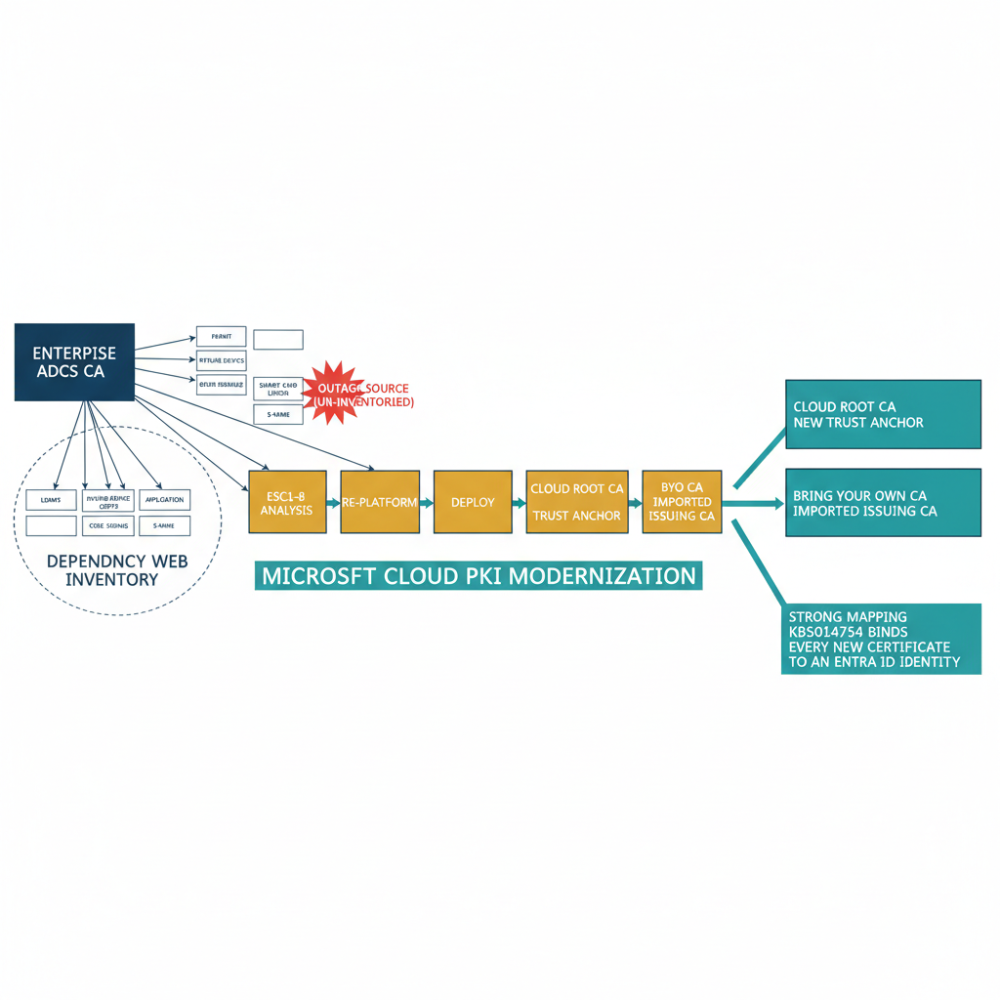

# Chapter 11 — PKI Modernization: From ADCS to Cloud PKI

::: {.callout-note}
## In this chapter
Active Directory Certificate Services is the second most underestimated dependency in any AD modernization — its certificates are embedded in hundreds of trust relationships, and one missed dependency produces an outage at decommissioning. This chapter covers the UIAO six-phase migration from ADCS to a hybrid Microsoft Cloud PKI architecture: the assessment inventory and its in-phase ESC vulnerability analysis, the two Cloud PKI deployment models and their tradeoffs, and the mandatory strong-mapping enforcement that binds every new certificate to an Entra ID identity.
:::

## Why ADCS Is the Dependency That Bites Last

Active Directory Certificate Services is the second most underestimated dependency in any Active Directory modernization program, ranking immediately behind DNS in the frequency and severity of migration failures it causes when not addressed with sufficient rigor. Certificates issued by the enterprise CA are embedded in hundreds of trust relationships across the environment. Every one of these use cases must be inventoried, re-platformed on the new PKI infrastructure, and validated before the ADCS infrastructure can be decommissioned.

The trust relationships that depend on the enterprise CA span the full breadth of the environment:

- **Domain controller authentication** via Kerberos PKINIT
- **LDAPS** for secure directory queries
- **Device identity certificates** for Intune compliance evaluation
- **User smart card authentication** for high-assurance logon scenarios
- **Application TLS** for internal web services
- **Code signing** for PowerShell scripts and deployment packages
- **S/MIME** for email encryption

> Any one missed dependency will produce an outage at decommissioning time.

{#fig-book-15-cpt-11-diagram-01 fig-alt="Engineering blueprint diagram on a white background showing the ADCS to Microsoft Cloud PKI modernization. On the left, a federal navy (#1F3A5F) box labeled enterprise ADCS CA fans out to a cluster of monospace-labeled trust-relationship nodes — PKINIT, LDAPS, Intune device certs, smart card logon, application TLS, code signing, S-MIME — illustrating the dependency web that must be inventoried. A red (#C0392B) burst marks one un-inventoried dependency as the outage source at decommissioning. In the center, an amber (#D4A017) horizontal six-stage pipeline runs left to right: Assessment with embedded ESC1 through ESC8 analysis, then re-platform, then deploy. On the right, two teal (#1A9E8F) target boxes present the deployment-model fork: Cloud Root CA new trust anchor, and Bring Your Own CA imported issuing CA. A teal callout reads strong mapping KB5014754 binds every new certificate to an Entra ID identity. Monospace labels throughout, no human figures, 16:9 landscape." width="100%"}

## The Six-Phase Migration and Its Assessment

The UIAO PKI modernization guide defines a six-phase migration from ADCS to a hybrid architecture using Microsoft Cloud PKI and Intune certificate deployment. The assessment phase uses the UIAOPKIAssessment module to inventory the full PKI surface:

- every CA instance, including offline root CAs;
- every issued certificate across all templates;
- every certificate template with its enrollment permissions and cryptographic settings; and
- every relying party that trusts the enterprise CA chain.

The ESC vulnerability analysis — applied during the assessment phase, not after — identifies the eight classes of certificate template misconfiguration that constitute the most common Active Directory Certificate Services attack surface, ranging from ESC1 through ESC8, and ranks each finding by exploitability and blast radius.

## Choosing a Cloud PKI Deployment Model

The migration architecture distinguishes between two Cloud PKI deployment models with meaningfully different tradeoffs.

The **Cloud Root CA model** creates a new PKI hierarchy hosted entirely in Microsoft Cloud PKI, establishing a new trust anchor that must be distributed to all devices through Intune Trusted Root certificate profiles before any dependent certificates can be issued. This model is appropriate for organizations that are willing to execute a complete device re-enrollment campaign and can accept the operational complexity of maintaining two parallel CA hierarchies during the transition period.

The **Bring Your Own CA model** imports an existing on-premises issuing CA into Microsoft Cloud PKI, preserving the existing trust anchor and the existing issued certificate inventory while moving all new certificate issuance to the cloud infrastructure. This model is appropriate for organizations with large inventories of long-lived certificates that cannot be replaced on an accelerated timeline, or for organizations where the re-enrollment campaign logistics would be prohibitive.

| Model | What it does | Trust anchor | Best fit |
| :--- | :--- | :--- | :--- |
| **Cloud Root CA** | New PKI hierarchy hosted entirely in Microsoft Cloud PKI | New anchor, distributed via Intune Trusted Root profiles before any dependent certificate issues | Organizations willing to run a complete device re-enrollment campaign and accept parallel CA hierarchies during transition |
| **Bring Your Own CA** | Imports an existing on-premises issuing CA into Microsoft Cloud PKI | Existing anchor and existing issued inventory preserved; new issuance moves to the cloud | Organizations with large inventories of long-lived certificates, or where re-enrollment logistics would be prohibitive |

## Strong Mapping Enforcement

The strong mapping enforcement introduced in Microsoft Security Advisory KB5014754 — which requires that certificates include Subject Alternative Name extensions that bind the certificate cryptographically to a specific Entra ID user or device object — is mandatory for all new certificate issuance in the UIAO framework.

> Strong mapping binds the certificate cryptographically to a specific Entra ID identity, eliminating a class of certificate substitution attacks that were possible when binding relied solely on subject name matching.

This requirement aligns the certificate trust model with the Entra ID identity model in a way that supports continuous compliance verification through the assessment pipeline.
