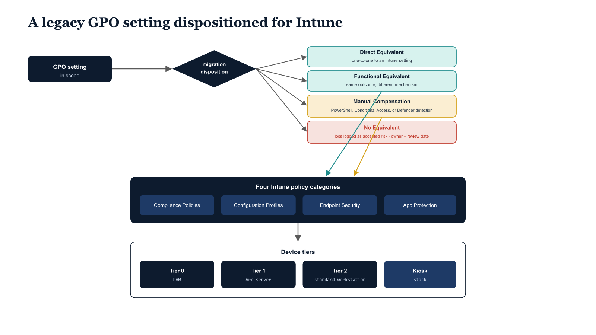

# Chapter 12 — Device Modernization: Intune as the GPO Successor

::: {.callout-note}
## In this chapter
How Microsoft Intune replaces Active Directory Group Policy across the full
range of enterprise device management. This chapter walks the four functional
policy categories of the Intune template library, the four disposition codes of
the GPO-to-Intune migration matrix that govern how every legacy setting is
handled, and the device tier model that structures all policy targeting across
the modernization lifecycle.
:::

## The Intune Policy Template Library

The Intune policy template library is the most operationally dense document in the UIAO corpus. It provides a complete, production-ready library of Microsoft Intune policy templates designed to replace Active Directory Group Policy Objects across the full range of enterprise device management scenarios, organized into four functional categories.

> Group Policy is not retired by deleting GPOs; it is retired by reproducing every behavior they enforced through an Intune surface that an organization can target, measure, and audit.

The four categories divide the device management surface by what each policy type is responsible for:

| Category | What it governs | Representative settings |
| :--- | :--- | :--- |
| **Compliance Policies** | The measurable standards a device must meet to be considered compliant by the Conditional Access evaluation engine | BitLocker encryption status, minimum OS build version, Windows Defender signature currency, firewall state, Secure Boot status |
| **Configuration Profiles (Settings Catalog)** | Device behavior across hundreds of policy areas previously governed by Group Policy | Windows Update rings, Microsoft Edge security settings, Windows Hello for Business enrollment policy |
| **Endpoint Security policies** | Hardening of the device security posture | Attack Surface Reduction rules, Microsoft Defender for Endpoint configuration, Windows Firewall rule sets, Account Protection settings |
| **App Protection Policies** | How managed applications handle organizational data on both managed and unmanaged devices | Copy/paste restrictions, screenshot prevention, data transfer limitations between managed and unmanaged application contexts |

{#fig-book-15-cpt-12-diagram-01 fig-alt="Engineering blueprint diagram on a white background showing a legacy Group Policy setting being dispositioned and re-expressed as Intune policy. On the left, a federal navy (#1F3A5F) box labeled GPO setting in scope feeds an arrow into a navy decision diamond labeled migration disposition. Four arrows branch right to four outcome boxes — a teal (#1A9E8F) box Direct Equivalent mapping one-to-one to an Intune setting, a teal box Functional Equivalent achieving the same outcome via a different mechanism, an amber (#D4A017) box Manual Compensation using a PowerShell remediation, Conditional Access policy, or Defender custom detection, and a red (#C0392B) box No Equivalent whose loss is logged as an accepted risk with owner and review date. The teal and amber outcomes flow into a navy panel listing the four Intune policy categories — Compliance Policies, Configuration Profiles, Endpoint Security, App Protection — and that panel feeds a navy panel of three device tiers — Tier 0 PAW, Tier 1 Arc server, Tier 2 standard workstation — plus a Kiosk stack. Monospace labels for setting names and tiers, no human figures, 16:9 landscape." width="85%"}

## The GPO-to-Intune Migration Matrix

The GPO-to-Intune migration matrix is the operational core of the device modernization document. Every GPO setting in scope receives one of four disposition codes that govern how it is handled in the migration plan:

| Disposition code | Meaning | How it is handled |
| :--- | :--- | :--- |
| **Direct Equivalent** | An Intune setting exists that produces identical device behavior | Mappable one-to-one with no compensating controls required |
| **Functional Equivalent** | An Intune setting exists that achieves the same security outcome through a different mechanism | For example, replacing a GPO script that configures Windows Firewall rules with an Intune Endpoint Security Firewall profile that achieves the same inbound and outbound rule set through a different configuration path |
| **Manual Compensation** | No Intune setting exists for this behavior, but the security goal can be achieved through an alternative mechanism | A PowerShell remediation script deployed as an Intune proactive remediation, a Conditional Access policy, or a Microsoft Defender for Endpoint custom detection rule |
| **No Equivalent** | The GPO setting enforces behavior that has no cloud analog | The loss must be formally accepted as a risk decision documented in the governance repository with an assigned risk owner and a planned review date |

> A *No Equivalent* disposition is never a silent gap — it is a recorded risk decision with an owner and a review date. The migration matrix turns the absence of a control into an explicit, auditable governance choice.

## The Device Tier Model

The device tier model structures all Intune policy targeting across the modernization lifecycle. Each tier defines a population of devices and the policy posture appropriate to it:

| Tier | Device population | Policy posture |
| :--- | :--- | :--- |
| **Tier 0** | Privileged Access Workstations | The most restrictive device configuration — BitLocker, Credential Guard, and Virtualization-Based Security mandatory; Attack Surface Reduction rules set uniformly to Block mode; no user-installed applications permitted; outbound network access restricted to the explicit allow list required for Tier 0 administrative functions |
| **Tier 1** | Arc-managed servers enrolled in Intune for endpoint security management | Configuration settings appropriate for server workloads rather than end-user devices |
| **Tier 2** | The standard corporate workstation population (the largest device tier) | Security baselines applied, compliance policies enforced, and a managed application catalog made available through the Intune Company Portal |
| **Kiosk** | Public-facing or shared-use devices | A separate, minimal policy stack that locks the device to a single-application experience appropriate for public-facing or shared-use scenarios |

> Policy targeting follows the tier, not the device name. A workstation's posture is decided by which tier it belongs to — and that membership is what makes the modernization lifecycle governable at scale.
