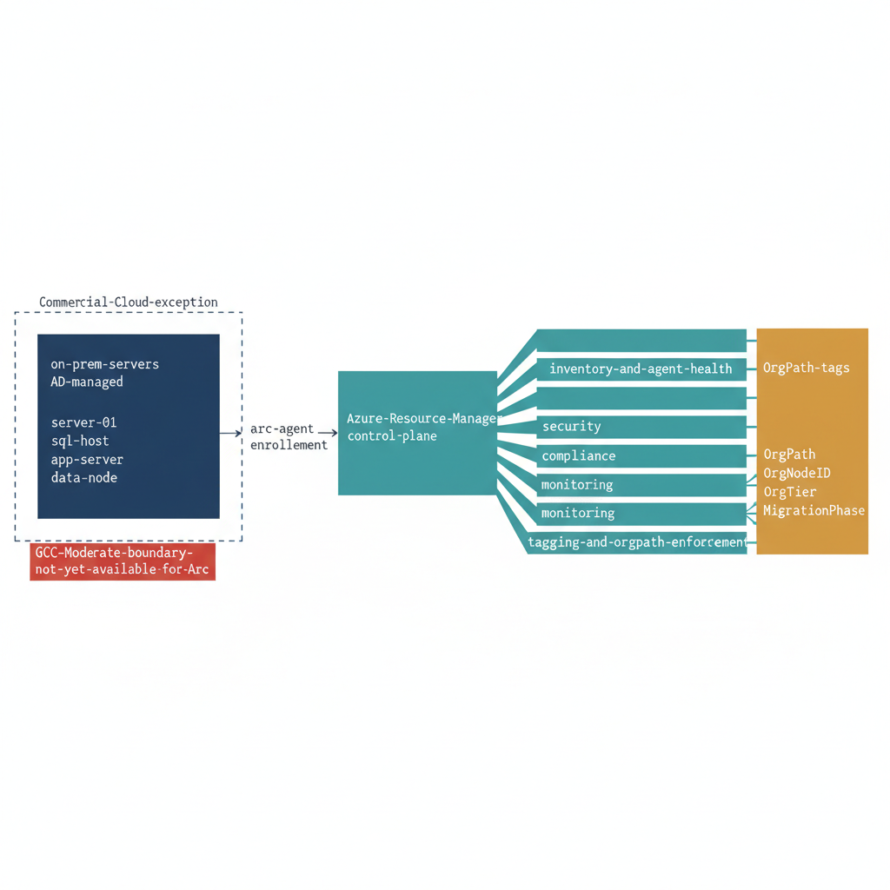

# Chapter 13 — Server Modernization: Azure Arc as the Hybrid Management Plane

::: {.callout-note}
## In this chapter
Azure Arc is the bridge between the Active Directory-managed server world and the Entra ID and Intune governance plane, extending the Azure Resource Manager control surface to on-premises servers during the modernization transition. This chapter covers the Arc policy library and its five governance domains, the documented Commercial Cloud exception that lets Arc run outside the GCC-Moderate boundary, and the OrgPath tagging policy that carries the governance model from the identity and device plane into the server resource plane.
:::

## Azure Arc as the Architectural Bridge

Azure Arc is the architectural bridge between the Active Directory-managed server world and the Entra ID and Intune governance plane. Its role in the UIAO program is to extend the Azure Resource Manager control surface — the same control plane used to manage Azure-native resources — to on-premises servers that will not be immediately migrated to Azure, providing a consistent management, policy enforcement, and compliance reporting experience across the hybrid estate during the transition period.

{#fig-book-15-cpt-13-diagram-01 fig-alt="Engineering blueprint diagram on a white background showing Azure Arc as a hybrid control plane bridging on-premises servers to the Azure governance plane. On the left, a federal navy #1F3A5F box labeled on-prem-servers AD-managed with monospace server hostnames sits inside a dashed boundary marked Commercial-Cloud-exception. An arrow labeled arc-agent-enrollment crosses to a central teal #1A9E8F box labeled Azure-Resource-Manager-control-plane. From that control plane five teal lanes fan to the right, each labeled with one governance domain in monospace text — inventory-and-agent-health, security, compliance, monitoring, and tagging-and-orgpath-enforcement. An amber #D4A017 side panel labeled OrgPath-tags lists four monospace tag keys OrgPath OrgNodeID OrgTier MigrationPhase feeding the tagging lane. A small red #C0392B note marks GCC-Moderate-boundary-not-yet-available-for-Arc against the dashed boundary. Monospace labels throughout, no human figures, 16:9 landscape." width="85%"}

The Azure Arc policy library provides a complete, ready-to-deploy set of Azure Policy definitions purpose-built for the UIAO modernization pipeline, organized across five governance domains:

| Governance domain | Purpose |
| :--- | :--- |
| **Inventory and Agent Health** | Track Arc-enabled servers and confirm the Arc agent is present and reporting |
| **Security** | Enforce security configuration baselines on Arc-managed servers |
| **Compliance** | Provide compliance reporting across the hybrid estate |
| **Monitoring** | Govern telemetry collection from Arc-managed servers |
| **Tagging and OrgPath enforcement** | Enforce the OrgPath governance tags on every Arc-enabled server object |

## The Boundary Context and the Commercial Cloud Exception

The boundary context for Azure Arc deployment matters precisely and must be understood before any Arc enrollment proceeds. UIAO operates within a GCC-Moderate boundary for all Microsoft 365 SaaS services, including Intune, Entra ID, and Microsoft Defender for Endpoint. Azure Arc runs in Commercial Cloud under an explicit, documented exception to the GCC-Moderate boundary — an architectural decision that acknowledges the operational reality that the Azure Arc control plane for on-premises servers is not yet available in GCC, while the management value of Arc enrollment is too significant to defer until GCC availability. All Azure Policy definitions target the Commercial Cloud Azure control plane. Data classification for all Arc-managed servers remains Controlled.

> This exception is not a gap in the governance posture — it is a deliberate, documented architectural decision committed to the governance repository and reviewed by the Canon Steward, with a planned reassessment trigger when Azure Arc achieves GCC availability.

## The OrgPath Tagging Policy

The OrgPath tagging policy is the most important policy in the Arc library, because it is the mechanism by which the OrgPath governance model extends from the identity and device plane into the server resource plane. The policy enforces the presence and correct format of four resource tags on every Arc-enabled server object in Azure Resource Manager:

| Tag | What it encodes |
| :--- | :--- |
| **OrgPath** | The full organizational hierarchy path inherited from the server's OU placement in Active Directory |
| **OrgNodeID** | The canonical node identifier from the UIAO OrgTree registry |
| **OrgTier** | The management tier assignment — Tier0, Tier1, or Tier2 — that governs which Intune and Arc policy stack applies to this resource |
| **MigrationPhase** | The current modernization phase status for the server |

> These tags are not decorative metadata added for dashboard aesthetics. They are the Arc-side representation of the OrgPath governance model.

The tags allow Azure Policy to enforce organization-specific rules, allow Azure Monitor workbook queries to filter telemetry by organizational boundary, and allow the OrgPath dependency graph to include server resources alongside user and device identities in a unified governance view.
