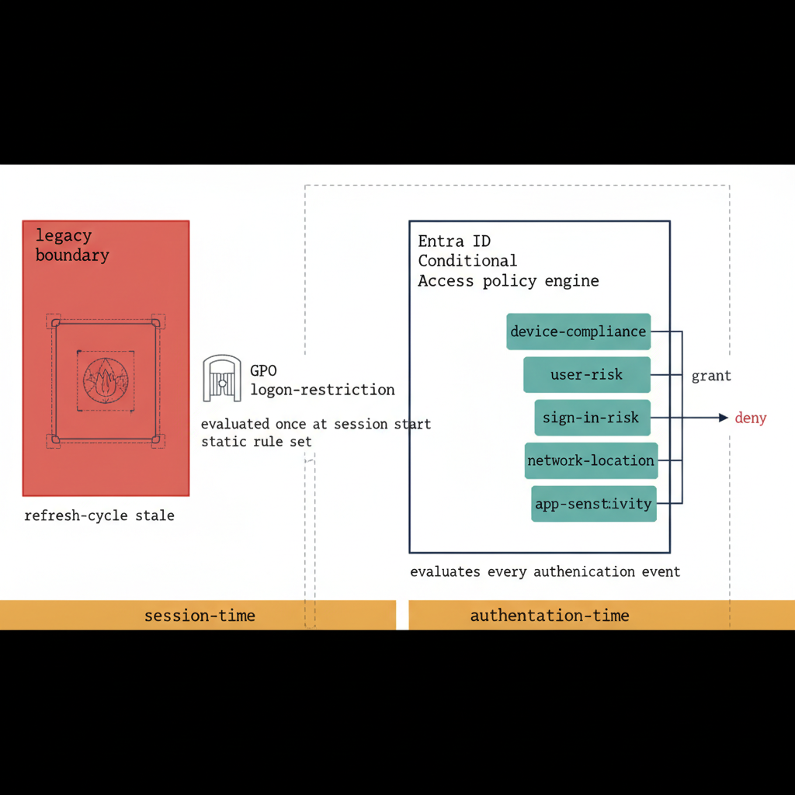

# Chapter 14 — Conditional Access: The Cloud Successor to GPO Logon Restrictions

::: {.callout-note}
## In this chapter
Conditional Access replaces GPO-based logon restrictions with signal-based, real-time policy evaluation that runs at authentication time rather than session establishment time. This chapter walks the policy library's eight families, the GPO-to-Conditional-Access transformation mapping, the OrgPath integration that targets organizational segments without per-segment security groups, and the break-glass emergency-access architecture that keeps the program from being locked out of its own platform.
:::

## Authentication-Time Evaluation, Not Session-Time

The Conditional Access policy library defines more than forty policies organized by function and tier, covering the complete replacement of GPO-based access control with signal-based, real-time policy evaluation that operates at authentication time rather than session establishment time. This distinction is architecturally significant.

Group Policy logon restrictions were evaluated when a session began, against a static set of rules captured in the most recently applied policy, producing a decision that could not be revised until the next Group Policy refresh cycle. Conditional Access instead evaluates every authentication event against the current policy set, using live signals — device compliance state, user risk score, sign-in risk score, network location, and application sensitivity — producing a grant or deny decision that reflects the current state of the environment at the moment of authentication.

> Group Policy decided once, at the door, against yesterday's rules. Conditional Access decides every time, against the signals present right now.

{#fig-book-15-cpt-14-diagram-01 fig-alt="Engineering blueprint diagram on a white background contrasting two access-control models. On the left, a red C0392B box labeled legacy boundary shows a network firewall perimeter and a GPO logon-restriction gate evaluated once at session start against a static rule set, with a monospace note refresh-cycle stale. On the right, a federal navy 1F3A5F box labeled Entra ID Conditional Access policy engine evaluates every authentication event. Five teal 1A9E8F input chips feed the engine with monospace labels device-compliance, user-risk, sign-in-risk, network-location, and app-sensitivity. The engine emits two outcomes, a navy grant arrow and a red C0392B deny arrow. An amber D4A017 band beneath both models marks the dividing line, labeled session-time on the left and authentication-time on the right. Monospace labels throughout, no human figures, 16:9 landscape." width="100%"}

## The Eight Policy Families

The library is organized into eight policy families that together cover the complete governance surface:

| Policy family | Scope and intent |
| :--- | :--- |
| **Baseline Policies** | Apply to all identities regardless of device state or network location; establish the minimum acceptable authentication posture for the organization |
| **Device Tier Policies** | Differentiate authentication requirements by device compliance tier, requiring progressively stronger authentication for access from less-managed device contexts |
| **Environment Policies** | Enforce controls based on network location and cloud environment boundary, applying additional verification for access originating outside the trusted network perimeter |
| **Region and Site Policies** | Apply geographic controls appropriate for organizations with site-specific data residency or access requirements |
| **Application-Specific Policies** | Enforce controls calibrated to the sensitivity of individual applications — phishing-resistant authentication for high-value targets, usable controls for lower-sensitivity applications |
| **Governance Policies** | Protect the UIAO platform itself — the Gitea repository server, the Quarto documentation site, and the assessment pipeline endpoints — with the strictest available controls |

## The GPO-to-Conditional-Access Transformation

The GPO-to-Conditional Access transformation table captures the conceptual mapping at the level of precision that governance engineers need to execute the transition.

| Group Policy mechanism | Conditional Access equivalent |
| :--- | :--- |
| **GPO logon restrictions** — preventing specific users or groups from logging in locally or over the network | Conditional Access device-based grant controls combined with device filter conditions, enforced at authentication time through the Entra ID policy engine rather than at session establishment through the local security authority |
| **Security filtering by group membership** | Application assignment and Conditional Access policy scoping through OrgPath-derived dynamic groups — the same targeting with lower maintenance overhead and real-time membership evaluation |
| **Account lockout policy** | Entra ID smart lockout with configurable observation window and lockout threshold |
| **Password complexity requirements** | Entra ID Password Protection with a custom banned-password list tailored to the organization's naming conventions and common weak-password patterns |
| **Credential delegation restrictions** — Kerberos constrained-delegation settings limiting which services could act on behalf of users | Conditional Access session controls with authentication-strength requirements that enforce the minimum assurance level for delegation-eligible service contexts |

## The OrgPath Integration

The OrgPath integration is the differentiating capability of the UIAO Conditional Access implementation. Because the OrgPath attribute is a custom Directory Schema Extension on every Entra ID user object, Conditional Access policies can target specific organizational segments through the extensionAttribute schema without creating a separate security group for each targeted segment.

A single Conditional Access policy can enforce phishing-resistant MFA for all identities whose OrgPath contains the Mission Operations segment, regardless of how many individual users that represents at any given time, without requiring any manual group membership management as organizational assignments change.

> This targeting model is both more precise and more maintainable than the group-based targeting it replaces, because the OrgPath attribute is the source of truth for organizational placement — maintained by the provisioning pipeline, not by manual group membership operations susceptible to accumulation, staleness, and human error.

## Break-Glass Emergency Access

The break-glass account procedures, defined in Section 11 of the Conditional Access library, address the emergency-access architecture that ensures the UIAO program cannot be locked out of its own governance platform by a misconfigured Conditional Access policy or a Microsoft Entra ID service disruption.

Two break-glass accounts are maintained in every deployment:

1. **Permanent-exclusion account** — explicitly excluded from all Conditional Access policies through a permanent named exclusion.
2. **FIDO2-only account** — its sole authentication method is a hardware FIDO2 security key stored separately from all other credentials.

Both accounts share a set of protective properties:

- They are **cloud-only Entra ID identities** with no on-premises Active Directory equivalent, ensuring they remain accessible even during complete Active Directory unavailability.
- Their sign-in logs are **monitored continuously** through Azure Monitor alert rules configured to fire within five minutes of any authentication event against either account.
- Their existence, credential storage location, and access procedures are **documented in the governance repository**.
- Their credentials are stored in **sealed physical envelopes** in physically secured locations designated in the DR playbook.
