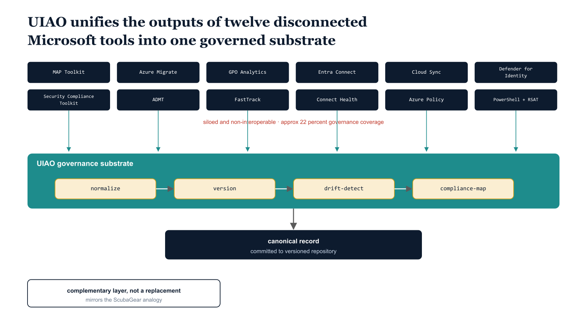

# Chapter 15 — UIAO versus Microsoft's Twelve Tools

::: {.callout-note}
## In this chapter
Why build a governance orchestration layer when Microsoft already ships tools for Active Directory assessment and migration? This chapter gives an honest accounting: Microsoft offers twelve tools that touch AD assessment, migration, or modernization, covering roughly 65 percent of UIAO's raw technical discovery — but only about 22 percent once governance requirements are factored in. The gap is not in any single tool; it is in the missing layer above all of them.
:::

## The Coverage Question

The UIAO versus Microsoft Native Tools gap analysis answers the question that every modernization program eventually confronts: why build a governance orchestration layer when Microsoft already provides tools for Active Directory assessment and migration? The answer is precise and unflinching, and it begins with an honest accounting of what Microsoft's tools actually provide.

Microsoft offers twelve tools that touch Active Directory assessment, migration, or modernization in some capacity. Collectively, they cover approximately 65 percent of what the UIAO Assessment Module captures in raw technical discovery. When governance requirements — versioning, drift detection, compliance mapping, OrgPath structure, and canonical artifact management — are factored into the comparison, Microsoft's effective coverage drops to approximately 22 percent of the total UIAO assessment and governance surface.

> Sixty-five percent of raw discovery, but only twenty-two percent of the governance surface — the difference between the two numbers *is* the gap UIAO fills.

{#fig-book-15-cpt-15-diagram-01 fig-alt="Engineering blueprint diagram on a white background, 16:9 landscape, no human figures. Across the top, twelve small disconnected boxes in federal navy #1F3A5F arranged in two rows, each labeled in monospace with a Microsoft tool name (MAP Toolkit, Azure Migrate, GPO Analytics, Entra Connect, Cloud Sync, Defender for Identity, Security Compliance Toolkit, ADMT, FastTrack, Connect Health, Azure Policy, PowerShell plus RSAT). Thin red #C0392B gaps drawn between the boxes mark them as siloed and non-interoperable, with a small red label reading approx 22 percent governance coverage. Below them, a single wide horizontal teal #1A9E8F bar labeled UIAO governance substrate spans the full width, with thin teal arrows drawing each tool box down into the bar to show consumption and normalization. Inside the teal bar, four monospace amber #D4A017 stage labels in sequence read normalize, version, drift-detect, compliance-map. Beneath the substrate a single navy output box labeled canonical record committed to versioned repository. To the left, a small navy callout reads complementary layer, not a replacement, mirroring the ScubaGear analogy. Monospace labels throughout." width="100%"}

## The Twelve Tools and Their Limits

The twelve tools span a wide range of purposes. Each one does its own job competently; none of them produces a governance-structured, organizationally aware record of the environment. The following table summarizes what each tool provides and where it stops.

| Tool | What it provides | Where it stops |
| :--- | :--- | :--- |
| **Microsoft Assessment and Planning Toolkit** | Hardware inventory and SQL Server discovery | No PowerShell integration; no machine-readable governance output |
| **Azure Migrate** | Server dependency mapping and replication orchestration | No Active Directory assessment capability; no governance-pipeline integration |
| **Group Policy Analytics (Intune)** | Analyzes GPO settings for Intune migration readiness | Limited to GPO-to-Intune translation; no forest topology, DNS, or PKI awareness |
| **Entra Connect and Cloud Sync** | Identity synchronization | No assessment functionality; cannot produce governance artifacts |
| **Microsoft Defender for Identity** | Attack detection and lateral movement analysis against AD | No migration guidance; no governance integration |
| **Microsoft Security Compliance Toolkit** | Security baselines for comparison | No migration tooling |
| **Active Directory Migration Tool** | Migrates objects between domains | No cloud transition capability; produces no machine-readable output |
| **FastTrack** | Advisory services | No tooling |
| **Entra Connect Health** | Monitors synchronization health | Produces no assessment data |
| **Azure Policy and Arc Guest Configuration** | Enforce compliance on Arc-enrolled servers | No Active Directory assessment surface |
| **PowerShell with Remote Server Administration Tools** | The raw data access layer everything else builds on | Raw access is not the same as a governance-structured pipeline |

That accounting covers eleven named entries; counting Azure Policy and Arc Guest Configuration as the paired enforcement surface they represent yields the full set of twelve tools that touch Active Directory assessment, migration, or modernization.

## The Gap Is in the Layer Above

The gap is not found in any individual tool. The gap is in the layer above all of them: the governance fabric that connects their outputs into a unified, versioned, drift-detected, compliance-mapped, organizationally structured picture of the environment.

> UIAO occupies the same position relative to Microsoft's Active Directory modernization tools that CISA's ScubaGear occupies relative to Microsoft 365 security baselines — it is a complementary orchestration layer, not a competitive replacement.

UIAO consumes the outputs of Microsoft's native tools, normalizes them into a common governance schema, commits them to a versioned repository, and provides the canonical record that connects assessment findings to modernization plans to compliance evidence to drift alerts. That layer is what Microsoft has not built and has not indicated it plans to build, because it requires organizational structure awareness — an OrgTree — that Entra ID's flat directory model fundamentally cannot provide.
