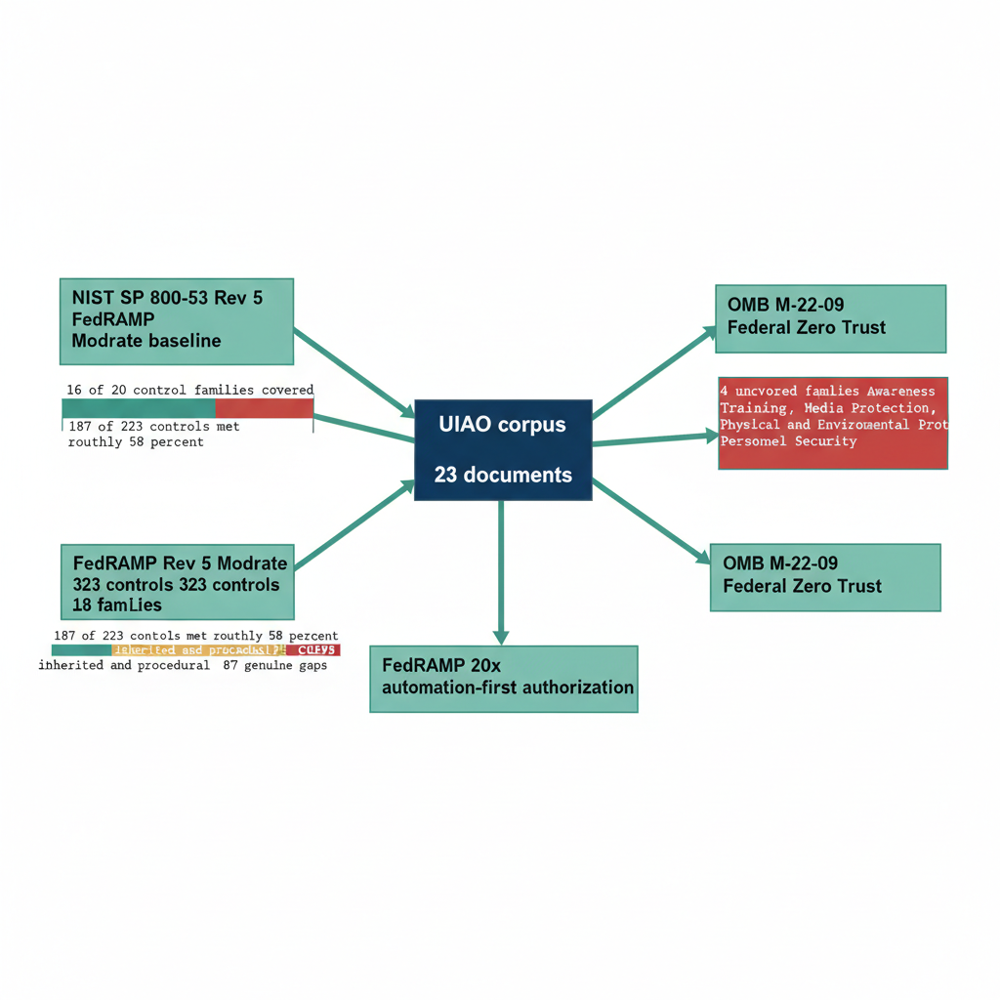

# Chapter 16 — The Compliance Framework

::: {.callout-note}
## In this chapter
The UIAO compliance mapping audits the 23-document corpus against five federal cybersecurity frameworks. This chapter summarizes the frameworks in scope, the honest coverage finding — 16 of 20 NIST 800-53 control families addressed, roughly 58 percent of FedRAMP Moderate controls met — and the reasons UIAO's Git-based governance pipeline is positioned strongly for FedRAMP 20x's automation-first authorization model.
:::

## Frameworks in Scope

The UIAO compliance mapping document performs a systematic audit of the 23-document UIAO corpus against five federal cybersecurity frameworks:

- **NIST SP 800-53 Revision 5** at the FedRAMP Moderate baseline.
- **FedRAMP Revision 5 Moderate** with its 323 controls across 18 assessed control families.
- **FedRAMP 20x** with its automation-first continuous authorization model.
- **CISA Binding Operational Directives** — BOD 22-01 on Known Exploited Vulnerabilities remediation timelines, BOD 23-01 on asset visibility and vulnerability enumeration, and [BOD 25-01](https://cyber.dhs.gov/bod/25-01/) on SCuBA M365 security configuration baselines.
- **OMB Memorandum M-22-09** on the Federal Zero Trust Architecture Strategy, which sets the target architecture requirements that the UIAO program's identity and access modernization work is designed to satisfy.

{#fig-book-15-cpt-16-diagram-01 fig-alt="Engineering blueprint diagram on a white background showing the UIAO 23-document corpus mapped against five federal cybersecurity frameworks. At center, a federal navy 1F3A5F box labeled UIAO corpus 23 documents. Five teal 1A9E8F connectors fan out to framework boxes: NIST SP 800-53 Rev 5 FedRAMP Moderate baseline, FedRAMP Rev 5 Moderate 323 controls 18 families, FedRAMP 20x automation-first authorization, CISA BOD 22-01 23-01 25-01, and OMB M-22-09 Federal Zero Trust. Below the NIST box, a teal segmented bar shows 16 of 20 control families covered, with a red C0392B segment marking the 4 uncovered families Awareness and Training, Media Protection, Physical and Environmental Protection, Personnel Security. Below the FedRAMP box, a teal segmented bar shows 187 of 323 controls met roughly 58 percent, with the remaining 136 split into amber D4A017 inherited and procedural segments and a red C0392B segment for 87 genuine gaps. Monospace labels for control counts, no human figures, 16:9 landscape." width="100%"}

## What the Audit Found

The key finding of the compliance audit is precise and honestly stated: UIAO documents address 16 of 20 NIST 800-53 control families with varying depth of coverage.

> Four control families have no UIAO corpus coverage: Awareness and Training, Media Protection, Physical and Environmental Protection, and Personnel Security.

These gaps are not surprising — they reflect control families that are addressed by agency-level policy and physical security programs rather than by a technical governance platform for IT modernization.

Of the 323 FedRAMP Moderate controls, approximately 187 — 58 percent of the total — are directly addressed or facilitated by existing UIAO artifacts. The remaining 136 controls fall into three categories:

| Category | Count | Disposition |
| :--- | :--- | :--- |
| Physical controls inherited from Microsoft's GCC-Moderate infrastructure | 26 | Not applicable to a SaaS-based governance program |
| Organizational and procedural controls | 23 | Require agency-specific policy documentation the corpus correctly leaves to individual agencies to produce |
| Genuine gaps | 87 | Addressable through targeted document creation and amendments to existing corpus documents |

## Why FedRAMP 20x Fits

UIAO's Git-based governance pipeline positions it strongly for FedRAMP 20x alignment, which is the compliance framework most directly relevant to the program's long-term trajectory. FedRAMP 20x's automation-first authorization model expects three things, each of which the UIAO approach already supplies:

| FedRAMP 20x expectation | UIAO mechanism |
| :--- | :--- |
| Machine-readable compliance evidence | Governance artifacts maintained as versioned code |
| Continuous compliance monitoring through automated controls | Git hooks that reject non-conforming artifacts |
| Key Security Indicator dashboards an authorization official can read without requesting a package of PDF documents | Compliance dashboards rendered through the Quarto pipeline on a continuous basis |

> The gap between UIAO's current posture and FedRAMP 20x requirements is primarily documentation coverage in four control families, not architectural.

The platform already produces the machine-readable evidence that FedRAMP 20x requires, and it already maintains the continuous monitoring posture that FedRAMP 20x's ongoing authorization model demands.
