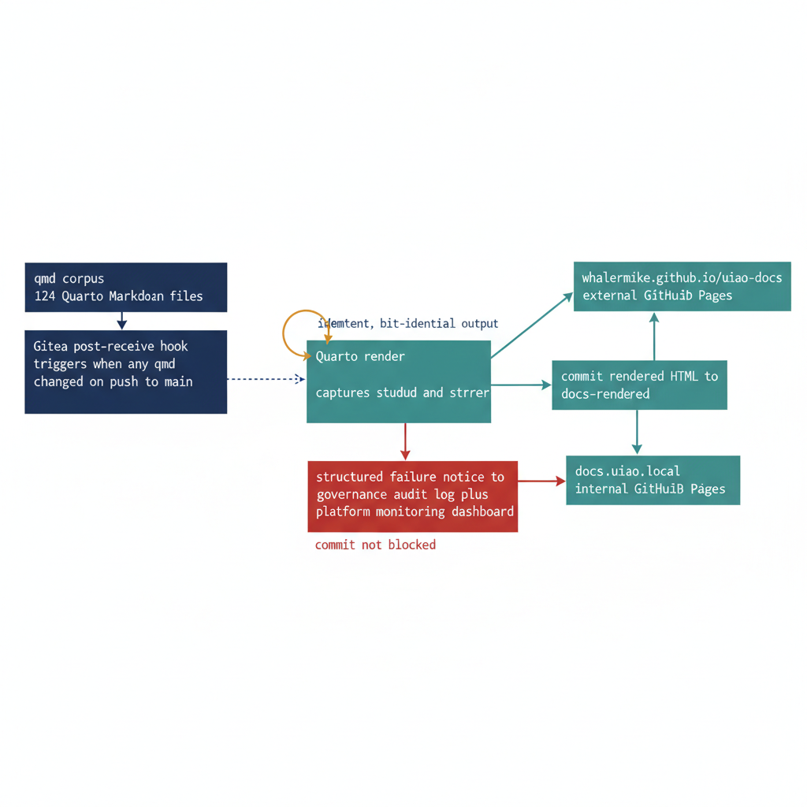

# Chapter 17 — The Documentation Pipeline

::: {.callout-note}
## In this chapter
The Quarto integration turns the UIAO document corpus from a folder of markdown files into a continuously deployed, automatically rendered, governance-tracked documentation site. This chapter describes the corpus the pipeline serves, the two deployment targets it publishes to simultaneously, and the Gitea post-receive hook that renders on every push to main, treats rendering failures as quality signals rather than governance violations, and runs idempotently.
:::

## What the Pipeline Does

The Quarto integration guide defines the end-to-end pipeline that transforms the UIAO document corpus from a collection of markdown files into a continuously deployed, automatically rendered, governance-tracked documentation site. The UIAO docs directory contains 124 Quarto Markdown files covering every aspect of the modernization program — assessment procedures, architecture decisions, migration guides, compliance mappings, operational runbooks, and policy references. These files are the primary human-readable artifact layer of the UIAO governance corpus, and their currency, accuracy, and accessibility directly affect the program's operational effectiveness.

Today these files must be rendered manually by a platform administrator who knows to run the Quarto CLI build command. The Quarto integration establishes an automated pipeline that, without any manual intervention, performs three actions on every commit to the main branch:

- **Renders** the documentation,
- **Validates** output quality, and
- **Deploys** to two targets simultaneously.

{#fig-book-15-cpt-17-diagram-01 fig-alt="Engineering blueprint diagram on a white background showing the UIAO documentation pipeline as a left-to-right flow. On the left, a federal navy (#1F3A5F) box labeled qmd corpus, 124 Quarto Markdown files feeds an arrow into a navy box labeled Gitea post-receive hook, triggers when any qmd changed on push to main. That feeds a teal (#1A9E8F) box labeled Quarto render, captures stdout and stderr. From the render box, on success a teal arrow leads to a box labeled commit rendered HTML to docs-rendered, which then fans out to two teal deployment boxes, one labeled docs.uiao.local internal IIS site and one labeled whalermike.github.io slash uiao-docs external GitHub Pages. On render failure a red (#C0392B) arrow branches downward to a red box labeled structured failure notice to governance audit log plus platform monitoring dashboard, annotated commit not blocked. A small amber (#D4A017) loop arrow on the render box is labeled idempotent, bit-identical output. Monospace labels for all file paths and host names, no human figures, 16:9 landscape." width="85%"}

## Two Deployment Targets

The dual publishing model ensures that documentation is always current, always accessible regardless of network location, and always consistent between the internal and external representations of the governance record. The pipeline writes to two surfaces at once:

| Target | Host | Audience |
| :--- | :--- | :--- |
| **Internal** | docs.uiao.local — IIS-hosted, inside the on-premises network boundary | Operational staff who use the documentation in daily work: governance operators referencing runbook procedures, platform administrators checking configuration parameters, and modernization engineers consulting migration guidance during active transition work |
| **External** | whalermike.github.io/uiao-docs — GitHub Pages | The public-facing documentation surface for the program |

## The Gitea Post-Receive Hook

The Gitea post-receive hook extension that drives this pipeline operates on a simple trigger condition: if any .qmd file was modified in a push to the main branch, the hook invokes the Quarto rendering pipeline. On a successful render it:

1. Captures the pipeline's stdout and stderr output,
2. Commits the rendered HTML output back to the repository in the docs-rendered/ directory, and
3. Pushes the rendered output to the GitHub Pages deployment branch.

If rendering fails — due to a broken cross-reference, a missing data file, or a syntax error in a Quarto document — the hook writes a structured failure notice to the governance audit log and sends a notification to the platform monitoring dashboard. The rendering failure does not block the commit.

> The markdown source is the authoritative artifact; a rendering failure is a quality signal, not a governance violation.

The entire pipeline is idempotent: running it against an unchanged corpus produces bit-identical output, making it safe to trigger from multiple concurrent events without coordination overhead.
