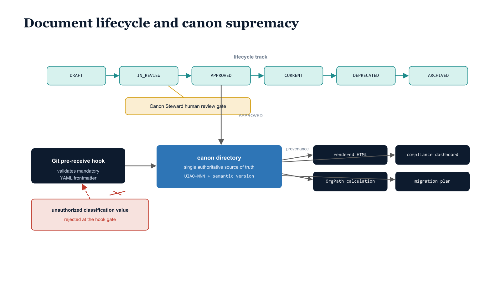

# Chapter 18 — Document Lifecycle and Canon Supremacy

::: {.callout-note}
## In this chapter
UIAO governs its own documentation with the same rigor it applies to the artifacts it governs. This chapter establishes canon supremacy — the rule that every derived artifact must trace its provenance to a canonical record — then walks the immutable identifiers and semantic version numbers that documents carry, the six-state lifecycle enforced by Git hooks, the mandatory YAML frontmatter validated at commit time, and the human-in-the-loop discipline that keeps AI-assisted regeneration accountable.
:::

## The Governance of Governance

The UIAO document lifecycle management guide codifies the governance of governance — the processes that ensure the UIAO corpus itself is created, versioned, reviewed, approved, updated, deprecated, and archived with the same rigor that UIAO applies to the modernization artifacts it governs. This recursive governance requirement is not an afterthought.

> A governance program that cannot govern its own documentation is a governance program that will drift from its own standards — producing the exact failure mode it was designed to prevent: undocumented decisions, inconsistent standards, orphaned artifacts.

{#fig-book-15-cpt-18-diagram-01 fig-alt="Engineering blueprint diagram on a white background showing document lifecycle and canon supremacy. On the left, a federal navy (#1F3A5F) box labeled canon directory is captioned single authoritative source of truth, holding monospace document identifiers UIAO-NNN with semantic version tags. A horizontal lifecycle track flows left to right through six teal (#1A9E8F) state boxes in monospace: DRAFT, IN_REVIEW, APPROVED, CURRENT, DEPRECATED, ARCHIVED, with an arrow from APPROVED pointing into the canon directory. A navy gate box labeled Git pre-receive hook sits before the canon box, validating mandatory YAML frontmatter; an amber (#D4A017) callout marks the Canon Steward human review gate between IN_REVIEW and APPROVED. From the canon box, arrows labeled provenance fan out to four navy derived-artifact tiles in monospace: rendered HTML, compliance dashboard, OrgPath calculation, migration plan. A red (#C0392B) crossed-out arrow shows a document with an unauthorized classification value rejected at the hook gate. No human figures, 16:9 landscape." width="100%"}

## Canon Supremacy and Document Identity

The foundational principle is canon supremacy: the canon/ directory in the UIAO governance repository is the single authoritative source of truth, and every derived artifact — rendered HTML, compliance dashboard, OrgPath calculation, migration plan — must trace its provenance directly to a canonical governance record committed to that directory.

Documents in the corpus carry immutable UIAO-NNN identifiers assigned sequentially at creation and never reused, even after a document is archived. Version numbering follows semantic versioning conventions adapted for governance documents:

| Version increment | When it applies | Effect on dependents |
| :--- | :--- | :--- |
| **Major** | Structural changes that invalidate previous implementations | Requires re-execution of dependent workflows |
| **Minor** | Content additions | Does not break compatibility with existing implementations |
| **Patch** | Corrections and clarifications | Does not change the normative requirements of the document |

## The Six-State Lifecycle

Document status follows a six-state lifecycle enforced by the Git hook infrastructure. Each state defines exactly what editing and commitment actions are permitted:

| Status | Meaning | Permitted action |
| :--- | :--- | :--- |
| **DRAFT** | Initial state for all new documents | Unrestricted editing without Canon Steward review |
| **IN_REVIEW** | Document locked against direct commits | All changes proceed through pull requests with a designated reviewer |
| **APPROVED** | Canon Steward sign-off recorded | Permits commitment to the canon/ directory |
| **CURRENT** | Operational state | Actively used in production governance workflows |
| **DEPRECATED** | Superseded | Not used for new work, remains accessible for reference |
| **ARCHIVED** | Removed from active workflows | Preserved in repository history for audit purposes |

## Mandatory Frontmatter and Hook-Layer Validation

YAML frontmatter is mandatory on every document and is validated by Git pre-receive hooks before any commit can be accepted into the repository. The frontmatter schema requires nine fields:

- `document_id`
- `version`
- `status`
- `classification`
- `boundary`
- `owner`
- `created`
- `last_updated`
- `review_cadence`
- `repository`

The classification and boundary fields are validated against an enumerated set of permitted values defined in the governance hook configuration — any document that claims a classification or boundary designation not in the approved set is rejected at the hook layer, producing a clear error message that identifies the invalid field value and the permitted alternatives.

> No document can enter the canonical record with a classification claim that has not been authorized by the governance framework.

## AI-Assisted Regeneration with Human-in-the-Loop Review

The Copilot Tasks integration is explicitly documented as a governance-compliant document regeneration tool within the lifecycle framework. AI-assisted document regeneration is permitted subject to a mandatory human-in-the-loop review at every lifecycle gate. An AI-generated document must be reviewed and approved by a Canon Steward before it can transition from IN_REVIEW to APPROVED status, and the pull request template for AI-generated content requires the reviewing Canon Steward to attest explicitly that they have:

1. read the complete document,
2. verified its technical accuracy against the assessed environment data, and
3. confirmed its compliance with UIAO document standards.

This attestation requirement ensures that AI assistance accelerates document production without reducing the quality or accountability of the governance record.
