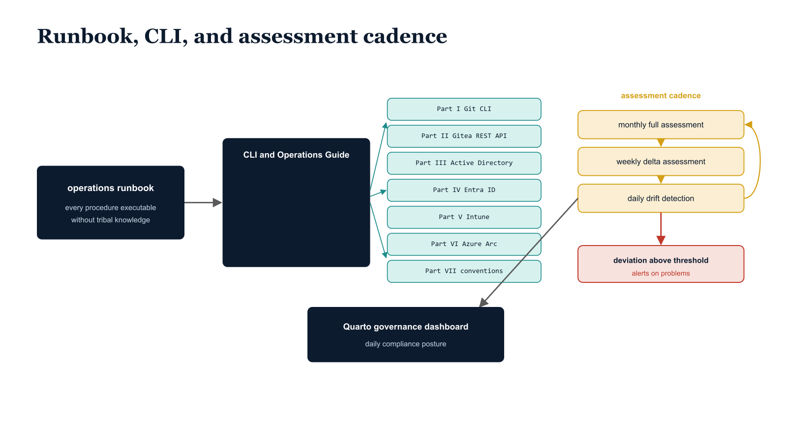

# Chapter 19 — Day-to-Day Platform Administration

::: {.callout-note}
## In this chapter
How the UIAO platform is run day to day: the operations runbook standard that lets any authorized administrator execute every procedure without tribal knowledge, the seven-part CLI and Operations Guide that documents every platform interaction, and the fixed monthly/weekly/daily assessment cadence that keeps the governance record current. Together these turn platform operation into a repeatable, self-sustaining discipline rather than a dependency on the person who built the system.
:::

## The Operations Runbook Standard

The UIAO operations runbook is the authoritative reference for day-to-day platform administration, written to the standard that any authorized administrator — not only the platform architect — can execute every documented procedure from the runbook alone, without tribal knowledge or informal guidance from the person who originally built the system.

> This standard is not merely a documentation best practice; it is a governance requirement.

A governance platform whose operational procedures are carried in individual memory rather than in the canonical record is a platform that cannot sustain itself across personnel changes, and personnel changes are guaranteed over the operational lifetime of any enterprise program.

{#fig-book-15-cpt-19-diagram-01 fig-alt="Engineering blueprint diagram on a white background showing the three pillars of day-to-day platform administration. On the left, a federal navy 1F3A5F box labeled operations runbook — every procedure executable without tribal knowledge feeds an arrow into a central navy box labeled CLI and Operations Guide. The central box fans into seven small teal 1A9E8F stacked tiles labeled in monospace Part I Git CLI, Part II Gitea REST API, Part III Active Directory, Part IV Entra ID, Part V Intune, Part VI Azure Arc, Part VII conventions. On the right, an amber D4A017 cyclic loop of three nodes labeled monthly full assessment, weekly delta assessment, daily drift detection, with an arrow from the loop into a navy box labeled Quarto governance dashboard — daily compliance posture. A small red C0392B marker labeled deviation above threshold branches off the daily drift node to indicate alerting on problems. Monospace labels throughout, no human figures, 16:9 landscape." width="100%"}

## The CLI and Operations Guide

The CLI and Operations Guide provides the complete command reference for all platform interactions, organized in seven parts that reflect the natural divisions of platform operation.

| Part | Scope | What it covers |
| :--- | :--- | :--- |
| **Part I** | Git CLI operations for UIAO contributors | Environment setup including credential manager configuration and GPG signing key registration; the daily contribution workflow from branch creation through pull request submission; branch management and rebase procedures; Canon Steward merge operations; and advanced Git operations including history rewriting for accidental sensitive data commits |
| **Part II** | Gitea REST API | Authentication using API tokens and OAuth2 flows; repository operations including programmatic repository creation and configuration; pull request management via API for automation integration; organization and team management; webhook management including registration and delivery log inspection; and API automation patterns using PowerShell `Invoke-RestMethod` |
| **Part III** | Integration CLI for Active Directory | The specific command patterns, authentication requirements, and output handling conventions used by the UIAO assessment and governance modules for Active Directory |
| **Part IV** | Integration CLI for Entra ID | The specific command patterns, authentication requirements, and output handling conventions used by the UIAO assessment and governance modules for Entra ID |
| **Part V** | Integration CLI for Intune | The specific command patterns, authentication requirements, and output handling conventions used by the UIAO assessment and governance modules for Intune |
| **Part VI** | Integration CLI for Azure Arc | The specific command patterns, authentication requirements, and output handling conventions used by the UIAO assessment and governance modules for Azure Arc |

Parts III through VI each cover the platform-specific command patterns, authentication requirements, and output handling conventions used by the UIAO assessment and governance modules — one part per management surface.

## The Assessment Workflow Cadence

The assessment workflow follows a fixed cadence that balances discovery thoroughness with operational overhead. Three runs operate on three timescales:

1. **Monthly full assessment** — executes all assessment modules against the complete Active Directory forest and commits their output to the governance repository, producing the baseline snapshot that the drift detection engine uses for the following month.

2. **Weekly delta assessment** — runs the read-only assessment module to detect changes in the OU hierarchy, group membership roster, and domain controller inventory that occurred since the last full assessment — changes significant enough to affect the OrgPath dependency graph but not requiring the full assessment runtime to detect.

3. **Daily drift detection** — compares the current state of monitored attributes (OrgPath values, group memberships, domain controller health, DNS record accuracy, and certificate template configurations) against the committed baseline and generates structured alerts for any deviation above the configured threshold.

> The drift detection output feeds the Quarto governance dashboard, which provides a real-time compliance posture view updated daily for the Canon Steward and platform administrators.

This gives the Canon Steward and platform administrators a continuous situational awareness picture of where the environment stands relative to the committed governance record.
