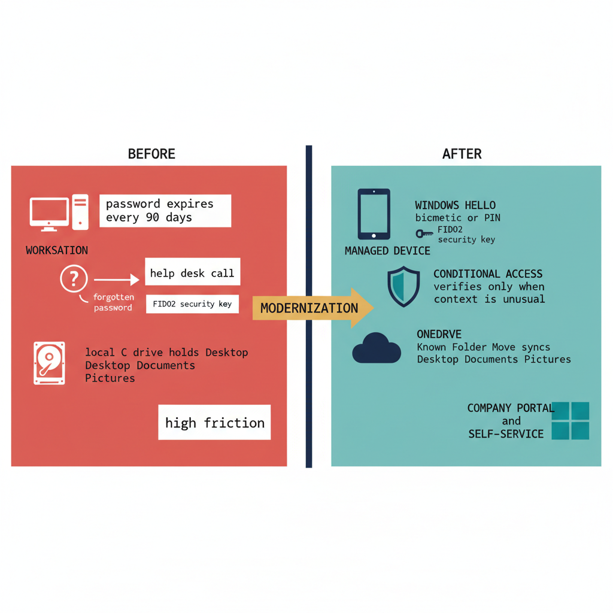

# Chapter 20 — The User Experience of Modernization

::: {.callout-note}
## In this chapter
Why identity modernization succeeds or fails on the human experience of the
change, not the sophistication of the architecture behind it. This chapter
introduces the UIAO End User Training Guide — its plain-language framing, the
eight user-facing transitions it covers, and the honest Frequently Asked
Questions section that pre-empts the help desk calls similar programs reliably
generate.
:::

## Why the Human Experience Decides the Outcome

Every technical program that touches how people authenticate to their daily work tools will fail if it ignores the human experience of that change. This is not a soft observation about organizational change management. It is a hard operational reality: identity modernization requires users to take active steps — registering a new authentication method, completing a new enrollment process, understanding a new sign-in prompt — and users who do not understand what is happening and why will route around the change, call the help desk at scale, or, in the worst cases, respond in ways that create security vulnerabilities by choosing the path of least resistance.

> The most sophisticated identity governance architecture in the world produces no value if the people it governs do not understand what has changed, why it changed, and how to use the new system effectively.

The UIAO End User Training Guide exists to close exactly that gap.

{#fig-book-15-cpt-20-diagram-01 fig-alt="Engineering blueprint diagram on a white background, split into a left BEFORE panel and a right AFTER panel divided by a vertical rule, 16:9 landscape, no human figures, monospace labels throughout. The left BEFORE panel is drawn in red (#C0392B) to mark friction: a desktop workstation icon labeled WORKSTATION, a credential prompt labeled password expires every 90 days, an icon labeled forgotten password and a connector to a box labeled help desk call, an icon labeled local C drive holds Desktop Documents Pictures, and a tag reading high friction. The right AFTER panel is drawn in federal navy (#1F3A5F) for the user device and teal (#1A9E8F) for the modern experience: a managed device labeled WINDOWS HELLO biometric or PIN, a small key icon labeled FIDO2 security key, a phone icon labeled MICROSOFT AUTHENTICATOR, a quiet background shield labeled CONDITIONAL ACCESS verifies only when context is unusual, a cloud icon labeled ONEDRIVE Known Folder Move syncs Desktop Documents Pictures, and a self-service tile labeled COMPANY PORTAL and SELF-SERVICE RESET. An amber (#D4A017) horizontal arrow spans the divider left to right labeled MODERNIZATION. width=85%" width="85%"}

## Plain Language by Design

The guide is deliberately written in plain language, entirely free of acronyms, architecture diagrams, and the technical vocabulary that governance engineers use naturally among themselves. It translates each capability into an everyday benefit:

- **Active Directory to Entra ID** is explained as upgrading from an old lock-and-key system to a modern smart lock that recognizes the user automatically, without requiring them to carry a key or remember a combination.

- **Passwordless authentication** is explained not as a cryptographic capability using asymmetric key pairs but as a personal benefit: no more remembering complex passwords that must be changed every 90 days, no more password reset calls to the help desk that consume productive time, no more failed authentication attempts when a password has expired without warning.

- **Conditional Access** is explained not as a policy framework with named controls and signal inputs but as a security layer that works quietly in the background, occasionally asking for additional verification when something unusual is detected about the current sign-in context — a new device, an unfamiliar location, or a pattern that differs from the user's established behavior.

## The Eight Transitions Users Experience Directly

The training guide covers eight transitions that users will experience directly during the modernization program:

| # | Transition | What the user experiences |
| :--- | :--- | :--- |
| 1 | **Passwordless authentication setup** | Windows Hello for Business — the biometric or PIN-based credential bound to the user's managed device — or FIDO2 hardware security keys for high-assurance scenarios |
| 2 | **Conditional Access prompts** | What they mean, and how to respond to them without calling the help desk |
| 3 | **Certificate-Based Authentication** | High-assurance sign-in without a password, for scenarios that require it |
| 4 | **OneDrive Known Folder Move** | Transparent, background migration of Desktop, Documents, and Pictures content from local drives to OneDrive for Business cloud storage |
| 5 | **Intune Company Portal** | The self-service destination for managed application installation and device compliance status review |
| 6 | **Self-Service Password Reset** | Recovering their own access through pre-registered authentication methods without involving the help desk |
| 7 | **Self-Service Group Management** | Requesting access to shared resources through an Entra ID Entitlement Management access package rather than opening a ticket |
| 8 | **Microsoft Authenticator** | The primary mobile authentication companion for MFA prompts and passwordless phone sign-in |

## Honest Answers Before the Questions Arise

The guide concludes with a Frequently Asked Questions section addressing the concerns users most commonly raise during identity modernization programs, based on the pattern of help desk calls that similar programs have generated before adequate user education was in place. Every answer is honest, specific, and focused on what users actually experience rather than on what the governance framework technically achieves.

Users are told directly:

- whether their files will be preserved during the OneDrive migration,
- whether they will need to learn new applications,
- whether the new authentication process works on personally owned devices used for remote work, and
- whether the new system functions offline when VPN or internet connectivity is unavailable.

> Honest, specific answers to these questions before users encounter the changes in production is the most effective available mechanism for reducing help desk volume and maintaining user confidence during the transition.
