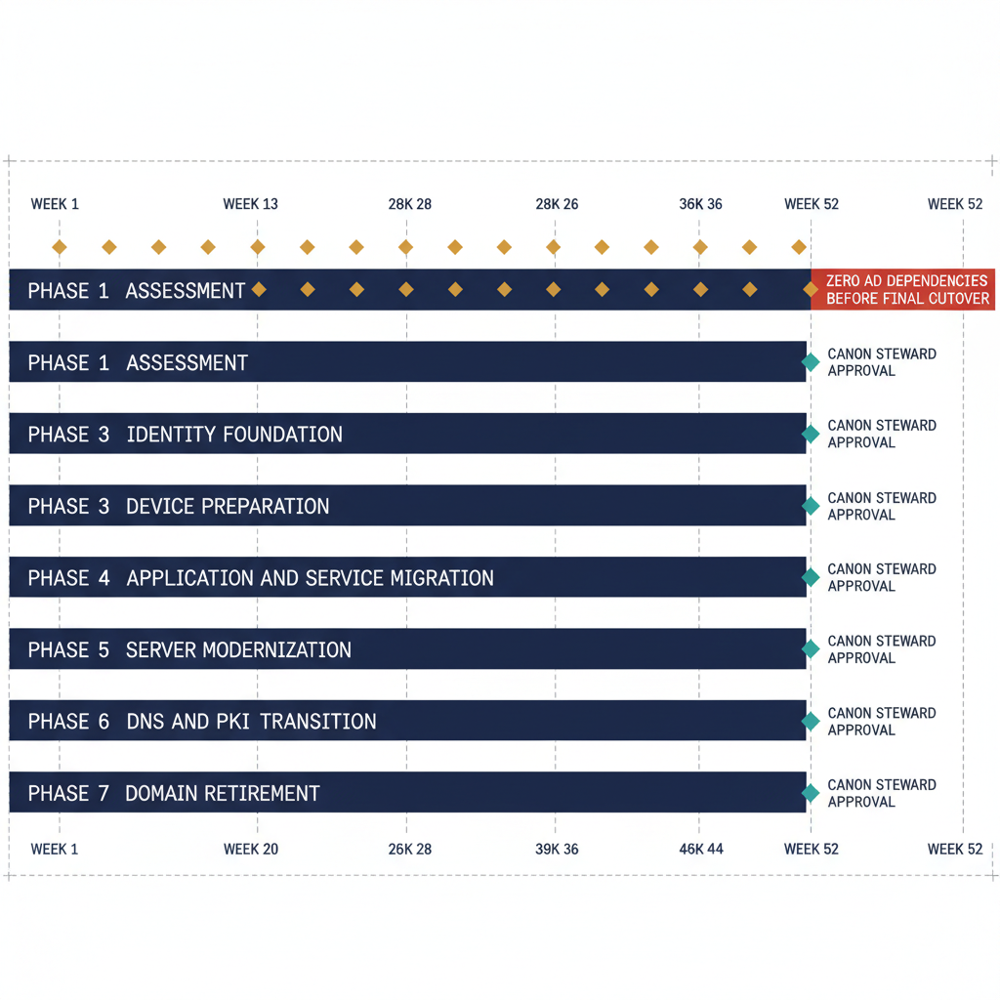

# Chapter 21 — Fifty-Two Weeks to Modern

::: {.callout-note}
## In this chapter
The UIAO Master Project Plan sequences the entire transformation into seven phases, 48 milestones, and a 52-week execution timeline, every phase transition governed by formal review and artifact commitment. This chapter walks each phase in turn — Assessment, Identity Foundation, Device Preparation, Application and Service Migration, Server Modernization, DNS and PKI Transition, and Domain Retirement — and closes on the final governed act that confirms zero remaining Active Directory dependencies.
:::

## The Capstone Plan

The UIAO Master Project Plan is the capstone planning document for the entire corpus — the artifact that synthesizes the assessment outputs, the architecture decisions, the policy libraries, and the operational procedures into a sequenced, milestone-gated execution timeline. It organizes the full transformation lifecycle into seven phases with 48 milestones across a 52-week execution timeline, with every phase transition governed by formal review, documented approval, and artifact commitment to the UIAO governance repository.

> The plan is a living document in the governance repository, updated as phases complete and as assessment findings require sequence adjustments, never manually edited outside the pull request workflow.

{#fig-book-15-cpt-21-diagram-01 fig-alt="Engineering blueprint diagram on a white background showing a fifty-two-week modernization roadmap as a horizontal timeline reading left to right from week 1 to week 52. Seven federal navy (#1F3A5F) phase bars sit along the timeline with monospace labels: Phase 1 Assessment spanning weeks 1 to 12, Phase 2 Identity Foundation weeks 13 to 20, Phase 3 Device Preparation weeks 21 to 28, Phase 4 Application and Service Migration weeks 29 to 36, then two parallel bars stacked at weeks 37 to 44 — Phase 5 Server Modernization and Phase 6 DNS and PKI Transition — and finally Phase 7 Domain Retirement weeks 45 to 52. Small amber (#D4A017) diamond markers above the bars denote the 48 milestone gates, and teal (#1A9E8F) review-gate markers sit at each phase boundary labeled Canon Steward approval. A red (#C0392B) marker at the far right reads zero AD dependencies confirmed before the final cutover. Monospace labels throughout, no human figures, 16:9 landscape." width="85%"}

## The Seven Phases at a Glance

The plan partitions the 52-week timeline into seven phases, each with a defined week range and a governed exit gate:

| Phase | Name | Weeks | Outcome at exit |
| :--- | :--- | :--- | :--- |
| **1** | Assessment | 1–12 | Forest inventoried across all ten domains; OrgPath dependency graph generated; Canon Steward approves transition |
| **2** | Identity Foundation | 13–20 | Cloud identity infrastructure established; OrgPath provisioned; dynamic groups, AUs, CA baseline, and PIM in place |
| **3** | Device Preparation | 21–28 | GPO inventory dispositioned; Intune piloted; co-management bridge enabled; Autopilot configured |
| **4** | Application and Service Migration | 29–36 | Legacy auth inventoried and sequenced; service accounts converted; App Proxy and SSO deployed |
| **5** | Server Modernization | 37–44 | Servers Arc-enrolled with OrgPath tags; Arc policies enforced; server domain dependencies registered |
| **6** | DNS and PKI Transition | 37–44 (concurrent with Phase 5) | Azure DNS Private Zones and Resolver deployed; Cloud PKI instantiated; ADCS in wind-down |
| **7** | Domain Retirement | 45–52 | Domain controllers decommissioned in dependency order; zero AD dependencies confirmed |

## Phase 1 — Assessment (Weeks 1–12)

Phase 1 occupies the first twelve weeks and produces twenty-three canonical deliverables — one for each document in the UIAO corpus that corresponds to an assessment output. It is the most detailed phase in the plan because everything else depends on it.

The phase proceeds through a deliberate access-escalation sequence:

1. The assessment team begins with the UIAOReadOnlyAssessment module on day one, capturing the maximum available data before elevated access is authorized.
2. Elevated access requests are submitted formally through the agency's authorization process, scoped precisely to the assessment requirements documented in the gap analysis, and tracked as open items in the governance repository.
3. As each delegated permission is granted, the corresponding assessment module executes and commits its output.

By week twelve, the complete Active Directory forest has been inventoried across all ten assessment domains, the OrgPath dependency graph has been generated from the combined assessment output, and the Canon Steward has approved the transition to Phase 2.

## Phase 2 — Identity Foundation (Weeks 13–20)

Phase 2 establishes the cloud identity infrastructure that all subsequent phases build on. The phase delivers the following foundation elements:

- **Entra Connect Sync** is deployed — or validated if already present — with the OrgPath attribute included in the synchronization scope.
- **OrgPath values** are computed from the assessed OU hierarchy, normalized through the OrgTree registry, and provisioned on all user and device objects.
- **Dynamic groups** are created for every OrgPath node with a population above the minimum threshold, with branch groups for subtree targeting and node groups for exact-match targeting.
- **Administrative Units** are populated using the same membership rules as the corresponding dynamic groups, establishing the delegation boundary structure.
- **Conditional Access baseline policies** are deployed in report-only mode, allowing the program to observe what would be blocked before any policy moves to enforcement.
- **Privileged Identity Management** is configured for all Tier 0 and Tier 1 roles, with just-in-time activation workflows tested and validated before any Tier 0 account has its standing access removed.

## Phase 3 — Device Preparation (Weeks 21–28)

Phase 3 prepares the device estate for cloud management. The complete GPO inventory is finalized with every setting assigned a disposition code from the migration matrix. Intune enrollment is piloted with the Tier 2 device population in the lowest-risk organizational unit identified by the assessment — typically a small, operationally independent team whose workflows can be disrupted without affecting mission-critical functions.

Co-management is enabled through Configuration Manager for devices that cannot complete full Intune enrollment immediately, providing a bridge state where both GPO and Intune policies apply during the transition.

> The Windows Autopilot deployment profile is configured for all new device provisioning, ensuring that no new device enters the estate through the legacy domain-join path after Phase 3 completes.

## Phase 4 — Application and Service Migration (Weeks 29–36)

Phase 4 addresses the dependency surface that is most commonly responsible for domain decommissioning delays. The work falls into four streams:

- **Legacy authentication protocols** — NTLM, Kerberos-constrained delegation flows, and basic authentication endpoints — are inventoried against the dependency graph and assigned migration sequences that respect application dependencies.
- **Service accounts** are converted following the three-track migration framework.
- **Microsoft Entra Application Proxy** is deployed for on-premises web applications that cannot be immediately migrated to cloud hosting, providing modern authentication and Conditional Access enforcement for applications that still require on-premises infrastructure.
- **Single sign-on** is configured for all cloud-hosted applications using SAML or OIDC federation with Entra ID as the identity provider.

## Phase 5 — Server Modernization (Weeks 37–44)

Phase 5 brings the on-premises server estate under cloud governance. Azure Arc enrollment is executed for all in-scope on-premises servers following the OrgPath-tagged Arc onboarding plan, with the OrgPath, OrgNodeID, OrgTier, and MigrationPhase tags applied at enrollment time rather than as a retroactive tagging exercise.

Arc policies from the UIAO Azure Arc Policy Library are applied in audit mode for the first two weeks, producing a compliance report that identifies any servers that would fail enforcement, followed by enforcement mode after the remediation window has closed. Domain dependencies are formally documented for each server in the server domain dependency registry — the artifact that drives the domain retirement sequence in Phase 7.

## Phase 6 — DNS and PKI Transition (Weeks 37–44, Concurrent)

Phase 6 runs concurrent with Phase 5 from weeks 37 through 44, migrating name resolution and certificate issuance to cloud infrastructure. Azure DNS Private Zones are created for all internal forward lookup zones with record sets imported from the DNS assessment output. The Azure DNS Private Resolver is deployed with forwarding rulesets covering all conditional forwarder targets identified in the assessment.

Cloud PKI is instantiated under the selected deployment model — Cloud Root or Bring Your Own CA — and Intune certificate profiles are deployed to the enrolled device population. The ADCS issuing CA enters wind-down mode, where no new certificate templates are created, existing templates are migrated on a tracked schedule committed to the governance repository, and new enrollments route to the Cloud PKI infrastructure.

## Phase 7 — Domain Retirement (Weeks 45–52)

Phase 7 executes the irreversible transition steps that eliminate the Active Directory dependency. Domain controllers are decommissioned in the sequence prescribed by the server domain dependency registry, beginning with DCs that serve only retired workstations and ending with the last DC that any active service still contacts.

AD-integrated DNS zones are decommissioned only after the DNS assessment pipeline confirms that every record in each zone has been successfully migrated and is resolving correctly from the Azure DNS infrastructure. The final domain controller in each domain is decommissioned only after every dependency — every device, user, application, service account, and server — has been confirmed as AD-free through the assessment pipeline running its full validation suite against the target environment.

> The governance repository receives a final assessment run confirming zero AD dependencies, and the program completion artifact is committed, reviewed by the Canon Steward, and approved — the last governed act of a program built on the principle that every decision is documented, every transition is verified, and nothing is assumed.
