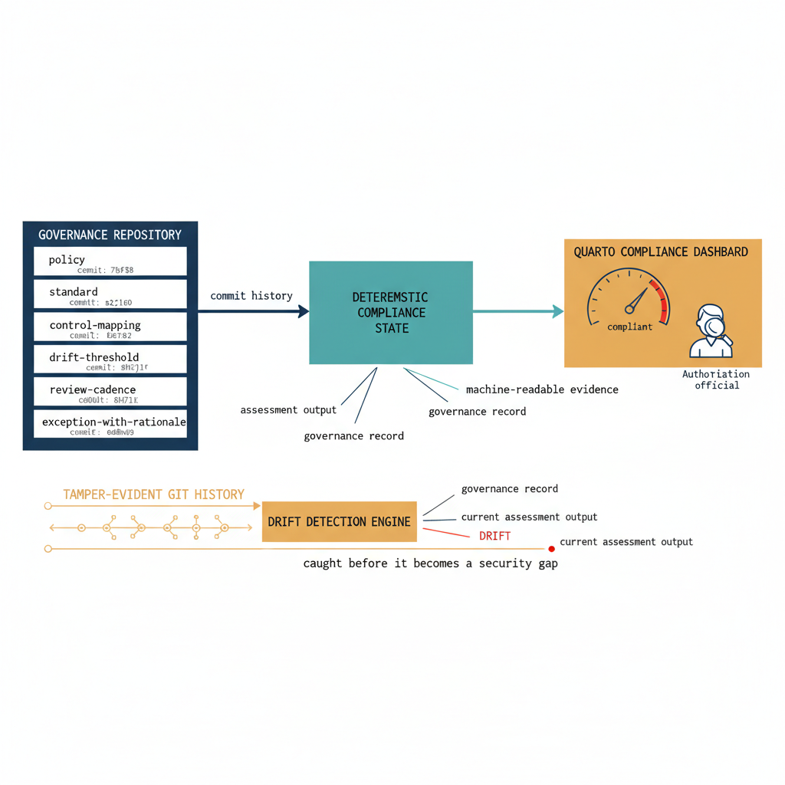

# Chapter 22 — What Governance-as-Code Actually Means

::: {.callout-note}
## In this chapter
UIAO is not a migration tool that retires when the last domain controller is decommissioned — it is a governance operating system whose value compounds after the migration completes. This chapter explains what *governance-as-code* actually means: every governance decision expressed as a versioned artifact, compliance posture as a deterministic function of commit history, and audit performed by reading the record rather than inspecting current state. It closes by showing why this design already aligns with the continuous-authorization direction of FedRAMP 20x.
:::

{#fig-book-15-cpt-22-diagram-01 fig-alt="Engineering blueprint diagram on a white background showing governance-as-code as a pipeline. On the left, a federal navy (#1F3A5F) box labeled governance repository holds a vertical stack of versioned artifact cards in monospace — policy, standard, control-mapping, drift-threshold, review-cadence, exception-with-rationale — each card tagged with a commit hash. A navy arrow labeled commit history feeds right into a teal (#1A9E8F) box labeled deterministic compliance state, computed from two inputs drawn as merging arrows — assessment output and governance record. From the teal box, a teal arrow labeled machine-readable evidence feeds an amber (#D4A017) box labeled Quarto compliance dashboard, drawn as a live gauge an authorization official reads directly. Below the pipeline, a separate amber timeline labeled tamper-evident Git history shows timestamp-anchored commits feeding the drift detection engine, which compares the governance record against current assessment output. A small red (#C0392B) marker labeled drift flags a divergence caught before it becomes a security gap. Monospace labels throughout, no human figures, 16:9 landscape." width="85%"}

## What the Program Is Actually Building

Every program eventually reaches the question of what it is actually building. The UIAO Governance OS is not building a migration tool. Migration tools are temporary by design — they exist to move from one state to another and then stop, leaving behind a target environment and a documentation archive. UIAO is building a governance operating system: a platform that continues to operate after the migration completes, detecting drift before it becomes a security gap, enforcing policy before it is violated, and maintaining the organizational structure that Entra ID cannot express on its own.

> The platform does not retire when the last domain controller is decommissioned. It begins its operational phase, where its value compounds over time as the environment it governs continues to change.

## What Governance-as-Code Means

Governance-as-code means that every governance decision — every policy, every standard, every control mapping, every drift alert threshold, every review cadence, every exception and its rationale — is expressed as a versioned artifact in the governance repository, subject to the same review and approval process as any other change to the governance record. From that single principle, three properties follow:

- **It means that** the compliance posture of the environment at any point in time is a deterministic function of the commit history of the governance repository: given the assessment output and the governance record, the compliance state is computable, auditable, and reproducible.

- **It means that** governance can be audited not by inspecting the current state of the environment — which may have drifted from the intended configuration in ways that a point-in-time inspection misses — but by reading the versioned record of every governance decision ever made and comparing it against the current assessment output through the drift detection engine.

> Governance is audited not by inspecting the environment, but by reading the versioned record of every decision ever made and comparing it against the current assessment output.

## Alignment with FedRAMP 20x Continuous Authorization

This is precisely the claim that FedRAMP 20x is built around: that authorization is not a point-in-time event requiring a package of documents but a continuous state demonstrated by a live compliance dashboard backed by machine-readable evidence continuously updated from the live environment. The program is already aligned with that model, because three of its existing mechanisms map directly onto what FedRAMP 20x requires:

| FedRAMP 20x requirement | What UIAO already provides |
| :--- | :--- |
| Machine-readable evidence continuously updated from the live environment | UIAO's governance pipeline already produces the evidence that FedRAMP 20x requires. |
| A live compliance dashboard an authorization official can access without a document package | The Quarto dashboard already renders the compliance posture in a format that an authorization official can access without requesting a document package. |
| A tamper-evident, timestamp-anchored audit trail for continuous authorization | The Git history already provides the tamper-evident, timestamp-anchored audit trail that FedRAMP 20x's continuous authorization model demands. |

The program is, in this sense, already aligned with the direction that federal authorization is moving, because it was designed from the beginning around the principle that governance evidence must be machine-generated from the live environment, not manually assembled from documentation produced after the fact.
