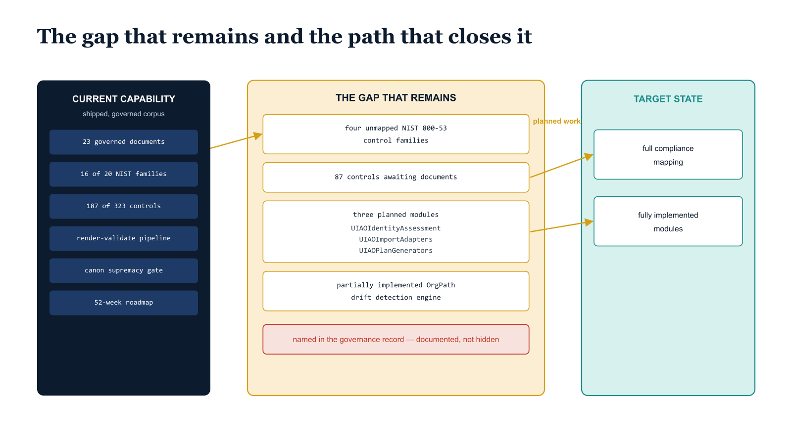

# Chapter 23 — The Gap That Remains

::: {.callout-note}
## In this chapter
A closing reflection on what the UIAO corpus deliberately does *not* yet cover — the unmapped control families, the unbuilt modules, the partially implemented drift engine — and why naming those gaps in the governance record is itself a governance act. The chapter turns from inventory to argument: Microsoft will not build OrgTree, so UIAO does, and governs it with the rigor that outlasts the people who made it.
:::

The UIAO corpus is honest about what it does not cover, and that honesty is itself a governance act. The remaining gaps are named explicitly rather than minimized:

| Gap | Current state |
| :--- | :--- |
| **NIST 800-53 control families** | Four families have no UIAO corpus coverage today |
| **Controls requiring documentation** | Eighty-seven controls require new or amended documents to reach full compliance mapping |
| **Planned PowerShell modules** | UIAOIdentityAssessment, UIAOImportAdapters, and UIAOPlanGenerators have specifications but not implementations |
| **OrgPath drift detection engine** | Fully specified in the architecture documentation but only partially implemented in the current module release |

These are not embarrassments to be minimized. They are the honest articulation of a program that is still in execution, committed to the governance record precisely so that the gap between current capability and target state is visible, trackable, and closable through planned work.

{#fig-book-15-cpt-23-diagram-01 fig-alt="Engineering blueprint diagram on a white background showing the gap between current UIAO capability and target state and the path that closes it. On the left, a federal navy (#1F3A5F) column labeled CURRENT CAPABILITY lists shipped, governed corpus artifacts in monospace. On the right, a teal (#1A9E8F) column labeled TARGET STATE shows full compliance mapping and fully implemented modules. Between the two columns, an amber (#D4A017) band labeled THE GAP THAT REMAINS holds four named items in monospace — four unmapped NIST 800-53 control families, eighty-seven controls awaiting documents, three planned modules UIAOIdentityAssessment and UIAOImportAdapters and UIAOPlanGenerators, and a partially implemented OrgPath drift detection engine. Amber arrows labeled planned work bridge each gap item from the navy column toward the teal target column, showing the gap is trackable and closable. A small red (#C0392B) marker on the band reads named in the governance record, indicating the gaps are documented rather than hidden. Monospace labels throughout, no human figures, 16:9 landscape." width="85%"}

The UIAOPlanGenerators module is the most consequential of the planned capabilities, because it would close the most significant remaining manual gap in the UIAO workflow. Currently, the modernization plans produced from assessment data are designed by architects who interpret the assessment output and translate it into migration sequences manually. UIAOPlanGenerators would derive the migration sequence automatically from the assessment data — computing the OrgPath dependency graph, identifying the correct decommissioning order for every domain controller based on the server dependency registry, and generating a draft migration plan that an architect reviews and approves rather than constructs from scratch. This capability would reduce the time from assessment completion to approved migration plan from weeks to hours, and would eliminate the class of sequencing errors that occurs when an architect's manual interpretation of the dependency graph misses a cross-domain service dependency that the assessment data records but the architect did not recognize.

These gaps are not failures. They are the product of a program that has chosen to be honest about its current state rather than to represent its current capability as its target state, which is the more common choice and the more dangerous one. The value of the UIAO corpus is not that it covers everything — it is that it knows precisely what it covers and what it does not, documents both with equal rigor, and provides a traceable path from current capability to target state through planned artifacts that are already specified, already assigned, and already tracked in the governance repository.

> **Microsoft will not build OrgTree** — and the federal government cannot wait for it to change that decision, if it ever does.

Microsoft will not build OrgTree. Not because it cannot, but because it has made a product architecture decision to maintain Entra ID as a flat directory and to provide dynamic group rules, administrative units, and custom security attributes as the toolset for organizations that need structure. That toolset is insufficient for federal IT governance at the scale and rigor that UIAO addresses, and the federal government cannot wait for Microsoft to change that decision — if it ever does. UIAO is the answer to the question of what you do when the platform you depend on refuses to build the layer you need: you build it yourself, you govern it with the same rigor you apply to everything else you build, and you make sure that every decision you make is documented, versioned, reviewed, and traceable to the governance record that outlasts the people who made it.

That is what the UIAO Governance OS is. That is what this corpus represents. And that is what it means to govern at the speed of cloud.

## The Complete OrgPath Narrative \| UIAO-NARRATIVE-001 v1.0 \| Controlled \| GCC-Moderate Boundary

## UIAO Governance Engineering \| May 2026 \| github.com/WhalerMike/uiao

*This document is a synthesis of the 23-document UIAO corpus. The canonical versions of all referenced artifacts are maintained in the UIAO governance repository. In the event of any conflict between this narrative document and a canonical governance artifact, the canonical artifact governs.*
