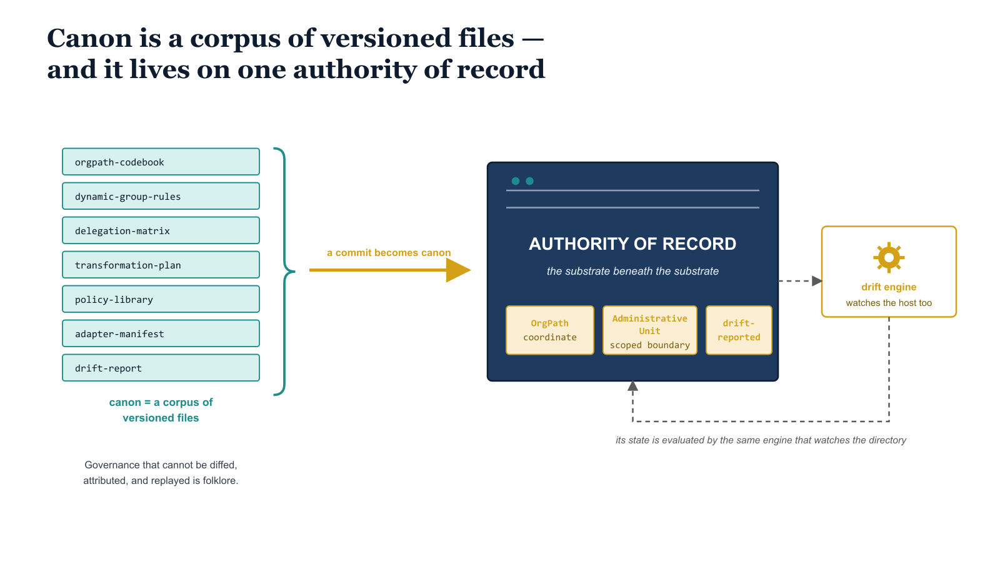

# Chapter 1 — Where Canon Lives: The Question Fifteen Books Deferred

::: {.callout-note}
## In this chapter
Fifteen books described a coordinate and every Microsoft surface that consumes it, but quietly deferred a more concrete question: where does any of it actually live? This chapter answers it — canon is a corpus of files, files need a governed home, and that home is the authority of record where a commit becomes canon. It establishes the substrate-beneath-the-substrate as a first-class governed object and maps the four decisions the rest of the book examines.
:::

## The Question the Series Set Aside

Fifteen books have described a coordinate and the surfaces that consume it.
OrgPath gave the enterprise a single organizationally meaningful address;
OrgTree gave that address a structure; and chapter after chapter walked the
attribute through Intune, Defender, Purview, Azure Policy, cross-tenant
collaboration, the security operations layer, infrastructure services, Power
BI, and the third-party DDI platforms at the edge of the Microsoft fabric.
The synthesis tied it together into a governance operating system. And yet
the series, for all its reach, quietly deferred a question that an architect
eventually has to answer out loud: where does any of this actually live?

The answer is less abstract than the rest of the series, and that is exactly
why it matters.

{#fig-book-16-cpt-01-diagram-01 fig-alt="A stack of monospace-labeled canon file cards — orgpath codebook, dynamic-group rules, delegation matrix, transformation plan, policy library, adapter manifest, drift report — bound by a teal bracket and carried by an amber arrow into a navy server box labeled Authority of Record, which wears OrgPath, Administrative Unit, and drift-reported governance tags; a dashed loop runs from a drift engine back to the host." width="100%"}

## Canon Is Files, and Files Need a Home

The OrgPath codebook is a file. The dynamic-group rules that turn an
organizational coordinate into Entra group membership are files. The
delegation matrices, the transformation plans, the policy libraries, the
adapter manifests, the drift reports — every one of them is a versioned
document with an author, a timestamp, and a history. The whole substrate, in
the end, is a corpus of text under version control. That is not a weakness;
it is the point.

> Governance that cannot be diffed, attributed, and replayed is not
> governance — it is folklore.

But text under version control has to sit on a machine, and that machine is
not a detail to be waved away in an appendix. It is the substrate beneath the
substrate.

## The Authority of Record

Call it the authority of record. It is the one place where a commit becomes
canon, where a change to the codebook becomes the codebook, where the
difference between a proposal and a decision is a merge. Everything the
earlier books described as authoritative is authoritative *because* it was
written down here and nowhere else. Lose this host, or let a second one
quietly become a rival source of truth, and the single organizational truth
the entire series argued for fractures at its foundation — not in theory, but
in the most literal way: two files, two histories, two answers to the same
question.

## The Host as a Governed Object

So the host that holds canon is itself a governed object. It is not
infrastructure that happens to sit underneath the governance substrate; it is
the first-class citizen of it — the object whose integrity every other object
inherits. It carries the same governance markers as everything else the
series has tagged:

| Governance marker | What it means for the host |
| :--- | :--- |
| **OrgPath** | The host carries an organizational coordinate like every other object |
| **Administrative Unit** | It lives inside a scoped delegation boundary, not in the open |
| **Drift reporting** | Its state is evaluated by the same engine that watches the directory |

The chapters that follow describe the decisions that shape that host: why it
cannot live in the cloud you already trust, why there is exactly one of it,
what its machinery looks like, and what happens at the moment a commit
arrives at its door. The next chapter begins where the instinct to "just use
GitHub" runs into the boundary.
