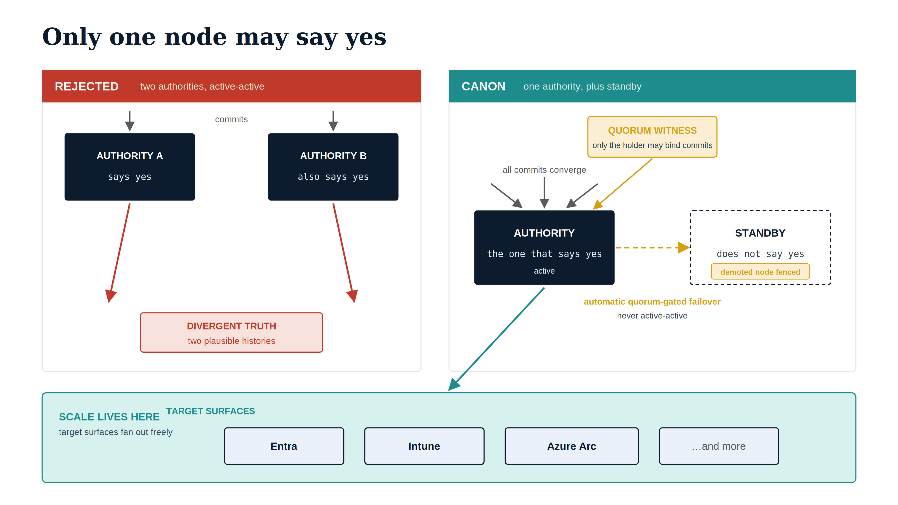

# Chapter 3 — One Host, Not a Fleet

::: {.callout-note}
## In this chapter
Modern infrastructure instinct says scale out, and here that instinct is
wrong — not for reasons of capacity, but of truth. This chapter shows why two
hosts cannot both be authoritative without diverging, why replication exists
for recovery rather than load-sharing, and why horizontal scale belongs at
the target surfaces and not at the substrate authority. Scarcity, here, is a
feature: one authority means one audit surface a human can actually reason about.
:::

## Scale Out Is the Wrong Instinct Here

Modern infrastructure instinct says scale out. If a service matters, make it
redundant; if it is busy, put it behind a load balancer; if it is critical,
run it active-active across zones. That instinct is correct almost everywhere
in a modern estate, and it is wrong here, for a reason that has nothing to do
with capacity and everything to do with truth.

## Two Hosts Cannot Both Be Authoritative

The instant a second machine is permitted to accept a binding commit, the
architecture has two histories, and the only question left is when — not
whether — they diverge. A merge that lands on one but not the other, a hook
that fires on one and is missed by the other, a clock skew that orders two
changes differently on two machines: any of these turns a single
organizational truth into a pair of plausible ones.

> The single source of truth is not only a documentation principle the
> earlier books invoked; it is a physical claim about how many machines are
> allowed to say *yes*. The answer is one.

{#fig-book-16-cpt-03-diagram-03 fig-alt="Two-panel engineering blueprint. The left REJECTED panel shows two navy AUTHORITY server boxes both accepting commits, their red histories forking into a DIVERGENT TRUTH box. The right CANON panel shows one navy AUTHORITY box receiving all converging commits, governed by an amber QUORUM WITNESS, with a dashed standby box marked demoted node fenced reached only by an amber automatic quorum-gated failover arrow. A teal SCALE LIVES HERE band below carries the target surfaces Entra, Intune, and Azure Arc fanning out freely." width="85%"}

## Replication Is for Recovery, Not Load

This does not mean the substrate is fragile, and it does not mean it cannot
recover. Replication exists — but it exists for resilience and recovery, not
for load-sharing. The second copy may be a cold standby restored on demand, or —
where a tighter recovery requirement justifies it — a hot standby kept
continuously current and promoted automatically. What makes either one safe is
not how fast it takes over but a single guarantee: only one node may ever say
*yes*. A quorum witness arbitrates which node that is, and the node being
replaced is fenced before the other takes over, so promotion — even automatic
promotion — never becomes two machines serving traffic at once. The distinction
is the whole point: redundancy that preserves a single answer is safety;
redundancy that produces two answers is corruption wearing safety's clothes. The
mechanics of the hot-standby posture are the subject of ADR-090; what matters
here is that it changes the substrate's availability, never its singularity.

## Where the Scale Actually Goes

Where, then, does the scale go? It goes where it belongs — at the target
surfaces. The substrate authority governs those surfaces; it does not compete
with them for throughput.

| Layer | Sizing posture | Why |
| :--- | :--- | :--- |
| **Substrate authority** | One logical authority, modest | Workload is correctness, not volume |
| **Target surfaces** (Entra, Intune, Arc) | Fan out, horizontal | Built to serve millions of objects |

A single authority, sized modestly, can hold the entire governance corpus of a
large enterprise and serve every operator who needs to commit to it, because
the workload is not volume — it is correctness.

## Governed Once

And because there is exactly one authority, it can be governed exactly once. One
authority means one patch cadence, one compliance policy, one enrollment, one
OrgPath tag, one object for the drift engine to evaluate. The host that holds
canon is classified the way a domain controller is classified: Tier-0, the
most trusted plane in the estate, hardened to match. Where high availability
adds a standby, that standby is held to the identical Tier-0 baseline, so a
two-node authority is still governed as one. Scarcity, here, is a feature — it
collapses the audit surface to something a human can actually reason about.
Having settled that there is one authority and why, the next chapter describes
what is actually running on it.
