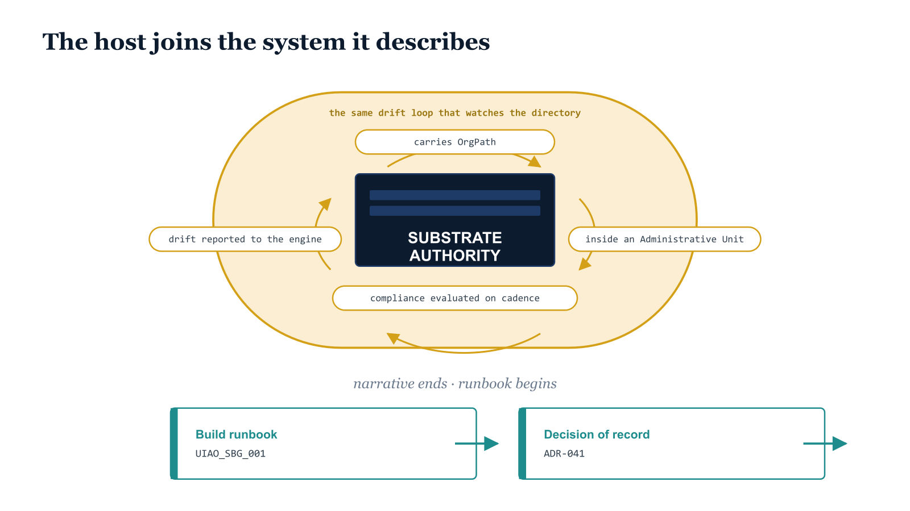

# Chapter 6 — From Idea to Iron

::: {.callout-note}
## In this chapter
The closing. Sixteen books in, the substrate is no longer an idea — it has a
physical home inside the boundary, and in becoming iron it joins the very
system it describes, watched by the same drift engine as everything else.
This chapter marks where the narrative ends and the runbook begins, and hands
the reader, through a single pointer block, to the canonical build guide and
the decision of record behind it.
:::

## The Substrate Made Real

Sixteen books in, the substrate is no longer an idea. It has a physical home:
one hardened host inside the boundary, holding the governance corpus, deciding
at its door what becomes canon and what does not. The coordinate the series
introduced as a concept now has a place to live, a service that serves it, an
identity that issues it, and a gate that enforces it. The architecture that
began with an honest accounting of what Microsoft did not build ends on
something that can be racked, patched, audited, and recovered.

{#fig-book-16-cpt-06-diagram-06 fig-alt="A federal-navy server box labeled SUBSTRATE AUTHORITY sits inside a closed amber governance loop labeled 'the same drift loop that watches the directory,' ringed by four amber waypoints: carries OrgPath, inside an Administrative Unit, compliance evaluated on cadence, and drift reported to the engine. Below, two teal hand-off cards point rightward to the Build runbook (UIAO_SBG_001) and the Decision of record (ADR-041), under the caption 'narrative ends · runbook begins.'" width="85%"}

## The Host Joins the System It Describes

What changes when the philosophy becomes iron is that it joins the very
system it describes. The host that holds canon is not exempt from the
governance it serves; it is the first object subject to it. It carries an
OrgPath. It lives inside an administrative unit. Its compliance state is
evaluated on the same cadence as every endpoint in the estate, and its drift
is reported to the same engine that watches the directory.

> The series set out to give the enterprise a single organizational truth
> expressed everywhere; the last place that truth comes to rest is the machine
> that defines it.

## Where the Narrative Ends and the Runbook Begins

That is where the narrative ends and the runbook begins. This book has told
the *why* — why canon needs a home, why that home sits inside the boundary,
why there is exactly one of it, what it is made of, and what its gate
enforces. The *how* — the phase-by-phase procedure, the pinned binaries, the
exact configuration that turns a bare Windows Server into the substrate
authority — lives in canon, deterministic and copy-paste ready, where a
procedure belongs. Read this book for the reasoning; follow the runbook to
build the machine.

::: {.callout-tip}
## Where the *how* is written

This narrative is the companion; the normative build lives in canon. To
actually stand up the substrate:

- **[Platform Server Build Guide — Windows Server 2025 + Gitea + IIS](../platform/platform-server-build.qmd)** (`UIAO_SBG_001`) — the canonical 14-phase runbook: base hardening, IIS, TLS, Gitea, reverse proxy, AD LDAPS + Entra OIDC, governance hooks, Intune, Azure Arc, backup/DR, and OrgTree integration.
- **[ADR-041 — UIAO Git Infrastructure](../../adr/adr-041-uiao-git-infrastructure.qmd)** — the decision of record behind every choice this book narrates (Gitea behind IIS on a single Windows Server 2025 host).
- **[Platform section](../platform/index.qmd)** — the full set of infrastructure runbooks, including the lab/POC reference build.

Every external binary the runbook installs is version- and hash-pinned in the
release manifest at `src/uiao/canon/release-manifests/platform-server-v1.2.yaml`.
:::
