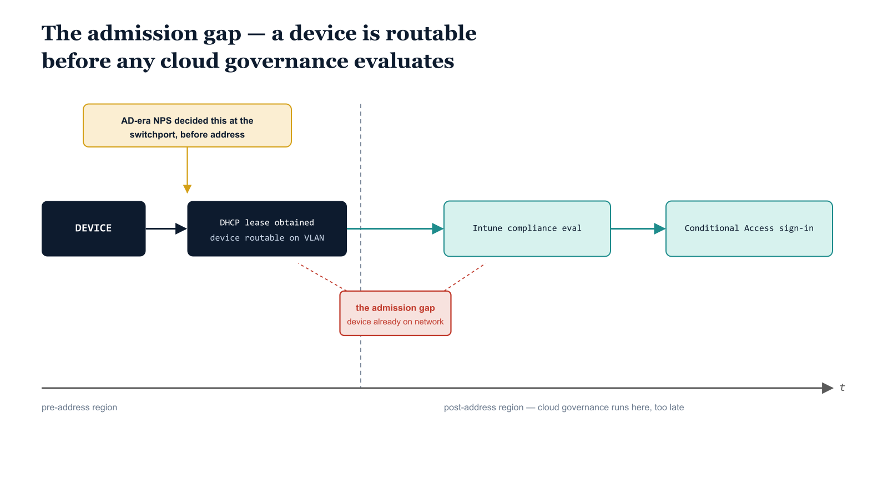

# Chapter 1 — The Admission Gap

::: {.callout-note}
## In this chapter
For two decades the Active Directory estate decided what a device was allowed to touch at the moment it plugged into the network, long before that device reached any application. When the domain controller and its RADIUS server retire in an Entra-first modernization, that decision point vanishes — and the cloud controls everyone reaches for next, Intune compliance and Conditional Access, both evaluate too late to replace it. This chapter names the seam that opens between those two eras, explains why it is structural rather than a configuration oversight, and sets the thesis the rest of the book develops: that OrgPath must reach the admission plane and become a third policy-targeting transport.
:::

## The Edge Used to Decide

In the Active Directory era, the network edge was a decision point, and a surprisingly powerful one. A Windows machine connecting to a wired switchport or a wireless access point did not simply receive an address and begin talking to the rest of the environment. It first had to authenticate, and the device or its user was challenged through 802.1X before the port was opened to anything beyond the authenticator itself.

The arbiter of that challenge was Network Policy Server. NPS ran as the RADIUS server, it was domain-joined, and it was bound directly to Active Directory. When a supplicant presented credentials at the switchport, the switch relayed them to NPS, and NPS resolved the question that mattered: who is this, and what group memberships do they carry? Those group memberships drove a policy decision, and the decision was expressed as a VLAN assignment. A device belonging to one set of groups landed on one VLAN; a device belonging to another set landed somewhere else; a device that failed authentication outright landed on a quarantine VLAN or nowhere at all.

{#fig-book-17-cpt-01-diagram-01 fig-alt="Engineering blueprint diagram on a white background, 16:9 landscape, depicting a left-to-right timeline of device network admission with no human figures and all labels in monospace. On the far left a navy #1F3A5F rounded box labeled DEVICE connects via a navy arrow to a navy box labeled DHCP lease obtained, device routable on VLAN, positioned early on the timeline. Continuing rightward along a horizontal time axis labeled t, two teal #1A9E8F boxes appear much later in sequence, the first labeled Intune compliance evaluation and the second labeled Conditional Access sign-in, both connected by teal arrows after the address step. A thick red #C0392B horizontal band spans the interval between the navy address-obtained box and the first teal evaluation box, labeled the admission gap, device already on the network. Above the red band an amber #D4A017 callout box with a thin connector points back toward the address-obtained step, labeled AD-era NPS decided this at the switchport, before address. A faint vertical dashed gridline separates the pre-address region from the post-address region. The time axis arrowhead points right at the far edge." width="85%"}

The essential property of this arrangement is one of *ordering*. The decision was made at the network edge, before the device reached the operating environment. By the time a machine held a routable address on a production VLAN, it had already been judged. Admission was not a thing that happened and was later reviewed; admission was the judgment. A device that did not belong simply never received a usable address on the network it was trying to reach, because the switchport that would have granted it one was still closed.

> The AD-bound NPS server was not merely an authentication service. It was an *admission control plane* — the place where organizational identity was translated into network position, at the edge, before anything downstream could be touched.

## What Retires When the Domain Controller Retires

An Entra-first modernization sets out to retire the on-premises domain. That is the point of it: the domain controller goes away, devices become Entra-joined rather than domain-joined, and identity moves to the cloud. This is the correct destination, and nothing in this book argues against reaching it.

But the domain controller does not retire alone. The AD-bound NPS server depended on Active Directory for the group lookups that drove every VLAN decision, and when the directory that NPS consulted is gone, NPS has nothing left to consult. The RADIUS server that decided network position at the switchport retires alongside the directory it was bound to. The edge decision point — the thing that judged a device before it held an address — disappears as a side effect of the migration's central goal.

This is easy to miss precisely because it is a side effect. The migration plan is written in terms of identity, devices, and applications moving to the cloud. The switchport, the 802.1X exchange, and the VLAN assignment are infrastructure that sat quietly underneath all of that, doing their work invisibly for years. When the directory moves, the plan accounts for identity and devices and applications explicitly, and the admission decision is the part nobody wrote down, because nobody had needed to think about it.

## The Instinct, and Why It Fails

The instinct, once the gap is noticed, is to reach for the cloud controls that the modernization has already put in place. The organization now has Intune compliance policies and Conditional Access. Surely these are the modern replacement for what NPS used to do — they evaluate device posture, they make allow-or-deny decisions, they are exactly the kind of governance that ought to gate network admission.

The problem is one of timing, and it is structural rather than a matter of configuration. Both Intune compliance evaluation and Conditional Access run only *after* a device already holds a network address. Conditional Access fires at sign-in, when an application or identity request is made — which presupposes that the device can already reach the identity endpoint, which presupposes that it already has a routable address. Intune compliance is evaluated against a device that has already checked in, which again presupposes network reachability. Neither control is positioned at the moment a device requests admission to the network. Both are positioned well after it.

| Control | When it evaluates | What it presupposes |
| :--- | :--- | :--- |
| **AD-era NPS / 802.1X** | At the switchport, during the authentication exchange | Nothing — the port is closed until the decision is made |
| **DHCP lease** | When the port is already open and the device requests an address | The device is already admitted to the VLAN |
| **Intune compliance** | After the device has checked in to the service | The device already holds a routable address |
| **Conditional Access** | At application or identity sign-in | The device can already reach the identity endpoint |

The consequence is that a non-compliant device, or a device whose organizational position has not yet been established, can already be sitting on the corporate VLAN before any cloud governance fires. It has a DHCP lease. It is routable. It can reach other hosts on its segment. Whatever Conditional Access or Intune later decides, it decides about a device that is *already inside*. The cloud controls are real and valuable, but they are admission *review*, not admission *control*.

> NPS decided at the edge, before the address. Intune and Conditional Access decide in the cloud, after the address. The window between "address obtained" and "cloud governance evaluates" is the seam, and a device is already on the network for the whole duration of it.

This seam is the **admission gap**. It is not a misconfiguration that a tighter policy would close, because no Conditional Access policy or compliance rule can run earlier than the network reachability it depends on. The gap is a property of where these controls sit in the sequence of events, and that position cannot be edited away.

## Why This Matters for OrgPath

The admission gap is not merely an abstract sequencing curiosity. It collides directly with a requirement the modernization program has already committed to.

ADR-071, the Intune-First decision, states in its first pillar that a device must carry an Active OrgPath before it reaches production. This is a positioning requirement: a device is not simply compliant or non-compliant in the abstract, it occupies a defined place in the organizational tree, and that place must be established before the device is allowed to operate in the production environment.

The trouble is that "reaches production" has, until now, had no enforcement point at the network layer. ADR-071 Pillar 1 can be honored everywhere the cloud control plane reaches — in what applications a device may sign in to, in what resources it may enroll against, in what Conditional Access will permit. But every one of those enforcement points sits *after* the device already holds a network address. A device with no Active OrgPath, in clear violation of Pillar 1, can still obtain a DHCP lease and sit on a production VLAN, because there is nothing at admission that checks for an OrgPath at all.

> ADR-071 Pillar 1 says a device must carry an Active OrgPath before it reaches production. Without a network-edge layer that can read OrgPath at admission, that requirement has a rule but no place to enforce it at the moment it matters most — the moment the device first touches the wire.

In the AD era, the edge layer existed, and it enforced organizational position by reading AD group membership at the switchport. The modernization removes that layer and replaces the directory it read. What it has not yet done is give the admission plane any way to read the organizational position that has succeeded AD group membership — namely, OrgPath. The enforcement point that Pillar 1 needs is exactly the enforcement point that retired with NPS.

## The Thesis of This Book

The conclusion follows directly. If a device's organizational position must be established before it reaches production, and the only honest moment to enforce that at the network layer is admission, then the organizational position must be *readable at admission*. OrgPath cannot remain a thing that the cloud control plane consults after the fact. It must reach the admission plane itself.

This is the thesis the rest of this book develops. OrgPath is already a policy-targeting transport in two domains: it targets policy through the identity and device control plane, and it targets policy through the resource and infrastructure plane. The admission gap reveals that a third transport is missing — the network-edge transport, the one that decides position before the address is granted, the one NPS used to provide. OrgPath must become that third policy-targeting transport, carried into the admission decision the way it is already carried into Conditional Access scoping and resource governance.

The mechanism by which OrgPath reaches the admission plane is the subject of ADR-073, and the chapters that follow build it out in detail: how organizational position is presented to the network-edge authenticator, how the 802.1X exchange can be made to consult OrgPath rather than AD group membership, and how a VLAN or segment assignment can once again be decided before a device holds a routable address. This opening chapter sets only the motivation. The edge used to decide; the modernization removed the place where it decided; the cloud controls cannot stand in because they arrive too late; and so OrgPath must be made to reach the edge.

> The admission gap is the problem. OrgPath at the admission plane, as a third policy-targeting transport per ADR-073, is the answer this book defends. Everything that follows is the engineering of that answer.
