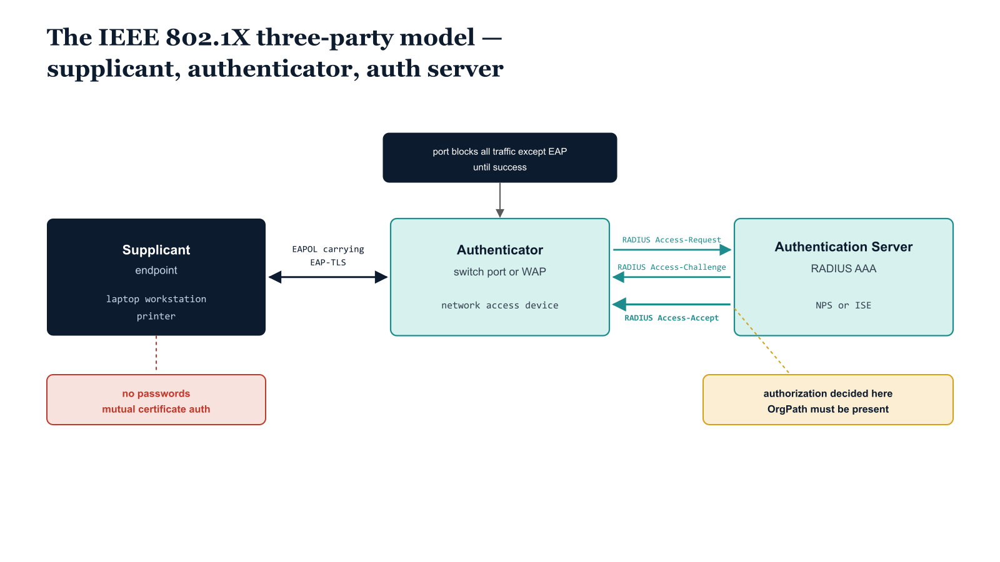

# Chapter 2 — The Three-Party Model

::: {.callout-note}
## In this chapter
Port-based network access control rests on a deceptively simple structure: three parties, two protocols, and one decision. This chapter walks the IEEE 802.1X-2020 three-party authentication model — the supplicant, the authenticator, and the authentication server — and follows a single authentication exchange from the moment a cable is plugged in to the moment a port is opened. It establishes EAP over LAN as the protocol on the wire, RADIUS as the protocol on the back end, EAP-TLS as the certificate-based method that carries no passwords, and the Access-Accept as the precise instant authorization is decided — which is exactly where an organizational signal must already be present.
:::

## Three Parties, One Decision

IEEE 802.1X-2020 §5.1 describes network access control in terms of three cooperating parties. The terminology is precise, and it pays to keep the roles distinct, because each party speaks a different protocol to its neighbor and each has exactly one job.

| Party | 802.1X role | Concretely | Speaks |
| :--- | :--- | :--- | :--- |
| **Supplicant** | The entity seeking access | The endpoint — a laptop, workstation, printer, or any device attached to a controlled port | EAP over LAN (EAPOL) to the authenticator |
| **Authenticator** | The entity that controls access to the port | The network access device — a switch port or a wireless access point | EAPOL to the supplicant; RADIUS to the authentication server |
| **Authentication Server** | The entity that makes the access decision | The RADIUS / AAA server (in federal deployments, typically Network Policy Server or ISE) | RADIUS to the authenticator |

The authenticator sits in the middle and never decides anything itself. It is a relay and an enforcer: it carries the supplicant's credentials to the authentication server, and it enforces whatever verdict the server returns. The decision — whether to grant access, and on what terms — belongs entirely to the authentication server. This separation is the whole point of the model. The device that physically controls the wire is deliberately not trusted to judge who should be on it.

{#fig-book-17-cpt-02-diagram-01 fig-alt="Engineering blueprint diagram on a white background showing the IEEE 802.1X three-party authentication model laid out left to right. On the left a federal navy #1F3A5F box labeled Supplicant endpoint with monospace sub-labels laptop workstation printer. In the middle a teal #1A9E8F box labeled Authenticator switch port or WAP with sub-label network access device. On the right a teal box labeled Authentication Server RADIUS AAA with sub-label NPS or ISE. Between the supplicant and the authenticator a bidirectional arrow labeled in monospace EAPOL carrying EAP-TLS. Between the authenticator and the authentication server three stacked arrows labeled in monospace RADIUS Access-Request then RADIUS Access-Challenge then RADIUS Access-Accept. A small navy note above the authenticator reads port blocks all traffic except EAP until success. An amber #D4A017 callout band sits on the Access-Accept arrow labeled authorization decided here OrgPath must be present. A red #C0392B note near the supplicant reads no passwords mutual certificate auth. All protocol and field labels in monospace, no human figures, 16:9 landscape." width="100%"}

Before authentication succeeds, the authenticator holds the port in a state where it forwards nothing of substance. The only frames it will pass are EAPOL frames — the protocol used to conduct the authentication conversation itself. Everything else — IP, DHCP, the device's attempt to reach the network — is dropped at the port. This is the defining behavior of port-based access control: the door is shut, and the only thing you can do at a shut door is knock in the one language the door understands.

> The authenticator blocks all traffic except EAP until authentication succeeds. The port is not "open but monitored" — it is closed, and the sole exception is the authentication exchange that might open it.

## Two Protocols on Two Segments

The conversation crosses two distinct network segments, and a different protocol carries it on each.

Between the supplicant and the authenticator, the conversation runs as **EAP over LAN** — EAPOL. The Extensible Authentication Protocol is a framework, not a single method; EAPOL is the encapsulation that carries EAP frames directly over the Layer 2 LAN segment between the endpoint and the switch port or access point. No IP address is required, which is precisely why it works before the device has been granted network access: the supplicant has no address yet, so the authentication cannot depend on having one.

Between the authenticator and the authentication server, the same EAP conversation continues, but now encapsulated in **RADIUS**. The authenticator takes the EAP messages it receives over EAPOL, repackages them as RADIUS attributes, and forwards them to the authentication server; it does the reverse for messages coming back. The authenticator is, in effect, a protocol translator sitting between a Layer 2 EAPOL segment on one side and a routed RADIUS path on the other.

> EAP is the payload; EAPOL and RADIUS are two different envelopes carrying the same letter across two different segments of its journey.

## The RADIUS Exchange (RFC 2865)

On the back-end segment, the authentication server and authenticator exchange a small, fixed set of RADIUS message types defined in RFC 2865. Four matter for an 802.1X authentication.

| RADIUS message | Direction | Meaning |
| :--- | :--- | :--- |
| **Access-Request** | Authenticator → server | "Here is a supplicant attempting to authenticate, and here is what it has presented so far." Carries the encapsulated EAP data and identifying attributes. |
| **Access-Challenge** | Server → authenticator | "Not done yet — send this back to the supplicant and return its response." Used to drive the multi-round EAP method conversation. |
| **Access-Accept** | Server → authenticator | "Authentication succeeded. Open the port — under the following terms." The authorization decision and its parameters. |
| **Access-Reject** | Server → authenticator | "Denied. Keep the port closed." |

A real EAP-TLS exchange is not a single request-and-answer. It is a sequence: the authenticator sends an Access-Request, the server replies Access-Challenge, the supplicant responds, the authenticator wraps that response in another Access-Request, and the Challenge/Request volley repeats as many times as the EAP method requires to complete its handshake. Only when the method finishes does the server emit a terminal verdict — Access-Accept or Access-Reject. Everything before that verdict is conversation; the verdict is the decision.

## EAP-TLS — Certificates, Not Passwords (RFC 5216)

The EAP method that matters in this architecture is **EAP-TLS**, defined in RFC 5216. EAP-TLS conducts a full TLS handshake inside the EAP conversation, and it does so with **mutual certificate authentication**: the supplicant presents a client certificate to prove its identity to the server, and the server presents a server certificate to prove its identity to the supplicant. Each side validates the other's certificate against a trusted certificate authority chain.

The consequence that distinguishes EAP-TLS from password-based EAP methods is that **there is no password anywhere in the exchange**. The supplicant authenticates by possession of a private key whose corresponding certificate the authentication server trusts. There is no shared secret to phish, to reuse, or to capture and replay. For a federal deployment standardizing on certificate-based machine and user identity, EAP-TLS is the method that aligns with that posture — the credential is a certificate issued through the organization's PKI, and the act of authenticating is the act of proving the device or user holds the matching key.

> EAP-TLS authenticates by proof of a private key, not by knowledge of a secret. The thing the supplicant presents — and the thing the server validates — is a certificate.

This matters for what comes next, because a certificate is not just a yes-or-no credential. It carries fields, and it maps to an identity, and both of those can be read for more than the binary question of "is this device allowed on the network at all."

## The Access-Accept Carries the Authorization (RFC 3580)

An Access-Accept is not a bare "yes." RFC 3580, the IEEE 802.1X RADIUS usage guidelines, describes how RADIUS attributes in the Access-Accept communicate the **terms** of access back to the authenticator — most consequentially, the VLAN the port should be placed into. The relevant attributes work together to express a VLAN assignment.

| RADIUS attribute | Role in the Access-Accept |
| :--- | :--- |
| **Tunnel-Type** | Set to `VLAN (13)` to indicate the assignment is a VLAN |
| **Tunnel-Medium-Type** | Set to `IEEE-802 (6)` for an 802 LAN |
| **Tunnel-Private-Group-ID** | Carries the VLAN identifier — the actual VLAN the port is assigned to |

When the authenticator receives an Access-Accept carrying these attributes, it does two things in one motion: it transitions the port from blocked to authorized, and it places that port into the VLAN the server named. The supplicant, which until this instant could send nothing but EAPOL, is now on a specific network segment chosen by the authentication server. Authorization — not merely authentication, but the decision about *where* and *how* the supplicant connects — is fully expressed in this single message.

## Where OrgPath Must Be Present

This is the governance crux of the entire model, and it follows directly from the standards just described.

The Access-Accept is the moment authorization is decided. It is the one message in the exchange that says not only "this supplicant is who it claims to be" but "and therefore it goes *here*, on *this* VLAN, under *these* terms." The VLAN assignment in an Access-Accept is an organizational placement decision: it determines which segment of the network — and by extension which trust zone, which set of reachable resources, which policy domain — the endpoint joins.

If network placement is to reflect organizational structure — if a finance workstation is to land in the finance segment and an operations device in the operations segment — then the **organizational signal must be present at the instant the Access-Accept is composed**. That signal, in this architecture, is OrgPath: the hierarchy path from the OrgTree root to the governing node, the same value that every other governed surface in the substrate carries.

::: {.callout-important title="The placement of the decision determines the placement of the signal"}
Authorization is decided when the authentication server composes the Access-Accept. Therefore OrgPath must be available to the authentication server *at that moment*, not bolted on afterward. There are only two places it can come from, and both are rooted in what the supplicant already presented:

- **Derived from the certificate** the supplicant presents in the EAP-TLS handshake — read directly out of a field of the client certificate.
- **Looked up from the identity or group** that the certificate maps to — the certificate identifies the device or user, and that identity resolves to an OrgPath through a directory or registry the authentication server consults.

Either way, OrgPath is anchored to the credential. There is no third path, because by the time the Access-Accept is composed, the certificate is the only thing the server knows about the supplicant.
:::

The two carriage paths named above are not interchangeable conveniences; they are genuinely different integration patterns with different operational characteristics, and the next chapters take each one in turn. The first follows the path where OrgPath is carried *in* the certificate itself and read out of it at authentication time. The second follows the path where the certificate establishes identity and OrgPath is resolved by lookup against the directory that identity lives in. Both end at the same place — an Access-Accept whose VLAN assignment reflects the supplicant's place in the organization — and the standards walked through in this chapter are the fixed frame within which both operate.

> Three parties, two protocols, one decision. The decision is the Access-Accept, and an Access-Accept that does not know the supplicant's OrgPath cannot place it according to organizational structure. Everything that follows is about getting OrgPath to that decision in time.
