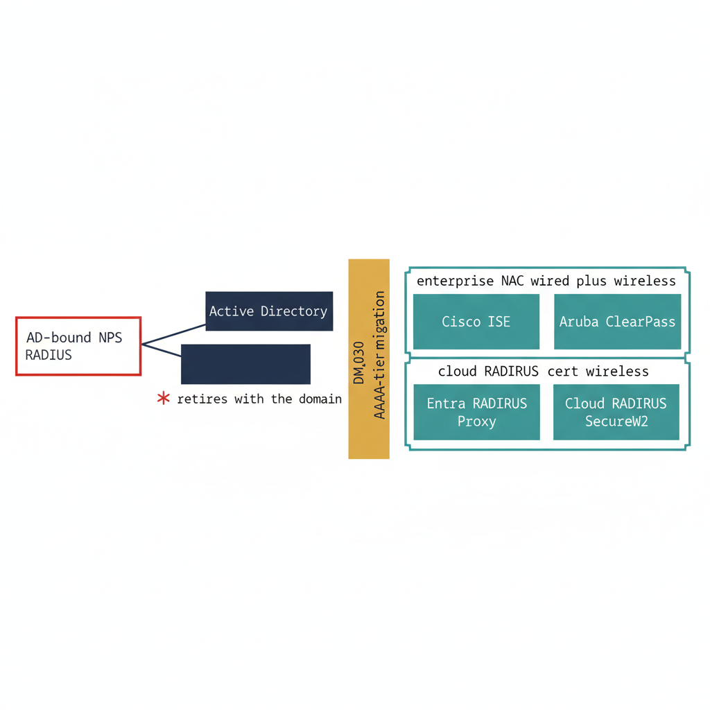

# Chapter 3 — From NPS to Cloud AAA

::: {.callout-note}
## In this chapter
Authentication, authorization, and accounting — the AAA tier — is the part of the network that decides who gets onto the wire and what they can reach once they are there. On a domain-bound network that decision runs through the Network Policy Server, and NPS cannot outlive the domain it depends on. This chapter follows the AAA tier through migration: why AD-bound NPS must retire when the domain does, how UIAO models the move as the DM_030 RADIUS/NPS adapter, and how two target framings — enterprise on-premises NAC and cloud RADIUS — coexist by role rather than compete.
:::

## The Legacy: NPS Is Domain-Bound by Design

Network Policy Server is the RADIUS server that ships with Windows Server, and on most agency networks it is the quiet hinge on which network access turns. When a laptop authenticates to wired 802.1X, when a VPN concentrator hands off a tunnel request, when a wireless controller validates a user against policy, the request lands at NPS. NPS evaluates it against a stack of policies and answers accept or reject.

The problem is not NPS as software. The problem is what NPS *reads* to make its decision. Its Connection Request, Network, and Health policies are written in terms of Active Directory group membership. Its identity lookups resolve against the domain. An NPS policy that says "members of `Domain\Network-Admins` may reach the management VLAN" is a sentence with no meaning once the domain is gone — the group it names no longer exists, and the identity it would have matched no longer resolves there.

> NPS does not merely *use* Active Directory; its policy language is expressed in AD terms. When the directory retires, NPS retires with it. There is no version of "keep NPS, drop the domain" that preserves the access decisions the network depends on.

This is what makes the AAA tier a migration problem rather than a configuration change. The decision logic has to be lifted out of AD-group vocabulary and re-expressed against whatever identity and policy plane replaces the domain. That lift is the work the adapter exists to do.

{#fig-book-17-cpt-03-diagram-01 fig-alt="Engineering blueprint diagram on a white background. On the left a federal navy #1F3A5F box with a red #C0392B border labeled AD-bound NPS RADIUS connects by a navy line to a navy box labeled Active Directory, and a red #C0392B mark beside the pair reads retires with the domain. A center amber #D4A017 vertical band labeled DM_030 AAA-tier migration separates left from right. On the right four teal #1A9E8F boxes are arranged in two groups. The upper group is bracketed and labeled enterprise NAC wired plus wireless and contains a teal box labeled Cisco ISE and a teal box labeled Aruba ClearPass. The lower group is bracketed and labeled cloud RADIUS cert wireless and contains a teal box labeled Entra RADIUS Proxy and a teal box labeled Cloud RADIUS SecureW2. All box and group labels are in monospace, no human figures, 16:9 landscape." width="85%"}

## DM_030: Modeling the AAA Tier as an Adapter

UIAO does not treat "replace NPS" as a one-off project. It treats the AAA tier the same way it treats every other directory-bound surface in the migration: as a *source-to-target* problem with a defined adapter. That adapter is **DM_030 — the RADIUS / Network Policy Server adapter** — and its interface is documented at `modernization/directory-migration/adapters/radius/radius-adapter-interface.md`.

DM_030 carries a CRITICAL priority for a blunt reason recorded in its own risk field: network access failure pre-migration completion. Get the AAA tier wrong and people cannot get on the network — which is why the adapter is built around parallel operation and validation rather than a flag-day cutover.

The adapter's required capabilities describe the full lift the AAA tier needs:

| Capability | What it covers |
| :--- | :--- |
| **NPS policy inventory** | Enumerate every Connection Request, Network, and Health policy on the source NPS |
| **AD dependency mapping** | Map each NPS policy to the AD groups it depends on |
| **RADIUS client inventory** | Identify every client device — access points, VPN concentrators, switches |
| **Certificate profile inventory** | Catalog the 802.1X certificate profiles in use |
| **EAP method inventory** | Record the EAP methods deployed — PEAP, EAP-TLS, EAP-TTLS |
| **Policy translation** | Re-express AD group membership as Entra ID dynamic group rules |
| **Side-by-side operation** | Run source and target RADIUS simultaneously through the transition |
| **Validation** | Confirm RADIUS auth succeeds against the new backend before cutover |

The migration sequence the adapter prescribes is deliberately conservative, and the order matters:

1. Inventory all RADIUS clients and NPS policies.
2. Map every NPS AD-group dependency to its Entra ID equivalent.
3. Deploy the replacement RADIUS — Cisco ISE, Aruba ClearPass, or the Entra proxy.
4. Validate in parallel, before cutover.
5. Cut over RADIUS clients to the new server.
6. Decommission NPS only after a 30-day validation window.

> Note the shape of steps 4 through 6. The old server and the new server run side by side; clients move only after the new backend has been proven; and NPS is not torn down until a full validation window has elapsed against it. The adapter is engineered so that the AAA tier never goes dark.

## The Target Landscape: Two Honest Framings

When teams ask "what replaces NPS," they tend to get two different answers depending on who they ask — and both answers are correct, because they are answering different questions. UIAO holds both framings rather than picking a winner.

### Framing 1 — Enterprise On-Premises NAC

The first framing is the enterprise Network Access Control platform: **Cisco ISE** and **Aruba ClearPass**. These are the heavyweight, authoritative AAA servers that most large agencies already run somewhere in their estate. They do full wired *and* wireless 802.1X, and they bring enforcement that NPS never matched:

| Enforcement capability | What it does |
| :--- | :--- |
| **VLAN assignment** | Place an authenticated endpoint onto the correct segment dynamically |
| **Downloadable ACLs** | Push per-session access rules to the switch port at authentication time |
| **Posture assessment** | Evaluate endpoint health and compliance before granting access |
| **TrustSec (ISE)** | Carry segmentation as security-group tags rather than as IP-based ACLs |

This is the framing for the wired campus and for high-assurance segments — the places where a switch port has to make a rich, enforced decision the moment a cable is plugged in. If an agency already runs ISE or ClearPass, the AAA migration is largely a matter of re-pointing policy at the new identity plane and retiring the NPS instances that the platform supersedes.

### Framing 2 — Cloud RADIUS

The second framing is **cloud RADIUS**: the **Entra RADIUS Proxy** and third-party services such as **SecureW2**. These suit a narrower, lighter scenario — certificate-based passwordless wireless tied directly to Entra identities, where standing up a full on-premises NAC stack is not warranted by the size or assurance profile of the deployment.

| Cloud RADIUS option | Fit |
| :--- | :--- |
| **Entra RADIUS Proxy** | Cloud-native RADIUS tied to Entra ID identities; certificate-based wireless without an on-prem policy server |
| **Cloud RADIUS / SecureW2** | Third-party managed cloud RADIUS for certificate-anchored passwordless wireless |

Cloud RADIUS trades the depth of NAC enforcement for a far smaller footprint. There is no Grid of appliances to run, no on-prem policy server to patch — just Entra-anchored certificates authenticating wireless clients against a cloud endpoint.

### Coexistence by Role, Not Competition

The two framings are not a bake-off. They occupy different parts of the network, and on a large agency they routinely run side by side:

> Enterprise NAC owns the wired campus and the high-assurance segments, where rich, enforced access decisions are mandatory. Cloud RADIUS suits the wireless-certificate scenarios and the lighter footprints, where Entra-anchored certificates are sufficient and a full NAC stack would be over-built. The same agency can run ISE on its wired core and Entra RADIUS for a branch wireless SSID without contradiction.

Choosing between them is a question of role and assurance, not of one technology displacing another. DM_030 supports either target — and a mix of both — because the adapter's job is to lift the *decision logic* off AD, not to mandate a single destination for it.

## The Canonical AAA-Server Set

Across both framings, UIAO recognizes a fixed set of AAA servers as canonical — the players the governance contract knows by name. That set is:

- **Cisco ISE**
- **Aruba ClearPass**
- **Entra RADIUS**
- **Legacy NPS** (the source being migrated away from)

This enumeration is established by **ADR-073**, developed in the next chapter. The point to carry forward here is simply that these four are the recognized actors on the AAA tier: two enterprise NAC platforms, one cloud RADIUS proxy, and the legacy server they collectively replace. The schema and the enum that encode this set belong to the next chapter; this chapter only names the players.

## What the Next Chapter Must Answer

Picking a target AAA server — ISE, ClearPass, Entra RADIUS, or a mix — settles *where* access decisions will be made. It does not settle *how* those decisions will be expressed once AD group membership is no longer the vocabulary.

A replacement RADIUS server still has to target policy at *something*. It needs an organizational signal it can read — a way to say "this endpoint belongs to this part of the organization, apply this policy" — that survives the loss of the domain and resolves cleanly against the new identity plane.

> Whichever AAA server an agency chooses, it now needs an organizational signal to target policy by. Providing that signal — and the governance contract that defines it — is the subject of the next chapter and of ADR-073.
