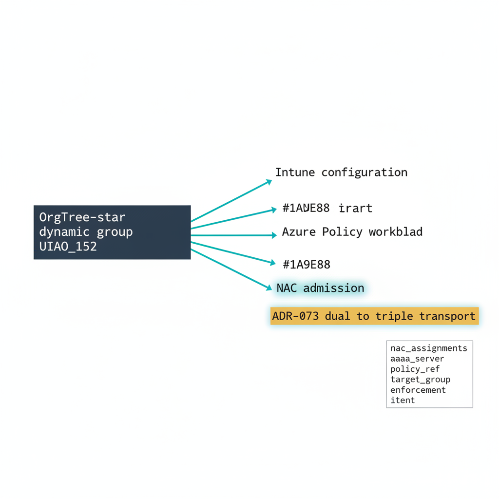

# Chapter 4 — OrgPath as the Third Transport

::: {.callout-note}
## In this chapter
OrgTree policy targeting began as a dual-transport model: configuration profiles delivered through Intune, and workload governance delivered through Azure Policy. That model never reached the network-admission plane. This chapter explains how ADR-073 amends ADR-039 to promote the model from dual to triple transport by adding network access control as the third contract, introduces the new `nac_assignments` section of the policy-targets canon, and walks each field of a representative assignment so that one organizational truth drives configuration, workload, and admission alike.
:::

## From Dual to Triple Transport

ADR-039 established OrgTree policy targeting as a *dual transport* model. Both transports key off the same organizational truth — the OrgTree-\* dynamic groups maintained in UIAO_152 — but they reach different control planes:

| Transport | Plane | Binding mechanism | Defined by |
| :--- | :--- | :--- | :--- |
| **Intune** | Configuration | Configuration profiles and compliance policies bound to `OrgTree-*` dynamic groups through Microsoft Graph | ADR-039 |
| **Azure Policy** | Workload | Policy assignments bound to OrgPath ARM tag selectors on Arc-enrolled machines | ADR-039 |
| **NAC** | Admission | AAA policy bound to `OrgTree-*` dynamic groups through a network access controller | **ADR-073** |

The dual model covered the configuration plane and the workload plane completely. What it did not reach was the *network-admission* plane — the decision a switch, controller, or RADIUS server makes the moment a device asks to join the network at all. A device could be perfectly configured by Intune and perfectly governed by Azure Policy and still be admitted to, or excluded from, a network segment by rules that knew nothing about the OrgTree.

{#fig-book-17-cpt-04-diagram-01 fig-alt="Engineering blueprint diagram on a white background. A central federal navy #1F3A5F box is labeled OrgTree-star dynamic group UIAO_152. Three teal #1A9E8F branches fan to the right, each a labeled transport. The first teal branch is labeled Intune configuration. The second teal branch is labeled Azure Policy workload. The third teal branch is highlighted and labeled NAC admission. Beneath the third branch an amber #D4A017 callout band reads ADR-073 dual to triple transport. A small monospace inset box to the lower right lists the nac_assignments field names aaa_server, policy_ref, target_group, enforcement, intent. All labels in monospace, no human figures, 16:9 landscape." width="100%"}

ADR-073 — *OrgTree Policy Targeting — NAC as Third Transport* — closes that gap. It does not replace ADR-039; it *amends* it, promoting the model from dual to triple by adding network access control as a peer transport alongside the original two. The three transports now form **parallel contracts** against a single organizational truth:

> Configuration flows through Intune, workload governance flows through Azure Policy, and admission flows through NAC — but all three are keyed to the same `OrgTree-*` dynamic groups. One organizational fact, expressed once in the OrgTree, now decides how a device is configured, how its workloads are governed, *and* whether it is admitted to the network at all.

## The `nac_assignments` Section

The third transport is expressed in canon the same way the first two are: as a declarative section of `canon/data/orgpath/policy-targets.yaml`. ADR-073 adds a new top-level key, `nac_assignments`, as a sibling of the existing Intune and Arc transport sections. The loader treats all three sections as a single assignment namespace, so the integrity rules that already protect the Intune transport extend to NAC without modification.

A representative `nac_assignments` entry looks like this:

```yaml
nac_assignments:
  - assignment_name: nac-fin-devices-permit-corp
    aaa_server: cisco-ise
    policy_ref:
      kind: policy-set
      match_by: name
      value: NAC-FIN-CORP-PERMIT
    target_group: OrgTree-FIN-Devices
    enforcement:
      vlan_id: 412
      dacl_name: DACL-FIN-CORP
      sgt_tag: 30
      posture_profile: NAC-FIN-POSTURE-STD
      change_of_authorization: true
    intent: permit
```

Each field carries a specific governance meaning, and several are validated at load time against other canon sources.

### `assignment_name`

A human-readable identifier that must be **unique across the entire file** — not merely within the `nac_assignments` section. Because the Intune, Arc, and NAC transports share one assignment namespace, an `assignment_name` collides if it duplicates any name already used by an Intune or Azure Policy assignment. This single-namespace rule is what lets an operator reason about "the FIN-Devices admission contract" as a first-class object alongside its configuration and workload siblings.

### `aaa_server`

An enum naming the authentication, authorization, and accounting platform that will enforce the assignment:

| Value | Platform |
| :--- | :--- |
| `cisco-ise` | Cisco Identity Services Engine |
| `aruba-clearpass` | Aruba ClearPass Policy Manager |
| `entra-radius` | Microsoft Entra-integrated RADIUS |
| `nps` | Windows Network Policy Server |

The `nps` value carries a special restriction: it is permitted **only when paired with a cloud twin**. A bare on-premises NPS server is not an admissible target on its own, because it cannot independently resolve the cloud-anchored `OrgTree-*` dynamic groups that the assignment binds to.

> The pairing requirement for `nps` is enforced as part of the hybrid-window discipline. The mechanics of the cloud twin — how an on-premises NPS instance is bound to a cloud authority during a migration — are deferred to the hybrid-window chapter; here it is enough to know that a lone `nps` target will not validate.

### `policy_ref`

A structured reference to the concrete AAA artifact that the assignment maps onto. It has three fields:

| Field | Meaning |
| :--- | :--- |
| `kind` | One of `policy-set`, `service`, `connection-policy`, or `posture-profile` — the class of artifact in the AAA platform that this assignment targets. |
| `match_by` | How the artifact is located on the AAA server (for example, `name`). |
| `value` | The artifact's identifier. |

The `value` field is constrained by a canonical naming rule: it **must match the regular expression** `^NAC-[A-Z0-9-]+$`. Every NAC artifact reference therefore begins with the `NAC-` prefix and uses only uppercase letters, digits, and hyphens. The loader enforces this prefix; a `value` that does not match is rejected at load rather than discovered later during enforcement.

### `target_group`

The `OrgTree-*` dynamic group whose members the assignment governs — for example, `OrgTree-FIN-Devices`. This is the field that anchors the third transport to the same organizational truth as the first two. The loader performs a **cross-canon integrity check** identical to the one already applied to the Intune transport: the named group must resolve to a *live* UIAO_152 OrgTree-\* dynamic group. A `target_group` that points at a group which does not exist, or which has been retired, fails the load.

> This is the crux of the triple-transport design. Because `target_group` is the same kind of reference the Intune transport uses, the NAC transport inherits the Intune transport's integrity guarantee for free. There is exactly one definition of "the FIN devices population," and all three transports cite it.

### `enforcement`

The payload the AAA server applies once the assignment matches. Its fields name the network primitives that carry out the admission decision:

| Field | Role |
| :--- | :--- |
| `vlan_id` | The VLAN the device is placed into. Validated at load against the IPAM canon (DM_010 — BlueCat / InfoBlox): the `vlan_id` must resolve to a **live VLAN** in IPAM. |
| `dacl_name` | The downloadable ACL applied to the session. |
| `sgt_tag` | The Security Group Tag assigned to traffic from the device. |
| `posture_profile` | The posture-assessment profile evaluated before admission. |
| `change_of_authorization` | Whether a CoA may be issued to re-evaluate an already-admitted session. |

The detailed semantics of these enforcement primitives — how a DACL, an SGT, and a CoA combine to realize an admission decision — are the subject of the next-but-one chapter. Here the `enforcement` block is named, not unpacked; what matters at this layer is that `vlan_id` is the second cross-canon integrity check (against IPAM) and that the rest of the payload is carried verbatim to the AAA server.

### `intent`

An enum declaring what the assignment is *for*:

| Value | Meaning |
| :--- | :--- |
| `permit` | Admit the device under the named enforcement payload. |
| `quarantine` | Admit the device into a restricted segment for remediation. |
| `deny` | Refuse admission. |

The `intent` makes the assignment's purpose legible to a reviewer without requiring them to interpret the enforcement primitives.

## Uniqueness of the Enforcement Triple

Beyond the file-wide uniqueness of `assignment_name`, the loader enforces a second uniqueness rule specific to NAC: the **`(policy_ref, target_group, enforcement)` triple must be unique**. Two assignments may not bind the same AAA artifact to the same OrgTree group with the same enforcement payload. This prevents a population from being silently double-governed — two contracts that would each claim to decide admission for the identical devices under identical terms.

| Uniqueness rule | Scope | Prevents |
| :--- | :--- | :--- |
| `assignment_name` unique | Whole file (Intune + Arc + NAC namespace) | Two transports of any kind sharing a name |
| `(policy_ref, target_group, enforcement)` unique | Within `nac_assignments` | Two admission contracts governing the same population identically |

## Where This Sits in the Adapter Family

The third transport does not stand alone. ADR-047 — the sibling decision — registers the **network-aaa adapter category**, the surface through which the canon `nac_assignments` declarations are actually projected onto a Cisco ISE, Aruba ClearPass, Entra RADIUS, or NPS instance. ADR-073 defines the *contract*; ADR-047 reserves the *adapter category* that carries it.

> Read together: ADR-039 established the dual-transport contract, ADR-073 promotes it to triple by adding the admission plane, and ADR-047 registers the adapter category that materializes the new transport against real AAA platforms.

This chapter is deliberately scoped to the schema and the governance point. The enforcement-payload mechanics, the carriage of certificates that authenticate the device to the AAA server, the network-aaa adapter itself, and the hybrid-window discipline that governs `nps` cloud-twin pairing are each treated in their own later chapters. What this chapter establishes is the load-bearing claim: with `nac_assignments` in place, admission joins configuration and workload as a third parallel contract, and all three are keyed to the one organizational truth held in the OrgTree.
