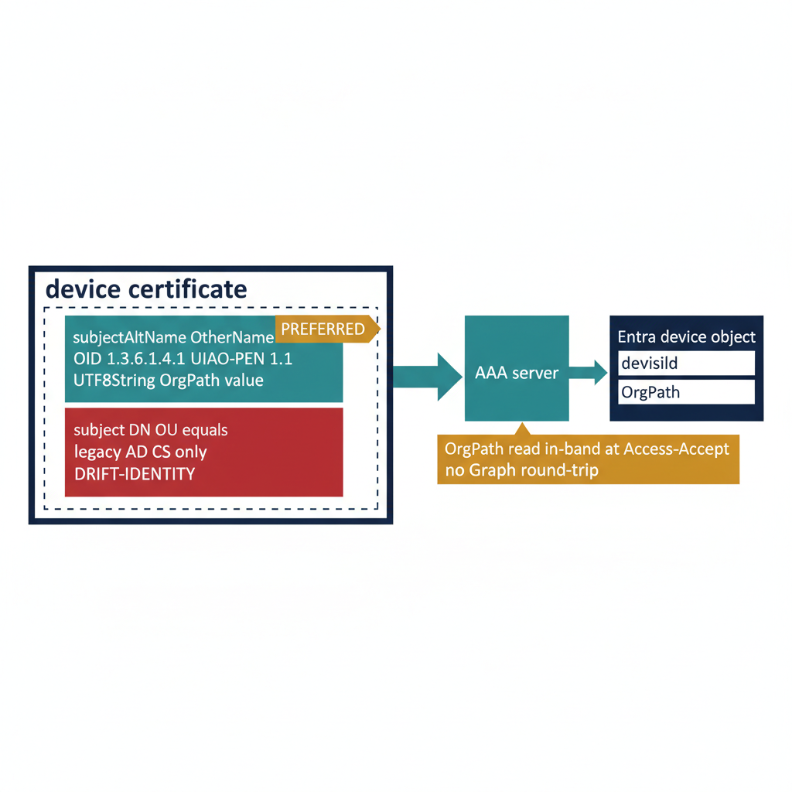

# Chapter 5 — Carrying OrgPath in the Certificate

::: {.callout-note}
## In this chapter
EAP-TLS network admission turns on a single object: the certificate the device presents at the moment it asks to join the network. This chapter covers how OrgPath rides inside that certificate so the AAA server can read organizational context at authentication time. It describes the preferred carrier — a subjectAltName OtherName entry under the UIAO Private Enterprise Number arc — the deprecated legacy fallback in the subject DN, how each issuance authority stamps the carrier, and why in-band carriage avoids a per-request Graph round-trip.
:::

## Why the Carrier Matters

EAP-TLS, the certificate-based EAP method defined in RFC 5216, requires the supplicant — the device asking to join the network — to present an X.509 certificate that the AAA (RADIUS) server can validate and then map to an Entra device object. The validation half of that exchange is standard PKI: chain to a trusted root, check revocation, confirm the certificate is current. The mapping half is where OrgPath enters the picture. For the AAA server to make an organizationally aware admission decision, the certificate must carry — or be resolvable to — the device's place in the OrgTree hierarchy.

> The certificate is the only artifact the device controls at admission time. If the organizational signal is not in the certificate, the AAA server has to go find it somewhere else — and "somewhere else" has a latency cost that the 802.1X handshake cannot always absorb.

ADR-073's certificate-carriage rule (its D5 decision) settles where that signal lives: OrgPath travels **in-band, inside the presented certificate**. This chapter is about carriage only — how OrgPath gets into the certificate and how the AAA server reads it back out. Running the issuing authority itself — standing up the CA, managing key material, operating revocation — is covered separately in the Certificate Authority book and is not repeated here.

{#fig-book-17-cpt-05-diagram-01 fig-alt="Engineering blueprint diagram on a white background showing how OrgPath is carried inside an EAP-TLS device certificate. In the center a navy #1F3A5F box labeled device certificate expands to reveal two carrier options stacked vertically. The upper option is a teal #1A9E8F box with monospace labels subjectAltName OtherName, OID 1.3.6.1.4.1 UIAO-PEN 1.1, and UTF8String OrgPath value, marked with an amber #D4A017 tag reading PREFERRED. The lower option is a red #C0392B box with monospace labels subject DN OU equals, legacy AD CS only, and DRIFT-IDENTITY. A teal arrow runs from the device certificate box to the right into a teal box labeled AAA server, which in turn maps with a short arrow to a navy box labeled Entra device object holding monospace fields deviceId and OrgPath. An amber #D4A017 callout band beneath the AAA server reads OrgPath read in-band at Access-Accept no Graph round-trip. All field labels in monospace, no human figures, 16:9 landscape." width="85%"}

## The Preferred Carrier — subjectAltName OtherName

The carriage rule names one preferred home for OrgPath: a **subjectAltName (SAN) OtherName** entry. An OtherName is the X.509 extension point designed for exactly this purpose — carrying an identifier that does not fit any of the predefined SAN types (DNS name, RFC 822 name, IP address) by pairing a private OID with a typed value.

The OtherName for OrgPath is defined as:

| Element | Value |
| :--- | :--- |
| **SAN type** | `otherName` |
| **type-id (OID)** | `1.3.6.1.4.1.{UIAO-PEN}.1.1` |
| **value** | `UTF8String` whose contents match the OrgPath grammar in UIAO_151 |

The OID is anchored under the IANA Private Enterprise Number arc `1.3.6.1.4.1`, with `{UIAO-PEN}` standing in for the UIAO enterprise number, then `.1.1` identifying the OrgPath attribute within UIAO's own arc. The `UTF8String` value is not free-form text — it must conform to the OrgPath grammar defined in **UIAO_151, the OrgPath codebook**, the same canonical path notation used everywhere else in the substrate (for example, a path rooted at the OrgTree root and descending through the governing nodes).

::: {.callout-important title="The UIAO PEN is not yet a production value"}
The UIAO Private Enterprise Number is a **real procurement item that has not yet been obtained**. Until IANA issues the enterprise number, development and lab work use an **interim placeholder PEN** in the `{UIAO-PEN}` position. Certificates carrying the placeholder PEN **must not ship to production NAC** — the production AAA policy is keyed to the real enterprise arc, and a placeholder-OID certificate will not map. The placeholder exists so the carriage mechanism can be built and tested ahead of the PEN issuing; it is not a substitute for it.
:::

The advantage of the OtherName carrier is that it is purpose-built. It does not overload a field that means something else, it survives certificate reissuance cleanly, and a SAN OtherName is read by the AAA server from a well-defined, machine-parseable location rather than scraped out of a distinguished-name string.

## The Legacy Fallback — subject DN OU=

Before the OtherName carrier, the only place to put an organizational unit string was the **subject distinguished name's `OU=` component**, the relative distinguished name that AD CS templates have populated for organizational placement for years. The carriage rule retains this as a **legacy fallback for AD CS-issued certificates only**: where a certificate was minted from an AD CS template that maps organizational placement into `OU=`, the AAA server can read OrgPath from the subject DN.

It works — but it is **deprecated after the DM_030 cutover**. The `OU=` component was never designed to carry a structured hierarchy path; it carries one organizational unit label, not the full OrgTree path, and reading it requires DN string parsing rather than a typed extension lookup. The fallback exists to keep the hybrid window working, not to be a steady-state design.

::: {.callout-warning title="DRIFT-IDENTITY in the post-migration steady state"}
After the DM_030 cutover, a device that **still presents an AD-shaped certificate** — one carrying its organizational signal in `OU=` rather than the SAN OtherName — produces a **DRIFT-IDENTITY finding**. The finding does not mean authentication failed; the fallback may still admit the device. It means the device is **still carrying legacy identity shape** when the steady state expects the modern carrier, and that drift is a signal that the device's certificate profile has not been migrated to the cloud-issued OtherName form.
:::

> In the hybrid window, reading `OU=` is correct behavior. In the post-migration steady state, reading `OU=` is a finding. The same code path is tolerated before the cutover and flagged after it — the cutover is what changes the meaning of the legacy shape from "expected" to "drift."

## How Each Issuance Authority Stamps the Carrier

Three issuance authorities can mint device certificates in this environment, and each stamps the OrgPath carrier through its own template surface. The certificate profile is where carriage is configured — the template defines what goes into the Subject and SAN, and a token in that template is resolved to the device's OrgPath at issuance time. (Operating these authorities is the Certificate Authority book's subject; the table below is strictly about *how each one places the carrier*.)

| Issuance authority | Carrier it stamps | How the carrier is populated | Status |
| :--- | :--- | :--- | :--- |
| **Intune SCEP / PKCS certificate profile** | SAN OtherName (preferred) | The certificate profile's Subject + SAN template includes an `{{OrgPath}}` token, resolved at issuance from the device's **Entra OrgPath extension attribute** | Current — cloud-native target state |
| **Microsoft Cloud PKI** | SAN OtherName (preferred) | Same template surface as SCEP / PKCS — the `{{OrgPath}}` token in the Subject + SAN template resolves from the device's Entra OrgPath extension attribute | Current — cloud-native target state |
| **AD CS (hybrid window only)** | subject DN `OU=` mapped to SAN OtherName | The certificate template's `OU=` placement maps to the SAN OtherName via a template extension | **Deprecated at DM_030 cutover** |

The two cloud-native authorities — Intune's SCEP/PKCS certificate profile and Microsoft Cloud PKI — present the **same template surface**: the Subject and SAN fields of the certificate profile carry an `{{OrgPath}}` token that Intune resolves from the device's **Entra OrgPath extension attribute** at the moment the certificate is issued. Because the resolution happens against the Entra device object's extension attribute, the value placed in the certificate is exactly the OrgPath the substrate already knows for that device — the certificate becomes a point-in-time snapshot of the device's organizational placement.

AD CS occupies the hybrid window only. Its templates were built around `OU=` placement; a template extension maps that `OU=` placement onto the SAN OtherName so AD CS-issued certificates can participate in the modern carrier during the transition. That mapping is a bridge, not a destination — it is deprecated at the DM_030 cutover, after which AD-shaped certificates surface as DRIFT-IDENTITY.

## Reading OrgPath In-Band — The Governance Payoff

The reason ADR-073 prefers in-band carriage is operational, and it is best understood by contrasting it with the alternative.

When OrgPath rides **in-band in the certificate**, the AAA server reads it **directly from the presented certificate at authentication time**. The device hands over its certificate as part of the EAP-TLS handshake; the SAN OtherName is already there; the server parses the OrgPath value out of the certificate it is already validating. No external lookup is required. The organizational signal is available at the exact moment the server forms the **Access-Accept** — the same moment it decides which VLAN, which segment, which policy the device receives.

The alternative is **AAA-side group lookup by client identifier**: the server takes the device identity from the certificate, then calls Microsoft Graph to look up the device's group membership or extension attributes. This also works, and it produces the same organizational signal. But it **costs a Graph round-trip per RADIUS request**.

> 802.1X has a timeout budget. The supplicant, the authenticator (the switch or wireless controller), and the AAA server each enforce timers, and a Graph round-trip injected into the middle of every authentication strains those timers — under load, lookups queue, latency climbs, and authentications time out and retry. In-band carriage removes the network call from the hot path entirely.

| | In-band cert carriage (preferred) | AAA-side Graph lookup |
| :--- | :--- | :--- |
| **Where OrgPath comes from** | The presented certificate's SAN OtherName | A Graph query keyed on the client identifier |
| **Cost per RADIUS request** | None — read from the cert already in hand | One Graph round-trip per request |
| **Effect on 802.1X timers** | Neutral — no added network call | Strains the timeout budget under load |
| **Availability at Access-Accept** | Immediate | Gated on the lookup completing in time |

Both paths reach the same decision; only the cost differs. ADR-073 prefers in-band cert carriage precisely because the organizational signal arrives for free, inside an artifact the server is already parsing, at the one moment it is needed.

::: {.callout-note title="Carriage, not issuance"}
Everything in this chapter concerns what the AAA server *reads* and what the certificate *carries*. Standing up and operating the issuing authorities — the CA hierarchy, key custody, revocation, profile lifecycle — is the subject of the Certificate Authority book. The two authorities meet at the template surface: the CA book governs the template; this chapter governs what the template's `{{OrgPath}}` token must resolve to and where the resulting value must land in the certificate.
:::
