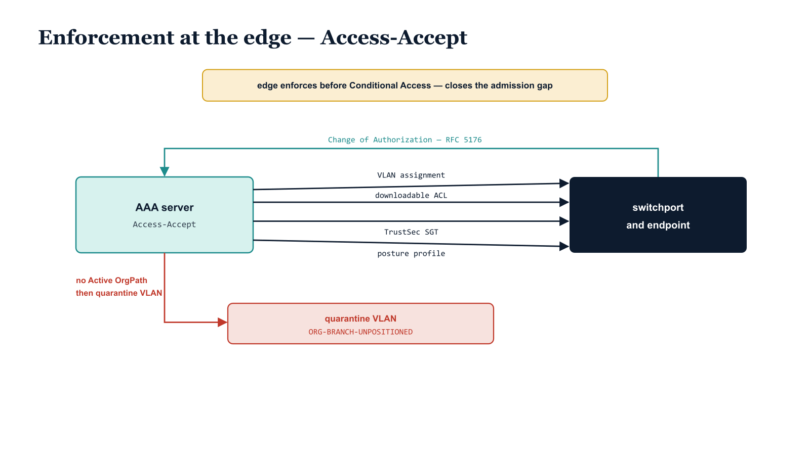

# Chapter 6 — Enforcement at the Edge

::: {.callout-note}
## In this chapter
Knowing an endpoint's OrgPath is only half the story. This chapter follows what the AAA server actually does with that knowledge once the lookup resolves — how the `enforcement` payload from the `nac_assignments` entry is translated into concrete RADIUS attributes in the Access-Accept, what each of the five enforcement mechanisms accomplishes on the wire, and how a device with no Active OrgPath is steered onto a quarantine VLAN at the network edge before it can ever reach the Conditional Access plane.
:::

## From Assignment to Action

The previous chapter, on ADR-073, established the structure: every endpoint resolves through the AAA server to a `nac_assignments` entry, and each entry carries an `enforcement` payload that describes precisely what the network should do with that endpoint. This chapter is about the verb. The assignment says *who the device is* in OrgPath terms; the enforcement payload says *what happens to its packets*. The translation from the one to the other happens inside a single RADIUS message — the Access-Accept — and it is worth being precise about how each field in the payload becomes an attribute on the wire, because the entire admission-control posture of the network rests on that translation being correct and deterministic.

{#fig-book-17-cpt-06-diagram-01 fig-alt="Engineering blueprint diagram on a white background. A central teal #1A9E8F box labeled AAA server — Access-Accept sits in the middle. Four navy #1F3A5F arrows fan out to the right toward a single navy box labeled switchport and endpoint; the four arrows carry monospace labels VLAN assignment, downloadable ACL, TrustSec SGT, and posture profile. A teal #1A9E8F back-arrow curves from the switchport box back into the AAA server box, labeled Change of Authorization RFC 5176, indicating live re-authorization of an existing session. Below the main flow a red #C0392B branch leaves the AAA server toward a red box labeled quarantine VLAN ORG-BRANCH-UNPOSITIONED, with the branch labeled no Active OrgPath then quarantine VLAN. An amber #D4A017 callout band across the top reads edge enforces before Conditional Access — closes the admission gap. All field and box labels in monospace, no human figures, 16:9 landscape." width="85%"}

The five fields described below — `vlan_id`, `dacl_name`, `sgt_tag`, `posture_profile`, and `change_of_authorization` — are not alternatives to one another. A single Access-Accept can carry several of them at once, and most production assignments do. They operate at different layers and accomplish complementary things, so the AAA server emits whichever ones the resolved assignment specifies and the switchport applies them together.

## Dynamic VLAN Assignment — `vlan_id`

The most fundamental thing an Access-Accept can do is decide which network segment the endpoint lands on. The `vlan_id` field in the enforcement payload becomes a set of RADIUS tunnel attributes in the Access-Accept, and the authenticating switch reads those attributes and places the port into the named VLAN for the duration of the session.

The mechanism is standardized in RFC 3580, which defines how the IEEE 802.1X port-based access control framework uses RADIUS. Rather than inventing a bespoke "put this port on VLAN N" attribute, RFC 3580 reuses the existing tunnel attributes:

| RADIUS attribute | Value for dynamic VLAN |
| :--- | :--- |
| `Tunnel-Type` | `VLAN` (13) |
| `Tunnel-Medium-Type` | `IEEE-802` (6) |
| `Tunnel-Private-Group-ID` | the VLAN identifier — the `vlan_id` from the enforcement payload |

> The endpoint never negotiates its VLAN. It authenticates, the AAA server resolves its OrgPath, and the segment it lands on is dictated entirely by the assignment. A finance workstation and a building-control sensor can share the same physical switch and the same cable plant and still wake up on entirely different network segments, because the OrgPath each one resolves to drives a different `vlan_id`.

This is the difference between physical topology and policy topology. The wiring closet does not change when an organization reorganizes; the assignment table does, and the next time the device authenticates it lands where its new OrgPath says it belongs.

## Downloadable ACL — `dacl_name`

Placing an endpoint on the correct VLAN constrains the broadcast domain it participates in, but it does not by itself constrain what that endpoint may reach. Two devices on the same VLAN can ordinarily talk to one another and to everything the VLAN's gateway routes to. The `dacl_name` field closes that gap.

A downloadable ACL is a named access-control list that the AAA server references in the Access-Accept and that the switch applies directly at the authenticating port. The switch enforces the ACL inline, on the port itself, so the policy travels with the endpoint's session rather than living statically in the switch configuration. Even within its assigned VLAN, the endpoint can reach only what the dACL permits.

> A VLAN answers *which segment*; a downloadable ACL answers *what, within that segment, this particular session is allowed to touch*. Together they give the edge two independent levers: macro-segmentation by VLAN and micro-segmentation by per-session ACL.

## TrustSec Security Group Tag — `sgt_tag`

The third lever decouples policy from addressing entirely. The `sgt_tag` field carries a Cisco TrustSec Security Group Tag, delivered in the same Access-Accept, and it labels the endpoint's traffic with a group identity that downstream enforcement points can act on without reference to the device's IP address or VLAN membership at all.

The value of group-based segmentation is that it survives IP and topology change. An endpoint can move, re-address, or be re-segmented at the VLAN layer, and its SGT — and therefore the group-based policy that applies to it — follows the session rather than the address. This is segmentation expressed in OrgPath terms rather than subnet terms.

::: {.callout-important title="TrustSec SGT is Cisco-specific"}
The Security Group Tag mechanism is part of Cisco TrustSec and is specific to Cisco infrastructure. A heterogeneous network will use `sgt_tag` only on the Cisco-capable portions of its edge, and the assignment table should reflect that — devices that authenticate against non-TrustSec switches rely on `vlan_id` and `dacl_name` for equivalent segmentation outcomes.
:::

## Posture Profile — `posture_profile`

The fields above all describe *where* an endpoint may go. The `posture_profile` field describes *whether it is healthy enough to be there*. It names a posture-assessment policy that the NAC platform applies at admission — a device-health and compliance check evaluated as part of, or immediately following, authentication.

A posture profile is the network edge's hook into device state: patch level, disk encryption, endpoint-protection status, and whatever else the NAC platform is configured to assess. The OrgPath-resolved assignment determines *which* posture profile applies, so a Tier 0 management workstation can be held to a stricter posture standard than a general-purpose endpoint simply by virtue of the OrgPath it resolves to. The posture result then feeds back into the authorization decision — which is precisely where the next mechanism becomes essential.

## Change of Authorization — `change_of_authorization`

Authentication is a moment in time, but the conditions that authentication evaluated are not static. A device's posture can degrade after it is admitted; its OrgPath can change when the organization reorganizes; a policy can be revised. Without a way to revisit a live session, every such change would have to wait for the device to disconnect and re-authenticate.

The `change_of_authorization` field enables the alternative. Defined in RFC 5176, RADIUS Change of Authorization (CoA) lets the AAA server push a new authorization to an already-connected session — without forcing the endpoint to reconnect. When a posture check later fails, or when an OrgPath or policy change lands, the AAA server issues a CoA against the live session and the new enforcement is applied in place.

> CoA is what turns the edge from a one-time gate into a continuously governed boundary. The Access-Accept sets the initial posture; CoA keeps that posture current as state changes underneath it. A device that drifts out of compliance after admission does not get to keep the access it was granted while healthy.

This matters most when it is paired with posture assessment: the posture profile detects the change in device state, and CoA is the mechanism by which the network responds to it on the existing session rather than at the next reconnection.

## The Headline Behavior — Quarantine for the Unpositioned Device

Everything above describes what happens when an endpoint resolves cleanly to an Active OrgPath. The more consequential case — the one this entire integration exists to handle — is the device whose OrgPath is missing or not yet Active.

A device that does not resolve to an Active OrgPath does not fall through to a permissive default and it does not simply fail authentication into a useless state. Per ADR-073, it maps to a quarantine assignment: an `enforcement` payload whose intent is `quarantine`, which places the endpoint on a dedicated quarantine VLAN. There is a canonical bucket for exactly these devices in the OrgTree — `ORG-BRANCH-UNPOSITIONED` — and a device with no Active OrgPath is assigned there rather than being left undefined.

| Condition | Resolved assignment | Edge outcome |
| :--- | :--- | :--- |
| Endpoint resolves to an Active OrgPath | the OrgPath's `nac_assignments` enforcement payload | placed on its dictated VLAN, dACL, SGT, and posture profile |
| OrgPath missing or not yet Active | quarantine assignment, `intent: quarantine`, `ORG-BRANCH-UNPOSITIONED` | placed on the quarantine VLAN |

The reason this is the headline behavior, and not a footnote, is timing. Per the ADR-071 Intune-First doctrine — Pillar 1 — a device with no Active OrgPath now lands on the quarantine VLAN *before it can even attempt a Conditional Access sign-in*. The network edge has become the first enforcement point in the admission sequence, not the last. This directly closes the admission-gap timing problem laid out in Chapter 1: in the old sequence, an unpositioned device could obtain network connectivity and then attempt to authenticate at the identity plane, leaving a window in which an ungoverned device sat on a usable network. With enforcement at the edge, that window closes — the device that cannot prove an Active OrgPath never reaches the segment from which a Conditional Access attempt would originate.

::: {.callout-note title="Why the edge goes first"}
Conditional Access is a powerful gate, but it evaluates at sign-in — after a device already has network reach. Edge enforcement evaluates at the switchport — before the device has reach at all. Putting the unpositioned device on the quarantine VLAN at admission means the identity-plane gate is no longer the first and only line; it is the second line behind a network boundary that has already decided whether this device belongs on a productive segment.
:::

The quarantine VLAN is not a dead end. It is the segment from which an unpositioned device can be observed, remediated, and — once it acquires an Active OrgPath through the Intune-First onboarding path — re-evaluated. A CoA against the session, or a fresh authentication, then moves it off `ORG-BRANCH-UNPOSITIONED` and onto the segment its newly Active OrgPath dictates. The edge does not merely reject the unknown device; it holds it in a defined, governed place until it becomes known.
