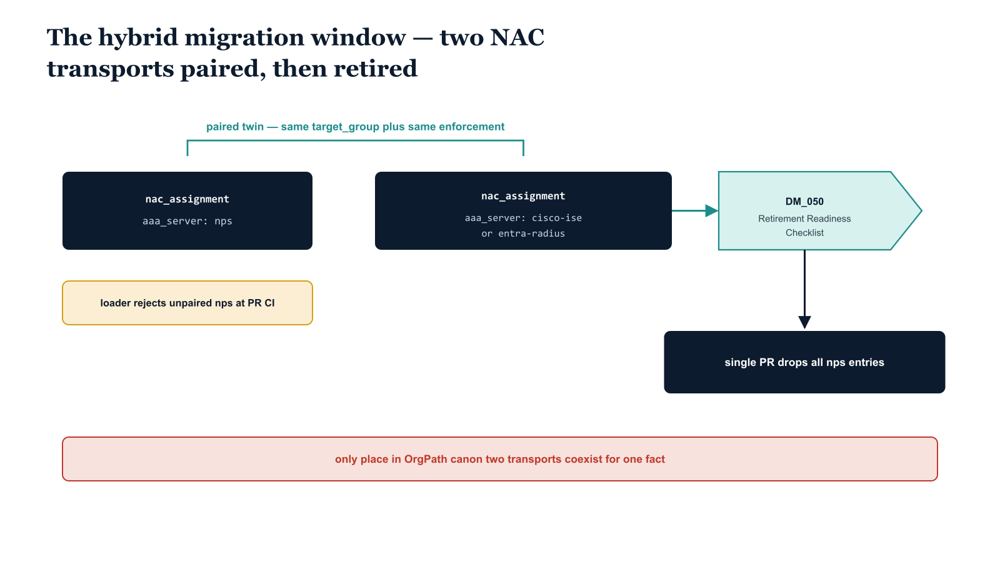

# Chapter 7 — The Hybrid Window

::: {.callout-note}
## In this chapter
During the migration from legacy Network Policy Server to a modern cloud or enterprise RADIUS service, both transports run at once. This chapter explains how ADR-073's D4 decision keeps that dual state finite and auditable rather than informal — through the paired-twin rule enforced at PR CI and the retirement gate tied to the DM_050 readiness checklist. It closes by showing why this is the only place in the OrgPath canon where two transports for one governance fact are permitted to coexist.
:::

## A Bounded Exception, Not an Informal Overlap

Every other surface in the OrgPath canon expresses a given governance fact through exactly one transport. A NAC enforcement decision is carried by one AAA server, a DNS boundary by one zone authority, a tier classification by one tag. The discipline is deliberate: one fact, one path, no ambiguity about which copy is authoritative.

Network access enforcement is the single, deliberate exception. During the `DM_030` migration window — the phase in which an organization moves off the legacy on-premises Network Policy Server (NPS) and onto a non-NPS AAA server such as Cisco ISE or an Entra-integrated RADIUS service — both transports are necessarily in service at the same time. The legacy NPS continues to answer live authentication requests while the modern AAA server is stood up, validated, and progressively cut over. For a real and bounded period, the same enforcement fact must be expressed twice.

{#fig-book-17-cpt-07-diagram-01 fig-alt="Engineering blueprint diagram on a white background. Two federal navy #1F3A5F boxes sit side by side in the center. The left box is labeled in monospace nac_assignment aaa_server nps. The right box is labeled in monospace nac_assignment aaa_server cisco-ise or entra-radius. A teal #1A9E8F bracket joins the two boxes and is labeled paired twin same target_group plus same enforcement. An amber #D4A017 callout band below the left box reads loader rejects unpaired nps at PR CI. On the right side a teal #1A9E8F gate shape is labeled DM_050 Retirement Readiness Checklist and an arrow leads from it to a final navy #1F3A5F box labeled single PR drops all nps entries. A small red #C0392B note at the bottom reads only place in OrgPath canon two transports coexist for one fact. All field and object labels in monospace, no human figures, 16:9 landscape." width="85%"}

ADR-073 calls this out explicitly. The schema permits `aaa_server: nps` entries in `nac_assignments`, but it permits them only under two strict constraints. Without those constraints the dual state would be informal — a transitional mess that nobody could measure and that could silently drop rules at cutover. The two constraints are what convert an informal overlap into a bounded, auditable window.

## The Paired-Twin Rule

The first constraint governs what an `nps` entry is allowed to mean while it exists.

> Every `nps` entry MUST have a paired non-NPS entry with the same `target_group` and the same enforcement payload.

The pairing is not advisory and it is not checked by a nightly audit after the fact. The loader enforces it at PR CI, before merge. An `nps` entry that lacks its non-NPS twin — same `target_group`, same enforcement payload — is rejected at continuous integration. The pull request does not merge.

| Field | Constraint on the paired twin |
| :--- | :--- |
| `aaa_server` | One entry is `nps`; its twin is the non-NPS server (e.g. `cisco-ise`, `entra-radius`) |
| `target_group` | MUST be identical across the pair |
| enforcement payload | MUST be identical across the pair |

The effect of this rule is precise: every governance fact expressed against NPS is mirrored, byte-for-byte in intent, on the modern AAA server. The legacy and modern transports are not allowed to drift apart. Whatever access decision the old NPS path enforces, the new path enforces the same decision, against the same group, with the same payload.

> Because the twin is mandatory and is enforced before merge, cutover can never lose a rule. By the time NPS is retired, every fact it ever carried already exists on the modern server — it was placed there as a precondition of the `nps` entry being allowed to exist at all.

This is the heart of D4. The pairing rule is what makes the dual state *bounded*. Anyone can open the `nac_assignments` file and read off, directly, exactly which facts are still dual-homed — every `nps` entry is one such fact — and therefore exactly how much migration work remains. There is no separate tracker to consult and no inference required. The file is the ledger.

```yaml
# nac_assignments — during the DM_030 hybrid window.
#
# Each nps entry below is paired with a non-NPS twin that carries the
# SAME target_group and the SAME enforcement payload. The loader rejects
# any unpaired nps entry at PR CI, before merge.

nac_assignments:

  # --- Paired twin: finance-privileged workstations -----------------
  - target_group: finance-privileged-workstations
    aaa_server:   nps                 # legacy transport (DM_030 window)
    enforcement:
      vlan:       210
      dacl:       finance-priv-acl
      posture:    compliant-required

  - target_group: finance-privileged-workstations
    aaa_server:   cisco-ise           # modern transport — IDENTICAL payload
    enforcement:
      vlan:       210
      dacl:       finance-priv-acl
      posture:    compliant-required

  # --- Paired twin: field-operations laptops ------------------------
  - target_group: field-ops-laptops
    aaa_server:   nps                 # legacy transport (DM_030 window)
    enforcement:
      vlan:       320
      dacl:       field-ops-acl
      posture:    compliant-required

  - target_group: field-ops-laptops
    aaa_server:   entra-radius        # modern transport — IDENTICAL payload
    enforcement:
      vlan:       320
      dacl:       field-ops-acl
      posture:    compliant-required
```

Reading the file above, the migration state is self-evident: two facts are still dual-homed, so two cutovers remain. When a third `nps` entry appears in a pull request without its twin, CI rejects it; when an `nps` entry's payload diverges from its twin's, CI rejects that too. The window cannot be entered sloppily.

## The Retirement Gate

The second constraint governs how the window *closes*.

Removing the `nps` entries is not something an engineer does opportunistically, one entry at a time, whenever a given group looks ready. Removal of all `nps` entries from `nac_assignments` is gated by the `DM_050` Retirement Readiness Checklist — the Entra Connect / AAA-tier checklist that confirms the modern AAA server is fully authoritative and the legacy NPS is no longer carrying live load.

| Stage | Action | Authority |
| :--- | :--- | :--- |
| Window open | `nps` entries coexist with paired non-NPS twins | Paired-twin rule, enforced at PR CI |
| Readiness | Modern AAA server validated as fully authoritative | `DM_050` Retirement Readiness Checklist |
| Closure | A single PR drops **every** `nps` entry at once | Loader confirms no orphaned twins remain |

When the `DM_050` checklist passes, a single pull request drops every remaining `nps` entry in one operation — not a trickle of removals, but one decisive cut. The loader's role at that point is the mirror image of its role during the window: instead of rejecting unpaired `nps` entries, it confirms that no orphaned twins remain. The non-NPS entries that were the mandatory partners of the now-removed `nps` entries stand on their own as the sole transport, exactly as every other governance fact in the canon does.

> The window does not fade out informally. It ends at a defined gate, in a single reviewable change, with the loader verifying the end state. There is no lingering tail of half-migrated entries.

## The Only Permitted Dual Transport in the Canon

It is worth stating plainly, because the discipline elsewhere is so strict. The hybrid window is the **only** place in the OrgPath canon where two transports for the same governance fact are permitted to coexist. ADR-073 names this exception explicitly rather than letting it emerge as drift, and it surrounds the exception with the two constraints precisely so that the permission is finite.

Everywhere else, a fact has one transport by construction. Here — and only here, and only during `DM_030` — a NAC enforcement fact may live on two. The paired-twin rule keeps that duality honest while it lasts; the `DM_050` retirement gate guarantees it ends cleanly.

This connects directly to the broader migration arc. The hybrid window is the AAA tier's expression of the larger AD-to-Entra modernization program: a legacy on-premises authority running in parallel with its cloud or enterprise successor until the successor is proven and the legacy can be retired. The `nac_assignments` file is the instrument that makes the AAA-tier portion of that arc measurable. As long as a single `nps` entry remains, the tier is still dual-homed and the modernization is incomplete.

> When the last `nps` entry drops, the AAA tier's modernization exit criterion is met. The hybrid window has closed, every enforcement fact rests on a single modern transport, and the file once again obeys the canon's universal rule — one fact, one transport.
