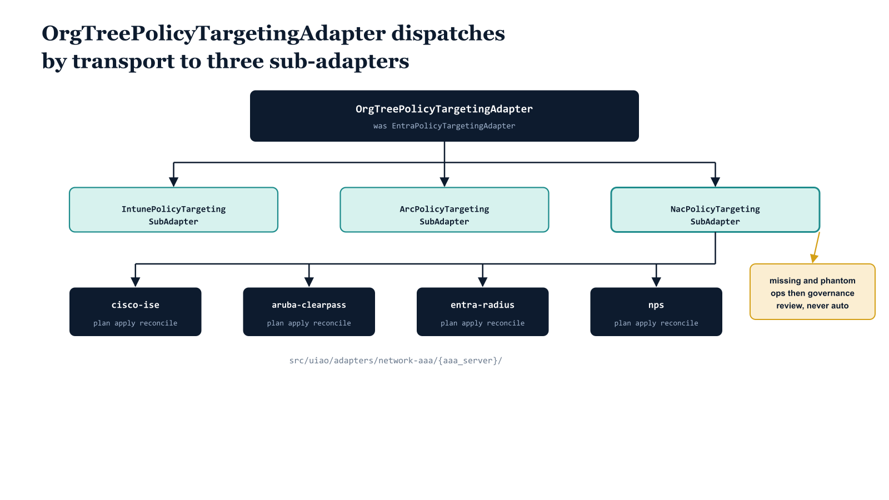

# Chapter 8 — The Adapter

::: {.callout-note}
## In this chapter
Everything in the preceding chapters has been about *what* OrgPath targets and *why*. This chapter is about *how* — the code that actuates a NAC targeting decision against a live AAA server. It covers the reference adapter rename from `EntraPolicyTargetingAdapter` to `OrgTreePolicyTargetingAdapter`, the three transport sub-adapters that dispatch by enforcement plane, the per-vendor NAC implementations that share a single `plan` / `apply` / `reconcile` contract, and the twelve-op vocabulary — eight inherited from Intune and Arc, four new for NAC — including why two of the NAC ops never auto-apply.
:::

## One Adapter, Several Transports

Per ADR-073's adapter decisions (D2 and D3), NAC targeting does not get its own top-level adapter. It joins the existing OrgPath targeting adapter as one more transport, dispatched alongside Intune and Azure Policy. The reference adapter is **renamed** to signal the broadened scope.

{#fig-book-17-cpt-08-diagram-01 fig-alt="Engineering blueprint diagram on a white background. A top navy #1F3A5F box reads OrgTreePolicyTargetingAdapter with a smaller subtitle was EntraPolicyTargetingAdapter in monospace. Three teal #1A9E8F child boxes hang beneath it labeled IntunePolicyTargetingSubAdapter, ArcPolicyTargetingSubAdapter, and NacPolicyTargetingSubAdapter, each connected to the parent by a vertical line. The NacPolicyTargetingSubAdapter box fans downward to four navy #1F3A5F leaf boxes labeled cisco-ise, aruba-clearpass, entra-radius, and nps, all grouped under a monospace path label src/uiao/adapters/network-aaa/{aaa_server}/ and each leaf tagged with the monospace verbs plan apply reconcile. An amber #D4A017 callout box on the right reads missing and phantom ops then governance review, never auto and points an arrow at the Nac sub-adapter. All labels in monospace, no human figures, 16:9 landscape." width="100%"}

> The reference adapter `EntraPolicyTargetingAdapter` is renamed to `OrgTreePolicyTargetingAdapter`. The rename signals that targeting is no longer an Entra-only concern — it now spans Intune device-configuration policy, Azure Policy via Arc, and network admission control. To avoid breaking callers on the day of the rename, the old symbol is **re-exported as a thin alias** for one release cycle, then removed.

The alias is deliberately minimal. It exists only so that existing import sites keep resolving during the deprecation window; it carries no behavior of its own and emits a deprecation notice when imported.

```python
# src/uiao/adapters/targeting/__init__.py

class OrgTreePolicyTargetingAdapter:
    """Dispatch an OrgPath targeting decision to the correct transport.

    Renamed from EntraPolicyTargetingAdapter (ADR-073, D2). The rename
    signals that targeting now spans Intune, Azure Policy (Arc), and NAC —
    not Entra alone.
    """

    def __init__(self) -> None:
        self._transports = {
            "intune":      IntunePolicyTargetingSubAdapter(),
            "azure-policy": ArcPolicyTargetingSubAdapter(),
            "nac":         NacPolicyTargetingSubAdapter(),
        }

    def dispatch(self, transport: str):
        return self._transports[transport]


# Thin compatibility alias — re-exported for ONE release cycle, then removed.
# Importing this name emits a DeprecationWarning; it adds no behavior.
EntraPolicyTargetingAdapter = OrgTreePolicyTargetingAdapter
```

The design echoes the other OrgPath adapters: one targeting decision at the top, several vendor-shaped implementations beneath it — rather than fragmenting into one adapter per vendor. That symmetry is the point. A reader who understands how Intune targeting works already understands the shape of NAC targeting.

## Dispatch by Transport

The top-level adapter selects a sub-adapter by transport. Each sub-adapter owns its own credential model, because each enforcement plane authenticates differently.

| Transport | Sub-adapter | Credentials |
| :--- | :--- | :--- |
| **Intune** | `IntunePolicyTargetingSubAdapter` | Graph application token with `DeviceManagementConfiguration.ReadWrite.All` |
| **Azure Policy** | `ArcPolicyTargetingSubAdapter` | ARM service principal with `Microsoft.Authorization/policyAssignments/*` |
| **NAC** | `NacPolicyTargetingSubAdapter` | Vendor-specific — Cisco ISE ERS API token, Aruba ClearPass API session, Entra RADIUS Proxy management API token, or NPS RPC for legacy |

> The Intune and Azure Policy transports each speak to a single, well-known control plane with a single credential type. The NAC transport is different: its credential model is not one thing but a set, because the NAC plane is itself a set of vendor products. This is why the NAC sub-adapter dispatches a second time.

## The NAC Sub-Adapter Dispatches by AAA Server

`NacPolicyTargetingSubAdapter` does not talk to any AAA server directly. It dispatches by `aaa_server` to a vendor-specific implementation. Each implementation lives under a predictable path and exposes exactly the same three verbs:

```
src/uiao/adapters/network-aaa/{aaa_server}/
```

Where `{aaa_server}` resolves to one of `cisco-ise`, `aruba-clearpass`, `entra-radius`, or `nps`. Every one of these directories exposes the same `plan` / `apply` / `reconcile` contract, so the sub-adapter can treat them uniformly regardless of the vendor behind them.

```python
# src/uiao/adapters/network-aaa/_contract.py

class AaaServerAdapter(Protocol):
    """Every per-vendor NAC adapter exposes this trio of verbs."""

    def plan(self, desired: CanonState) -> list[Op]:
        """Compute the ordered op list. NO live writes.

        Reads the AAA server's current assignments, diffs against canon,
        and returns the ordered operations that would reconcile them.
        """

    def apply(self, ops: list[Op], *, dry_run: bool = True) -> ApplyResult:
        """Execute the op list. dry_run defaults to True.

        Auto-appliable ops are written; governance-review ops are reported
        and held. Set dry_run=False to perform live writes.
        """

    def reconcile(self, desired: CanonState, *, dry_run: bool = True) -> ApplyResult:
        """plan + apply in one call. Convenience for pipeline runs."""
        return self.apply(self.plan(desired), dry_run=dry_run)
```

The three verbs form a deliberate progression:

| Verb | Behavior |
| :--- | :--- |
| **plan** | Computes the ordered op list by diffing canon against the AAA server's live state. Performs **no live writes** — it is always safe to run, and its output is the unit of review. |
| **apply** | Executes an op list. Runs in **`dry_run` by default**, so a bare `apply` reports what it would do without changing the AAA server. Live writes require an explicit opt-out of dry-run. |
| **reconcile** | The composition `plan + apply` — compute the op list, then execute it. The convenience entry point for a pipeline run, and itself dry-run by default. |

> Because `reconcile` is just `plan` followed by `apply`, and `apply` defaults to dry-run, the default behavior of the entire chain is to *describe* rather than *mutate*. Mutation is always an explicit choice.

## The Op Vocabulary — Twelve Ops

A targeting decision is expressed as an ordered list of *ops*. ADR-039 defined eight ops covering the Intune and Azure Policy transports. ADR-073 adds **four NAC ops**, bringing the vocabulary to **twelve total**. Reusing the existing op model rather than inventing a parallel one keeps NAC legible to anyone already fluent in the Intune and Arc transports.

The four new NAC ops divide cleanly into those that auto-apply and those that require human governance review:

| NAC op | Auto-applies | What it means |
| :--- | :--- | :--- |
| **nac-assign-create** | Yes | Canon declares an assignment the AAA server lacks. The adapter creates it. |
| **nac-assign-update** | Yes | Canon and the AAA server diverge on policy reference, target group, or enforcement payload. The adapter reconciles the AAA server to canon. |
| **nac-policy-missing** | No — governance review | The policy referenced by canon does not exist on the AAA server. The adapter cannot safely invent it. |
| **nac-assign-phantom** | No — governance review | The AAA server has an OrgTree-named assignment that canon does not declare. The adapter will not silently delete it. |

### Why Missing and Phantom Require Human Review

The split is not arbitrary. NAC has an exceptionally **broad blast radius**: a single wrong VLAN assignment can move thousands of devices onto the wrong network segment in one enforcement cycle. The two auto-applying ops — create and update — bring the AAA server *toward* a state canon already describes, so the worst case is a state the governance model already sanctioned. The two review-gated ops are different in kind:

- **`nac-policy-missing`** would require the adapter to fabricate a policy definition that no human has authored. Inventing enforcement policy on the fly is precisely the failure mode NAC review exists to prevent.
- **`nac-assign-phantom`** would require the adapter to **delete** an assignment that is live on the AAA server today. A phantom may be a stale artifact — or it may be a deliberate, hand-placed assignment that simply has not been reflected back into canon yet. The adapter cannot tell the difference, so it refuses to guess.

::: {.callout-warning title="Warning — NAC blast radius"}
NAC ops are never auto-applied for the `nac-policy-missing` and `nac-assign-phantom` cases. A wrong policy reference or an erroneous deletion can affect thousands of devices in a single enforcement cycle. These two ops are surfaced in the `plan` output and held for governance review; they are never written by `apply`, even with dry-run disabled, until a reviewer promotes them.
:::

> The discipline mirrors the rest of the OrgPath adapter family. Where Intune and Arc draw the auto-apply line around create/update and gate destructive or undefined operations, the NAC sub-adapter draws the same line — adapted to a transport whose mistakes are measured in thousands of endpoints rather than one tenant's policy set.

## Where This Leaves the Adapter

The adapter is, by design, unremarkable to read. It renames cleanly, dispatches twice — once by transport, once by AAA server — and speaks a vocabulary that is mostly inherited. The four new ops are the only genuinely new surface, and two of them exist precisely to *stop* the adapter from acting. That restraint is the chapter's real subject: the code that actuates NAC targeting is most careful exactly where the network is most exposed.
