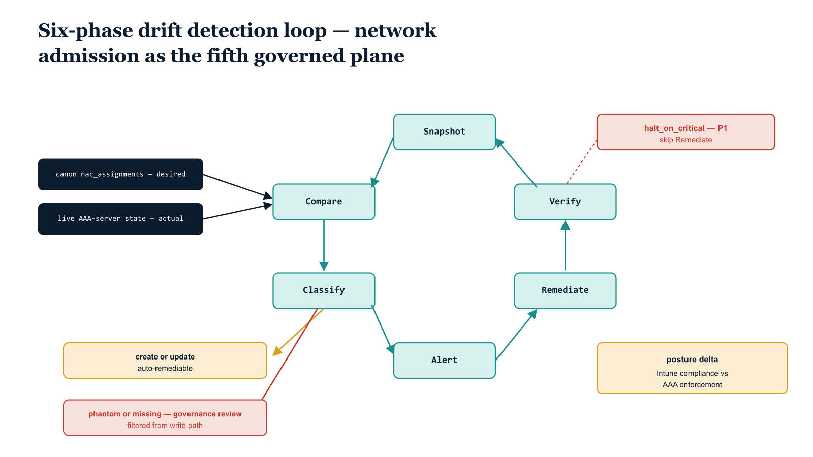

# Chapter 9 — Drift at the Admission Plane

::: {.callout-note}
## In this chapter
Network admission joins the OrgTree drift detection engine as a fifth governed plane. This chapter walks the six phases of the engine — Snapshot, Compare, Classify, Alert, Remediate, Verify — as they apply to admission, carries forward the three ADR-040 guarantees that protect every plane the engine touches, and introduces the chapter's distinctive finding: the posture delta between what Intune evaluates and what the AAA server enforces, which becomes a first-class drift finding at the admission plane.
:::

## A Fifth Plane Joins the Engine

The OrgTree drift detection engine, ratified as ADR-040 and specified in UIAO_163, is a six-phase orchestrator. It does not treat any one platform as special. It snapshots a canonical desired state, snapshots the corresponding live actual state, compares them, classifies every divergence it finds, alerts on the classified findings, optionally remediates the divergences that are safe to remediate, and verifies that the writes it issued landed as intended. The same six phases run regardless of which surface is being reconciled.

Until now the engine reconciled four planes, each covered by a phase adapter: dynamic group membership, administrative unit assignment, the device-plane OrgPath stamped onto managed endpoints, and policy targeting. Per ADR-073, network admission becomes the fifth governed plane, parallel to those four and running through the identical six phases.

{#fig-book-17-cpt-09-diagram-01 fig-alt="Engineering blueprint diagram on a white background showing a six-phase drift detection loop ring with the phases Snapshot, Compare, Classify, Alert, Remediate, Verify drawn as teal #1A9E8F nodes connected in a clockwise ring with monospace labels. Two navy #1F3A5F input boxes feed into the Compare node from the left, the upper labeled canon nac_assignments desired and the lower labeled live AAA-server state actual. Out of the Classify node two branches descend, an amber #D4A017 branch labeled create or update auto-remediable and a red #C0392B branch labeled phantom or missing governance review filtered from write path. A red #C0392B badge attached to the ring reads halt_on_critical P1 skip Remediate. A separate amber #D4A017 callout box at the lower right reads posture delta Intune compliance vs AAA enforcement. All labels in monospace, no human figures, 16:9 landscape." width="100%"}

The desired state for this plane is the canonical `nac_assignments` set — the OrgPath-derived mapping of which devices and identities are entitled to which network segments, produced by the governance pipeline and committed to the registry. The actual state is the live configuration read back from the AAA server that enforces admission. The engine's job at the admission plane is the same as everywhere else: make the actual converge on the canon, or escalate the divergence to a human when convergence is not safe to automate.

> From the substrate's point of view nothing about the engine changed. A fifth adapter was registered, it produces the same shape of snapshot, and it speaks the same op vocabulary. The novelty is entirely in *what* is now being watched, not in *how* the watching works.

## The Six Phases at the Admission Plane

### Snapshot

The Snapshot phase reads both states without modifying either. On the desired side it loads the canonical `nac_assignments` from the registry checkout that the pipeline materializes at the start of each run. On the actual side it queries the AAA server for the live admission configuration currently in force. Neither read mutates anything; Snapshot is always safe to run.

### Compare

Compare diffs the two snapshots key by key. For each assignment in the canon it asks whether a matching entry exists in the live AAA state and whether that entry agrees on segment, posture requirement, and OrgPath provenance. The output of Compare is a flat list of divergences — not yet classified, just the raw set of places where desired and actual disagree.

### Classify

Classify maps each divergence onto the operation vocabulary carried forward from the adapter chapter. This is the phase that decides what *kind* of drift each divergence is, and therefore how the engine is allowed to act on it.

| Op | Meaning | Disposition |
| :--- | :--- | :--- |
| `create` | The canon defines an assignment the AAA server does not have. | Auto-remediable — the engine may add it. |
| `update` | The assignment exists on both sides but the live values disagree with canon. | Auto-remediable — the engine may correct it. |
| `missing` | The canon expects an assignment that is absent from the live state in a way that may indicate upstream loss, not a simple gap. | Routed to governance review — never auto-remediated. |
| `phantom` | The AAA server enforces an assignment the canon does not authorize. | Routed to governance review — never auto-remediated. |

The `create` and `update` ops are the safe, additive corrections: the canon is authoritative, the live state simply hasn't caught up, and the engine can bring it into line. The `phantom` and `missing` ops are the ones that mean something is wrong in a way a script should not paper over — an assignment exists that no OrgPath warrants, or an expected assignment has vanished. Those are findings for a human, not a write the engine should make on its own authority.

### Alert

Alert emits the classified findings as evidence — to the pipeline log, to the governance repository run artifact, and to whatever notification channel the deployment has wired up. Every finding is alerted regardless of whether it will be remediated, so that the `phantom` and `missing` findings that the engine refuses to touch are still surfaced for the reviewers who must resolve them.

### Remediate

Remediate is the only phase that writes, and it is the most heavily guarded. It applies the auto-remediable `create` and `update` ops — and nothing else. The disposition assigned in Classify is binding here: the governance-review ops never reach the write path.

### Verify

Verify re-reads the affected live state after the Remediate pass and confirms that the writes the engine issued actually landed. A `create` is verified by reading the assignment back; an `update` is verified by confirming the corrected values are now in force. Verify closes each scan with evidence that the actual state is what the engine intended to make it — or with a flagged discrepancy if a write did not take.

## The Three Guarantees, Carried Forward

The admission plane inherits the ADR-040 engine guarantees unchanged. They are what make a write-capable reconciler safe to point at a production AAA server.

### dry_run defaults to True

The engine does not write unless explicitly told it may. `dry_run` defaults to `True`, which means every scan is a read-and-report by default: Snapshot, Compare, Classify, Alert, and Verify all run, but the Remediate pass produces a *plan* rather than issuing writes. Turning writes on requires an explicit per-scan opt-in. The safe posture is the default posture, and the dangerous posture has to be requested by name on every run.

### auto_remediate is per-facet, and review ops are filtered out

`auto_remediate` is configured per facet, so an operator can enable automated correction for one plane while leaving another in report-only mode. But independent of that switch, and independent of the `dry_run` flag, the governance-review ops are *filtered out of the remediation pass entirely*. The `phantom` and `missing` findings do not reach the write path under any configuration. Even with `dry_run` set to `False` and `auto_remediate` enabled for the admission facet, a `phantom` assignment is never deleted and a `missing` assignment is never silently recreated by the engine. They are alerted, recorded, and left for a human.

> The distinction is deliberate. `create` and `update` make the world match a canon that is known-good. `phantom` and `missing` are signals that either the canon or the world is wrong in a way the engine cannot adjudicate — and the engine declines to guess.

### halt_on_critical skips the entire Remediate pass

`halt_on_critical` defaults to a P1 threshold. When any finding at or above the halt severity fires during Classify, the *entire* Remediate pass is skipped for that scan — not just the offending finding. One escalation poisons the whole scan. The engine will still complete Snapshot, Compare, Classify, Alert, and Verify, so the operator gets full evidence of what it saw, but it issues no writes at all until a human resolves the critical finding and re-runs.

| Guarantee | Default | Effect at the admission plane |
| :--- | :--- | :--- |
| `dry_run` | `True` | Writes require an explicit per-scan opt-in; otherwise Remediate only plans. |
| `auto_remediate` | per-facet | `phantom` / `missing` filtered from the write path regardless of this flag or `dry_run`. |
| `halt_on_critical` | P1 | A single finding at or above P1 skips the whole Remediate pass until a human resolves it. |

## The Posture Delta

The distinctive finding at the admission plane is one that no single platform can see on its own, because it lives in the gap between two platforms.

Intune evaluates device compliance — it decides, against its compliance policies, whether a device is in a healthy posture. The AAA server applies admission enforcement — it decides, at the moment a device joins the network, which segment that device is admitted to. These two evaluations are made by different systems, on different schedules, against different inputs. They can disagree.

A device that Intune considers compliant might be admitted to a segment that its OrgPath no longer warrants — the compliance verdict says "healthy" while the admission decision is stale. Or the inverse: a device whose OrgPath fully entitles it to a segment might be held out because the AAA server's enforcement state has drifted from the compliance evaluation. Either way, the *delta* between the Intune-evaluated compliance and the AAA-applied enforcement is itself a divergence — and at the admission plane the engine treats that delta as a first-class drift finding.

> The posture delta is not a `create` or an `update`. It is the discovery that two authorities that are supposed to agree do not. Like `phantom` and `missing`, it is a finding for governance review — the engine surfaces it as evidence and lets a human decide which side is wrong.

This is the governance point the chapter has been building toward. Before ADR-073, admission was a blind spot: the substrate could reconcile groups, administrative units, device OrgPath, and policy targeting, but the actual decision the network made when a device asked to join was invisible to the engine. A device could be admitted to a segment that no current OrgPath authorized, and nothing in the substrate would notice.

With admission registered as the fifth governed plane, that blind spot closes. Admission is now a continuously reconciled surface with the same six phases, the same op vocabulary, the same `dry_run` / `auto_remediate` / `halt_on_critical` semantics, and the same evidence trail as every other plane the engine watches. The network's admission decisions are no longer something the substrate takes on faith — they are something it snapshots, compares against canon, classifies, alerts on, and, where safe, corrects.

::: {.callout-note title="Note — Why the posture delta routes to review, not remediation"}
It is tempting to want the engine to "fix" a posture delta automatically — to re-evaluate compliance or re-apply admission until the two agree. The engine deliberately does not. A posture delta means an *authority* disagreement, and resolving it requires deciding which authority is correct in context: the device may be legitimately quarantined by Intune for a reason the AAA server's stale state hasn't caught up to, or the AAA server may be correctly holding a device that an over-permissive compliance policy would wave through. Auto-remediating the delta would force the two systems to agree without anyone having decided *who should be right*. That is precisely the kind of guess the governance-review disposition exists to prevent.
:::
