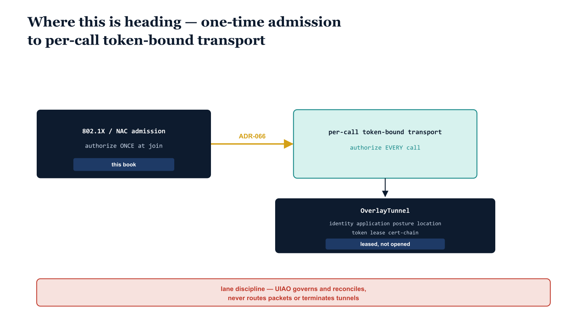

# Chapter 10 — Where This Is Heading

::: {.callout-note}
## In this chapter
This book carried OrgPath all the way to the network edge — the moment a device is admitted to the wire. This closing chapter looks past that moment. It traces the forward arc described by ADR-066, from one-time network admission to continuous, per-call transport authorization, and explains why a long-lived session is the antipattern zero-trust exists to retire. It introduces the sixth canonical mission class, the leased OverlayTunnel object, the DRIFT-TRANSPORT drift class, and the lane discipline that keeps UIAO a governance system rather than a controller in the data path.
:::

## The Limit of Admission

Everything this book described converges on a single event: the Access-Accept. A device presents an identity, the supplicant negotiates with the authenticator, the RADIUS exchange resolves, and the port opens. At that instant the OrgPath signal we have followed through every chapter — the location and identity binding stamped onto the network object — rides into the authorization decision and the device is on the network.

And then it stays on the network.

> 802.1X and NAC admission authorize a device **once**, at the moment it joins the wire. The session that results is trusted for its lifetime. Nothing re-checks the binding after the port opens.

This is the natural seam of admission control, and for the era it was built for it was correct. But it is exactly the shape zero-trust was created to retire. A long-lived session is a standing grant of trust that survives the intent that created it. If the session is hijacked, the attacker inherits its trust wholesale — every downstream system that honors the session honors the attacker. The admission decision was sound; the session that outlived it is the liability.

{#fig-book-17-cpt-10-diagram-01 fig-alt="Engineering blueprint diagram on a white background showing a left-to-right evolution. On the left a federal navy #1F3A5F box with monospace label 802.1X / NAC admission — authorize ONCE at join, tagged this book. An amber #D4A017 arrow labeled ADR-066 points right to a teal #1A9E8F box with monospace label per-call token-bound transport — authorize EVERY call. Below the teal box a navy object box with monospace label OverlayTunnel braces identity, application, posture, location, token, lease, cert-chain braces, marked leased, not opened. A red #C0392B footer band spans the width with monospace label lane discipline — UIAO governs and reconciles, never routes packets or terminates tunnels. All labels in monospace, no human figures, 16:9 landscape." width="100%"}

## ADR-066 — Token-Bound Transport as the Sixth Mission Class

ADR-066, "Application-Aware Networking and Token-Bound Transport Plane," takes the seam seriously. Its argument is direct: if a long-lived session is the antipattern, then UIAO should stop treating a session as a thing worth modeling at all. The decision adds **`transport`** as a sixth canonical mission class, alongside the five this corpus has carried throughout — joining identity, telemetry, policy, enforcement, and integration.

| Mission class | What it governs |
| :--- | :--- |
| identity | who and what is being asserted |
| telemetry | what is observed about the estate |
| policy | what intent is declared |
| enforcement | how intent is applied |
| integration | how surfaces are bound together |
| **transport** | how each authorized intent is carried across the network — per call |

The doctrine attached to the new class is the part that breaks with admission thinking. Transport authorization becomes **per-call**. Every adapter call, every evidence transfer, every overlay tunnel carries its own short-lived, audience-scoped token. The token is bound to four things: the caller's identity, the target application, the device posture at the moment of the call, and the OrgPath-derived location.

> A "session" — any long-lived authorization context that survives a single authorized intent — is no longer a canonical concept in UIAO. Authorization is reconstituted at each call rather than carried forward from a prior one.

The continuity here is exact, and it is the reason this chapter closes the book rather than opening a new one. The OrgPath location and identity binding that this entire book carried into the Access-Accept is the *same* binding ADR-066 carries into every per-call token. Admission was never the destination; it was the first place OrgPath reached the network. Per-call transport authorization is the same signal, applied continuously instead of once.

## The OverlayTunnel — Leased, Not Opened

To make transport governable, ADR-066 defines the **OverlayTunnel** as a typed canonical object. It is not a connection that an operator opens and forgets; it is a structured assertion with a bounded life.

| Field | What it carries |
| :--- | :--- |
| `identity` | the caller identity the tunnel is bound to |
| `application` | the target application the tunnel serves |
| `posture` | the device posture asserted at lease time |
| `location` | the OrgPath-derived location of the caller |
| `token` | the short-lived, audience-scoped authorization token |
| `lease` | the bounded lifetime, set by the token's own lifetime |
| `cert-chain` | the certificate chain backing the binding |

The single most important property of the object is the `lease`. Tunnels are **leased**, not opened — their existence is bounded by the lifetime of the token that authorized them. When the token expires, the lease expires, and the authorization to carry traffic ends with it. There is no standing tunnel waiting to be reused, because a reusable tunnel would be the long-lived session under a new name.

> "Leased, not opened" is the OverlayTunnel's whole point. The lifetime of the authorization and the lifetime of the carrying object are the same lifetime. Nothing outlives the intent that justified it.

## DRIFT-TRANSPORT — A Drift Class for the New Plane

A canonical plane that cannot drift is not really governed; it is only described. ADR-066 therefore adds **DRIFT-TRANSPORT** as a drift class specific to this plane. It gives the governance pipeline a name for the gap between the transport state UIAO expects from canonical intent and the transport state actually observed in the field — tunnels that exist without a matching lease, leases that have outlived their token, posture that no longer matches what was asserted at lease time, tokens scoped to an audience that no longer applies.

DRIFT-TRANSPORT sits beside the drift classes the rest of the corpus already defines for identity, policy, and the other planes. It is the mechanism by which a leased-not-opened model stays honest: drift in the transport plane is detected, named, and reconciled the same way drift is handled everywhere else in UIAO.

## Lane Discipline — A Hard Boundary

The most important sentence in ADR-066 is not about tokens or tunnels. It is about what UIAO is **not**. The transport plane brings UIAO conceptually close to the network data path, and that proximity is precisely where a governance system can lose its identity by reaching for a job that belongs to other software. ADR-066 draws the line as a hard boundary.

::: {.callout-important title="Lane discipline — the hard boundary of ADR-066"}
UIAO is a **governance OS**. It is **not** an SD-WAN controller, a service mesh, or a token-issuance service. Transport-class adapters **observe** the live transport state, **reconcile** it against canonical intent, and **emit** evidence. They may make change-making API calls into an SD-WAN, SASE, or service-mesh controller — but they **must not** be the controller, terminate tunnels, route packets, or hold any position in the data plane.
:::

The discipline maps cleanly onto the three verbs that govern every adapter in this corpus:

| Verb | What a transport-class adapter does |
| :--- | :--- |
| **observe** | read the live transport state — tunnels, leases, tokens, posture — from the network control plane |
| **reconcile** | compare that observed state against the canonical intent expressed in OrgPath and the transport plane's objects |
| **emit** | produce evidence of the comparison, including any DRIFT-TRANSPORT findings |

A transport-class adapter may *call* a controller to make a change — the same way the adapters earlier in this book call Infoblox, Entra, or Azure DNS to stamp OrgPath. What it must never do is *become* the controller. It does not sit in the path packets travel; it does not hold a data-plane position; it does not terminate a tunnel or decide a route. It governs the controller's configuration against intent and reports the gap. The packet path stays where it belongs, in the network's own equipment.

## The Policy Backdrop

This forward arc is not a private architectural preference. It tracks the direction federal policy has been pointing for years.

| Source | What it establishes |
| :--- | :--- |
| **EO 14028 §3** | directs federal agencies toward a zero-trust architecture |
| **NIST SP 800-207** | defines the zero-trust architecture model — continuous verification rather than perimeter trust |
| **TIC 3.0 / F5 perimeter retirement roadmap** | the operational path away from the fixed perimeter toward distributed, policy-driven trust |

Per-call, token-bound transport authorization is the concrete form continuous verification takes at the transport layer. A session that is trusted for its lifetime is the perimeter assumption wearing network clothes; reconstituting authorization at every call is what NIST SP 800-207 means by "never trust, always verify" applied to the path itself. ADR-066 is UIAO's answer to where EO 14028 §3 and the perimeter-retirement roadmap have been heading all along.

## Closing the Book

This book set out to carry OrgPath to the network edge, and it arrived: the same location and identity binding that flows through Entra, Intune, Azure DNS, and the Infoblox DDI plane now reaches into the Access-Accept that admits a device to the wire. That was the thesis.

The thesis has a sequel, and ADR-066 is its first chapter. Admission is one decision at one moment. The path a device's traffic takes after that moment — every adapter call, every evidence transfer, every overlay tunnel — is the next surface to govern, and the OrgPath signal is already the right currency for it. A token bound to identity, application, posture, and OrgPath-derived location is admission's logic, applied per call instead of per join.

> OrgPath now reaches the network edge. The edge is only the beginning of governing the path itself.

UIAO will govern that path the way it governs everything else: by observing the live state, reconciling it against canonical intent, and emitting evidence — never by routing a packet or terminating a tunnel. The lane stays the lane. What changes is how far down the network the lane now runs.
