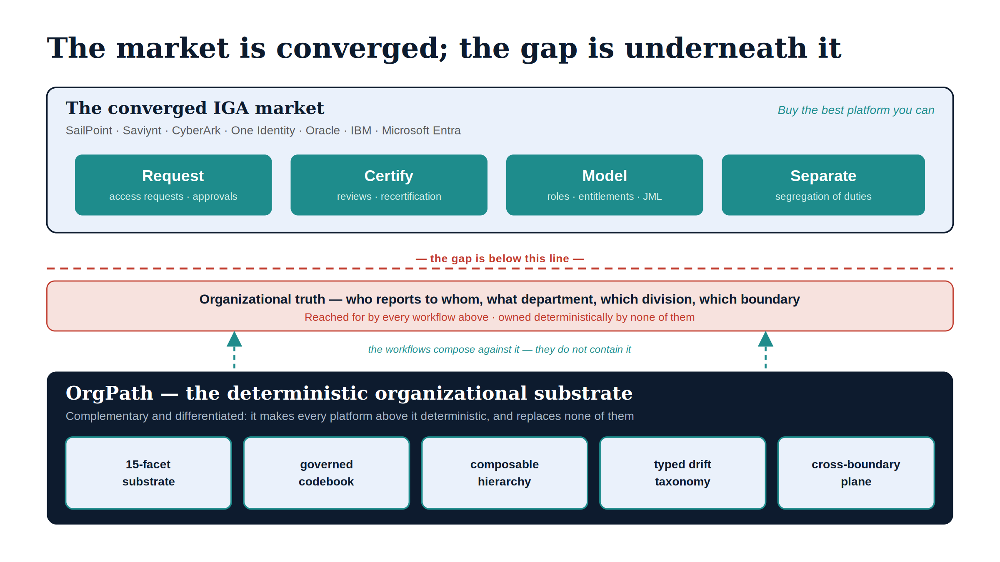

# Chapter 1 — The Market and the Gap

::: {.callout-note}
## In this chapter
The Identity Governance and Administration market is mature and converging on a single primary surface, and any honest positioning of OrgPath has to begin by saying so plainly. This chapter accounts for what the established IGA platforms actually provide, names the one capability that none of them targets as a primary function, and states the thesis the rest of the book defends: OrgPath is not an IGA replacement but a deterministic organizational-addressing substrate that those platforms — and Microsoft's own primitives — compose against rather than contain.
:::

{#fig-book-18-cpt-01-diagram-01 fig-alt="Two stacked bands. The top band, titled 'The converged IGA market' and naming SailPoint, Saviynt, CyberArk, One Identity, Oracle, IBM and Microsoft Entra, holds four teal capability pills: Request, Certify, Model, Separate, annotated 'Buy the best platform you can.' A red dashed line labeled 'the gap is below this line' separates it from a red-tinted strip reading 'Organizational truth, reached for by every workflow above, owned deterministically by none.' Below, a navy band titled 'OrgPath, the deterministic organizational substrate' carries five ice capability chips: 15-facet substrate, governed codebook, composable hierarchy, typed drift taxonomy, cross-boundary plane, with dashed teal arrows rising into the market band labeled 'the workflows compose against it.' Engineering blueprint diagram, white background, navy and teal palette with red gap markers, no human figures, 16:9 landscape." width="100%"}

## The Market That Already Exists

There is a temptation, when introducing a new piece of governance machinery, to invent a gap that the incumbents have left open and then announce that the new thing fills it. This book does not do that, because the Identity Governance and Administration market does not have the kind of gap that marketing usually claims. It is mature, it is well-capitalized, and over the last decade it has converged on a remarkably consistent primary surface.

SailPoint, Saviynt, CyberArk, One Identity, Oracle, IBM, and Microsoft Entra are not interchangeable, but they are aimed at the same set of problems. Each of them offers access requests and approval workflows. Each offers access certifications and recertification campaigns. Each models the joiner, mover, and leaver lifecycle and automates some portion of it. Each carries a role and entitlement model of some kind, and each implements segregation-of-duties controls that flag and prevent toxic access combinations. The more recent product cycles have added two things on top of that shared base: machine-learning recommendations that suggest what access to grant or revoke, and coverage for non-human and agent identities as those proliferate.

> The IGA market is not a set of vendors with different missions. It is a set of vendors converging on the same mission — request, certify, model, separate — and competing on execution, integration breadth, and price.

An organization evaluating that market is choosing among genuinely capable platforms. Whatever else is true, it is not true that the incumbents have neglected access governance. They have spent twenty years building exactly that, and they are good at it.

## What OrgPath Is Not

Because the market is mature, the first thing to say about OrgPath is what it is not. OrgPath is not an access-request engine. It does not run certification campaigns. It does not model roles or entitlements in the IGA sense, and it does not enforce segregation of duties. If an organization needs those capabilities — and most do — it should buy one of the platforms above, or use the one it already owns.

This is not a hedge. It is the load-bearing claim of the whole positioning. OrgPath deliberately does not compete on the converged IGA surface, because competing there would mean reproducing twenty years of someone else's product at a fraction of the maturity, and pretending that a substrate is a workflow engine.

> OrgPath is *complementary and differentiated*. It does not replace the IGA platform; it supplies the canonical organizational substrate the IGA platform's workflows compose against.

The relationship is the one this program already uses elsewhere with ScubaGear: consume the platform's strengths rather than rebuild them, and add the one layer the platform does not provide. The pattern is consistent across UIAO, and it is the honest one. A substrate that tries to become the platform is a worse platform; a substrate that stays a substrate makes every platform on top of it more deterministic.

## The Capability That Is Actually Missing

So if the market is converged and OrgPath is not trying to enter it, what is the gap? It is not on the workflow surface at all. It is underneath it.

Every IGA platform consumes organizational structure, and almost none of them *own* it deterministically. Access requests route to approvers who are "the user's manager" or "the resource owner." Certifications are scoped to "the finance department" or "the engineering org." Roles are modeled against "job function." In each case the platform is reaching for an organizational truth — who reports to whom, what department this is, which division that belongs to — and in each case it is reaching for a truth that lives, vaguely and inconsistently, in a directory attribute, an HR feed, or a manually maintained group.

OrgPath is the deterministic answer to that reach. It is a fifteen-facet, codebook-validated lineage model — region, department, division, role, cost center, classification, and the rest — stamped onto every identity and device, each facet independently enumerated and validated, and continuously reconciled by a typed drift engine so the structure cannot quietly rot. It is not a better access-request engine. It is the canonical organizational substrate that makes every access-request engine's scoping decisions deterministic instead of approximate.

> No platform we surveyed offers a deterministic, per-facet, codebook-validated organizational substrate with a typed drift taxonomy reconciled across federal cloud boundaries. That is the differentiator, stated in one sentence.

## Why Microsoft's Own Primitives Do Not Close It

The natural objection, in a Microsoft-first estate, is that Entra already has the building blocks. Dynamic groups compose membership from attribute rules. Administrative Units scope delegation. Conditional Access and PIM target by group. Entra ID Governance adds access packages and reviews. Surely these compose into the substrate OrgPath claims to provide.

They do not, and the reasons are structural rather than a matter of configuration — which is why this objection deserves its own treatment later in the book. Dynamic group rules compose attributes but do not validate their values against a governed enumeration, so a typo or a retired department name produces a silently wrong group rather than a flagged finding. Administrative Units are flat: they do not nest and they do not inherit, so they cannot express a hierarchy. Entra ID Governance operates at the access-package and review level, not at the level of stamping and reconciling a per-facet organizational identity. And none of these primitives carries a typed drift taxonomy that names which facet, in which slot, on which principal, has diverged — because none of them treats organizational position as a validated, per-facet substrate in the first place.

The point is not that Microsoft is weak. The point is that Microsoft's primitives, like the IGA platforms above them, are *consumers* of organizational structure, not deterministic *owners* of it. The gap is the same gap, and it is below all of them.

## The Thesis of This Book

The conclusion follows directly, and it sets the shape of everything after this chapter. If the IGA market is mature and converged, OrgPath should not try to enter it. If every platform in that market — and Microsoft's own primitives beneath them — reaches for an organizational truth that none of them owns deterministically, then the useful and defensible thing to build is exactly that truth: a deterministic organizational substrate the whole stack composes against.

The rest of this book defends that substrate one capability at a time. There are five capabilities that, taken together, constitute the gap, and no surveyed platform offers them as a primary function. The deterministic fifteen-facet substrate is the foundation. The governed codebook and per-facet enumeration is the validation gate on it. The composable hierarchy with inherited targeting is what the IGA workflows actually consume. The typed five-class drift taxonomy is what keeps the first three from decaying. And the single reconciled cross-boundary plane is the one that Microsoft, specifically, cannot compose at all. Each gets a chapter. The final chapter assembles them into the capability matrix and the deployment sequence for filling the gap without replacing anything an organization already runs.

> The market is real, mature, and worth buying into. The gap is real too, and it is underneath the market. OrgPath fills the gap, not the market. Everything that follows is the defense of that claim, capability by capability.
