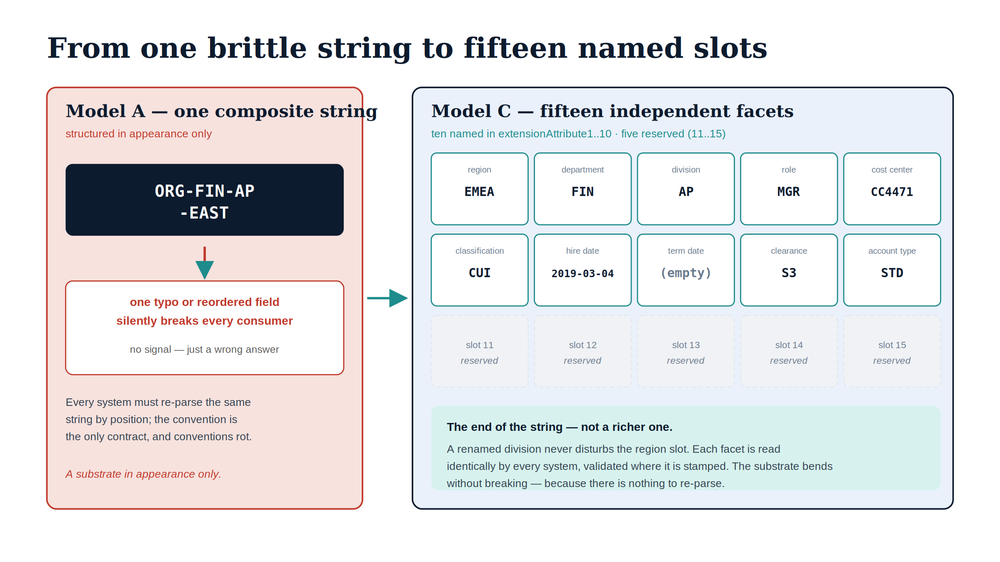

# Chapter 2 — The Deterministic Fifteen-Facet Substrate

::: {.callout-note}
## In this chapter
The first of the five differentiated capabilities is the foundation the other four stand on: a deterministic organizational identity decomposed into fifteen independent facets, each carried by its own attribute slot. This chapter explains why a composite organizational string fails the moment governance needs to reason about one part of it, what the move to a per-facet model buys, and why "deterministic" rather than "inferred" is the property that separates a substrate from a convention. The normative schema is `ADR-078`; the customer-facing specification is the [Codebook reference](/customer-documents/reference-architecture/codebook.html).
:::

{#fig-book-18-cpt-02-diagram-01 fig-alt="Left red-tinted panel 'Model A, one composite string' shows a navy box reading ORG-FIN-AP-EAST with a red arrow to a note 'one typo or reordered field silently breaks every consumer.' A teal arrow crosses to a right panel 'Model C, fifteen independent facets', a five-by-three grid: ten named slots (region EMEA, department FIN, division AP, role MGR, cost center CC4471, classification CUI, hire date 2019-03-04, term date empty, clearance S3, account type STD) carried in extensionAttribute1 to 10, and five dashed reserved slots numbered 11 to 15. A teal caption reads 'The end of the string, not a richer one.' Engineering blueprint diagram, white background, navy and teal palette with a red contrast panel, monospace facet values, no human figures, 16:9 landscape." width="100%"}

## The Problem With a Single String

Organizations have always encoded structure into identity. The familiar form is a composite string — something like `ORG-FIN-AP-EAST`, packing organization, finance, accounts-payable, and an East region into one value, separated by hyphens, parsed by position. It is compact, it is human-readable, and it works right up until governance needs to reason about one part of it without the rest.

The trouble is that a composite string has no parts as far as any system is concerned. It is one opaque value. A dynamic group that wants "everyone in finance, regardless of region" has to match a substring and hope the position convention holds. A drift check that wants to know whether the region is valid has to slice the string at a delimiter and trust that the slicing is correct. A reorganization that renames a division has to find and rewrite every composite string that happens to contain it, in the right position, without disturbing the other segments. The string was never designed to be queried by part, and every consumer that needs a part has to reconstruct one by convention.

> A composite organizational string is a substrate in appearance only. It looks structured, but it is a single value that every consumer must re-parse, and a convention that any typo or position error silently breaks.

## One Facet, One Slot

OrgPath's Model C, defined by ADR-078, replaces the single string with fifteen independent facets, each bound one-to-one to its own attribute slot. Ten of the fifteen are named and canonical: region, department, division, role, cost center, classification, hire date, term date, clearance level, and account type, carried in `onPremisesExtensionAttribute1` through `extensionAttribute10`. Slots eleven through fourteen are reserved for tenant-specific extension, so an organization can add facets without renegotiating the schema; slot fifteen carries the derived canonical OrgPath of the Hybrid-C+Path model (ADR-127) — regenerated from the hierarchy facets, never hand-authored.

The change is small to describe and large in consequence. Each facet now has independent existence. A consumer that cares about region reads the region slot; it does not parse a string and hope. A consumer that cares about department reads the department slot, and the two never interfere. There is no position convention to break, because there is no position — there are named slots, and each one holds exactly one facet's value.

> Model C is not a richer string. It is the end of the string. Fifteen slots, each holding one independently named, independently queryable facet.

This is what the chapters that follow build on. The codebook validates each slot's value against its own enumeration because each slot has its own enumeration. The drift engine names the specific facet and slot that diverged because facets and slots are first-class. The dynamic-group library composes membership from per-facet predicates because the facets are addressable. None of that is possible against a composite string; all of it falls out naturally once the string becomes fifteen slots.

## Deterministic, Not Inferred

The second property of the substrate matters as much as the decomposition, and it is the word *deterministic*. OrgPath does not infer a principal's organizational position from behavior, from group memberships, from sign-in patterns, or from a machine-learning model. It is stamped, from an authoritative source, and it is exact.

This is a deliberate rejection of the inference approach that pervades the broader identity market. Inference is attractive because it appears to require no data hygiene: point a model at the directory and let it guess the org chart. But an inferred organizational position is a probability, and governance cannot be built on a probability. An access decision scoped to "probably finance" is not a control; it is a suggestion. A certification campaign aimed at "the division this user most likely belongs to" is not an attestation; it is a guess wearing an attestation's clothes.

The authoritative source for the named facets is the HR system of record, which is the one place in the organization that actually knows who is in which department under which cost center. OrgPath consumes that truth and stamps it deterministically onto the identity, where every downstream consumer reads the same exact value. The substrate is only as good as its source, which is why the source is named and the binding is governed — but given a good source, the substrate is exact, and exactness is the whole point.

> An inferred org chart is a probability the directory happens to imply. A deterministic substrate is the org chart the organization actually authored, stamped where every system can read it identically. Governance needs the second one.

## Why This Is the Foundation

It is worth being explicit about why this capability comes first among the five. The other four differentiators do not stand on their own. A governed codebook validates the values of facets, which presupposes facets. A typed drift taxonomy reports which facet on which slot diverged, which presupposes per-facet slots. A composable hierarchy targets policy by facet predicate, which presupposes addressable facets. A cross-boundary plane reconciles per-facet values across clouds, which presupposes that the values are per-facet to begin with.

The deterministic fifteen-facet substrate is therefore not merely the first capability; it is the precondition for the rest. An organization that adopts OrgPath adopts this first, stamping the facets from its authoritative source, and the remaining four capabilities become available precisely because the substrate underneath them is decomposed and exact. The next chapter takes up the gate that keeps each facet's values honest: the governed codebook and its per-facet enumeration.
