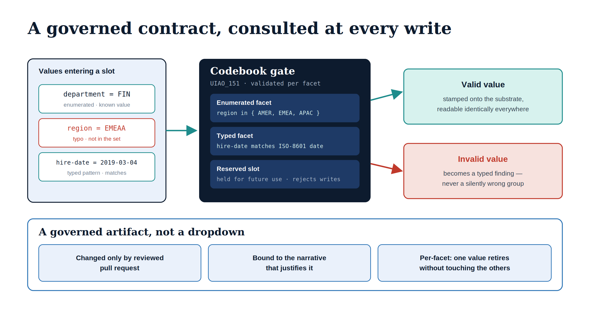

# Chapter 3 — The Governed Codebook and Per-Facet Enumeration

::: {.callout-note}
## In this chapter
A decomposed substrate is only as trustworthy as the values its facets carry, and the second differentiated capability is the gate that keeps those values honest: a governed codebook that validates each facet independently against its own enumeration. This chapter explains the three kinds a facet can take, why validation has to be per-facet rather than whole-value, and why the codebook being a governed artifact — changed by reviewed pull request, not by an administrator's keystroke — is what separates it from a dropdown. The normative binding is `ADR-035`; the customer-facing specification is the [Codebook reference](/customer-documents/reference-architecture/codebook.html).
:::

{#fig-book-18-cpt-03-diagram-01 fig-alt="A value-flow schematic. At left, three values entering a slot: department = FIN (enumerated, known), region = EMEAA (a typo, not in the set, marked red), hire-date = 2019-03-04 (typed pattern, matches). A teal arrow leads into a navy Codebook gate (UIAO_151) listing three facet kinds: Enumerated facet (region in AMER, EMEA, APAC), Typed facet (hire-date matches ISO-8601 date), Reserved slot (rejects writes). Two outputs branch right: a teal box 'Valid value, stamped onto the substrate' and a red box 'Invalid value, becomes a typed finding, never a silently wrong group.' A bottom strip titled 'A governed artifact, not a dropdown' holds three points: changed only by reviewed pull request; bound to the narrative that justifies it; per-facet, one value retires without touching the others. Engineering blueprint diagram, white background, navy and teal palette with red for the invalid path, no human figures, 16:9 landscape." width="100%"}

## The Question a Substrate Must Answer

Once organizational position is decomposed into fifteen independent facets, an obvious question follows for each one: is this value allowed? A region slot holding `EASTUS` is meaningful; a region slot holding `Eastus2-temp` or `east` or a department name pasted into the wrong field is not. The substrate is exact only if each facet's value is checked against what that facet is permitted to hold.

The IGA platforms and Microsoft's primitives mostly do not ask this question of organizational attributes. A dynamic group rule will happily compose membership from `department -eq "Marketng"` — the misspelling produces a group with no members, not an error. An access package scoped to a division consumes whatever string the directory holds, valid or not. The organizational value is trusted because nothing validates it, and untrusted values flow downstream silently, scoping access and certifications against structure that is quietly wrong.

> The failure mode of an unvalidated organizational attribute is not a crash. It is a silently wrong group, a misrouted certification, a control that points at nothing — and no signal that anything is amiss.

## Three Kinds of Facet

OrgPath's codebook answers the question per facet, and it does so by giving each facet a *kind* that determines how its values are validated. There are three.

An **enumerated** facet is constrained to a closed list. Region, department, division, role, cost center, classification, clearance level, and account type are enumerated: each declares the exact set of values it may hold, and any value outside that set is invalid. This is the most common kind, and it is the one that catches typos, retired values, and cross-field paste errors.

A **typed** facet is constrained not by a list but by a shape. Hire date and term date are typed: they must match an ISO-8601 date pattern, and term date additionally permits the empty string, because an active employee has no termination date. A typed facet validates format rather than membership — there is no list of allowed dates, only a list of allowed *shapes*.

A **reserved** facet is one of the five tenant-extension slots that has not yet been given semantics. A reserved facet must be empty; any value on it is itself a finding, because populating a slot before it has been promoted to a real facet means writing data the substrate cannot interpret.

| Facet kind | Validated against | Example facets | A bad value looks like |
| :--- | :--- | :--- | :--- |
| **Enumerated** | A closed list of allowed values | region, department, division, role, clearance | a typo, a retired value, a pasted wrong field |
| **Typed** | A format pattern (and optional empty) | hire_date, term_date | a US-format date where ISO is required |
| **Reserved** | Must be empty until promoted | slots 11–15 | any value at all, before the slot has semantics |

## Why Per-Facet, and Why It Matters

The decisive property is that validation is *per facet*, not against the organizational value as a whole. This is the direct payoff of the decomposition in the previous chapter. Because each facet has its own slot and its own kind, each can be validated independently, and a problem with one facet does not condemn the others.

This independence is what makes the substrate maintainable at scale. When a division is renamed, only the division facet's enumeration changes; the region, department, and role facets are untouched, and the validation of those facets continues uninterrupted. When a new clearance level is introduced, it is added to the clearance facet's enumeration alone. A deprecated value can be retired in one facet with a recorded successor, and principals still carrying it are flagged for reassignment facet-by-facet — without a coordinated rewrite across every other facet they hold. Per-facet validation turns governance from an all-or-nothing rewrite into a series of small, independent, reviewable changes.

> Per-facet validation means a renamed division never disturbs the region check, a new clearance level never touches the department list, and a retired value is replaced one facet at a time. The substrate bends without breaking.

## A Governed Artifact, Not a Dropdown

The last and most important property of the codebook is that it is *governed*. The enumerations and facet kinds are not configuration an administrator edits in a console. They live in a single source-of-truth document, and they change only through a reviewed pull request — the same way code changes. Adding a value to a facet's enumeration, retiring one, or promoting a reserved slot to a real facet is a change to canon, recorded, reviewed, and bound to the narrative that explains it.

This is what distinguishes the codebook from the dropdown lists every directory and IGA platform already has. A dropdown is editable by whoever holds the console; its history is whatever the audit log happened to capture; its meaning is implicit. The codebook is editable only by the governance process; its history is the commit history; and ADR-035 binds the machine-readable codebook to the human-readable narrative so the two cannot drift apart. When an auditor asks why a value is allowed, the answer is a reviewed change with a recorded rationale, not "someone added it."

The validation has reach beyond the stored values, too. The same codebook that checks a stamped facet value also checks values before they are written into a dynamic group rule, so an invalid value is caught at the moment a rule is constructed rather than after it has produced an empty group. The codebook is the one gate, consulted everywhere a facet value enters the system.

> The codebook is not a list of choices. It is a governed contract: what each facet may hold, changed only by reviewed pull request, bound to the narrative that justifies it, and consulted at every point a value enters the substrate.

The next chapter turns from the values to the shape they describe: how the validated facets compose into a hierarchy, and how that hierarchy is what the IGA workflows and Microsoft's own primitives actually target.
