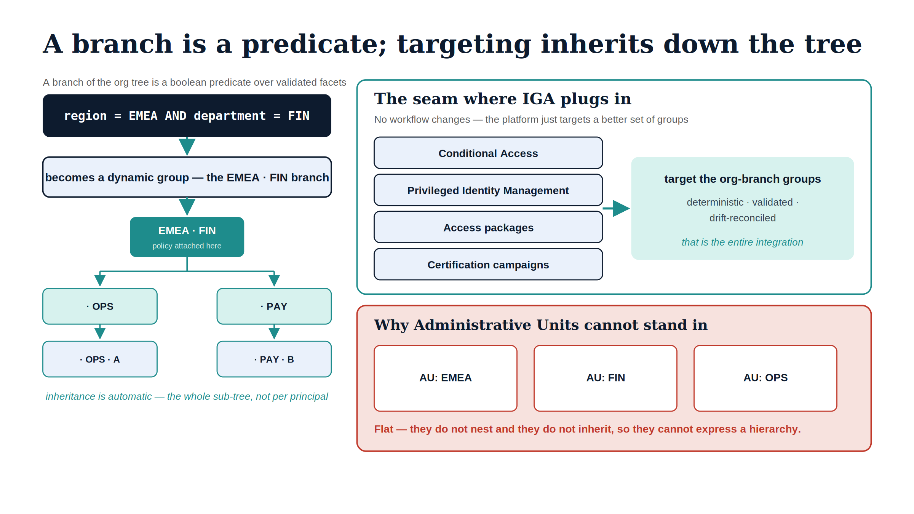

# Chapter 4 — Composable Hierarchy and Inherited Targeting

::: {.callout-note}
## In this chapter
The third differentiated capability is the one the rest of the stack actually consumes: a composable organizational hierarchy that policy can target and inherit down. This chapter shows how a hierarchy expressed as boolean composition of validated facet predicates avoids the brittleness of path-position parsing, why this is the seam where an existing IGA platform plugs in without being replaced, and why Administrative Units — Microsoft's nearest primitive — cannot stand in. The normative contracts are `ADR-036` and `ADR-062`; the customer-facing specification is the [Dynamic Group Library](/customer-documents/reference-architecture/dynamic-groups.html).
:::

{#fig-book-18-cpt-04-diagram-01 fig-alt="Left column: a navy box reading region = EMEA AND department = FIN flows down to 'becomes a dynamic group, the EMEA FIN branch', then into a small inheritance tree where a teal root 'EMEA FIN (policy attached here)' branches to children OPS and PAY and grandchildren OPS A and PAY B, captioned 'inheritance is automatic, the whole sub-tree, not per principal.' Top-right panel 'The seam where IGA plugs in' lists Conditional Access, Privileged Identity Management, Access packages and Certification campaigns, with a teal arrow to 'target the org-branch groups, deterministic, validated, drift-reconciled, that is the entire integration.' Bottom-right red panel 'Why Administrative Units cannot stand in' shows three flat boxes AU EMEA, AU FIN, AU OPS over the line 'Flat, they do not nest and they do not inherit, so they cannot express a hierarchy.' Engineering blueprint diagram, white background, navy and teal palette with a red contrast panel, no human figures, 16:9 landscape." width="90%"}

## Hierarchy Without a Path

An organization is a tree. Engineering contains Platform and Infrastructure; Platform contains several teams; a person belongs to a team, which belongs to a division, which belongs to a department. Governance constantly needs to address this tree by branch — "everyone in Engineering," "everyone in the Platform division," "this specific team" — and the addressing has to be reliable, because access decisions ride on it.

The decomposition from the earlier chapters makes a particular kind of addressing possible, and it is worth being precise about it because it is subtly different from how hierarchies are usually encoded. OrgPath does not express the tree as a path that gets parsed by position. It expresses a branch as a *boolean composition of facet predicates*. "Everyone in the Platform division of IT" is not a substring match on a path; it is the conjunction `(department -eq "IT") and (division -eq "Platform")`. A node deeper in the tree adds another conjunct; a whole branch is the predicate that names it.

> A branch of the org tree is not a path to be parsed. It is a boolean predicate over validated facets — and because the facets are validated, the predicate cannot reference a value the codebook does not know.

This is what ADR-062's depth extension is about: the model supports meaningful organizational depth — eight hierarchy levels rather than four — not by lengthening a delimited string but by composing more facet predicates. The hierarchy is as deep as the facets allow, and each level is an independently validated facet, so a deep branch is a longer conjunction of values that are each known to be real.

## Inheritance Is the Point

Expressing a branch as a predicate would be a curiosity if it stopped there. What makes it a capability is *inheritance*: policy attached to a branch automatically reaches everything beneath it, because the predicate that names the branch matches every principal in it.

A configuration profile assigned to the group defined by `(department -eq "IT")` reaches every team in IT, every division, every person — because every one of them satisfies the predicate. A more specific policy attached to `(department -eq "IT") and (division -eq "Platform")` reaches only the Platform sub-tree. The two coexist: the broad policy inherits down the whole department, the narrow one scopes to the division, and a principal in Platform is correctly in scope for both. Inheritance is not a feature bolted on; it is what falls out of targeting by predicate over a decomposed substrate.

> Attach policy to a branch predicate and it inherits to the whole sub-tree automatically. Inheritance is not configured per principal; it is the natural consequence of a group defined by an organizational predicate.

## The Seam Where IGA Plugs In

This is the chapter to be most explicit about the complementary positioning, because the composable hierarchy is the exact seam where an organization's existing IGA platform connects to OrgPath without being replaced.

OrgPath renders its branch and node predicates into a library of dynamic groups — a branch group for each meaningful sub-tree, a node group for each specific position. These groups are ordinary Entra groups; there is nothing proprietary about them. And ordinary Entra groups are precisely what every consumer in the stack already targets. Conditional Access targets groups. PIM eligibility targets groups. Intune assignment filters target groups. Access packages and access reviews target groups. An IGA platform's certification campaigns and request workflows scope to groups.

So the integration requires no rebuild of the IGA platform. The platform keeps doing what it does well — requests, certifications, lifecycle, segregation of duties — and it simply points those workflows at the OrgPath-generated groups instead of at hand-maintained ones. The difference is that the groups it now targets are deterministic, codebook-validated, and reconciled against drift, rather than approximate and manually curated. The workflows are unchanged; the substrate beneath their scoping is replaced with something exact.

> OrgPath does not ask the IGA platform to change its workflows. It asks them to target a better set of groups — deterministic, validated, drift-reconciled — and that is the entire integration.

## Why Administrative Units Cannot Stand In

The Microsoft-native objection here is specific: Entra Administrative Units already scope delegation, so why not express the hierarchy as AUs? The answer is a hard structural limit, and it is the reason this capability cannot be composed from Microsoft's primitives.

Administrative Units are flat. They do not nest, and they do not inherit. An AU for Engineering and an AU for the Platform team are two unrelated containers; the second is not *inside* the first, and a delegation granted on Engineering does not flow to Platform. There is no parent-child relationship to ride, because the primitive has no notion of parent and child. Whatever organizational tree an estate has, Administrative Units can represent only a single flat layer of it at a time, with no inheritance between layers.

A real hierarchy with inheritance therefore cannot be built out of Administrative Units, no matter how they are arranged, because the one property that makes a hierarchy useful — that a parent's policy reaches its children — is the one property AUs do not have. OrgPath supplies that property at the substrate level, expressing depth as composed predicates and inheritance as predicate matching, and then renders the result into the flat groups the rest of the stack can consume. The hierarchy lives in the substrate; the flat artifacts it produces are what Microsoft's primitives were always able to target.

> Administrative Units are a single flat layer with no nesting and no inheritance. A hierarchy needs both. The hierarchy lives in OrgPath's composed predicates; what Entra consumes is the flat group library OrgPath renders from it.

The next chapter takes up the capability that keeps all of this from decaying over time: the typed drift taxonomy that detects, names, and ranks every way a facet, a value, or a group rule can diverge from canon.
