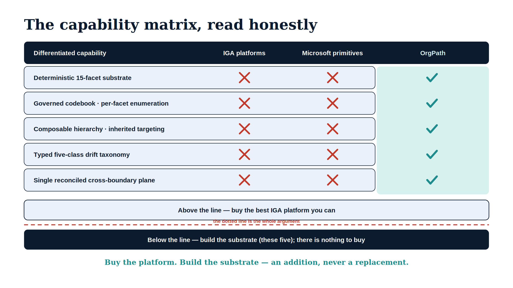

# Chapter 7 — The Capability Matrix and How to Fill the Gap

::: {.callout-note}
## In this chapter
This closing chapter assembles the five differentiators into the capability matrix that shows, row by row, who owns what across the IGA platforms and OrgPath — and then turns the matrix into a plan. It lays out the sequence for filling the gap that consumes an organization's existing platforms rather than replacing them, and it restates, one last time, why the correct move is not to buy another IGA tool but to deploy a substrate beneath the one already in place. This is the synthesis of the book; the normative contracts are the ADRs cited throughout, and the operator path is the [OrgPath Implementation Guides](../operational-guides/orgpath-implementation/index.qmd).
:::

{#fig-book-18-cpt-07-diagram-01 fig-alt="A matrix with a navy header row (Differentiated capability, IGA platforms, Microsoft primitives, OrgPath) over five rows: Deterministic 15-facet substrate; Governed codebook, per-facet enumeration; Composable hierarchy, inherited targeting; Typed five-class drift taxonomy; Single reconciled cross-boundary plane. Every IGA-platforms and Microsoft-primitives cell carries a red X; every OrgPath cell, in a highlighted teal column, carries a teal check. Below the matrix, an ice band 'Above the line, buy the best IGA platform you can' sits over a red dashed line ('the dotted line is the whole argument') and a navy band 'Below the line, build the substrate (these five), there is nothing to buy', closing with 'Buy the platform. Build the substrate, an addition, never a replacement.' Engineering blueprint diagram, white background, navy and teal palette with red X marks, no human figures, 16:9 landscape." width="100%"}

## The Matrix, Read Honestly

The point of a capability matrix is usually to make a product look good by choosing the rows carefully. This one is built the other way around: it grants the IGA platforms every row they genuinely own, and confines OrgPath to the rows none of them targets. The two halves complement; they do not compete.

The top band is the converged IGA surface from Chapter 1. Across it, the established platforms — SailPoint, Saviynt, CyberArk, One Identity, Oracle, IBM Verify, and Microsoft Entra — are primary owners. This is their market, and the matrix says so.

| Capability (IGA surface) | Who owns it |
| :--- | :--- |
| Access certifications and reviews | The IGA platforms — native |
| Joiner/mover/leaver lifecycle | The IGA platforms — native |
| Role and entitlement modeling and mining | The IGA platforms — native |
| Access requests and AI recommendations | The IGA platforms — native |
| Non-human and agent identity coverage | The IGA platforms — native |
| Segregation-of-duties enforcement | The IGA platforms — native |

The bottom band is the substrate this book has defended. Across it, no surveyed platform — including Entra, and including any composition of Microsoft's own primitives — offers the capability as a primary function. These five rows are the gap.

| Capability (the substrate gap) | Who owns it |
| :--- | :--- |
| Deterministic fifteen-facet organizational substrate | **OrgPath — uniquely** |
| Codebook-validated per-facet enumeration | **OrgPath — uniquely** |
| Composable org hierarchy with inheritance — two layers: governance facets composed by boolean predicate, plus a derived OrgPath whose delimiter-terminated prefixes give subtree inheritance ([ADR-127](../../adr/adr-127-orgpath-hybrid-derived-path.qmd)) | **OrgPath — uniquely** |
| Typed five-class drift taxonomy | **OrgPath — uniquely** |
| Single reconciled cross-boundary plane | **OrgPath — uniquely** |

> The dotted line between the two bands is the whole argument. Above it, buy the best platform you can. Below it, there is nothing to buy — and that is the gap OrgPath fills.

## The Move Is Not Another IGA Tool

The instinct, faced with a governance shortcoming, is to look for a product that closes it, and the IGA market is where one would look. The matrix says why that instinct fails here: every vendor in the top band leaves the bottom five rows blank. Buying a second IGA platform, or switching to a different one, does not move the dotted line, because the gap is not on the IGA surface at all. It is underneath it.

The correct move is the ScubaGear pattern this program uses throughout: consume the platform's strengths rather than rebuild them, and add the one layer the platform does not provide. An organization keeps the IGA platform it has — keeps its certifications, its requests, its lifecycle automation, its segregation-of-duties controls — and deploys OrgPath *beneath* that platform as the substrate its workflows compose against. Nothing in the top band is replaced. Something is added below it, and the workflows above inherit a deterministic foundation they previously approximated.

> Filling the gap is not a purchase decision on the IGA surface. It is a substrate decision below it. Keep the platform; give it a better foundation to stand on.

## The Sequence for Filling It

The five capabilities are not five independent projects. They are one substrate, deployed in an order where each step enables the next.

**First, define the codebook.** Establish the facets and their enumerations as a governed artifact — the foundation from Chapters 2 and 3. This is where the organization decides which facets it carries and what values each may hold, and it is a governance exercise before it is a technical one.

**Second, stamp the substrate.** Write the validated facet values onto identities and devices from the authoritative source — HR for the named facets — through the boundary-correct transports. After this step the organization's structure exists as exact, per-facet, validated data where every system can read it.

**Third, generate the dynamic groups, and point existing workflows at them.** Render the branch and node predicates into the group library from Chapter 4, then retarget the IGA platform's certifications, the Conditional Access policies, the PIM eligibilities, and the access packages at those groups. This is the seam, and it is deliberately undramatic: the workflows do not change, only the groups they target.

**Fourth, turn on the drift loop.** Run the reconciliation engine from Chapter 5 in dry-run first, with halt-on-critical engaged, and watch the read-only console. Promote it to remediation only once the organization trusts what it reports. Detection is on from day one; action is opt-in.

**Fifth, extend across boundaries.** Register each cloud boundary, anchor its trust root, and let the one engine reconcile the substrate across Commercial, GCC-Moderate, GCC-High, and DoD as the single plane of Chapter 6.

| Step | What it delivers | Capability it turns on |
| :--- | :--- | :--- |
| 1. Define the codebook | Governed facets and enumerations | Per-facet validation |
| 2. Stamp the substrate | Exact facet values on every principal | The deterministic substrate |
| 3. Generate groups, retarget workflows | The integration seam with existing IGA | Composable hierarchy, inheritance |
| 4. Turn on the drift loop | Continuous, safe reconciliation | The typed drift taxonomy |
| 5. Extend across boundaries | One org truth in every federal cloud | The cross-boundary plane |

## Where the Book Lands

This series began, many books ago, with an honest accounting of what Microsoft's identity stack provides and what a governance substrate must contain. This book applied that same honesty to the wider market. The Identity Governance and Administration platforms are mature, capable, and worth buying; they are not the thing OrgPath competes with. What none of them owns — and what Microsoft's own primitives cannot be composed into — is a deterministic, per-facet, codebook-validated organizational substrate, with a typed drift taxonomy, reconciled across federal cloud boundaries as one plane. That sentence is the gap, and each of its clauses earned a chapter.

The way to fill it is not to shop the IGA market harder. It is to deploy the substrate beneath whatever platform an organization already runs, in the five-step sequence above, consuming every strength of the layers above and adding the one layer none of them targets. That is the ScubaGear pattern, applied to organizational structure itself, and it is the position this book has defended from the first page.

> Buy the platform. Build the substrate. The platform runs the workflows; the substrate makes them deterministic. The gap is real, it is below the market, and filling it is an addition — never a replacement.

For the command-by-command path from an empty tenant to facets landing on managed devices and a drift loop running, continue to the [OrgPath Implementation Guides](../operational-guides/orgpath-implementation/index.qmd). For the normative substrate contracts, the [reference architecture](../reference-architecture/index.qmd) and the Architecture Decision Records remain the binding record.

::: {.callout-tip}
## End of Book 18

[← Book 18 cover](Book_18.qmd) · [OrgPath series index](index.qmd)
:::
