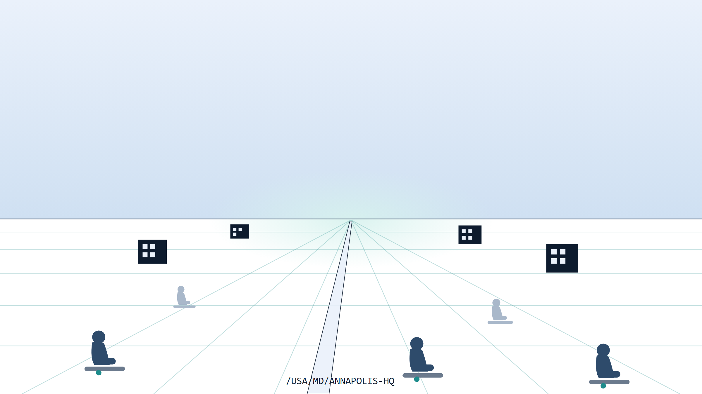

::: {.content-visible when-format="docx"}
# Book_19 — Where People Sit: LocPath and the Place Axis
:::

::: {.callout-note}
The place axis. Active Directory's Sites and Services was the one canonical statement of *where things are* that the whole estate agreed on — it drove domain-controller affinity, replication topology, site-linked Group Policy, and DFS referrals, and it retires with the domain. Nothing inherits the job, and place data fragments into ungoverned copies in HR, facilities, the SD-WAN controller, and the UCaaS emergency-address table just as E911 dispatchable-location rules, TIC 3.0 Direct Internet Access, and the EIS/SD-WAN transition make governed location load-bearing. This book rebuilds the place axis as **LocPath**: a second canonical addressing dimension beside OrgPath — deliberately *not* a sixteenth facet, claiming no extension-attribute slot — with HR duty station as the truth source, a two-layer governed-versus-observed model, Site-level policy classification, a location Mover, three location drift classes, and Entra exposure that works with zero attribute stamping. It tells the *why* and the journey; the normative contract is [ADR-102](/docs/adr/adr-102-locpath-location-addressing.html), the operator reference is the [LocPath Codebook (UIAO_194)](/docs/canon/UIAO_194_LocPath_Codebook.html), and the one-page summary is the [reference-architecture page](../reference-architecture/locpath.qmd).
:::

::: {.callout-tip}
## Download this book
**[Book_19-bundle.docx](https://github.com/WhalerMike/uiao/releases/download/downloads-latest/orgpath-narrative-Book_19-bundle.docx)** — every chapter of this book concatenated into one Word document. Regenerated on every site deploy.
:::

{#fig-book-19-image-01 fig-alt="Illustrative cover scene on a white background. A pale blue sky gradient meets a horizon at mid-canvas with a soft luminous glow at the vanishing point. From the horizon, a governed grid of thin teal lines recedes across the ground plane, with receding horizontal grid lines growing fainter with distance. A pale path runs from the foreground to the vanishing point, etched with the monospace text /USA/MD/ANNAPOLIS-HQ. Small navy building pictograms with pale windows stand at grid intersections in the middle distance. Three deep slate-blue seated human silhouettes — circle heads, rounded bodies, on simple grey benches — occupy foreground grid points, each above a small teal anchor dot; two lighter muted silhouettes sit farther back. The idea: people sit at governed points on a place grid." width="100%"}

## Chapters

::: {#book-chapters}
:::

::: {.callout-tip}
## Continue the series

[← Previous: Book 18 — OrgPath and the IGA Market](Book_18.qmd) · [Index](index.qmd)
:::
