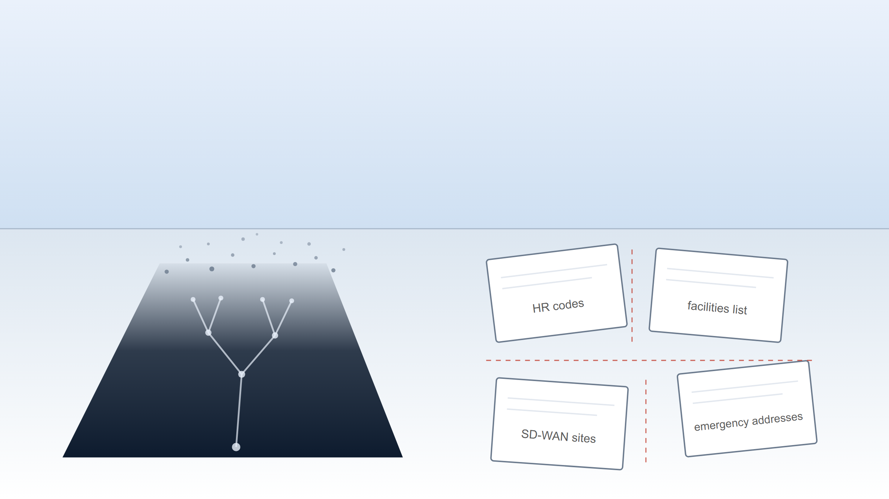
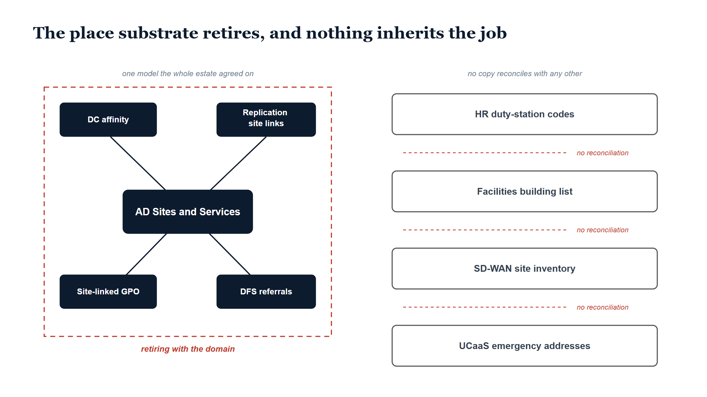

# Chapter 1 — The Place Nobody Governs

::: {.callout-note}
## In this chapter
For as long as the domain has existed, Active Directory has quietly carried the enterprise's model of *place*. Sites and Services bound subnets to sites, and that one binding drove domain-controller affinity, replication topology, site-linked Group Policy, and DFS referral ordering — the whole estate agreed, machine by machine, on where things were. Administrators never treated it as a governance surface, because it presented itself as plumbing. Entra ID has no sites, so when the domain retires, the place model retires with it, and nothing inherits the job: place data fragments into the HR system's duty-station codes, the facilities office's building list, the SD-WAN controller's site inventory, the UCaaS platform's hand-maintained emergency addresses, and ad-hoc spreadsheets — none reconciling with any other, no drift detector watching. This chapter names that loss and sets the thesis the rest of the book develops: the place axis must be rebuilt as a governed, canonical, drift-detected dimension — LocPath.
:::

{#fig-book-19-cpt-01-image-01 fig-alt="Illustrative widescreen scene on a white background. A pale blue sky gradient meets a low horizon. On the left, a large dark navy floor map lies in perspective on the ground, etched with a faint light-blue site tree of nodes and branches; toward the horizon the map's far edge fades out and breaks apart into scattered small grey dots. On the right, four white paper sheets with grey outlines drift at slight rotations, each ruled with faint lines and carrying one small grey label: HR codes, facilities list, SD-WAN sites, and emergency addresses. Thin red dashed lines run through the gaps separating the sheets, marking that no copy reconciles with any other. No people and no other text appear." width="100%"}

## The Model Nobody Called a Model

Every Active Directory estate has carried, usually since the week the forest was stood up, a precise and machine-readable answer to a question most organizations would struggle to answer any other way: *where are things?* The answer lived in Active Directory Sites and Services. An administrator defined sites — the headquarters campus, the regional offices, the data center — and bound subnets to them. That binding was the whole mechanism. Once a subnet belonged to a site, any machine on that subnet could be placed: its IP address resolved to a subnet, the subnet resolved to a site, and the site was a statement, made once and consumed everywhere, about where in the physical world that machine sat.

What consumed it is the part worth dwelling on, because the consumers were not exotic. They were the daily mechanics of the domain. Domain-controller affinity came first: a client authenticating against the domain did not pick a domain controller at random from across the enterprise — it was steered toward a domain controller in its own site, so that a workstation in a regional office authenticated against the regional domain controller rather than hauling its logon traffic across the country. Replication topology came second: site links described which sites could reach which, and on what schedule, and directory replication flowed along those links rather than along whatever paths a naive mesh would have chosen. Group Policy came third: policy objects could be linked to sites, so that configuration could be scoped not just to an organizational unit but to a *place* — every machine at this location gets this policy, whoever it belongs to organizationally. And DFS referrals came fourth: when a client asked for a namespace target, the referral list was ordered by site, so the client reached for the nearest file server first instead of mounting a share across a continent.

Four consumers, one binding. The subnet-to-site mapping was a single canonical model of place, and the estate did not merely store it — the estate *behaved according to it*, every hour of every day, in authentication, in replication, in policy, and in file access.

> Sites and Services was the one canonical statement of "where things are" that the whole estate agreed on — and almost nobody who maintained it would have described it that way.

{#fig-book-19-cpt-01-diagram-01 fig-alt="Engineering blueprint diagram on a white background, 16:9 landscape, no human figures. Georgia-serif navy title across the top reads The place substrate retires, and nothing inherits the job. The left half shows a solid navy rounded rectangle labeled AD Sites and Services as a central hub, connected by navy lines to four navy spoke boxes labeled DC affinity, Replication site links, Site-linked GPO, and DFS referrals. Hub and spokes sit inside a red dashed rectangular boundary captioned in red italic retiring with the domain, with a small grey caption above reading one model the whole estate agreed on. The right half stacks four separate white rectangles with grey outlines labeled HR duty-station codes, Facilities building list, SD-WAN site inventory, and UCaaS emergency addresses, with a grey caption above reading no copy reconciles with any other. In each of the three gaps between the stacked boxes a thin red dashed horizontal line carries the red label no reconciliation." width="100%"}

## Plumbing, Not Governance

It is worth being honest about how this model was regarded, because the regard is the reason the loss goes unnoticed. Sites and Services was configured early in the life of the forest, usually by whoever built it, and touched afterward only when the network changed — a new office, a new subnet, a circuit redesign. It did not appear in governance reviews. It had no change-advisory ceremony, no data steward, no owner in the sense that an application has an owner. It was infrastructure, in the dismissive sense of the word: the thing underneath the things people actually thought about.

And yet, considered coldly, it had the properties that governance surfaces aspire to and rarely achieve. It was canonical — there was exactly one of it, and no rival model of place existed inside the estate that could contradict it. It was machine-readable, which meant its consumers did not interpret it; they obeyed it. And it stayed roughly true, not because anyone audited it, but because so much load-bearing behavior depended on it that error announced itself: a subnet bound to the wrong site sent clients to far-away domain controllers and file servers, and the resulting complaints pulled the mapping back toward reality. The model was kept honest by consequence rather than by review — which is a fragile kind of honesty, but a real one.

The administrators who maintained it were, in effect, running a governed location registry without ever using those words. The vocabulary of governance — source of truth, reconciliation, drift — was never applied, because nothing ever drifted far enough to need the vocabulary. There was nothing to reconcile *against*. The model was alone, and being alone, it was definitionally consistent.

## What Retires When the Domain Retires

An Entra-first modernization sets out to retire the on-premises domain, and this book — like the books before it — takes that destination as correct. The domain controllers go; devices join Entra ID rather than the domain; identity moves to the cloud. Nothing in what follows argues for keeping Active Directory alive.

But Entra ID has no sites. There is no subnet-to-site binding in the cloud directory, no site object, no equivalent surface where the enterprise states, once and canonically, where its things are. The omission is not an oversight to be fixed by a feature request; the cloud directory simply was not built around physical topology the way a directory serving LAN-era authentication and replication had to be. And so when the domain retires, the place model retires with it — not because anyone decided to retire it, but because it lived inside the thing being decommissioned. Domain-controller affinity stops mattering when there are no domain controllers; replication site links stop mattering when there is no directory replication; site-linked policy and site-ordered referrals dissolve along with the services that consulted them.

Readers of the earlier books in this series will recognize the shape of this event. The migration plan is written in terms of identities, devices, and applications, because those are the things the plan is *about*. The place model is a side effect's side effect: it was maintained as plumbing, so it appears in no inventory of governance surfaces, so no line item in the migration plan says "place model — disposition." The estate loses its only canonical statement of where things are, and the loss does not appear on any decommissioning checklist, because the thing being lost was never written down as a thing.

> Nothing inherits the job. That is the precise statement of the problem: not that the place model is destroyed, but that it is orphaned — the consumers retire, the binding retires, and no successor surface is designated, because no one ever named the surface in the first place.

## The Fragments

What happens next is not that the enterprise stops having location data. It is that the enterprise stops having *one* location data. Place information is too operationally necessary to disappear; instead it re-forms wherever a team needs it, in whatever shape that team's tooling prefers, and the canonical model is replaced by four or five local ones.

The HR system carries a duty-station code on every person — a location, of a kind, attached to the workforce record because employment law and payroll need it. The facilities office keeps a building list, because someone has to know what buildings the organization occupies. The network team keeps a site inventory inside the SD-WAN controller, because the controller cannot route traffic without a model of the sites it connects. The UCaaS platform keeps emergency addresses, hand-maintained, because calls have to carry a location and somebody once typed those addresses in. And around the edges, ad-hoc spreadsheets accumulate — the floor plan someone exported, the office list a project team built and never deleted.

Each copy is locally adequate. The HR code serves payroll; the building list serves leases; the site inventory serves routing; the emergency addresses serve calling. None of them was created to be a model of place for the enterprise, and none of them answers to any of the others. There is no reconciliation pass that compares the HR duty station against the facilities building list, no process that notices when the SD-WAN controller knows about a site the UCaaS platform has never heard of, no detector that fires when an emergency address goes stale because an office moved. The copies are not merely separate; they are *unwatched*. They drift apart silently, and the silence is the defining property — in the Sites and Services era, error announced itself through slow logons and misrouted traffic, but a wrong duty-station code and a stale emergency address announce nothing at all until the day something depends on them being right.

This is the place nobody governs. Not an absence of data — an absence of canon, reconciliation, and drift detection over data that exists five times.

## The Thesis of This Book

The conclusion this series has reached once before applies again, on a different axis. When this program confronted the loss of the organizational substrate — the org structure that Active Directory had implicitly carried — the answer was not to mourn the directory but to rebuild the axis properly: OrgPath, a governed, canonical, hierarchical statement of where every identity sits organizationally, with drift detection watching the places where copies could diverge. Readers of the earlier books know that story, and this book asks them to carry exactly one sentence of it forward: what OrgPath did for the organizational axis, something must now do for the physical one.

That something is LocPath. The place axis must be rebuilt as a governed, canonical, drift-detected dimension — a hierarchical path from country down through region, site, building, floor, and space, held in a governed registry, assigned to identities from an authoritative source, and reconciled against the fragments instead of ignored by them. Where the AD-era model was kept honest by consequence, LocPath is kept honest by governance: the registry is the canon, the copies become consumers or feeds, and divergence becomes a drift finding rather than a silent fact.

The chapters that follow build that dimension out: what the hierarchy is and why the site is its minimum governance unit, where the authoritative sources sit, how the governed assignment relates to observed position, and what the fragments — HR, facilities, network, UCaaS — look like once they are reconciled against a canon instead of drifting alone. This opening chapter sets only the loss and the obligation.

> Active Directory carried the place model as plumbing, and the modernization retires it as a side effect. LocPath rebuilds it as governance — one canonical, drift-detected statement of where things are, owned on purpose this time. Everything that follows is the engineering of that statement.
