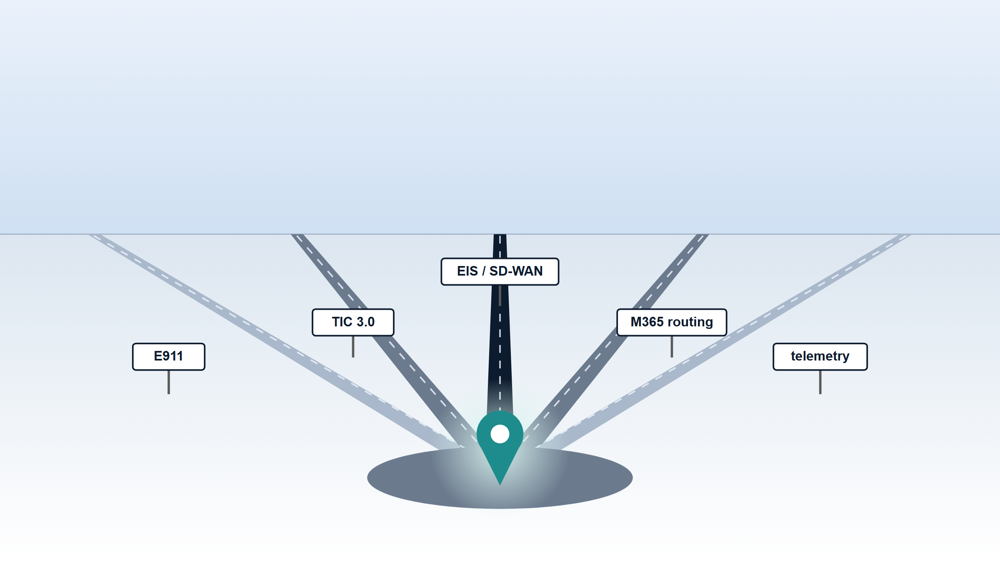
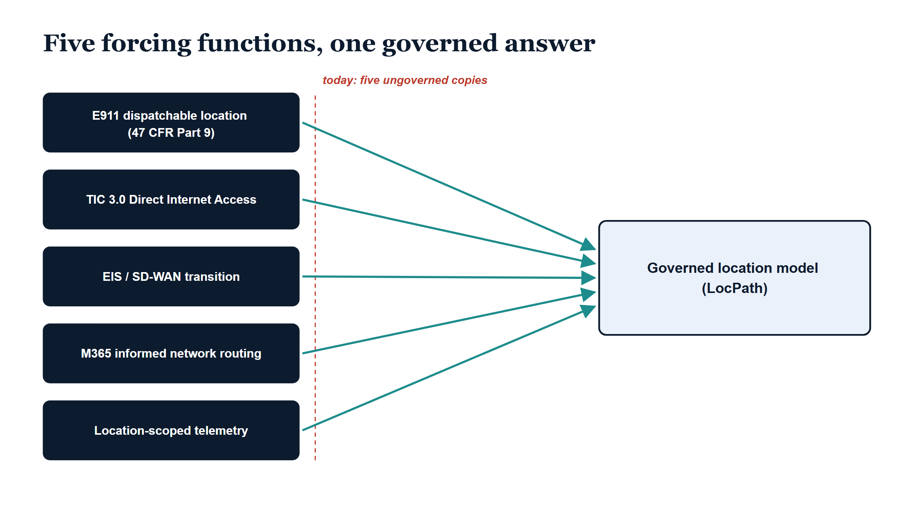

# Chapter 2 — The Forcing Functions

::: {.callout-note}
## In this chapter
Ungoverned place data was tolerable for years. Every enterprise carried four or five uncoordinated copies of "where things are" — an HR duty-station string, a facilities building list, a network site inventory, a hand-maintained emergency-address table — and nothing forced them to agree, because nothing important read them. This chapter explains what changed. Five independent obligations have arrived, each from a different direction — E911 dispatchable location, TIC 3.0 Direct Internet Access, the EIS and SD-WAN transition, Microsoft 365 network path optimization, and location-scoped telemetry governance — and each one demands a governed, auditable answer that the fragmented copies cannot give. The chapter walks each forcing function in turn and closes on the observation that all five are asking for exactly the same thing.
:::

{#fig-book-19-cpt-02-image-01 fig-alt="Illustrative widescreen scene on a white background. A pale blue sky gradient sits above a low horizon. Five straight roads, drawn in greys and dark navy with faint dashed center lines, run in perspective from five separate points on the horizon and converge on a single junction in the foreground. Each road carries a small white roadside signpost with a navy border and a navy label: E911, TIC 3.0, EIS / SD-WAN, M365 routing, and telemetry. At the junction stands the only colored element, a teal map-pin waypoint marker with a white center, surrounded by a soft pale-teal glow halo on the grey junction pad. No people appear, and no text appears beyond the five signpost labels." width="100%"}

## The Mess Was Tolerable

It is worth being honest about why place data was allowed to fragment in the first place: for most of the client-server era, nothing of consequence depended on it being right.

The HR system carried a duty-station code on every person, because payroll and locality rules needed one. The facilities office kept a building list, because leases and floor plans needed one. The network team kept a site inventory, because circuits terminate somewhere. The telephony platform kept an emergency-address table, because someone filled in a form when the PBX was installed. Each copy was maintained by the team that needed it, to the standard that team needed, on the schedule that team could afford. None of the copies was canonical. None was hierarchical — a duty-station string is not a tree, and a circuit inventory does not know about floors. None was drift-detected: when the facilities office renamed a building, or a team moved across a campus, or a site closed, no mechanism noticed that the other four copies were now wrong. They simply drifted apart, silently, and the cost of the drift was an occasional confused conversation.

That arrangement was not negligence. It was a reasonable response to the actual stakes. When the worst consequence of a stale site record is a misdelivered package or a mislabeled monitoring dashboard, no rational organization builds a governance apparatus around it. The mess persisted because the mess was cheap.

{#fig-book-19-cpt-02-diagram-01 fig-alt="Engineering blueprint diagram on a white background, 16:9 landscape, no human figures. The serif navy title reads Five forcing functions, one governed answer. Down the left side five solid navy rounded rectangles with bold white labels are stacked vertically: E911 dispatchable location with a second line reading 47 CFR Part 9 in parentheses, then TIC 3.0 Direct Internet Access, then EIS / SD-WAN transition, then M365 informed network routing, then Location-scoped telemetry. From each navy box a teal arrow runs rightward, the five arrows converging on the left edge of one large ice-blue rounded rectangle with a navy border on the right, labeled in bold navy text Governed location model with a second line reading LocPath in parentheses. Just right of the navy boxes a red dashed vertical line spans the arrow origins, with a red italic annotation above it reading today: five ungoverned copies." width="100%"}

> What changed is not the mess. The mess is the same mess it has been for twenty years. What changed is that five separate obligations arrived — regulatory, programmatic, architectural — and every one of them needs a governed answer to a question the mess cannot answer.

The rest of this chapter takes the five in turn. They share no common origin: one is telecommunications law, one is a federal security architecture, one is a contract-vehicle migration, one is a vendor's network-optimization machinery, and one is a property of operating inside a constrained compliance boundary. That independence is the point. If a single program were demanding governed location data, an organization could satisfy it with a single program-specific list — a sixth copy. Five independent demands make the sixth-copy strategy untenable.

## The Call That Must Carry a Room Number

The first forcing function is the oldest kind there is: a statute with a life-safety rationale behind it.

Two pieces of federal law now bear directly on how an enterprise telephone system handles an emergency call, and both are implemented in [47 CFR Part 9](https://www.ecfr.gov/current/title-47/chapter-I/subchapter-A/part-9). Kari's Law requires that a multi-line telephone system allow direct 911 dialing — no prefix, no outside-line digit — and that it provide on-site notification when an emergency call is placed (§ 9.8). RAY BAUM'S Act § 506 goes further: it requires that a *dispatchable location* be conveyed with the 911 call — not merely a street address, but a civic address plus the floor- and room-level detail a responder needs to actually find the caller (§ 9.16).

Consider what "dispatchable location" means as a data requirement. It is not a property of the phone, and in a softphone world it is not a property of any physical handset at all. It is a property of *where the identity placing the call is assigned to sit* — building, floor, room — and it must be accurate enough that someone unfamiliar with the campus can navigate to it under time pressure. Microsoft Teams and the other UCaaS platforms expose emergency-address configuration for exactly this purpose, and that configuration has to be fed from somewhere. The platform does not invent the answer; an administrator types it in.

Today, the source feeding that configuration is hand-maintained, per platform. The emergency-address table is one more ungoverned copy of place data — except this is the copy where drift has a body count rationale behind its regulation. The obligation, stated as a governance requirement, is precise: there must be a governed, auditable source for *the dispatchable location of record* for an identity or a site, and the UCaaS configuration must be traceable to it.

## The Perimeter Became a Per-Site Decision

The second forcing function comes from the opposite end of the architecture: not the phone on the desk, but the path packets take out of the building.

For years the federal answer to internet egress was centralization — traffic backhauled to a small number of mandated gateways where the security stack lived. [CISA's Trusted Internet Connections program](https://www.cisa.gov/resources-tools/programs/trusted-internet-connections-tic), in its 3.0 form, replaced that mandate with risk-based use cases: Traditional, Branch Office, Remote User, and Cloud. Under the Branch Office and Cloud use cases in particular, an individual *site* may break out directly to the internet and to cloud services, provided the required security capabilities are applied at or near the edge.

Read that as a governance statement rather than a network statement, and its shape becomes clear. The decision is no longer "the agency has a perimeter"; the decision is "*this site* is approved for Direct Internet Access, at *this* capability level." That is a per-site record. It has an approver, a justification, a set of capability assertions behind it, and an audit trail someone will eventually ask for. And a per-site governance record needs two things the fragmented copies cannot supply: a canonical definition of what the sites *are*, and a governed place for the approval to live where drift can be detected — because a site whose traffic breaks out locally while its record says otherwise is not a paperwork discrepancy, it is an unapproved hole in the architecture.

> TIC 3.0 turned "the perimeter" from an agency-level fact into a per-site governance record. A per-site record presupposes a governed list of sites — and no such list exists.

## The Contract Vehicle Is Moving

The third forcing function is programmatic, and it comes with a clock attached.

Agencies are transitioning off legacy MPLS contract vehicles toward [GSA Enterprise Infrastructure Solutions](https://www.gsa.gov/technology/it-contract-vehicles-and-purchasing-programs/telecommunications-and-network-services/enterprise-infrastructure-solutions), and the architecture on the far side of that transition is SD-WAN with local breakout. This is the acquisition path for the TIC 3.0 posture described above: the modern WAN does not haul every site's traffic to a central gateway; it makes routing and breakout decisions per site, in a policy engine, against a site model.

The phrase to dwell on is *site model*. An SD-WAN controller is configured around a hierarchy of sites — which locations exist, how they group into regions, which class of breakout each is permitted. The network team will build that hierarchy regardless, because the controller demands one. The question an architect must ask is whether the hierarchy the network policy engine enforces is the same hierarchy the identity substrate believes in. If the network team's site model and the identity model are two more independent copies, then the most consequential per-site policy decisions in the enterprise — what egresses where — are being made against a list that nothing reconciles. The transition is the moment to fix this, because the transition is when the site model gets rebuilt anyway.

## The Routing Engine Asks Where You Are

The fourth forcing function is quieter, and it would be easy to dismiss as an optimization detail if it did not illustrate the drift problem so cleanly.

[Microsoft 365 informed network routing](https://learn.microsoft.com/en-us/microsoft-365/enterprise/office-365-network-mac-perf-cpe) consumes per-site context to improve how client traffic reaches the service: the tenant describes its locations and egress characteristics, and the routing machinery uses that description. Here the consumer is not a regulator or a contract officer but the vendor's own performance plumbing — and it is fed from yet another site description, maintained in yet another place.

The failure mode is not catastrophic; it is corrosive. An ungoverned site model serving network optimization drifts away from the identity model with no detector. A site closes, splits, or re-homes its egress; the identity substrate learns about it through HR and device management; the network-facing description quietly keeps the old answer. No alarm fires, because no mechanism compares the two. Each individual divergence is small. The accumulated condition — an enterprise whose network layer and identity layer hold materially different beliefs about where the organization physically is — is the condition every other forcing function in this chapter makes expensive.

## Telemetry With a Return Address

The fifth forcing function arises inside constrained compliance boundaries, with GCC-Moderate as the present case.

In a constrained boundary, telemetry is not an undifferentiated exhaust stream. Which telemetry classes may originate from which locations, and which destinations they may egress to, is a governance assertion — something the organization must be able to state, defend, and verify. A diagnostic stream acceptable from one class of site may be unacceptable from another; a destination acceptable for one telemetry class may be out of bounds for a second.

The difficulty is grammatical before it is technical. An assertion needs a subject. "Telemetry class X may originate from locations of class Y and egress only to destinations Z" is unstatable as policy if "locations of class Y" resolves to nothing — if there is no governed object representing the location, carrying the classification, against which the rule can be written and the violation detected. Today that subject does not exist. The assertion lives, where it lives at all, in prose: in boundary documentation that names categories of places no system of record can enumerate. A governance assertion with no subject is a sentence, not a control.

## Five Demands, One Shape

Set the five side by side and the pattern is hard to miss. E911 needs a governed, auditable source for the dispatchable location of record, down to floor and room. TIC 3.0 needs a per-site, classification-bearing record of Direct Internet Access approval. The EIS and SD-WAN transition needs a site hierarchy that the network policy engine and the identity substrate agree on. Network path optimization needs per-site context that does not silently drift from the identity model. Location-scoped telemetry needs a governed subject for boundary assertions to attach to.

Five obligations, five origins, no coordination among them — and one shape. Each demands a location model that is *canonical* (one copy, not five), *hierarchical* (country down through site to floor and room, because the consumers operate at different depths), and *drift-detected* (because every one of these obligations is violated silently, never loudly, when the data goes stale).

> The forcing functions do not ask for five solutions. They ask, from five directions at once, for one thing: a single canonical, hierarchical, drift-detected model of place, governed the way organizational structure is already governed.

That model is LocPath, and the next chapter introduces it.
