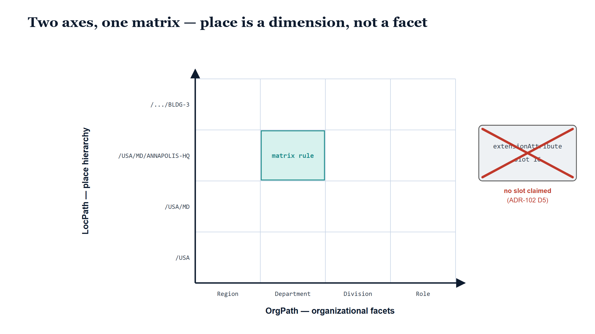

# Chapter 3 — A Second Axis, Not a Sixteenth Facet

::: {.callout-note}
## In this chapter
When location finally demanded a governed home, the obvious move was sitting right there: OrgPath has five reserved extension-attribute slots, and dropping a site code into one of them would have taken an afternoon. This chapter explains why ADR-102 refused the afternoon's work. OrgPath facets carry organizational meaning, and place is not organizational meaning — conflating the two would have quietly poisoned both. Instead, place became a second canonical dimension: a hierarchical path with Site as its minimum governance unit, composed by prefix exactly the way OrgPath rules compose by facet predicate, and claiming no extension-attribute slot at all. The discipline of keeping the two axes apart is what makes it possible to query them together.
:::

{#fig-book-19-cpt-03-image-01 fig-alt="Illustrative widescreen scene on a white background. A pale blue sky gradient meets a low horizon. Two long straight roadways cross at right angles in the foreground, each receding to its own vanishing point on the horizon: a dark navy road labeled OrgPath in white serif letters rises toward the upper right, and a teal road labeled LocPath in white serif letters rises toward the upper left. Both roads carry faint dashed center lines. At the crossing stands a single stylized human silhouette in slate blue, drawn as a simple circle head above a rounded body shape, with a soft pale-teal elliptical glow on the ground beneath their feet at the intersection. No other text or figures appear in the scene." width="85%"}

## The Afternoon's Work

Every governance program eventually meets a temptation shaped like this one. There is a hard-won substrate already in production — in this case OrgPath, fifteen facets of organizational position, validated against a codebook, stamped onto identities, consumed by policy engines. And there is a new kind of fact that needs a governed home — in this case physical place. The substrate has room to spare: five extension-attribute slots sit reserved precisely so the model can grow. The new fact is small: a site code, maybe a building code. The temptation writes itself. Take one reserved slot, call it Location, populate it with `ANNAPOLIS-HQ`, and ship. An afternoon of work, no new model, no new ADR, and every existing tool that knows how to read a facet would read the new one for free.

It is worth being honest about how reasonable this looks. The slot mechanism exists to be used. The consumers are already wired. The alternative — standing up a second canonical addressing dimension, with its own codebook, its own hierarchy, its own governance rules — is plainly more work, and more work needs a justification stronger than tidiness.

ADR-102 supplies that justification, and it begins with a question the afternoon's work never asks: what does a facet *mean*?

{#fig-book-19-cpt-03-diagram-01 fig-alt="Engineering blueprint diagram on a white background, 16:9 landscape, no human figures. A navy horizontal axis along the bottom is labeled OrgPath — organizational facets, with four monospace tick labels beneath it reading Region, Department, Division, and Role. A navy vertical axis on the left is labeled LocPath — place hierarchy in rotated text, with four monospace tick labels reading /USA, /USA/MD, /USA/MD/ANNAPOLIS-HQ, and /.../BLDG-3 from bottom to top. Between the two axes a light grey grid of sixteen cells suggests a matrix, with one cell filled teal and labeled matrix rule. To the right of the grid a grey box labeled extensionAttribute slot 16 is struck through by a large red X, captioned no slot claimed and ADR-102 D5 beneath it. A serif navy title across the top reads Two axes, one matrix — place is a dimension, not a facet." width="85%"}

## What a Facet Means

The fifteen facets of the OrgPath schema are not a grab-bag of attributes that happened to be useful. They are a single, coherent answer to one question: *where does this identity sit in the organization?* Region, Department, Division, Role, CostCenter, and the rest each describe a different cut through the same underlying thing — the organizational structure. A facet predicate like Department=Finance is meaningful because every facet on the identity is talking about the same subject. That coherence is what lets a policy author compose facets freely: any combination of facet predicates is still a statement about organizational position, because organizational position is all the facets know how to express.

Now put a site code in slot sixteen. The slot mechanics work fine — the value stamps, the consumers read it. But the *semantics* have been broken. Fifteen facets describe where you report; one describes where you sit. The schema no longer answers a single question, and every consumer must now carry the tribal knowledge of which facet is the odd one out.

The clearest casualty would have been the Region facet itself. OrgPath already has a facet named Region, and it does not mean geography. The OrgPath Region facet describes *organizational* region — a reporting structure, a branch of the org chart that happens to carry a compass direction in its name. A person can report into a "Northeast" organization while sitting in a Maryland building, because the Northeast in their reporting line is a node in an org tree, not a place on a map. The codebook is explicit on the point: the Region facet of OrgPath and the Region level of the place hierarchy are distinct concepts, and neither derives from the other.

A location facet sitting three slots away from an organizational Region facet is a standing invitation to confuse them. Policy authors would write rules against Region meaning geography and get reporting structure; reporting reorganizations would silently shift rules that were meant to be geographic; and the one drift that matters most — the gap between where someone reports and where someone sits — would become invisible, because the model would have offered a single blurred answer where two sharp ones were needed.

> A facet stuffed with geography does not extend the organizational model. It poisons it — and the poison spreads both ways, because place described in organizational vocabulary is as unreliable as organization described in geographic vocabulary.

## A Path of Its Own

So ADR-102 Decision D1 gives place what OrgPath gave organization: a first-class canonical addressing dimension of its own, called LocPath. Its shape is a hierarchical path:

```
/<Country>/<Region>/<Site>/<Building>/<Floor>/<Space>
```

A fully resolved example reads `/USA/MD/ANNAPOLIS-HQ/BLDG-3/FL-2/RM-210` — country, state, campus, building, floor, room, each segment a stable canonical identifier drawn from a registry rather than free text. The Region segment here means exactly what it appears to mean: geography, a state, an administrative grouping. It can afford to, because it lives on an axis where every segment is about place, just as every OrgPath facet is about organization.

Not every path runs six segments deep, and the hierarchy is deliberate about which level carries the weight. **Site is the minimum governance unit.** Every governed LocPath assertion resolves at least to a Site, and the decisions that make location worth governing in the first place all resolve there: whether a site is approved for Direct Internet Access, what telemetry boundary applies to traffic originating from it, how its SD-WAN breakout is classified, and which people are assigned to it. A site with a single building can stop at the Site level and carry everything it needs.

The deeper levels — Building, Floor, Space — exist for a different master. E911 dispatchable location requires that an emergency call carry not just a civic address but information sufficient to find the caller: a floor, a room. Where that obligation applies, the path extends to the precision the obligation demands. Depth in LocPath is not thoroughness for its own sake; it is governance resolving at Site and dispatchability resolving at Space, each level earning its place in the hierarchy by the decision that lives there.

## One Idiom, Two Axes

A second dimension would be an expensive luxury if it forced operators to learn a second way of thinking. It does not, and this is the quiet elegance of the design: LocPath rules compose by **path prefix**, exactly as OrgPath rules compose by facet predicate.

An OrgPath rule scoped to Department=Finance covers every identity carrying that facet value, however the rest of their facets vary. A LocPath rule scoped to the prefix `/USA/MD/ANNAPOLIS-HQ` covers the entire campus — every building, every floor, every room beneath that Site — however deep the individual paths run. Widen the prefix to `/USA/MD` and the rule covers every governed site in the state; narrow it to `/USA/MD/ANNAPOLIS-HQ/BLDG-3` and it covers one building. The operator who has internalized "match the facet, inherit the scope" already knows "match the prefix, inherit the subtree." One composition idiom, two axes.

This is the payoff of refusing the slot. Had location shipped as a facet, it would have *looked* like the same idiom while behaving differently — a flat code pretending to be hierarchy, with no prefix to widen or narrow. As a path, the hierarchy is real: containment is spelled into the value itself, and scope is a substring relationship any rule engine can evaluate.

## No Slot Claimed

The final discipline is the one that closes the door the afternoon's work would have opened. ADR-102 Decision D5 states it without hedging: LocPath is not a sixteenth OrgPath facet, and it claims **no extension-attribute slot at all**. The fifteen-facet slot table is untouched. The five reserved slots remain reserved — for organizational meaning, when organizational meaning needs them.

How, then, does an identity carry its place? As a governed substrate fact. Every in-scope identity carries an OrgPath and a Primary LocPath, side by side, each validated against its own codebook, each provenance-anchored, neither expressed in the other's vocabulary. The substrate — not a directory attribute — is the source of truth for both, and consumers that need place read it from the governed assignment rather than from a slot scraped off a directory object.

And when some target platform eventually does need LocPath written onto its objects? That is precisely the situation the binding-profile mechanism exists for. Storage-on-target, when it ships, rides a locator declared per target profile — the same vendor-neutral mechanism OrgPath already uses to project itself onto enforcement surfaces — not a new hardcoded slot contract. The decision about *where a value lives on a given platform* stays a deployment decision, made per profile, revisable per profile, instead of being frozen into the canonical model on the day someone needed a shortcut.

> Two governed axes, kept strictly apart, can be queried together. One blurred axis can only be queried alone — and answered wrongly.

That last sentence is the real argument, and it points forward. Because the dimensions are separate, a rule can finally predicate on both at once: identities in the Finance department whose assigned place is not under the headquarters campus; everyone at sites not yet approved for direct breakout; the person whose reporting line says Northeast and whose path says Maryland, surfaced as a fact rather than lost in a conflated field. OrgPath crossed with LocPath forms a matrix, and the matrix is only meaningful because each axis means exactly one thing. A later chapter develops what governance does inside that matrix. This one only establishes why the matrix exists at all: because ADR-102 spent more than an afternoon, and refused to make place the sixteenth answer to a question it was never asking.
