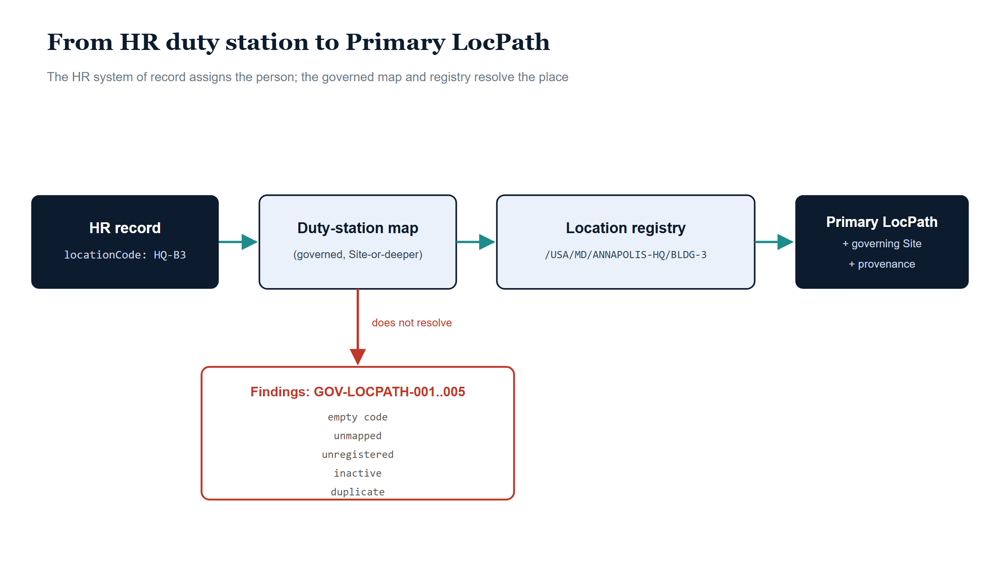

# Chapter 4 — Where People Are Assigned

::: {.callout-note}
## In this chapter
Every governed value needs a named upstream authority, and the previous chapters built the place hierarchy without yet saying who gets to put a person into it. ADR-088 settled that question for organizational placement — the workforce HR system of record, not the directory, is where organizational truth originates — and ADR-102 extends the same doctrine to place: the HR duty-station assignment is the authoritative source for a person's Primary LocPath. This chapter follows one HR record through the governed duty-station map and the location registry to the assignment it produces, and explains why everything that fails to resolve along the way becomes a drift finding in a standard report rather than an exception in a sync job.
:::

{#fig-book-19-cpt-04-image-01 fig-alt="Illustrative scene on a white canvas with a pale blue sky gradient, 16:9 landscape. On the left, a large open ledger book with navy covers and ice-blue pages bearing faint curved ruled lines; a small navy tab on its spine reads system of record in white text. Three muted blue-grey human silhouettes, drawn as simple circle heads over rounded bodies, queue at the ledger's left. From the ledger a single teal thread with a soft pale-teal glow arcs up and across the canvas to the right, ending at a large teal map pin with a white center and a soft glow halo. The pin is planted in a small ice-blue parallelogram patch of governed grid, outlined in navy with thin grey grid lines." width="100%"}

## The Question Every Governed Value Must Answer

A governed attribute is only as trustworthy as the answer to one question: where does its value come from? An attribute with no named upstream authority is not governed at all — it is merely populated, and a populated value with an anonymous origin will drift the moment two systems disagree about it, because there is no doctrine that says which one wins. The OrgPath substrate learned this lesson on the organizational axis, and ADR-088 wrote the answer down as doctrine: the workforce HR system of record is the authoritative upstream source for the assignment of a person to an organizational node. Not the directory, which is a downstream projection that drifted for years; not an administrator's edit, which is an assertion without authority; the HR system, which owns hire, position, and separation as a matter of business fact.

ADR-102 extends that doctrine, deliberately and symmetrically, from the organizational axis to the place axis. Decision D3 of that ADR says it plainly: the HR duty-station assignment — the work-location fact the HR system of record already maintains for every employee — is the authoritative source for a person's Primary LocPath. The same upstream that says where a person sits organizationally says where that person sits physically, and the governance model stays coherent because both placements flow from one named authority.

The extension comes with a division of labor that is easy to state and important to hold. Facilities and real-property systems are not displaced by this doctrine, but they are positioned precisely: they are secondary enrichment sources that describe the *nodes* of the hierarchy — civic addresses, building geometry, floor and space detail, the dispatchable-location attributes a site carries. What they do not do is assign *people*. HR assigns the people; facilities describes the places the people are assigned to. A facilities record can tell you everything about Building 3, but only the HR system of record can tell you that a particular employee's duty station is there.

> Facilities and real-property systems describe the nodes. The HR system of record assigns the people. The Primary LocPath is the meeting point of those two authorities, and neither is allowed to do the other's job.

{#fig-book-19-cpt-04-diagram-01 fig-alt="Engineering blueprint diagram on a white background, 16:9 landscape, no human figures. A serif navy title reads From HR duty station to Primary LocPath, with a grey subtitle beneath it. A left-to-right pipeline of four rounded boxes connected by teal arrows: a navy #0D1B2E box labeled HR record with monospace locationCode: HQ-B3, an ice-filled navy-bordered box labeled Duty-station map with the note governed, Site-or-deeper, a second ice-filled box labeled Location registry with the monospace path /USA/MD/ANNAPOLIS-HQ/BLDG-3, and a final navy box labeled Primary LocPath with the lines + governing Site and + provenance. From beneath the duty-station map box a red #C0392B arrow labeled does not resolve drops to a red-outlined box titled Findings: GOV-LOCPATH-001..005, containing five grey monospace sub-labels stacked vertically: empty code, unmapped, unregistered, inactive, duplicate." width="100%"}

## Two Vocabularies and the Map Between Them

The doctrine names the source; it does not, by itself, make the source legible. The HR system of record does not speak in canonical paths. It speaks in **location codes** — the `locationCode` field carried on every canonical HR record, a short institutional vocabulary like `HQ-B3` that the HR side has maintained for its own purposes for years. The canonical hierarchy, meanwhile, speaks in paths: `/USA/MD/ANNAPOLIS-HQ/BLDG-3`, Country through Space, with Site as the minimum governance unit. Between these two vocabularies something has to translate, and in a governance system the translator cannot be an ad-hoc lookup someone maintains in a spreadsheet. It has to be a governed artifact in its own right.

That artifact is the **duty-station map**: a versioned translation table from the HR locationCode vocabulary to canonical LocPath values, with an identified envelope — a map identifier, a schema version, a status, a display name, an updated date — wrapped around its entries. The map is the place where the HR vocabulary and the location hierarchy are reconciled, which makes it exactly the kind of artifact whose own correctness has to be enforced rather than assumed.

So the map is validated at load time, before a single assignment is attempted, and the validation goes beyond what a schema can check. The envelope and entries are validated against a JSON Schema, and then two integrity rules that schema languages cannot express are enforced directly. First, location codes must be unique **case-insensitively**: a map that declares both `HQ-B3` and `hq-b3` is rejected outright, because HR vocabularies are not reliably case-disciplined and a translation table that resolves differently depending on capitalization is a latent fault. Second, every target path in the map must actually resolve in the paired location registry, and it must resolve **at Site level or deeper**. A map entry pointing at a path the registry does not contain is rejected. A map entry pointing at a Region — a level above Site — is rejected too, because Site is the minimum governance unit and an assignment that resolves no deeper than a Region is not a governed placement.

This last rule deserves a moment's attention, because it illustrates a design posture that recurs throughout the substrate. The system does not *discourage* Region-level assignments with a warning, or permit them with a caveat, or leave them to a reviewer's judgment. It makes them **structurally impossible**: a map containing one will not load, so the assignment pass that depends on the map can never encounter one. The difference between "discouraged" and "impossible" is the difference between a convention and an invariant, and invariants are what downstream consumers — emergency-location configuration not least among them — are allowed to build on.

> A bad map is a defect in a governance artifact, and it is refused wholesale at load time. A bad record is operational drift, and it is recorded one finding at a time. The system never confuses the two.

## The Assignment Pass

With a validated map and a validated registry in hand, the assignment pass itself is almost anticlimactic — which is the point. For each canonical HR record, the pass takes the record's location code, resolves it through the duty-station map to a canonical path, confirms that path against the location registry, and produces a **Primary-LocPath assignment**: the employee, the code that was resolved, the canonical path it resolved to, and two further things that turn a lookup result into a governed fact.

The first is the **governing Site**. The assignment may resolve deeper than Site — to a Building, as in the `/USA/MD/ANNAPOLIS-HQ/BLDG-3` example, or deeper still — but every assignment also carries the Site-level path that governs it, computed by walking up the hierarchy until the Site is found. Site is the unit at which governance assertions attach, so every assignment names its Site explicitly rather than leaving consumers to derive it.

The second is **provenance**. Every assignment records where its inputs came from: the timestamp at which the HR record was extracted from the system of record, the adapter metadata that traveled with it, the identifier of the duty-station map that performed the translation, and the identifier of the location registry that confirmed the target. When someone asks, months later, why a given person carries a given Primary LocPath, the answer is not an archaeology project. It is written on the assignment itself: this HR extraction, through this map, against this registry.

And the pass writes nothing. It is read-only by construction — its entire output is a plan, a tuple of assignments and a tuple of findings, stamped with the map and registry identifiers it ran against. Nothing downstream is mutated; no directory attribute is set; no system of record is touched. What to *do* with the plan is a separate, later, deliberate act. The pass only establishes what is true.

## Findings, Not Exceptions

The most consequential property of the assignment pass is what it does when a record is bad: it does not throw. Not for any record, not for any defect. Every way an HR record can fail to resolve produces a **drift finding** with a stable error code in the GOV-LOCPATH series, and the pass moves on to the next record.

There are five such conditions. An HR record whose location code is empty produces `GOV-LOCPATH-001` — no Primary LocPath can be derived for that person until HR supplies a duty station. A code that the duty-station map does not declare produces `GOV-LOCPATH-002` — the HR vocabulary has a term the governed map has not yet translated. A map target missing from the registry produces `GOV-LOCPATH-003` — the map and the registry have drifted apart since the map was loaded, which is why this finding carries the highest severity of the five. A target whose registry node is no longer active produces `GOV-LOCPATH-004`. And a duplicate employee identifier produces `GOV-LOCPATH-005`, because an identity carries **at most one** Primary LocPath: the first record wins, and the duplicate becomes a finding rather than a silent overwrite.

The inactive case is worth pausing on, because it shows the gradation the finding model makes possible. An assignment to an inactive node is not refused — the person genuinely is assigned there, and pretending otherwise would falsify the record. The assignment is made, *and* the finding is emitted: this placement points at a node on its way out, remap it before the node retires. The system records the truth and flags the deadline, instead of choosing between them.

These findings are not a private error format. They are emitted in exactly the same shape as the findings of every other modernization substrate survey, which means they merge into the same consolidated report. An unresolved duty station lands on the same page as every other governance gap the substrate has detected, with the same severity vocabulary and the same drift classification, where it can be triaged, prioritized, and tracked. Compare that with the alternative this design exists to avoid: a provisioning job that encounters the empty location code, raises, and halts — taking every well-formed record behind it hostage to the one malformed record in front of them, and surfacing the defect as a stack trace in a log instead of a finding in a report.

> Unresolved duty stations are governance gaps, and governance gaps belong in the drift report next to every other gap — not in the exception log of a crashed sync job.

That is the whole shape of the chapter, and of the doctrine it describes. One named authority assigns people to places. One governed, load-validated map translates that authority's vocabulary into the canonical hierarchy. One read-only pass resolves the records it can and files findings for the records it cannot, with provenance on every assignment and a stable code on every gap. The place axis now has what the organizational axis already had: not just a hierarchy, but a named upstream, a governed translation, and an honest account of everything that does not yet fit.
