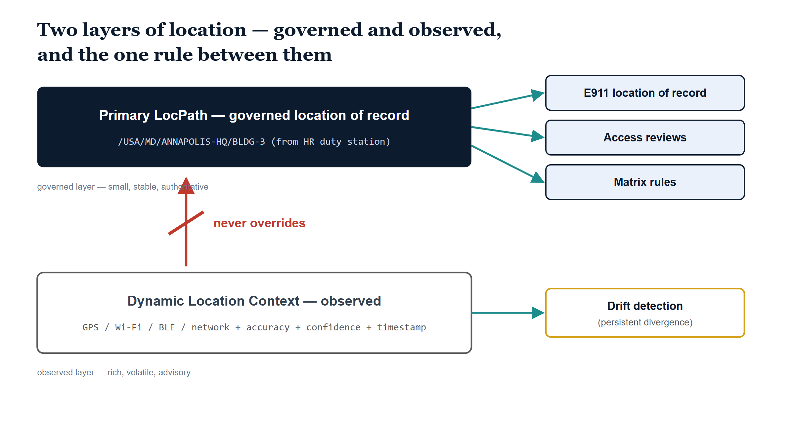

# Chapter 5 — The Two Layers

::: {.callout-note}
## In this chapter
A phone can place itself within a few meters of where it actually sits. The question this chapter answers is whether the governance substrate should believe it. The two-layer location model from ADR-102 says: not for governance, it shouldn't — and the reasons are structural, not squeamish. The **Primary LocPath** is the governed location of record, derived from the HR duty station, validated, provenance-anchored, and consumed by E911 configuration, access reviews, matrix rules, and compliance reporting. **Dynamic Location Context** is observational enrichment: the most recent positioning signal with its source, accuracy, timestamp, and confidence. Five relationship rules govern how the two layers interact, and the most important one is the simplest: the observed layer never overrides the governed layer. The chapter closes with the hybrid that modern emergency calling actually wants, the drift discipline that divergence triggers, and the privacy posture that keeps the observational layer honest.
:::

## The Question the Phone Asks

The device in your pocket knows where it is. Between GPS, the Wi-Fi access points it can hear, the Bluetooth beacons in the ceiling, and the network segment it is attached to, a modern endpoint can resolve its own position with an accuracy that would have seemed extravagant a decade ago. The signal is real, it is cheap to obtain, and it is constantly refreshing. The temptation is obvious: if the device already knows where it is, why does the governance substrate need anything else? Just ask the phone.

The previous chapters built the answer to a different question — where an identity is *assigned*. The Primary LocPath comes down from the HR duty station, through the governed mapping table, against the validated registry, with provenance attached at every step. That value is slow. It changes when a person's duty station changes, which is to say it changes when something organizationally real happens. The phone's idea of its own position changes every time someone walks to the cafeteria.

These are not two measurements of the same quantity at different precisions. They are two different quantities. One says where the organization has *placed* an identity — a statement of record, with an authority chain behind it, that an auditor can trace and a compliance report can cite. The other says where a device most recently *appeared to be* — an observation, with an error radius and a timestamp, that was true at the moment of capture and is decaying ever since. A governance substrate that confuses the two inherits the worst properties of both: governance decisions that flap with signal noise, and observational data burdened with an authority it cannot carry.

> The assigned location is a governed assertion; the observed location is a measurement. The two-layer model exists so that each can be exactly what it is, and neither has to pretend to be the other.

ADR-102's second decision makes the separation canonical. Every in-scope identity carries at most one Primary LocPath — the governed location of record — and at most one current Dynamic Location Context — the most recent positioning observation. The rest of this chapter is about what each layer holds, and about the small set of rules that govern the seam between them.

{#fig-book-19-cpt-05-diagram-01 fig-alt="Engineering blueprint diagram on a white background, 16:9 landscape, no human figures, all identifiers in monospace. An upper solid navy #0D1B2E rounded band is labeled Primary LocPath, governed location of record, with the monospace sub-label /USA/MD/ANNAPOLIS-HQ/BLDG-3 (from HR duty station). Three teal #1E8C8C arrows leave the band rightward to three small ice-fill #EAF1FB rounded boxes with navy borders, labeled E911 location of record, Access reviews, and Matrix rules. A lower grey-outlined white band is labeled Dynamic Location Context, observed, with the monospace sub-label GPS / Wi-Fi / BLE / network + accuracy + confidence + timestamp. Between the bands a red #C0392B upward arrow is crossed by a red strike line and labeled never overrides. A separate teal arrow runs from the lower band rightward to an amber-outlined #D4A017 box labeled Drift detection (persistent divergence)." width="85%"}

## The Governed Layer

The Primary LocPath is everything Chapter 3 and Chapter 4 built, resolved down to a single value on a single identity. It is derived from the HR duty-station assignment — the same upstream authority that ADR-088 names for organizational placement, extended by ADR-102 to physical placement. It is mapped through the governed duty-station translation table, so the derivation itself is a reviewable artifact rather than a script someone wrote. It is validated against the location registry, so it can only resolve to a node that actually exists, at Site level or deeper. And it is provenance-anchored, so the question "why does this person carry this LocPath" has an answer with dates and sources attached.

That pedigree is what qualifies it to do its four jobs. The Primary LocPath is the source for E911 emergency-address configuration — the dispatchable location of record that a UCaaS platform registers for an identity. It is the location axis for access reviews: does this person still need Building-3 resources, given where they are assigned? It is one of the two axes in matrix rules, where governance predicates on OrgPath and LocPath together. And it is the value compliance reporting cites, because a report needs a number that was true for a defensible reason, not a number that was true at 2:14 p.m.

Notice what this layer is *not*. It is not precise in the GPS sense — it resolves to a registry node, not a coordinate fix. It is not fresh in the telemetry sense — it updates on duty-station change, not on movement. It does not need to be either. Its job is to be small, stable, and authoritative, and every property it lacks is a property that would have compromised one it needs.

## The Observed Layer

Dynamic Location Context is the other shape entirely. The codebook defines it as the most recent positioning signal for an identity or device, carried with its origin and its quality:

| Attribute | What it carries |
| :--- | :--- |
| `source` | How the position was obtained — GPS, Wi-Fi, BLE, network-derived, hybrid, or manual |
| `latitude` / `longitude` | The WGS84 coordinate fix |
| `accuracyMeters` | The estimated horizontal accuracy radius |
| `floorHint` | An indoor-positioning floor estimate |
| `timestamp` | When the reading was captured |
| `confidence` | High, Medium, or Low |
| `isCurrent` | Whether this is the most recent known reading |

Every attribute in that table is a confession of uncertainty, and that is the point. A governed value does not carry an accuracy radius, because a governed value is not an estimate. The observed layer carries one because it *is* an estimate, and an honest data model says so in its schema. The confidence enum, the timestamp, the source — together they let a consumer decide how much weight a reading deserves, reading by reading, instead of forcing one trust decision onto every signal forever.

The observed layer is rich where the governed layer is small, volatile where the governed layer is stable, and advisory where the governed layer is authoritative. It enhances; it informs; it never decides.

## The Rules Between Them

The codebook states five normative relationship rules, and they are the heart of this chapter, because the two-layer model lives or dies on the seam.

The first rule is cardinality: an identity has at most one Primary LocPath and at most one current Dynamic Location Context. There is no stack of candidate locations to arbitrate among, no history table masquerading as present state. One governed value, one current observation — the model stays answerable.

The second rule is the one rule between the layers, and everything else in the model defers to it: dynamic context **never overrides** the Primary LocPath for governance, access review, or compliance reporting. No confidence level, no accuracy radius, no freshness makes an observation eligible to stand where the governed value stands. The arrow from the observed layer up into the governed layer simply does not exist, and the model is designed so that no configuration can create it.

> A high-confidence GPS fix is still an observation. The governed location of record changed hands through HR, a mapping table, a registry, and a provenance anchor — and nothing that arrives over the air outranks that chain.

The third rule is where the model shows its judgment rather than its rigidity, and it deserves its own section.

## How Emergency Calling Wants It

Downstream consumers that genuinely support real-time location — UCaaS emergency calling is the named case — may prefer high-confidence dynamic data at call time. When someone dials 911 from a softphone, and the platform holds a fresh, high-confidence position for that endpoint, the platform should use it: the caller's actual position at the moment of the call is precisely the thing emergency response wants. The Primary LocPath does not fight that preference. It remains the governed dispatchable-location *fallback* and the configured location of record — the address that is registered, audited, and guaranteed to exist when the real-time signal is stale, low-confidence, or absent.

This hybrid is not a compromise the model tolerates; it is the arrangement modern E911 architecture is built around. A registered location provides reliability — there is always a dispatchable address on file, vouched for by a governed process. A real-time signal provides precision — when a trustworthy fix exists, the call carries it. The two-layer model maps onto that division exactly: governed layer for the registered location, observed layer for the call-time enhancement, and the never-overrides rule keeping the enhancement from contaminating the record. The substrate did not have to bend its doctrine to serve emergency calling; the doctrine and the use case wanted the same shape.

## Divergence Is a Drift Signal

The fourth rule addresses the case everyone eventually asks about: what happens when the layers disagree, persistently? An identity is assigned to the Annapolis headquarters, and for three weeks every observation places the device two hundred miles away. Surely *now* the observation should win?

It should not — and the model's answer is better than a refusal. Persistent divergence between assigned and observed location is a **drift signal**, not a silent update. The substrate notices; it does not quietly rewrite. The divergence is surfaced as a finding — the codebook classes it as location-assignment drift — and a finding demands a human-governed resolution: perhaps the duty station is stale and HR needs to process a move, perhaps the device is shared or traveling, perhaps something is genuinely wrong. Each of those resolutions is different, and an automatic overwrite would have collapsed them into one wrong answer applied instantly. Drift detection is the observed layer's real governance contribution: it cannot change the record, but it is the most reliable witness that the record might need changing — through the front door, where the change leaves provenance behind.

## The Privacy Posture

The fifth rule is the one that keeps the observed layer from outgrowing its mandate. Dynamic Location Context is privacy-sensitive observational data — a stream of where people's devices are is among the most intrusive datasets an organization can hold. The codebook therefore defines the *shape* of that data and its *governance role*, and stops. It does not authorize collection. Any mechanism that would actually gather positioning signals requires its own review before it ships, with the privacy questions answered on their own terms rather than inherited from a schema definition.

That stopping point is not timidity; it is the same design instinct that shaped everything else in this chapter. The governed layer is small, stable, and authoritative because restraint is what makes authority credible. The observed layer is rich, volatile, and advisory because honesty about uncertainty is what makes enrichment usable. And the codebook describes what observational data must look like *if it exists* without decreeing that it should, because a location model earns trust the same way a location value does — by claiming exactly as much as it can stand behind.

> Two layers, one rule between them, and a substrate that notices rather than rewrites. The restraint is the design.
