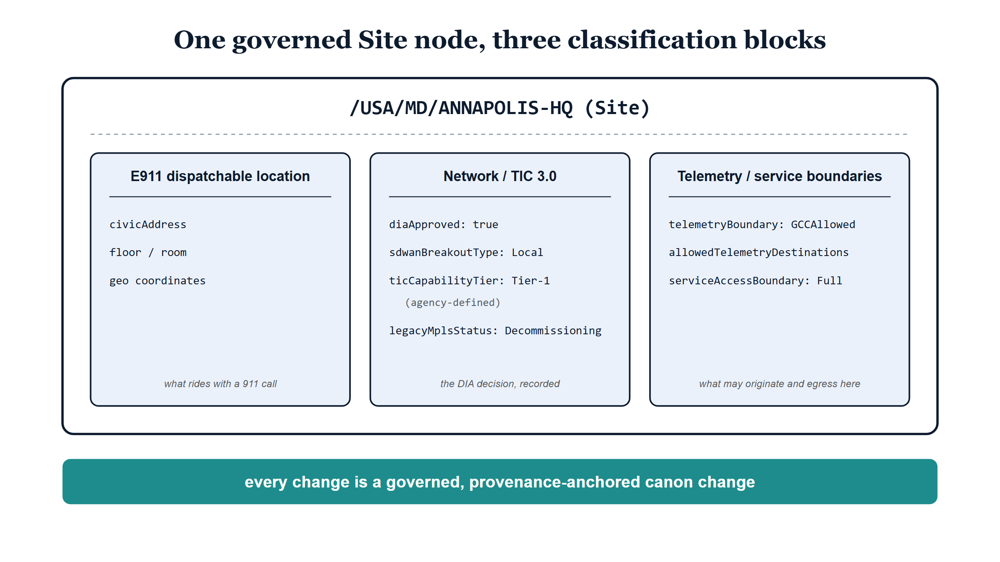

# Chapter 6 — The Site as Policy Subject

::: {.callout-note}
## In this chapter
A LocPath node is more than a structured address. At the Site level — the minimum governance unit — it carries three governed classification blocks: the E911 dispatchable-location payload that federal regulation requires with a 911 call, the network classification that records the agency's TIC 3.0 Direct Internet Access decision, and the telemetry and service boundaries that give location-scoped telemetry policy a subject to attach to. The chapter walks each block, is deliberately honest about what `ticCapabilityTier` is and is not, and works the Annapolis headquarters example from the codebook — ending with the rule that makes this governance rather than documentation: changes to these attributes are canon changes.
:::

## A Node That Carries Decisions

The mechanics of LocPath — the path syntax, the six levels from Country down to Space, the registry that issues canonical segments — can leave the impression that the model is a taxonomy: a clean, validated way to spell where things are. If that were all it was, it would be a modest convenience. Agencies already have site lists; another one, however well-formed, would not justify a second canonical addressing dimension.

What changes the proposition is what the codebook attaches to the node. UIAO_194 specifies, and ADR-102 Decision D4 establishes, that LocPath nodes carry three classification attribute blocks beyond their core identity and provenance fields — and that the Site, as the minimum governance unit, is where the consequential ones resolve. Each block holds a class of decisions every agency already makes, but makes somewhere ungoverned: a phone platform's emergency-address table, a network engineer's diagram, a boundary assumption nobody wrote down. The Site node gives those decisions a single, governed, provenance-anchored place to live.

{#fig-book-19-cpt-06-diagram-01 fig-alt="Engineering blueprint diagram on a white background, 16:9 landscape, no human figures, white background first. A serif navy title reads One governed Site node, three classification blocks. Below it a large white card with a thick navy border is titled in bold monospace /USA/MD/ANNAPOLIS-HQ (Site). Inside the card sit three side-by-side ice-blue panels with navy borders. The left panel, headed E911 dispatchable location, lists the monospace lines civicAddress, floor / room, and geo coordinates, with a grey italic footer reading what rides with a 911 call. The center panel, headed Network / TIC 3.0, lists diaApproved: true, sdwanBreakoutType: Local, ticCapabilityTier: Tier-1 with agency-defined in grey beneath it, and legacyMplsStatus: Decommissioning, with footer the DIA decision, recorded. The right panel, headed Telemetry / service boundaries, lists telemetryBoundary: GCCAllowed, allowedTelemetryDestinations, and serviceAccessBoundary: Full, with footer what may originate and egress here. Beneath the card a full-width teal band carries white bold text: every change is a governed, provenance-anchored canon change." width="85%"}

> A Site is not an address with a name. It is a policy subject: the object that the E911 obligation, the Direct Internet Access determination, and the telemetry boundary all attach to — held once, governed, and watched for drift.

## The Payload That Rides With a 911 Call

The first block exists because federal regulation says it must. 47 CFR Part 9 implements two statutes that changed what an enterprise phone system owes a 911 caller. Kari's Law, at § 9.8, requires that multi-line telephone systems support direct 911 dialing and on-site notification. RAY BAUM'S Act § 506 goes further: § 9.16 requires that a *dispatchable location* be conveyed with the 911 call — a validated civic address plus information sufficient to actually locate the caller within the building, down to floor- and room-level detail where the structure demands it.

The codebook models that payload directly on the LocPath node: `civicAddress`, the validated street address; `floor` and `room` identifiers; `geoLatitude` and `geoLongitude` as geodetic coordinates; and `locationDescription`, a free-text aid for the responders who will be reading it under the worst possible conditions — "Building 3, West Wing, 2nd Floor, Room 210." The Site level carries the default civic address; Building, Floor, and Space nodes carry the precision § 9.16 demands where a campus has the depth to need it.

What matters is not the field list — every phone platform has one. What matters is where the fields live. Today the dispatchable location of record is hand-maintained per platform: typed into the Teams emergency-address configuration, typed again into whatever the legacy PBX or UCaaS portal wants, each copy owned by whoever last touched it, each free to drift from the others. The codebook inverts that arrangement. The dispatchable location is held once, on the governed node, with provenance and an owner, and the platforms become consumers of the record rather than independent authors of it. The scope guardrail in ADR-102 is explicit about the division of labor: UIAO never sits in the 911 call path. It is the governed source of the location of record; the UCaaS platform carries the call. And a Site with MLTS or UCaaS presence and no resolvable dispatchable-location attributes at the required depth is a standing compliance gap, surfaced like any other governance finding.

## The Decision That Lived in a Visio File

The second block records a different kind of decision — one with no regulator dictating a field list, but with real money and real risk attached. CISA's Trusted Internet Connections 3.0 program retired the old mandate that every federal site backhaul its internet traffic through a centralized gateway. In its place, TIC 3.0 defines risk-based use cases under which a site may break out directly to the internet and to cloud services, provided the required security capabilities are applied at or near the network edge. The acquisition vehicle for the modern architecture is GSA's Enterprise Infrastructure Solutions, and agencies are riding it off their legacy MPLS contracts toward SD-WAN with local breakout.

That shift makes "is this site approved for Direct Internet Access" a per-site governance decision, and the codebook gives it a per-site record. `diaApproved` is a boolean answering exactly that question — approved or not under the agency's own TIC 3.0 risk determination. `sdwanBreakoutType` records how the site's traffic actually leaves: `Local`, `Centralized`, or `Hybrid`. `legacyMplsStatus` — `Active`, `Decommissioning`, `Decommissioned` — tracks each site through the EIS transition, so "is the old circuit gone yet" has a governed per-site answer rather than a spreadsheet on the network team's share.

The fourth attribute requires scrupulous honesty, and the codebook delivers it explicitly. `ticCapabilityTier` records a tier — `Tier-1`, `Tier-2`, or `Tier-3` — and TIC 3.0 defines no official tiers. CISA publishes a catalog of security capabilities, not a maturity ladder. The tier attribute is the *agency's own* internal determination of how completely a site applies those capabilities. It is useful precisely because the agency defines it: the DIA approval decision can be predicated on a tier the agency controls and can audit. But presenting it as a CISA designation would simply be wrong, cross-agency comparability is limited by construction, and any document — including this one — that lets the attribute pass as an external standard has misrepresented it.

> `ticCapabilityTier` is the agency's own maturity determination over the TIC 3.0 security capabilities. It is not a CISA designation, because no such designation exists.

The point of the whole block becomes clear when you ask where the DIA decision lived before. It lived in a network engineer's head, in a Visio file last exported the week of the design review, or in the text of a change ticket closed three years ago. None of those locations has a history, an owner, or any way of noticing that reality has wandered away from the decision. As a classification block on a governed node, the decision acquires all three — including the drift detector: the codebook defines a location-policy drift class for exactly the case where observed network behavior disagrees with the recorded classification, such as a site marked `diaApproved: false` exhibiting local breakout anyway.

## A Subject for Telemetry Policy

The third block is the one most particular to constrained boundaries. In a GCC-Moderate environment, *which telemetry classes may originate from which locations, and egress to which destinations* is a genuine governance assertion — and today it lives nowhere. There is no object in the environment that the assertion can attach to, so it persists as tribal knowledge and per-pipeline improvisation.

The codebook gives it a subject. `telemetryBoundary` — `InternalOnly`, `GCCAllowed`, `FedRAMPModerate`, or `Restricted` — classifies what telemetry may originate from the location. `allowedTelemetryDestinations` is an explicit egress allow-list — an enumerable set a pipeline can be checked against, not a sentiment about where data should go. `serviceAccessBoundary` — `Full`, `Limited`, `BoundaryEnforced`, `Isolated` — describes the service-access posture that applies at the location, and `boundaryEnforcementLevel` — `Strict`, `Monitored`, `Advisory` — records how hard that boundary is actually enforced.

With those attributes on the Site, rules of the form "telemetry of this class may leave sites whose boundary is `GCCAllowed`, bound only for destinations on the site's allow-list" become expressible, and therefore checkable. The companion drift class watches the boundary from the other side: telemetry observed egressing outside the site's `telemetryBoundary` or its `allowedTelemetryDestinations` is location-boundary drift, surfaced as a finding rather than discovered in an audit.

## Annapolis, Worked

The codebook closes with a worked example — a fictional agency headquarters, all values illustrative — that shows the three blocks doing their jobs on one campus.

The Site node is `/USA/MD/ANNAPOLIS-HQ`: "Headquarters Campus, Annapolis," status Active. Its network block reads as a story. `diaApproved: true` — the agency has made its TIC 3.0 risk determination and approved this campus for direct breakout. `sdwanBreakoutType: Local` — traffic leaves here, not through a distant gateway. `ticCapabilityTier: Tier-1` — the agency's own determination that the site applies the required capabilities at its highest internal tier. `legacyMplsStatus: Decommissioning` — the campus is mid-transition; the old circuit is on its way out but not gone, a fact now held as a governed value rather than a line in a project tracker. The boundaries block continues: `telemetryBoundary: GCCAllowed`, `serviceAccessBoundary: Full`, `boundaryEnforcementLevel: Monitored` — telemetry may flow to GCC-permitted destinations, service access is unrestricted, and the boundary is observed rather than hard-enforced.

Deeper in the same campus, the Space node `/USA/MD/ANNAPOLIS-HQ/BLDG-3/FL-2/RM-210` carries the dispatchable payload: civic address 100 Main Street, Annapolis, MD 21401; floor 2; room RM-210; location description "Building 3, West Wing, 2nd Floor, Room 210." The Site answers the network and telemetry questions; the Space answers the responder's question.

Notice what has happened. One governed node-set now answers questions three teams currently answer from three uncoordinated lists: the telecom team's question (what location rides with a 911 call from Building 3), the network team's question (may this site break out locally, and is the MPLS circuit retired yet), and the security team's question (what telemetry may leave this campus, and how strictly is that enforced). The abstraction "policy subject" stops being abstract the moment all three point at the same path.

## A Canon Change, Not a Field Edit

Everything above would still be merely a better-organized site list were it not for the codebook's change-control rule. Node creation, status changes, and classification changes — `diaApproved`, `telemetryBoundary`, and `serviceAccessBoundary` are named explicitly — are canon changes: provenance-anchored, with impact analysis on assigned identities and on the governance rules that depend on the node. Deactivating a Site that still has identities assigned to it is blocked outright until the assignments are remapped; a place that people are assigned to cannot simply vanish from the record.

Why that ceremony for what looks like attribute maintenance? Because these are not descriptive fields. A flipped `diaApproved` bit reroutes a building's traffic. A changed `telemetryBoundary` changes what data may leave a campus and where it may go. Edits with that blast radius deserve the same discipline as any other change to canon — a recorded decision, a responsible owner, an analysis of who and what is affected — and the codebook grants them exactly that, not as an aspiration but as a rule.

> The Site is where place stops being descriptive and starts being normative. The address says where the building is; the classification blocks say what is allowed to happen there. And because every change to them is a governed, provenance-anchored canon change, the moment the answer changes, the change has a history, an owner, and an impact analysis — which is the difference between a site list and a policy subject.
