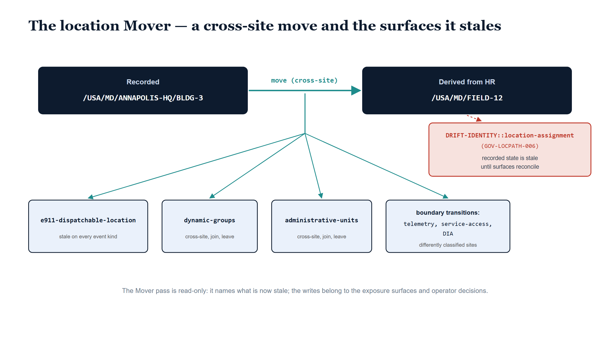

# Chapter 7 — When People Move

::: {.callout-note}
## In this chapter
The earlier books in this series built the organizational mover: the moment a person's recorded position and their freshly derived position disagree, and everything keyed to the old position is quietly wrong until the world catches up. A duty-station change is the same event on the place axis. This chapter follows the location Mover pass as it diffs the substrate's last recorded assignment state against the fresh HR derivation, sorts the differences into joins, leaves, and moves, and names the impact surfaces each event stales — the E911 dispatchable location of record on every event, the location-scoped groups and Administrative Units on the larger ones, and the boundary transitions a cross-site move carries when the two sites are classified differently. It then develops the chapter's central claim: the mover event is not a cause of drift, it *is* drift — one finding per event, open until the downstream surfaces reconcile. Through all of it the pass only reads. The writes belong elsewhere.
:::

{#fig-book-19-cpt-07-image-01 fig-alt="Illustrative scene on a white background. A pale blue sky gradient spans the canvas between two navy office buildings with light-blue windows. A single dark-blue stylized silhouette, circle head and rounded body, strides along a light path from the left building toward the right building, which is backed by a soft teal glow. At the left building, a faded grey-blue echo of the same silhouette sits on a bench, left behind as the stale record. Along the path behind the walker, three small fading grey record cards, each with a thin red underline, carry the tiny labels emergency address, groups, and admin units, growing fainter toward the building the person left." width="100%"}

## The Same Anatomy

By this point in the series the mover is a familiar figure. The earlier books developed it on the organizational axis: a person changes departments, and for some interval the position the substrate has recorded for them and the position HR now derives for them are two different answers to the same question. Nothing dramatic announces this. No system fails. The person badges in, signs in, does their work. But every control keyed to the old position — every membership, every policy scope, every route that resolved through where the person *used to* sit — is now answering from a state of the world that has stopped being true.

The place axis has exactly the same event, and this chapter is about it. A duty-station change is the place axis's mover. HR processes the personnel action: the person who sat at the Annapolis headquarters, building three, now reports to a field office. The fresh derivation from HR says `/USA/MD/FIELD-12`. The substrate's last recorded snapshot still says `/USA/MD/ANNAPOLIS-HQ/BLDG-3`. The recorded state and the freshly derived state disagree, and everything keyed to the old state — the emergency-services address on file, the groups that scope by site, the administrative boundaries drawn around the location — is now quietly wrong.

> A duty-station change is the place axis's mover event, and it has the same anatomy as the organizational mover: the recorded state and the derived state disagree, and everything keyed to the old state is wrong until something notices.

The location Mover pass is the something that notices.

{#fig-book-19-cpt-07-diagram-01 fig-alt="Engineering blueprint diagram on a white background, 16:9 landscape, no human figures, identifiers in monospace. Top row: a navy box labeled Recorded containing the path /USA/MD/ANNAPOLIS-HQ/BLDG-3, a teal arrow labeled move (cross-site) pointing right to a second navy box labeled Derived from HR containing /USA/MD/FIELD-12. From the arrow's midpoint a teal line drops to a junction and fans out through four thin teal connectors to four ice-blue boxes with navy borders across the lower half: e911-dispatchable-location captioned stale on every event kind; dynamic-groups and administrative-units each captioned cross-site, join, leave; and boundary transitions listing telemetry, service-access, DIA captioned differently classified sites. At the right, a red-outlined box reads DRIFT-IDENTITY::location-assignment with the code GOV-LOCPATH-006 and the caption recorded state is stale until surfaces reconcile, joined to the Derived box by a short red dashed connector. A grey footer states that the Mover pass is read-only." width="100%"}

## Two States, Three Kinds of Event

The pass takes two assignment states and compares them. The first is the recorded state — the substrate's last snapshot of who is assigned where. The second is the fresh derivation, the assignment state computed from current HR records. Identities whose assignment is unchanged produce nothing; the diff has nothing to say about agreement. Where the two states differ, the difference takes one of exactly three shapes.

A **join** is an identity that appears: the recorded state had no assignment for this person, and the fresh derivation does — a new hire reporting to a duty station, or an existing employee entering the assignment substrate for the first time. A **leave** is the mirror image: the recorded state carried an assignment and the fresh derivation carries none — a separation, a retirement, a record that has fallen out of the HR feed. And a **move** is an identity present in both states whose assigned place has changed.

Moves subdivide once more, and the subdivision matters for everything that follows. The question is whether the governing Site changed. A move from building three to building five of the same headquarters changes the assigned place — the person genuinely sits somewhere new — but the Site that governs them, with its classification, its network posture, and its administrative scoping, is the same Site. That is a **within-site** move. A move from the Annapolis headquarters to the field office crosses from one Site's governance to another's. That is a **cross-site** move, and it is the heavier event, because Sites are where the classifications live.

## What Just Went Stale

Each event names its **impact surfaces**: the specific things the event has just made stale. These are declarative names, not actions — the pass is telling you what is now wrong, not fixing it — and the discipline of naming them per event is what turns a personnel action into an operational picture.

One surface is stale on every event kind, with no exception: the E911 dispatchable location of record. This follows from what the event *is*. A join establishes a location of record where there was none; a leave removes one; a move changes one. In every case the answer to the question "where do emergency responders go for this person" has changed, and whatever address the communications platform is currently registered to dispatch against is the old answer. Even the mildest event in the catalog — the within-site move from one building to another — stales this surface, because dispatchable location is precise to the building, not to the Site. The mildest mover event still moves the one thing E911 exists to know.

The location-scoped surfaces come next: the dynamic groups whose membership rules key on site, and the Administrative Units that scope delegated administration by location. These go stale on joins, leaves, and cross-site moves — every event in which the governing Site changes or an identity enters or exits the assignment state. They are *not* staled by a within-site move: the person who moved between buildings is still governed by the same Site, still matches the same site-keyed membership rules, still falls inside the same administrative scope. The within-site move is the event that stales exactly one thing, and that one thing is the dispatchable location.

And then there are the transitions. A cross-site move between two sites that are classified *differently* does not merely stale surfaces — it carries the person across a governance boundary, and the pass flags each boundary crossed. If the two sites' telemetry classifications differ — the person moved from a GCCAllowed site to an InternalOnly site, or the reverse — the event carries a telemetry-boundary transition. If the two sites differ in their service-access boundary, the event carries a service-access-boundary transition. And if the two sites differ in their internet-egress posture — a move from a site with approved direct internet access to one whose traffic is backhauled, or the reverse — the event carries a DIA-approval transition. None of these flags appears on a join or a leave, and none appears on a cross-site move between identically classified sites. They appear precisely when a move transits a classification line, because that is the moment the rules governing the person's telemetry, service access, and network path change underneath them.

| Event kind | E911 dispatchable location | Dynamic groups and Administrative Units | Boundary transitions |
| :--- | :--- | :--- | :--- |
| **Join** | stale | stale | — |
| **Leave** | stale | stale | — |
| **Move, within-site** | stale | — | — |
| **Move, cross-site** | stale | stale | flagged where the two sites' classifications differ |

## The Event Is the Drift

It would be natural to describe all of this as a pipeline with a delay in it: the person moves, and until the downstream systems are updated there is a *risk* of drift. The pass takes a stricter view, and the strictness is the chapter's central insight. Every mover event carries, alongside its impact surfaces, exactly one drift finding — a location-assignment finding recording that the substrate's recorded Primary LocPath for this identity is stale, what it was, what it has become, and which surfaces are stale because of it. The event does not risk drift. The event *is* drift.

This is the substrate's standing discipline — Snapshot, Compare, Classify — applied to place. The recorded state is the snapshot. The fresh HR derivation is the comparison. The finding is the classification: from the moment the derivation diverges from the record, the record is wrong — not "about to be wrong," not "wrong if nobody acts," but wrong now, and provably so, because two readings of the same fact disagree. The finding stays open until the downstream surfaces reconcile — until the dispatchable location is re-registered, the groups re-evaluate, the administrative scopes catch up.

Severity follows the blast radius. A within-site move produces a moderate finding: one surface is stale, the governing Site is unchanged, and the wrongness is bounded. A cross-site move — and likewise a join or a leave — produces a higher-severity finding, because the stale set is wider and may include boundary transitions whose surfaces are not merely out of date but now governed by a different regime entirely.

> Every mover event carries one location-assignment drift finding, because the recorded state is wrong from the instant the derivation diverges. Drift here is not a pathology the move might cause. It is the name for the interval between the move and the world's reconciliation with it.

## Reads, Never Writes

There is one more property of the pass, and it is a design commitment rather than a limitation. The Mover pass is read-only, and dry-run by nature — not dry-run by a setting that could be flipped, but dry-run because there is no write path in it to enable. It diffs two states, it produces events and findings, and it mutates nothing.

This is deliberate. The surfaces an event stales are owned by different parties with different change disciplines. The dynamic-group and Administrative Unit updates are write surfaces in their own right, a later phase of the same program with its own controls. The E911 registered-address update belongs to the communications platform that consumes the location of record — the pass can tell that platform the address is stale, but the registration is that platform's act, not the substrate's. And a boundary transition is not a write at all; it is a fact an operator must weigh, because crossing a telemetry or egress regime may carry obligations no automation should discharge unreviewed. The pass's job ends at the truthful inventory: here is who moved, here is what kind of event it was, here is exactly what is now stale, and here is the drift finding that will stay open until someone acts.

When people move, the place axis behaves exactly as the organizational axis taught this series to expect. The recorded world and the real world come apart; the gap has a precise shape; and the first obligation of governance is to see the gap whole before touching anything.

> The location Mover pass diffs the recorded state against the derived one, sorts the differences into joins, leaves, and moves, names what each one stales, and records each one as drift. It tells you exactly what is now wrong. What to do about it — the writes, the registrations, the approvals — belongs to the exposure surfaces and to operator decisions, where it has belonged all along.
