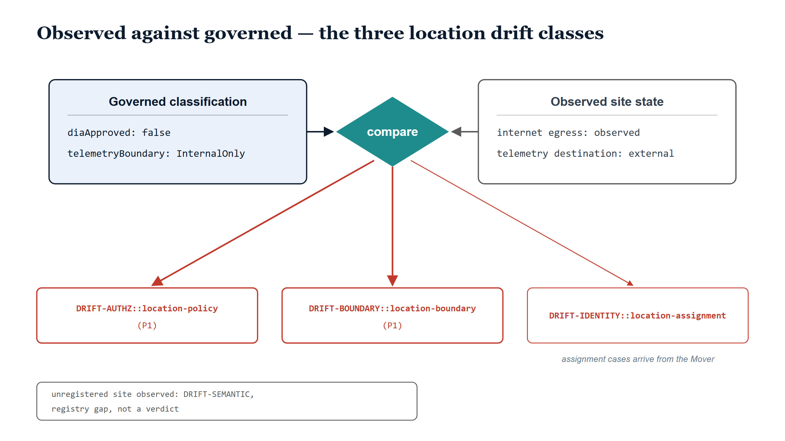

# Chapter 8 — Drift for Place

::: {.callout-note}
## In this chapter
A registry that declares how places must behave, with nothing watching whether they actually do, is a wish rather than a governance system. This chapter introduces the three location drift classes — `DRIFT-IDENTITY::location-assignment`, `DRIFT-AUTHZ::location-policy`, and `DRIFT-BOUNDARY::location-boundary` — and pays as much attention to *how* they were added as to what they detect. The canonical drift taxonomy is fixed doctrine; the location classes arrive as sub-classes of existing top-levels, through the same double-colon extension mechanism earlier extensions used. Along the way the chapter walks the observational contract the detector consumes, the concrete cases it convicts, the one case it deliberately refuses to convict, and the line that separates detection from collection.
:::

{#fig-book-19-cpt-08-image-01 fig-alt="Illustrative dusk scene on a white canvas. The sky grades from pale ice blue at the top through soft blue into a deep navy band at the horizon. On a dark navy headland at the left stands a stylized lighthouse: a tapered navy tower, a light-blue gallery room holding a small teal lantern, and a conical navy roof. A translucent teal beam fans from the lantern down across a pale plain on the right, where three small building pictograms stand. Two sit quiet in thin grey outline; the third, caught in the beam, flares with a heavy red outline, a faint red halo, and a pale red fill. Beneath the flaring site a small monospace label reads diaApproved: false. No other text appears." width="100%"}

## A Wish Without a Detector

The preceding chapters built up a governed description of place. The location registry declares what each site *is*: its position in the LocPath tree, its dispatchable address, and — most consequentially for this chapter — its network classification and its telemetry boundaries. A site is declared `diaApproved: false` or `true`; it carries a declared SD-WAN breakout type; its `telemetryBoundary` says whether telemetry may leave it at all, and its allow-list says where telemetry may go when it does.

All of that is declaration. None of it is enforcement, and none of it is even *observation*. A registry can say with perfect confidence that a field office routes all internet traffic through the centralized TIC stack, and the field office can be quietly doing something else entirely, for months, with the registry none the wiser. The declaration does not become less true on paper when the field contradicts it; it becomes a fiction that everyone downstream — conditional-access policy, compliance reporting, the boundary documentation itself — continues to consume as fact.

> Governance without a drift detector is a wish. The registry says what a place must be; only a comparison against what the place is actually observed doing turns that statement into something an auditor can trust.

This is not a new insight in the UIAO substrate. The organizational axis learned it long ago: every governed surface eventually grows a Compare/Classify pass that reads the governed declaration on one side, an observation of reality on the other, and emits a typed finding wherever the two disagree. The place axis is a governed surface like any other, and this chapter is the moment it acquires its detector.

{#fig-book-19-cpt-08-diagram-01 fig-alt="Engineering blueprint diagram on a white background, 16:9 landscape, no human figures, all identifiers in monospace. Top left, an ice-filled navy-bordered card titled Governed classification contains two monospace lines reading diaApproved: false and telemetryBoundary: InternalOnly. Top right, a white grey-outlined card titled Observed site state contains two monospace lines reading internet egress: observed and telemetry destination: external. Between the cards a teal diamond labeled compare receives an arrow from each card. From the diamond, three red arrows descend to three red-outlined boxes labeled in monospace DRIFT-AUTHZ::location-policy with severity P1, DRIFT-BOUNDARY::location-boundary with severity P1, and DRIFT-IDENTITY::location-assignment, the third reached by a thinner arrow captioned assignment cases arrive from the Mover. A small grey note box at the bottom reads unregistered site observed: DRIFT-SEMANTIC, registry gap, not a verdict." width="100%"}

## Extending the Taxonomy Without Breaking It

Before naming the location classes, it is worth being precise about the mechanism by which they exist at all, because the mechanism is itself doctrine.

The canonical drift taxonomy is fixed. Five top-level classes were established by the original drift decision record, and a sixth — `DRIFT-BOUNDARY` — was added later by its own decision record, ADR-033. That set does not grow casually. A new governed surface does not get to mint a new top-level class just because its findings feel novel; if it did, the taxonomy would fragment into per-surface vocabularies and the substrate report would lose the one property that makes it readable — that every finding, from every detector, lands in a class whose meaning was settled once.

What a new surface *does* get is the sub-class mechanism: a double-colon suffix on an existing top-level, narrowing the parent's meaning without altering it. This is not an invention of the place axis. `DRIFT-SCHEMA::slot-occupied` was added this way under ADR-063, and `DRIFT-SEMANTIC::orphan` and `DRIFT-SEMANTIC::phantom` arrived the same way in UIAO_163 v2.0. The pattern is established: the parent class tells you what *kind* of disagreement you are looking at; the suffix tells you which governed surface produced it and what specific shape it takes there.

The three location classes follow the pattern exactly. None of them invents a top-level. Each one asks, of the disagreement it detects, *which existing kind of disagreement is this?* — and rides that answer.

## The Three Classes

**`DRIFT-IDENTITY::location-assignment`** is identity drift, because the subject of the disagreement is an identity's governed attribute. An identity's recorded Primary LocPath disagrees with what the HR system of record derives: the assignment has gone stale, the duty station code no longer resolves to a registered location, or a mover has been detected by the HR feed and not yet reconciled into the assignment. In every variant, the question is the same one identity drift always asks — does the governed record of this identity match its source of truth? — narrowed to the place attribute. These findings are not emitted by the site detector this chapter centers on; they arrive from the HR assignment pass and from the Mover, the reconciliation machinery met earlier in this book. The class belongs in this chapter because it completes the family: the place axis watches its identities, its policies, and its boundaries, and each watch reports under the top-level that matches what is being contradicted.

**`DRIFT-AUTHZ::location-policy`** is authorization drift, because the disagreement is between governed policy and exercised behavior. A site's observed network behavior contradicts its governed classification: the registry says one thing about how this site may touch the internet, and the wire says another. The site is, in effect, exercising an authorization it was never granted.

**`DRIFT-BOUNDARY::location-boundary`** is boundary drift, riding the top-level that ADR-033 added for exactly this kind of finding: something observed crossing a declared boundary. Here the something is telemetry — data observed leaving a location outside its declared `telemetryBoundary` or to a destination missing from its `allowedTelemetryDestinations`.

> The taxonomy did not grow to accommodate place. Place sorted its disagreements into the classes that already existed, and the substrate report stayed readable.

## What the Detector Agrees to Consume

The policy and boundary detector is a read-only Compare/Classify pass, and the contract on its observation side is deliberately minimal. For each site, an observation carries at most four things: the LocPath of the site observed, the breakout type that was seen, whether internet egress was observed at all, and which telemetry destinations were seen.

Every field except the path is optional, and the optionality is the point. A collector fills in what it can actually see and leaves the rest unset, and the detector compares *only what was actually observed* against what the registry governs. An observation that says nothing about breakout type produces no breakout finding, however suspicious the site's history; an observation that lists no telemetry destinations produces no boundary finding. The detector never infers, never extrapolates from absence, and never treats "not observed" as "observed to be clean." Silence in the contract is silence in the findings.

This restraint is what lets the contract stay stable while the observation sources mature. A rich source can fill every field; a thin one can report a single fact; both speak the same contract, and the detector's verdicts mean the same thing regardless of which one spoke.

## The Concrete Cases

Walk the cases the detector actually convicts, because the severity assignments encode a judgment worth making explicit.

The gravest policy case: local internet breakout is observed at a site whose governed classification says `diaApproved: false`. This is a top-severity finding, and deservedly so. The `diaApproved` flag is not a stylistic preference — it records a TIC 3.0 decision about whether this site is permitted direct internet access, and an observed local breakout at a non-approved site means that decision is being violated in the field, right now, with traffic reaching the internet along a path the architecture explicitly forbade. Whether it was observed as a breakout classification or simply as internet egress seen where none should exist, the verdict is the same.

The moderate policy case: the observed breakout class disagrees with the declared one — the registry says the site backhauls centrally, the observation says it breaks out locally or in a hybrid pattern, but no forbidden access is implicated. This is a real finding, because the registry is wrong about reality and everything that consumes the registry inherits the error; but it is a disagreement about description rather than a violated prohibition, and it carries moderate severity accordingly.

The boundary cases are both top-severity, because a boundary crossed is a boundary crossed regardless of how far. Telemetry egress observed from a site whose `telemetryBoundary` is `InternalOnly` is a conviction the moment any destination is seen at all — the boundary said nothing leaves, and something left. And at a site that *is* permitted egress, any observed destination absent from the governed allow-list is its own finding, one per destination, because each unapproved destination is a separate hole in the declared perimeter.

## The Subject You Never Enrolled

One case deserves its own section, because the detector's refusal to convict is as deliberate as its convictions.

Suppose an observation arrives for a site the registry does not govern — a LocPath that resolves to nothing, or to a node that is not registered at Site level. The naive move is to treat this as the worst policy finding of all: unknown site, observed behavior, surely maximum alarm. The detector does the opposite. It emits a plain `DRIFT-SEMANTIC` finding — not a location-policy verdict, not a boundary verdict, not a sub-class at all — saying that an observation arrived for an ungoverned subject.

The reasoning is the same reasoning that gave `DRIFT-SEMANTIC` its orphan and phantom sub-classes on the organizational axis: a referent that the governed model cannot account for is a *semantic* problem with the model's coverage, not a policy problem with the subject's behavior. You cannot convict a subject you never enrolled. There is no governed classification to compare the observation against, so there is no policy to have violated; what exists is a registry gap, and the finding says exactly that. The remediation is not to discipline the site — it is to register it, after which the next observation cycle will judge it like any other.

> An observation against an ungoverned site is evidence about the registry, not evidence about the site. The detector files it accordingly.

## Detectors Detect; Collectors Collect

What this chapter has *not* described is where observations come from, and the omission is architectural rather than an oversight. Producing observations — reading SD-WAN exports to learn breakout behavior, consuming connectivity telemetry to learn egress, running boundary probes to learn where telemetry actually lands — is collector work, and it sits deliberately outside the detector. The detector's module knows nothing about any vendor's export format or any probe's schedule; it knows the observational contract and the registry, and it compares.

This is the same separation the substrate practices everywhere, and it pays the same dividends here. The detector could be written, tested, and shipped against the contract before any collector existed, and it was. The collectors arrive as the deployment matures — each one a bounded adapter that learns one source and emits the contract — and every collector that arrives makes the existing detector see more without changing a line of it. The boundary-probe precedent already exists elsewhere in the substrate; the SD-WAN and connectivity sources will follow as the program reaches them.

The place axis now has what every governed axis needs: declarations in a registry, and a detector that refuses to let those declarations remain wishes. What the registry says a site is, something now checks against what the site is seen doing — and when the two disagree, the disagreement lands in the substrate report, typed, severity-ranked, and impossible to ignore.
