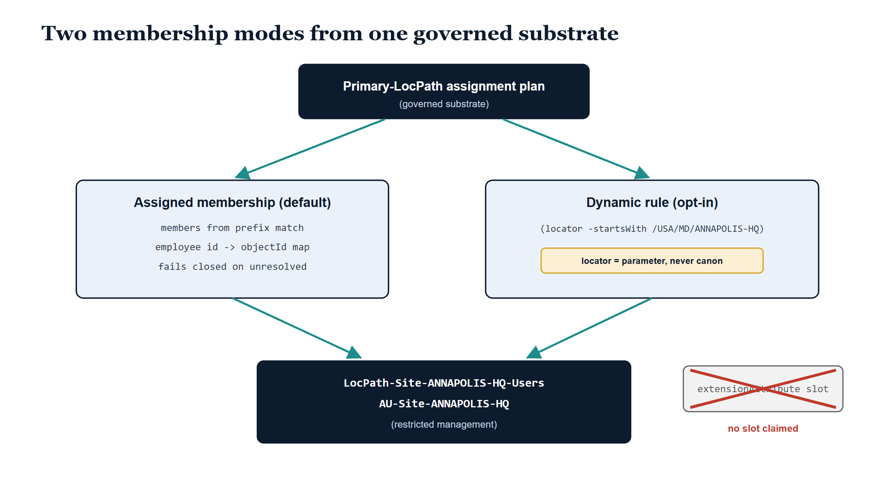

# Chapter 9 — Reaching the Directory Without a Slot

::: {.callout-note}
## In this chapter
OrgPath reaches Entra ID through extension-attribute slots; LocPath, by its own decision record, claims none. That looks like a dead end for location-scoped groups and Administrative Units — how do you target a directory you refused to stamp? This chapter shows the answer the exposure planners give: derive one security group and one Administrative Unit per governed Site, with membership read by LocPath prefix from the Primary-LocPath assignment plan. The default mode needs no attribute storage anywhere, because the governed substrate itself is the membership source; it resolves identities explicitly and fails closed when it cannot. An opt-in second mode renders Entra dynamic-membership rules against a caller-supplied locator, so the no-slot doctrine survives even contact with dynamic membership.
:::

{#fig-book-19-cpt-09-image-01 fig-alt="Illustrative 16:9 scene on a white background. A pale blue sky gradient stands behind a grand navy double door in a dark-blue frame. The left door leaf is swung ajar toward the viewer, and warm pale-teal light from the hall behind spills through the gap and across the floor. Both door faces are smooth navy with slim grey handles and no keyhole anywhere. To the right, a small white plaque on a grey post shows a grey keyhole pictogram struck through by a thin red X. In the left foreground a stylized doorkeeper silhouette with a circle head and rounded slate-blue body holds an open white ledger labeled in monospace assignment plan. A soft teal thread, haloed in pale teal, arcs from the ledger up to the upper door hinge, showing that the ledger itself, not a key, is what opens the door." width="100%"}

## The Question the Refusal Invites

The previous chapters of this book established LocPath's discipline by what it declined to do. ADR-102 Decision D5 is blunt about it: LocPath is a dimension, not a sixteenth OrgPath facet, and it claims no `extensionAttribute` slot. The ADR-078 slot table — the carefully rationed inventory of extension attributes that OrgPath's fifteen facets occupy — is untouched. When LocPath storage-on-target eventually ships, it will ride the ADR-098 binding-profile mechanism, a locator declared per target profile, not a new hardcoded slot contract. The place axis arrives in the architecture without writing a single byte into the directory.

That restraint reads well in a decision record. It reads less well the morning someone asks for a group containing everyone assigned to the Annapolis headquarters. Location-scoped groups are among the most ordinary artifacts in directory administration — the distribution scope for a building notice, the security scope for a site-local resource, the Administrative Unit that lets a regional helpdesk reset passwords for its own region and nobody else's. OrgPath delivers its equivalents by being *present* in the directory: the attribute is stamped, the dynamic-membership rule matches against it, and Entra does the rest. LocPath stamped nothing. On the face of it, the no-slot doctrine appears to have traded away exactly the capability that makes an addressing dimension useful.

> The question is not whether LocPath can afford a slot. The question is whether a slot was ever the real requirement — or whether the requirement was always *membership*, and the attribute was just one way of computing it.

The exposure planners answer by reframing what a group's membership source can be. A dynamic-membership rule is a way of asking the directory to compute membership from data the directory holds. But the membership itself — the set of people assigned under a given location — is not something the directory knows first. It is something the governed substrate knows first, because the Primary-LocPath assignment plan is where that fact is established, derived from the HR duty-station assignment under the truth-source doctrine ADR-102 extends from organizational placement to physical placement. If the substrate already holds the answer, the directory does not need to recompute it. It only needs to receive it.

{#fig-book-19-cpt-09-diagram-01 fig-alt="Engineering blueprint diagram on a white background, 16:9 landscape, no human figures, all identifiers in monospace. At top center a navy #0D1B2E rounded box labeled Primary-LocPath assignment plan, governed substrate. Two teal #1E8C8C arrows branch down to two ice-blue #EAF1FB boxes with navy borders. The left box is titled Assigned membership, default, with three monospace lines: members from prefix match, employee id to objectId map, fails closed on unresolved. The right box is titled Dynamic rule, opt-in, with one monospace line showing locator -startsWith /USA/MD/ANNAPOLIS-HQ in parentheses, and below it a small amber #D4A017 tag reading locator = parameter, never canon. Teal arrows from both boxes converge on a bottom navy box listing LocPath-Site-ANNAPOLIS-HQ-Users and AU-Site-ANNAPOLIS-HQ with restricted management noted beneath. At the lower right a grey box labeled extensionAttribute slot is struck through by a red #C0392B X and captioned no slot claimed." width="100%"}

## What the Planners Derive

The shape of the exposure is deliberately conservative. For each governed Site — the minimum governance unit ADR-102 D1 established, the level every governed location assertion must at least resolve to — the planners derive exactly two Entra artifacts: one security group and one Administrative Unit. The names follow the same conventions the OrgTree exposure established, so an administrator scanning the directory can read the provenance off the display name. The group for the Annapolis headquarters Site, whose LocPath is `/USA/MD/ANNAPOLIS-HQ`, is named `LocPath-Site-ANNAPOLIS-HQ-Users`; its Administrative Unit is `AU-Site-ANNAPOLIS-HQ`. The leaf segment of the path becomes the name; the description carries the full prefix and names the governing location registry, so the artifact is self-documenting about which governed substrate produced it.

By default, the planners cover every Site that has at least one Primary-LocPath assignment in the plan — no group is manufactured for an empty building. But the scope is not locked to Sites. A caller may pass explicit prefixes, each validated against the location registry before anything is planned, and those prefixes may reach deeper than Site. A building-scoped group — everyone assigned under `/USA/MD/ANNAPOLIS-HQ/BLDG-2`, say — is supported explicitly, because the membership semantics are prefix semantics all the way down: an identity belongs to a group when its Primary LocPath equals the group's prefix or sits anywhere beneath it. The hierarchy that Chapter 2 of this book introduced as an addressing convenience turns out to be the membership predicate.

## Membership Without an Attribute

The default mode is **assigned membership**, and it is worth being precise about what that means, because it is the move that dissolves the apparent dead end. In assigned mode, the planners enumerate the members of each group directly from the assignment plan, by prefix match, at planning time. The governed substrate itself is the membership source. No attribute is consulted in Entra, because no attribute exists in Entra; no attribute is consulted anywhere else either, because the assignment plan is not an attribute store — it is the governed record of where people sit on the place axis, the thing the whole book has been building. The membership requires no attribute storage at all, on any system.

This is the reframing in a sentence: the thing other architectures stamp onto the directory, this one simply *knows*. An attribute-and-rule architecture writes the fact of location into the directory so the directory can rediscover it through rule evaluation. A substrate architecture holds the fact in governed form and hands the directory the conclusion. Both produce a group whose members are the people at the Site. Only one of them required the directory to be a copy of the substrate first.

## The Render That Refuses

There is one honest dependency in assigned mode, and the module does not hide it. The assignment plan speaks in employee identifiers, because HR is the upstream authority and HR speaks employee identifiers. Entra group membership speaks in directory object identifiers. Rendering an assigned-membership Graph request body therefore requires an identity-resolution mapping — employee identifier to Entra object identifier — supplied at render time. This is not a new burden invented for LocPath; correlating the HR identity to the directory identity is the existing substrate concern, the same correlation every governed exposure ultimately rests on. The exposure planners refuse to guess at it.

And the refusal is literal. If even one member's employee identifier has no entry in the mapping, the render does not proceed with the members it could resolve. It fails, names the unresolved identities, and asks the operator to resolve them first. The render **fails closed**.

> A group that silently dropped a member is worse than no group. The administrator who scopes a resource to `LocPath-Site-ANNAPOLIS-HQ-Users` is trusting that the name means what it says — everyone assigned under that Site. A partial render quietly converts that trust into a falsehood. Refusing to render converts it into a visible task.

This is the same instinct that runs through the whole governance posture: divergence is surfaced, never papered over. An unresolved identity at render time is a small drift signal — the substrate and the directory disagree about who exists — and the correct response to a drift signal is detection, not improvisation.

## Restricted by Default

The Administrative Unit side carries one more default worth naming. Every AU the planners derive is created with **restricted management** unless the caller deliberately relaxes it. This continues the delegation doctrine earlier books established for the organizational axis: an Administrative Unit that exists to scope delegated administration should not itself be casually administrable, and membership of a governance-derived AU should change because the governed substrate changed, not because someone with broad directory rights edited it directly. The restriction is a default, not a mandate — it is a parameter, and an operator with a reason can turn it off — but the posture ships pointed in the safe direction.

## The Opt-In Second Mode

None of this forbids dynamic membership; it only refuses to *require* it. Some deployment, someday, will choose a storage locator for LocPath — an extension attribute or a directory extension that a future binding profile will name, under the ADR-098 mechanism D5 already points to. For that deployment, the planners offer the second mode: pass the locator, and every derived group and Administrative Unit carries an Entra dynamic-membership rule instead of an enumerated member list. The rule has exactly the shape you would expect from everything above — a prefix match, now expressed in Entra's rule grammar: `(locator -startsWith "/USA/MD/ANNAPOLIS-HQ")`, with the deployment's chosen locator standing in front of the operator.

The doctrinal point is in where the locator comes from. It is a parameter supplied by the caller, never canon. The module declares no default locator, reserves no slot, and embeds no attribute name in any artifact it ships. The day a binding profile lands and names a locator for a given target, the same planners render dynamic rules against it without modification — and until that day, nothing in the canon has prejudged the choice. The no-slot doctrine survives contact with dynamic membership because the slot decision was moved to the one party entitled to make it: the deployment that owns the directory.

## Pure Plans, Existing Pipes

The last property to name is the quietest. Planning is pure — the planners make no Graph calls, touch no tenant, and need no credentials. They take the assignment plan and the location registry, and they return specifications; each specification knows how to render its own Graph request body when asked. Getting those bodies into a tenant is the job of the transport and apply machinery the Entra adapters already provide, under the operator decisions that machinery already enforces — dry-run first, with the rendered plan inspected before anything is written. LocPath did not build a new pipeline to the directory. It built plans that fit the pipeline the organizational axis already proved.

Step back and the chapter's question has inverted. The directory was never refused — only the stamp was. The result is location-scoped groups and Administrative Units that are usable today, derived from the governed substrate with zero attribute storage on any system, resolving identities explicitly and failing closed rather than failing quietly. And the architecture holds the upgrade path open: the day a binding profile names a locator, the same Sites, the same names, and the same prefixes render as dynamic-membership rules, transparently.

> LocPath reaches the directory without occupying it. Assigned membership today, from the substrate that already knows; dynamic membership tomorrow, against a locator the deployment names. At no point does the place axis claim a slot — and at no point did it need one.
