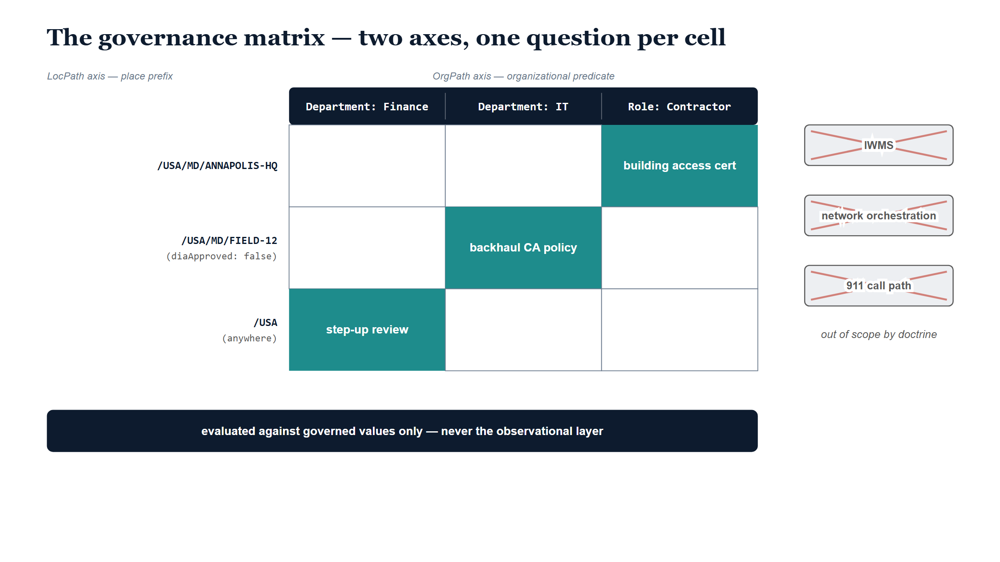

# Chapter 10 — The Matrix, and What Place Is Not

::: {.callout-note}
## In this chapter
Nine chapters built a governed axis for place. This closing chapter delivers what the axis was for: the matrix. Every identity now carries both an OrgPath and a Primary LocPath, and governance can finally ask questions that neither axis answers alone — a Finance identity assigned somewhere other than headquarters, a population defined by a site classification, a building-access review whose evidence keeps itself current. The chapter then states the discipline that keeps the matrix trustworthy, draws the three borders the decision record fixes as doctrine — LocPath is not facilities management, not network orchestration, not an emergency-call-routing service — and closes the book by closing the ledger it opened: the place model Active Directory retired without a successor now has one, and this time it is governed.
:::

## Two Axes, One Surface

A coordinate system with one axis is a line. It can tell you how far along you are, and nothing else. The organizational axis has been governed for some time: OrgPath answers, with provenance and drift detection behind it, where an identity sits in the organization. This book added the second axis. The Primary LocPath answers, with the same discipline behind it, where the organization has assigned that identity to sit in the world.

The payoff is not either axis. The payoff is what happens when a rule is allowed to read both at once. The codebook states it plainly: identities carry both an OrgPath and a Primary LocPath, and governance rules may predicate on both axes by prefix. An organizational predicate — a department, a role — crossed with a place prefix — a site, a campus, a country — defines a cell, and a cell is a population that no single directory attribute, no hand-joined spreadsheet, and no quarterly data call could previously name with confidence. The questions an enterprise actually needs to ask about its people are, more often than anyone admits, matrix questions. They have simply gone unasked, because until both axes were governed there was no honest way to answer them.

> The payoff of the place axis is not the place axis. It is the matrix — the ability to cross who someone is organizationally with where they are assigned physically, and get an answer that is governed on both sides.

{#fig-book-19-cpt-10-diagram-01 fig-alt="Engineering blueprint diagram on a white background, 16:9 landscape, with no human figures. A Georgia-serif navy title reads The governance matrix — two axes, one question per cell. A three-by-three grid: a navy header band carries three white monospace column headers reading Department: Finance, Department: IT, and Role: Contractor, and three navy monospace row headers on the left read /USA/MD/ANNAPOLIS-HQ, then /USA/MD/FIELD-12 with a second line reading diaApproved: false in parentheses, then /USA with a second line reading anywhere in parentheses. Three cells are filled teal with bold white labels: building access cert in the Contractor column of the ANNAPOLIS-HQ row, backhaul CA policy in the IT column of the FIELD-12 row, and step-up review in the Finance column of the bottom row. Below the grid a navy band carries white text reading evaluated against governed values only — never the observational layer. On the right, three grey boxes labeled IWMS, network orchestration, and 911 call path are each struck through with a red X, captioned out of scope by doctrine." width="85%"}

## The Auditor's Question

Consider the question as it actually arrives. A security officer preparing for an audit asks something that sounds simple: which of our Finance people are not at headquarters? Finance identities handle disbursements and approval chains; an identity with that authority sitting at an unfamiliar field office is not a violation, but it is the kind of fact a reviewer wants surfaced rather than discovered.

In the fragmented era, answering this meant exporting the HR roster, exporting the directory's department field, exporting whatever the facilities office believed about who sat where, and reconciling three lists that disagreed in ways nobody could adjudicate. The answer arrived weeks later with a confidence interval nobody wrote down.

In the matrix, the question is a rule: identities whose OrgPath carries Department=Finance and whose Primary LocPath is not under `/USA/MD/ANNAPOLIS-HQ/*` require step-up review. An organizational predicate crossed with a place prefix. The population it names is exact, because both coordinates are governed — the department comes from the OrgPath substrate, the place from the HR duty-station assignment mapped through the registry. When a Finance analyst transfers to a field office, the Mover pass recalculates the Primary LocPath, and the identity enters the cell — and the review — without anyone running an export.

## The Group That Maintains Itself

The second scene belongs to the network architect midway through the TIC 3.0 transition. Some sites have been approved for Direct Internet Access; their traffic breaks out locally. Other sites have not; their traffic must backhaul through the protected path until the day their approval is recorded. The conditional-access policy that enforces the backhaul posture needs a population: every identity assigned to a site that is not yet approved.

Before the place axis, that population was a hand-maintained group, updated when someone remembered, wrong whenever a site's status changed faster than the maintenance. Now it is a dynamic group defined against a site classification: all identities at sites where `diaApproved` is false. A place classification, registered on the Site node and provenance-anchored like every other canon assertion, drives an access decision directly. When the agency records a site's DIA approval — a canon change, with impact analysis and a decision history — the classification flips, the group recomputes, and the conditional-access policy releases that site's population from the backhaul posture in the same motion. Nobody edits a membership list, because the membership was never a list. It was a predicate, and the predicate reads governed values.

## The Certification That Stays Current

The third scene is the quiet one. An access certification campaign asks resource owners to confirm, identity by identity, that access is still needed. Among the entitlements under review: Building-3 resources — the badge groups, the print queues, the room-booking permissions that attach to a physical building. The reviewer's honest question is whether this person still works there.

Historically the evidence for that question was a snapshot — whatever the last data call said about who sat where, frozen at the moment someone compiled it. The certification was a review of stale evidence, and everyone signing it knew.

In the matrix, the certification asks whether the person still needs Building-3 resources given their *current* duty station — and "current" is doing real work in that sentence. The Primary LocPath is recalculated whenever HR moves the duty station; the evidence under review updates itself between campaigns. A reviewer comparing an entitlement against `/USA/MD/ANNAPOLIS-HQ/BLDG-3` is comparing it against the governed present, not the remembered past. The certification stops being a ritual performed over a snapshot and becomes what it was always supposed to be: a decision made against the location of record.

## The Discipline That Keeps It Honest

All three scenes share one property, and it is the property that makes the matrix trustworthy rather than merely clever. The matrix is evaluated against governed values only — the Primary LocPath and the registered node attributes — never against the observational layer.

The two-layer model built earlier in this book exists precisely to make this discipline expressible. Dynamic Location Context — the GPS fix, the Wi-Fi triangulation, the network-derived position — is observational enrichment. It carries an accuracy radius, a confidence grade, and a timestamp, and it is privacy-sensitive by nature. It is good for exactly two things: enhancing consumers that can use real-time precision, and feeding drift detection when observation persistently disagrees with assignment. It is good for governance decisions never. A step-up review triggered by a noisy GPS reading is a false positive that erodes trust in the rule; an access decision that follows a device's wanderings is not governance, it is surveillance wearing governance's badge. The codebook is normative on this point: dynamic context never overrides the Primary LocPath for governance, access review, or compliance reporting. Divergence between the two layers is a drift signal to be investigated — not an input to be acted on.

> Every cell in the matrix is computed from the governed layer: the assigned place and the registered classification. The observational layer can raise a flag. It can never cast a vote.

## What Place Is Not

A governance substrate that has just demonstrated three useful answers faces a predictable temptation: to keep answering. The decision record anticipates this and draws three borders, and it is worth being precise about their character. They are doctrine, not modesty — scope guardrails written into the record itself, binding until a future decision record argues otherwise.

LocPath is not facilities management. Work orders, preventive maintenance, space booking, move management, and lease administration belong in a purpose-built IWMS, CMMS, or EAM platform — systems whose entire competence is the operational life of buildings. UIAO governs only the identity-relevant slice of location: who is assigned where, what a site is classified as, what the dispatchable location of record is. The facilities system keeps its job; UIAO consumes its node descriptions and reconciles them, and goes no further.

LocPath is not network orchestration. SD-WAN controllers and network policy engines consume LocPath classification — a site's approval status, its breakout type, its zone — as input to decisions they own. UIAO never programs them. The day a UIAO component pushes configuration to a network controller is the day the control-plane boundary has been crossed, and that day requires its own decision record before it dawns.

And LocPath is not an emergency-call-routing service. The UCaaS platform consumes the dispatchable location of record and conveys it with the call; UIAO is the governed source of that record and nothing more. It never sits in the 911 call path. A life-safety call flow is engineered, certified, and operated by the platforms built for it, and a governance overlay has no business in the middle of one.

Crossing any of these three lines is not an enhancement request. It is a new decision, requiring its own record, its own deliberation, and its own justification.

## What Arrives Next

The decision record does not end with promises. It ends with triggers — named events that reopen the decision and start its review, which is a more honest way to describe a future than a roadmap is. The shape of what comes next is visible in them.

A live HR-feed transport, with certificate anchoring, replacing the mapping table's batch ancestry — the moment assigned place flows from the system of record continuously rather than episodically. A storage locator named by a binding profile, so that LocPath can be written to a target system under the same vendor-neutral contract that carries OrgPath, the day a write-back use case earns its keep. Observational collectors feeding the location-policy and location-boundary drift detectors — each collector requiring its own privacy review before it ships, because the observational layer's constraints do not relax just because the plumbing arrives. And the export that hands the dispatchable location of record to the calling platform, closing the loop the E911 chapters opened: the governed answer, delivered to the system that must speak it when someone dials three digits.

None of these is promised a date. Each is named as the event that changes the decision's premises — and that is the posture of a substrate that expects to be held to its record.

## The Ledger, Closed

This book opened where the series always opens: at the ledger of what Active Directory did that nothing was appointed to do next. AD had a place model. Sites and subnets told the directory's clients which side of a slow link they stood on, and an entire generation of infrastructure quietly consulted it. When the domain retired, that model retired with it — not replaced, simply ended — and place data scattered back into the duty-station strings, building lists, site inventories, and emergency-address tables it had come from.

The entry can now be closed. The successor exists: a canonical hierarchy from country to room, a governed assignment for every identity, classification surfaces that regulation and architecture can predicate on, drift detection watching the seams, and a matrix that lets place and organization be read together. The old model served one consumer and died with it. This one is built as canon — provenance-anchored, reviewed on triggers, bounded by doctrine.

Active Directory's place model retired without a successor. The successor is here. And this time, it is governed.
